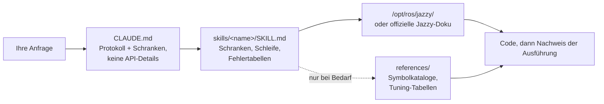

<div align="center">


**Claude Code Skills for ROS 2 Jazzy Jalisco robotics development.**

Skills, die die ROS 2-Entwicklung mit KI-Agenten grundlegend verändern: Unbekannte Parameter im Voraus identifizieren, Einstellungen anhand installierter Pakete verifizieren und die Ausführung durch funktionierende Nachweise bestätigen.


[English](README.md) | [한국어](README.ko.md) | [中文](README.zh.md) | [日本語](README.ja.md) | [Español](README.es.md) | [Français](README.fr.md) | **Deutsch**

<sub>🌐 Dieses Dokument ist eine maschinelle Übersetzung. Das Original ist auf [English](README.md).</sub>

| Skills | Immer geladenes Protokoll | Doku-Links (CI-geprüft) | Physikalische Roboter-Prüfungen |
| :---: | :---: | :---: | :---: |
| **11** | **28 Zeilen** | **32** | **4 Skripte** |

</div>

---

## Inhalt

- [Die teuren Fehlermuster](#die-teuren-fehlermuster)
- [Wie diese Skills aufgebaut sind](#wie-diese-skills-aufgebaut-sind)
- [Was es anders macht](#was-es-anders-macht)
- [Evaluationen](#evaluationen)
- [Schnellstart](#schnellstart)
- [Skills](#skills)
- [Verifikationsskripte](#verifikationsskripte)
- [Funktionsweise](#funktionsweise)
- [Aktualisierung](#aktualisierung)
- [Mitwirken](#mitwirken)
- [Lizenz](#lizenz)

## Die teuren Fehlermuster

Die kostenintensivsten Fehler in KI-generiertem ROS 2-Code sind selten Syntaxfehler. Stattdessen handelt es sich um subtile Probleme, die auf den ersten Blick korrekt wirken:

| Fehlermuster | Was Sie sehen | Warum der Agent auf das Problem stößt |
| :--- | :--- | :--- |
| **Stiller Fehlschlag** | `ros2 topic hz` zeigt 30 Hz an; Ihr Callback wird jedoch nie ausgelöst | Ein Standard-Subscriber mit RELIABLE versucht sich mit einem BEST_EFFORT-Publisher zu verbinden. Der Code kompiliert und besteht das Code-Review, schlägt aber auf DDS-Middleware-Ebene fehl. |
| **Falsche Ground Truth** | `/cmd_vel` zeigt Vorwärtsbewegung an und `/odom` meldet Vorwärtsbewegung, aber der physische Roboter bewegt sich **rückwärts** | Der statische TF-Frame ist relativ zur physischen Montage invertiert. Nachgelagerte Komponenten rechnen korrekt *unter Verwendung der falschen Transformation*, ohne offensichtliche Fehler zu erzeugen. |
| **Veraltete API** | Der Code besteht das Review, schlägt aber zur Laufzeit beim Aufruf einer falschen Methode fehl | Der Agent verwendet veraltete Foxy- oder Humble-API-Methoden, die in Jazzy umbenannt oder entfernt wurden. |
| **Ungültige Prämisse** | Der Agent schreibt 200 Zeilen Code basierend auf einer Annahme, die Sie in einem einzigen Satz hätten korrigieren können | Kein Mechanismus fordert den Agenten auf, fehlende Details vor der Codegenerierung zu verifizieren. |

Weder Compiler, Linter noch Log-Analysen erkennen diese versteckten Probleme. Die Behebung jedes Fehlers erfordert einen zusätzlichen Feedback-Zyklus: Ausgabe überprüfen, Ursache diagnostizieren, Korrektur erklären und den Code erneut generieren.

## Wie diese Skills aufgebaut sind

Vier Entwurfsregeln bestimmen jeden Skill in diesem Repository:

**1. Unbekannte Variablen im Voraus identifizieren.** Wichtige betriebliche Details sind in der Dokumentation oft nicht vorhanden – etwa ob die Umgebung reale Hardware oder Simulation ist, ob ein bestehender Workspace erweitert oder ein neuer erstellt werden soll, welcher Node bereits eine Transformation publiziert oder die genaue Geometrie des Roboters. [`CLAUDE.md`](./CLAUDE.md) weist den Agenten an, diese Unbekannten vor der Codegenerierung zu klären. Domänenspezifische Skills verwalten gezielte Parameter; beispielsweise fordert `ros2-dev` die Footprint-Geometrie des Roboters, die Antriebskinematik und die Lokalisierungsquelle an, bevor Nav2-Parameter konfiguriert werden.

**2. Eine strukturierte Schleife mit klaren Abbruchkriterien ausführen.** Jeder Skill folgt einem *Verifizieren → Schreiben → Beweisen*-Zyklus: Systemstandards in der installierten Umgebung prüfen, inkrementelle Änderungen anwenden und die Ausführung bestätigen. Eine Aufgabe ist erst dann abgeschlossen, wenn sie durch beobachtbare Nachweise gestützt wird – wie etwa einen erfolgreichen Build, aktive Daten auf `ros2 topic echo` oder ein bestandenes Verifikationsskript – anstatt einfach nur Codedateien zu erzeugen.

**3. Strukturierte Fehlertabellen gegenüber langen Beschreibungen bevorzugen.** Strukturierte Tabellen, die Symptome → Ursachen → Korrekturmaßnahmen zuordnen, bieten eine klare, dauerhafte Orientierung, die in offiziellen Dokumentationen oft fehlt und über Release-Versionen hinweg zuverlässig bleibt:

> `[` ist GZ→ROS, `]` ist ROS→GZ · `16UC1` ist Millimeter, `32FC1` ist Meter · `joint_state_broadcaster` wird nicht automatisch gestartet · `raytrace_max_range` ≤ `obstacle_max_range` bedeutet, dass Hindernisse nie gelöscht werden · rclc alloziert unbegrenzte Nachrichtenfelder nicht automatisch

**4. Kontextnutzung mit einer Drei-Schichten-Architektur optimieren.** Jeder Skill balanciert die Kontexteffizienz: Skill-Beschreibungen bleiben im Kontext, Skill-Rümpfe laden bei Aufruf und tiefer gehende Referenzdateien in `references/` laden erst bei Bedarf. Große Symbolkataloge und detaillierte Parameter-Tuning-Tabellen befinden sich in `references/`, wodurch der Kontext geschont wird und beim Debuggen gezielter Komponenten (wie AMCL) keine unnötige Dokumentation (wie Behavior-Tree-Nodes) geladen wird.

## Was es anders macht

Die meisten Robotik-Skill-Pakete betten statisches API-Wissen direkt in Skill-Dateien ein. Während die erste Nutzung einfach ist, bricht dieser Ansatz zusammen, sobald die zugrunde liegenden Pakete aktualisiert werden – zurück bleiben veraltete Code-Snippets, die stillschweigend fehlschlagen. Dieses Repository verfolgt einen dynamischen, dokumentationsgesteuerten Ansatz:

| Merkmal | Inhaltslastige Skill-Pakete | **claude-ros2-skills** |
| :--- | :--- | :--- |
| Speicherort des Wissens | In Skill-Dateien eingebettet (**400–1.800 Zeilen/Skill**) | Verlinkt auf offizielle Doku (**~60-Zeilen** Skill-Rümpfe); detaillierte Referenzen **nur bei Bedarf** gelesen |
| Immer geladener Kontext | Vollständige `SKILL.md`-Dateien | **28-Zeilen** Kernprotokoll |
| Umgang mit Jazzy-API-Updates | Snippets veralten stillschweigend; erfordert kontinuierliche manuelle Test-Updates | Risiko veralteter Snippets auf Einstiegspunkt-Links und Symbolnamen minimiert — **32 Dokumentationslinks** wöchentlich per CI verifiziert |
| Verifikationsmethode | Statische Codeanalyse oder Log-Prüfung | **Physikalische & Laufzeit-Verifikation**: IMU-Gravitationsprüfungen, Richtungs-Odometrietests, TF-Frame-Ausrichtung, DDS-QoS-Kompatibilität |
| Unterstützungsbereich | Behauptet Unterstützung für mehrere ROS-Distros, zielt aber nur auf eine ab | **Nur ROS 2 Jazzy**, durch Design — keine Ausflüchte wie „funktioniert auch auf Humble“ |

Dieses Repository ist auf ein einziges Ziel hin optimiert: das Risiko zu minimieren, plausibel aussehenden Code zu generieren, der auf ROS 2 Jazzy nicht ausgeführt werden kann.

## Evaluationen

**Ein Skill gilt hier erst dann als verifiziert, wenn zwei Fragen beantwortet sind:** Verändert er das, was der Agent bei einer Aufgabe erzeugt, die seinen eigenen Inhalt beansprucht, und ist dieser Skill-Rumpf der *kleinste*, der diese Änderung bewirkt? Korrektheit ist die Untergrenze (floor), nicht die Messlatte (bar) — weniger Token und weniger Text können dasselbe Ergebnis liefern, und bis dies getestet ist, ist „der Agent hat ihn verwendet“ nur eine halbe Antwort.

**Noch kein Skill hat die Verifikation abgeschlossen.** Der Status pro Skill ist in [`evals/RESULTS.md`](./evals/RESULTS.md) dokumentiert; Ergebnisse werden dort veröffentlicht, sobald jeder Skill beide Achsen besteht, einschließlich derjenigen, die fehlschlagen. Zwischenmessungen werden bewusst zurückgehalten — eine frühere Runde ergab aus einem einzelnen Durchlauf eine plausible Schlussfolgerung, die ein kontrollierter erneuter Durchlauf dann widerlegte, und Teilergebnisse verbreiten diese Art von Fehler schneller, als er behoben werden kann.

Was gemessen wird, wie bewertet wird und wie alles erneut ausgeführt werden kann: [`evals/README.md`](./evals/README.md). Transkripte und Protokolle jedes bisherigen Durchlaufs sind unter [`evals/runs/`](./evals/runs/) eingecheckt.

## Schnellstart

**Option A — Plugin Marketplace (Empfohlen):**

```
/plugin marketplace add Leehyunbin0131/claude-ros2-skills
/plugin install claude-ros2-skills@claude-ros2-skills
```

Aktualisieren Sie installierte Plugins jederzeit mit `/plugin marketplace update`.

**Option B — Manuelle Installation:**

```bash
git clone https://github.com/Leehyunbin0131/claude-ros2-skills.git

# Projektbasierte Installation (gilt nur für das aktuelle Projekt)
mkdir -p your-project/.claude/skills
cp -r claude-ros2-skills/skills/* your-project/.claude/skills/
cp claude-ros2-skills/CLAUDE.md your-project/

# Benutzerweite Installation (gilt für alle Projekte)
mkdir -p ~/.claude/skills
cp -r claude-ros2-skills/skills/* ~/.claude/skills/
```

Starten Sie Claude Code neu (oder beginnen Sie eine neue Sitzung), um die installierten Skills anzuwenden.

## Skills

| Skill | Pfad | Abdeckung |
| :--- | :--- | :--- |
| **ros2-core** | `skills/ros2-core/SKILL.md` | rclcpp, rclpy, TF2, EKF-Odometrie, QoS-Profile, Parameter |
| **ros2-package** | `skills/ros2-package/SKILL.md` | `ros2 pkg create`, CMakeLists/setup.py-Einbindung, colcon build & source, benutzerdefinierte Interfaces |
| **ros2-dev** | `skills/ros2-dev/SKILL.md` | Nav2 (AMCL, Costmaps, MPPI/Smac), SLAM Toolbox, RTAB-Map, Isaac ROS |
| **gazebo-sim** | `skills/gazebo-sim/SKILL.md` | Gazebo Harmonic, ros_gz_bridge, ros_gz_sim, SDFormat-Modellierung |
| **ros2-control** | `skills/ros2-control/SKILL.md` | ros2_control Hardware-Abstraktion, Controller Manager, URDF-Tags |
| **ros2-moveit** | `skills/ros2-moveit/SKILL.md` | MoveIt 2, MoveGroup C++/Python-API, IK-Solver, OMPL, MoveIt Servo |
| **ros2-perception** | `skills/ros2-perception/SKILL.md` | image_transport, cv_bridge, vision_msgs, depth_image_proc, PCL |
| **ros2-testing** | `skills/ros2-testing/SKILL.md` | launch_testing, gtest/pytest, rosbag2 C++/Python-APIs, ros2trace |
| **ros2-microros** | `skills/ros2-microros/SKILL.md` | micro-ROS Agent, rclc Client-API, benutzerdefinierte Transporte, statischer Speicher |
| **ros2-security** | `skills/ros2-security/SKILL.md` | SROS2, PKI-Keystore-Erstellung, Zugriffskontrolle, DDS-Sicherheit |
| **ros2-troubleshooting** | `skills/ros2-troubleshooting/SKILL.md` | REP 103/105 Ground-Truth-TF-Baum, LiDAR/IMU-Ausrichtung, physikalische Verifikation |

## Verifikationsskripte

Diese Verifikationsskripte sind im `ros2-troubleshooting`-Skill (`skills/ros2-troubleshooting/scripts/`) gebündelt und bei jeder Installation enthalten. Sie wandeln physikalische Hardware-Prüfungen in ausführbare Erfolgs-/Fehlerschritte (PASS/FAIL) um (erfordert eine gesourcte ROS 2-Umgebung; Rückgabecodes: 0 = PASS, 1 = FAIL, 2 = NO DATA):

| Skript | Verifiziert |
| :--- | :--- |
| `check_imu_gravity.py` | Validiert, dass ein ruhender Roboter die Schwerkraft mit ~+9,81 m/s² entlang der **+Z**-Achse misst (REP 103). Erkennt invertierte oder fehlausgerichtete IMU-Montagen. |
| `check_odom_direction.py` | Validiert, dass das Vorwärtsschieben des Roboters eine positive Odometrieverschiebung in Ausrichtungsrichtung erzeugt. Erkennt invertierte Drehrichtungen der Motoren, Polaritätsprobleme der Encoder oder invertierte TF-Setups. |
| `check_tf_tree.py` | Verifiziert, dass `map→odom→base_link` korrekt aufgelöst wird; zeigt jeden Sensormontage-Offset in RPY-Grad an und hebt potenzielle 180°-Orientierungsfehler hervor. |
| `check_qos_compat.py` | Verifiziert die QoS-Kompatibilität über alle Publisher/Subscriber-Paare auf einem Topic unter Verwendung von DDS-Regeln. Verhindert stille Fehlschläge (z. B. ein BEST_EFFORT-Publisher gepaart mit einem RELIABLE-Subscriber oder Abweichungen bei Durability, Deadline und Liveliness). |

Die Kern-Entscheidungslogik wird unabhängig von ROS per Unit-Test geprüft (`python3 skills/ros2-troubleshooting/scripts/test_checks.py`) und läuft bei jedem Push über Continuous Integration (CI).

## Funktionsweise



`CLAUDE.md` enthält keine spezifischen API-Details. Stattdessen etabliert es das Betriebsprotokoll und fordert, dass klärende Fragen vor dem Schreiben von Code beantwortet werden. Jede `SKILL.md`-Datei verwaltet domänenspezifische Entscheidungen: Unbekannte Variablen identifizieren, die Schleife aus Verifizieren-Schreiben-Beweisen ausführen und auf Fehlertabellen verweisen. Detaillierte Referenzmaterialien werden separat im Verzeichnis `references/` gespeichert. Siehe [`CLAUDE.md`](./CLAUDE.md) für Details.

## Aktualisierung

```bash
cd claude-ros2-skills
git pull
cp -r skills/* ~/.claude/skills/   # oder das .claude/skills/-Verzeichnis Ihres Projekts
```

## Mitwirken

Zusammenfassung: Skill-Dateien müssen sich auf die Entscheidungslogik konzentrieren (Validierungsschranken, Schleifenschritte und Fehlertabellen), während detaillierte Dokumentationen in `references/` verbleiben. Jedes API-Symbol muss gegen die offizielle Jazzy-Dokumentation oder `/opt/ros/jazzy/`-Installationen verifiziert werden. Verifikationsskripte müssen reine Logik beibehalten, die ohne ROS-Abhängigkeiten per Unit-Test geprüft werden kann. Die vollständigen Richtlinien, Checklisten für Skills und Skripte sowie Issue-Vorlagen finden Sie unter [`CONTRIBUTING.md`](./CONTRIBUTING.md).

## Lizenz

Apache-2.0 — siehe [LICENSE](./LICENSE).
