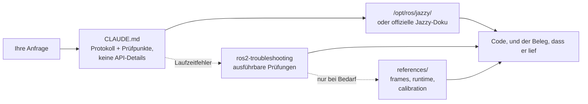

<div align="center">


**Claude Code Skills for ROS 2 Jazzy Jalisco robotics development.**

Skills, die verändern, wie KI-Agenten ROS-2-Entwicklung angehen: unbekannte Parameter vorab klären, Konfigurationen gegen die installierten Pakete prüfen und die Ausführung durch Belege für tatsächliches Funktionieren bestätigen.


[English](README.md) | [한국어](README.ko.md) | [中文](README.zh.md) | [日本語](README.ja.md) | [Español](README.es.md) | [Français](README.fr.md) | **Deutsch**

<sub>🌐 Dieses Dokument ist die deutsche Übersetzung des Originals auf [English](README.md).</sub>

| Skills | Immer geladenes Protokoll | Doku-Links (CI-geprüft) | Skripte für physische & Laufzeit-Verifikation |
| :---: | :---: | :---: | :---: |
| **2** | **30 Zeilen** | **9** | **4** |

</div>

---

## Inhalt

- [Die teuren Fehlermuster](#die-teuren-fehlermuster)
- [Wie diese Skills aufgebaut sind](#wie-diese-skills-aufgebaut-sind)
- [Was es anders macht](#was-es-anders-macht)
- [Evaluationen](#evaluationen)
- [Schnellstart](#schnellstart)
- [Skills](#skills)
- [Verifikationsskripte](#verifikationsskripte)
- [Funktionsweise](#funktionsweise)
- [Aktualisierung](#aktualisierung)
- [Mitwirken](#mitwirken)
- [Lizenz](#lizenz)

## Die teuren Fehlermuster

Die kostspieligsten Fehler in KI-generiertem ROS-2-Code sind selten Syntaxfehler. Es sind subtile Probleme, die auf den ersten Blick korrekt aussehen:

| Fehler | Was man sieht | Warum ein Agent darauf hereinfällt |
| :--- | :--- | :--- |
| **Middleware-Mismatch** | `ros2 topic hz` zeigt 30 Hz; der Callback feuert nie | Ein standardmäßig RELIABLE eingestellter Subscriber kann sich nicht mit einem BEST_EFFORT-Publisher paaren. Der Code kompiliert, besteht das Review und scheitert unterhalb der Anwendungsebene. rclpy warnt zwar — `offering incompatible QoS ... Last incompatible policy: RELIABILITY` — aber nur zur Laufzeit, im Startlog, für den, der es liest. |
| **Falsche Referenz** | `/cmd_vel` gibt Vorwärtsfahrt vor und `/odom` meldet Vorwärtsfahrt, doch der reale Roboter fährt **rückwärts** | Der statische TF-Frame ist gegenüber der physischen Montage invertiert. Nachgelagerte Komponenten rechnen korrekt — *mit der falschen Transformation* — und erzeugen keine erkennbaren Fehler. |
| **Veraltete API** | Der Code besteht das Review, scheitert aber zur Laufzeit beim Aufruf einer falschen Methode | Der Agent verwendet Foxy- oder Humble-Methoden, die in Jazzy umbenannt oder entfernt wurden. |
| **Falsche Prämisse** | Der Agent schreibt 200 Zeilen auf Basis einer Annahme, die Sie mit einem Satz korrigiert hätten | Nichts zwingt den Agenten, fehlende Details vor der Codegenerierung zu klären. |

Weder Compiler noch Linter noch Log-Analysen erkennen diese verborgenen Probleme. Jede Behebung kostet einen zusätzlichen Rückkopplungszyklus: Ausgabe prüfen, Ursache diagnostizieren, Korrektur erklären, neu generieren.

## Wie diese Skills aufgebaut sind

Vier Entwurfsregeln gelten für jeden Skill in diesem Repository:

**1. Unbekannte Variablen vorab identifizieren.** Zentrale betriebliche Details stehen oft in keiner Dokumentation — ob die Umgebung reale Hardware oder Simulation ist, ob ein bestehender Workspace erweitert oder ein neuer angelegt wird, welcher Node bereits eine Transformation publiziert, oder wie die genaue Geometrie des Roboters aussieht. [`CLAUDE.md`](./CLAUDE.md) weist den Agenten an, diese Unbekannten vor der Codegenerierung zu klären.

**2. Eine strukturierte Schleife mit klaren Abbruchkriterien ausführen.** Der Zyklus *prüfen → schreiben → nachweisen*: Standardwerte in der installierten Umgebung inspizieren, Änderungen schrittweise anwenden, Ausführung bestätigen. Eine Aufgabe gilt erst als abgeschlossen, wenn beobachtete Belege sie stützen — ein erfolgreicher Build, echte Daten auf `ros2 topic echo`, ein bestandenes Verifikationsskript — und nicht schon durch das bloße Erzeugen von Codedateien.

**3. Nichts sagen, was das Modell bereits weiß oder `CLAUDE.md` bereits festlegt.** Jede Symptom→Ursache→Maßnahme-Tabelle, die früher in diesem Paket enthalten war, wurde gegen einen Basis-Agenten ohne geladene Skills evaluiert. Beschreibende Prosa hat die Evaluationsergebnisse nie verbessert — das Modell erreicht die Lösung entweder eigenständig oder benötigt ein ausführbares Skript bzw. eine Protokoll-Bedingung in `CLAUDE.md`. Siehe [Evaluationen](#evaluationen).

**4. Auf ein ausführbares Artefakt zeigen, es niemals beschreiben.** Empirische Tests haben gezeigt, dass beschreibender Text darüber, was ein Skript prüfen würde, keine Verbesserung in den Evaluationen brachte. Nur ausführbare Skripte mit deterministischen Exit-Codes (`scripts/check_*.py` in `ros2-troubleshooting`) haben das Verhalten des Modells messbar verändert.

## Was es anders macht

Die meisten Robotik-Skill-Pakete betten statisches API-Wissen direkt in die Skill-Dateien ein. Die anfängliche Nutzung ist bequem, doch der Ansatz bricht, sobald die zugrunde liegenden Pakete aktualisiert werden — zurück bleiben veraltete Snippets, die stillschweigend versagen. Dieses Repository verfolgt einen dynamischen, dokumentationsgetriebenen Ansatz:

| Merkmal | Inhaltsschwere Skill-Pakete | **claude-ros2-skills** |
| :--- | :--- | :--- |
| Ort des Wissens | In Skill-Dateien eingebettet (**400–1.800 Zeilen pro Skill**) | Auf offizielle Dokumentation verlinkt (**~60 Zeilen** Skill-Rumpf); ausführliche Referenzen werden **nur bei Bedarf** gelesen |
| Immer geladener Kontext | Vollständige `SKILL.md`-Dateien | **30-zeiliges** Kernprotokoll |
| Umgang mit Jazzy-API-Änderungen | Snippets veralten stillschweigend; laufende manuelle Pflege nötig | Veraltungsrisiko auf Einstiegslinks und Symbolnamen begrenzt — **6 Dokumentationslinks**, wöchentlich per CI geprüft |
| Verifikationsmethode | Statische Codeanalyse oder Log-Prüfung | **Physikalische und Laufzeit-Verifikation**: IMU-Schwerkraftprüfung, gerichteter Odometrietest, TF-Frame-Ausrichtung, DDS-QoS-Kompatibilität |
| Verteilungsumfang | Bewirbt Unterstützung mehrerer ROS-Distributionen, zielt real auf eine | Konstruktionsbedingt **nur ROS 2 Jazzy** — ohne „läuft auch unter Humble"-Ausweichen |

Dieses Repository optimiert auf ein einziges Ergebnis: das Risiko zu minimieren, plausibel aussehenden Code zu erzeugen, der unter ROS 2 Jazzy nicht läuft.

## Evaluationen

**Der Maßstab.** Ein Skill verdient seinen Platz nur, wenn er etwas liefert, das der Agent **nicht selbst erreichen kann** — und zwar mit eigenem Wissen, Websuche und einer realen Jazzy-Installation vor sich. Text, der dem Agenten nur mitteilt, was er ohnehin getan hätte, ist Kosten ohne Nutzen.

**Wie gemessen wird.** Eine reale Aufgabe in einem isolierten Arbeitsverzeichnis, zehn Durchläufe mit dem geprüften Element und zehn ohne, bewertet durch *Ausführen* des Ergebnisses — ein Build, ein Topic mit Daten, ein Exit-Code — niemals durch Lesen. Exakter Test nach Fisher, Benjamini–Hochberg-Korrektur über die gesamte Runde.

**Historische Ergebnisse mit Grenzen der Reproduzierbarkeit.** Die Tabellen behalten die früher veröffentlichten Werte bei. Einige stimmen nicht mit den gespeicherten Ergebnisdateien überein; ein Teil der Nachbewertung ist nicht mehr belegbar. Lesen Sie den [Abgleich der Artefakte](./evals/CAPABILITIES.md), bevor Sie diese Zahlen oder allgemeine Fähigkeitsaussagen als verifiziert zitieren. Bei dieser Wartung wurde kein neuer Benchmark ausgeführt.

| Domäne | L1 → L2 → L3, pro Sprosse ergänzte Mechanismen | Ohne Hilfe |
| :--- | :--- | ---: |
| Packaging und Build | `ament_python`/`ament_cmake` → paketübergreifende `.srv` → komponierbarer Node + `colcon test` | **190/190** |
| Simulation | SDF-Welt + Differentialantrieb → `ros_gz_bridge` + `gpu_lidar` → URDF-Spawn + `use_sim_time` | **108/110** |
| Executors | 1-s-Service aus einem Timer → aus einem Subscription-Callback + Heartbeat → 5 nebenläufige Aufrufe | **110/110** |
| `ros2_control` | Mock-Hardware + Broadcaster → zweiter Controller, der Interfaces beansprucht → **eigenes C++-`SystemInterface`-Plugin** | **90/90** |
| Testing | pytest, den `colcon test` tatsächlich ausführt → `launch_testing` gegen einen laufenden Node → rosbag2 geschrieben und zurückgelesen | **110/110** |
| MoveIt 2 | Selbst verfasste URDF+SRDF, die `move_group` lädt → echter `GetMotionPlan` → Kollisionsobjekt in der Planungsszene | **100/100** |
| Kern | Statische TF aus Parametern → dynamische TF + `ExtrapolationException` → Lifecycle-Node, der bis zur Aktivierung schweigt | **110/110** |
| Nav2 | Parameterdatei, die die Server unverändert akzeptieren → Stack bis `active` gefahren → Costmap, die Hindernisse aus Live-Scans markiert | siehe unten |
| Perception | `cv_bridge`-Rundlauf → `CameraInfo`-Projektion → 16UC1-Tiefe → `PointCloud2` | **106/120** |

Die historische Analyse führte die folgenden Unterschiede auf Verifikation und Ausführung zurück. Diese Beobachtungen unterliegen den genannten Beleggrenzen und sind keine Garantie für alle Modelle oder Aufgaben.

| Was das Modell ohne Hilfe nicht tut | Basis | Was es schloss | Danach |
| :--- | ---: | :--- | ---: |
| Gegen die Installation prüfen, statt aus dem Gedächtnis zu antworten | **2/10** | ein Absatz in `CLAUDE.md` | **10/10** (q=0,002) |
| Ein Urteil mit Exit-Code liefern statt „sieht richtig aus" | **0/10** | ein mitgeliefertes ausführbares Skript | **10/10** (q<0,001) |
| Den geschriebenen QoS-Code vor der Übergabe ausführen | **5/10** | das „fertig heißt, es lief" aus `CLAUDE.md` | **9/10** (zu geringe Teststärke) |
| Die geschriebene Nav2-Konfiguration vor der Übergabe ausführen | **0/10** | eine Aufgabe, die das Erreichen von `active` verlangt | **30/30** |

Der historische Nav2-Vergleich deutete darauf hin, dass geforderte Ausführung Konfigurationsfehler sichtbar macht. Einige gespeicherte Urteile fehlen; Summen und Schlussfolgerungen sind zusammen mit dem obigen Abgleich zu lesen.

**Aktueller Umfang.** Frühere Skill-Löschungen bleiben bestehen. Diese Wartung belegt keine neuen Modellfähigkeiten und revidiert keine Entscheidungen ohne neue Nachweise. Das Paket enthält das unveränderte Protokoll mit 30 Zeilen, vier ausführbare Checks und Referenzen. Methode, historische Läufe und Beleggrenzen stehen in [`evals/`](./evals/).

## Schnellstart

**Option A — Plugin-Marketplace (empfohlen):**

```
/plugin marketplace add Leehyunbin0131/claude-ros2-skills
/plugin install claude-ros2-skills@claude-ros2-skills
```

Aktualisieren Sie das Plugin mit `claude plugin update claude-ros2-skills@claude-ros2-skills` und starten Sie eine neue Sitzung.

Wählen Sie eine Installationsmethode. Das Plugin lädt die unveränderte `CLAUDE.md` über einen `SessionStart`-Hook; im Benutzerbereich gilt sie für alle Projekte. Die manuelle Installation kopiert sie nach `.claude/rules/ros2-verification.md` und erhält bestehende `CLAUDE.md`-Dateien. Das Experiment 2/10→10/10 verwendete eine `CLAUDE.md` im Projektstamm; eine gleichwertige Wirkung von Hooks oder Regeldateien wurde nicht gemessen.

**Option B — Manuelle Installation:**

```bash
git clone https://github.com/Leehyunbin0131/claude-ros2-skills.git

# Installation auf Projektebene (gilt nur für das aktuelle Projekt)
python3 claude-ros2-skills/scripts/install.py --project your-project

# Installation auf Benutzerebene (gilt für alle Projekte)
python3 claude-ros2-skills/scripts/install.py --user
```

Starten Sie Claude Code neu (oder beginnen Sie eine neue Sitzung), um die installierten Skills zu übernehmen.

## Skills

| Skill | Pfad | Abdeckung |
| :--- | :--- | :--- |
| **ros2-troubleshooting** | `skills/ros2-troubleshooting/SKILL.md` | Vier ausführbare Bestanden/Durchgefallen-Prüfungen — QoS-Kompatibilität, TF-Baum, IMU-Montage, Odometrierichtung — sowie die dahinterliegenden REP-103/105-Frame-Konventionen, das Laufzeitverhalten von Jazzy und die Odometrie-Kalibrierung an realer Hardware |
| **ros2-microros** | `skills/ros2-microros/SKILL.md` | micro-ROS-Agent, rclc-Client-API, eigene Transporte, statischer Speicher |

**Warum nur zwei.** Alle anderen Skills wurden gegen einen Basis-Agenten ohne geladene Skills gemessen und entfernt, sobald der Agent ohne sie dasselbe Ergebnis lieferte — `ros2-core`, `ros2-dev`, `ros2-control`, `ros2-moveit`, `ros2-perception`, `ros2-testing`, `ros2-package` und `gazebo-sim`, in dieser Messreihenfolge. `ros2-microros` ist die einzige Domäne ohne Leiter: Die Hardware, um eine solche auszuführen, steht hier nicht zur Verfügung, daher bleibt der Skill erhalten und **wird nicht als verifiziert ausgewiesen**. Siehe [Evaluationen](#evaluationen).

## Verifikationsskripte

Diese Skripte sind im Skill `ros2-troubleshooting` enthalten (`skills/ros2-troubleshooting/scripts/`) und werden mit jeder Installation ausgeliefert. Sie überführen physikalische Hardwareprüfungen in ausführbare Bestanden/Durchgefallen-Schritte (erfordert eine gesourcte ROS-2-Umgebung; Rückgabewerte: 0 = BESTANDEN, 1 = DURCHGEFALLEN, 2 = NICHT EINDEUTIG):

Code 2 umfasst auch ungültige Daten, unbestimmtes QoS, fehlende TF und zu geringe Bewegung. Der IMU-Check transformiert die Beschleunigung nach `--base base_link`; nutzen Sie `--assume-aligned` nur bei nachweislich zur waagerechten Basis ausgerichteten Nachrichtenachsen.

| Skript | Verifiziert |
| :--- | :--- |
| `check_imu_gravity.py` | Bei ruhendem, waagerechtem Roboter: Gravitation per TF in den Basisrahmen transformieren und ~+9.81 m/s² auf **+Z** prüfen. Erkennt Roll-/Pitch-Abweichungen; Yaw ist mit Gravitation allein nicht prüfbar. |
| `check_odom_direction.py` | Dass Vorwärtsschieben des Roboters eine positive Odometrieverschiebung entlang seiner Fahrtrichtung erzeugt. Erkennt invertierte Motorrichtungen, Encoder-Polaritätsprobleme oder invertierte TF-Konfigurationen. |
| `check_tf_tree.py` | Dass `map→odom→base_link` korrekt auflöst; zeigt den Montage-Offset jedes Sensors in RPY-Grad und hebt mögliche 180°-Orientierungsfehler hervor. |
| `check_qos_compat.py` | Die QoS-Kompatibilität aller Publisher-/Subscriber-Paare eines Topics nach DDS-Regeln. Verhindert stille Fehler (etwa BEST_EFFORT-Publisher zusammen mit RELIABLE-Subscriber oder Abweichungen bei Durability, Deadline und Liveliness). |

Die zentrale Entscheidungslogik wird unabhängig von ROS unit-getestet (`python3 skills/ros2-troubleshooting/scripts/test_checks.py`) und läuft bei jedem Push über Continuous Integration (CI).

## Funktionsweise



[`CLAUDE.md`](./CLAUDE.md) enthält keine konkreten API-Details. Stattdessen legt es das operative Protokoll fest: Konfigurationen gegen die lokale Umgebung verifizieren, betriebliche Unbekannte vorab klären und eine Aufgabe erst dann als abgeschlossen betrachten, wenn eine Ausführung beobachtet wurde. Das Domänenwissen bleibt dem Modell und der installierten Umgebung überlassen, da empirische Evaluationen zeigten, dass beschreibende Prosa keinen Mehrwert bot. Der `ros2-troubleshooting`-Skill wird nur aufgerufen, wenn ein System in den Logs unauffällig aussieht, aber zur Laufzeit fehlschlägt, und liefert handlungsfähige Exit-Codes statt beschreibenden Textes. Einzelheiten in [`CLAUDE.md`](./CLAUDE.md).

## Aktualisierung

```bash
cd claude-ros2-skills
git pull
python3 scripts/install.py --user
# python3 scripts/install.py --project /path/to/your-project
```

Der Installer aktualisiert nur seine unveränderten Dateien und überschreibt weder lokale Änderungen noch vorhandene manuelle Kopien. Prüfen und verschieben Sie Konfliktdateien zuerst. Veraltete Skill-Ordner werden zur manuellen Bereinigung aufgelistet, niemals automatisch gelöscht. Derselbe Befehl aktualisiert Skills und Protokoll.

## Mitwirken

**Zusammenfassung:** Neue Skill-Inhalte müssen ihren Wert gegenüber einem Basis-Agenten ohne Hilfe durch empirische Tests nachweisen (eine reale Aufgabe, 10 Durchläufe je Bedingung, bewertet durch Ausführen der Ausgabe). Inhalte, die das Modell ohne Hilfe erzeugt, werden nicht aufgenommen, unabhängig von ihrer Korrektheit. Verifikationsskripte müssen ihre Entscheidungslogik rein halten, damit sie unabhängig von ROS unit-getestet werden können. Für das Evaluationsprotokoll, Checklisten und Issue-Vorlagen siehe [`CONTRIBUTING.md`](./CONTRIBUTING.md).

## Lizenz

Apache-2.0 — siehe [LICENSE](./LICENSE).
