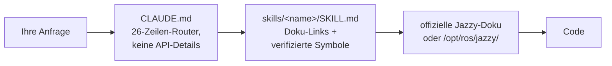

<div align="center">


**Claude Code Skills für die Robotik-Entwicklung mit ROS 2 Jazzy Jalisco.**

Anti-Halluzinations-Referenz-Skills — jeder Skill routet zur offiziellen Dokumentation, statt API-Namen zu raten.


[English](README.md) | [한국어](README.ko.md) | [中文](README.zh.md) | [日本語](README.ja.md) | [Español](README.es.md) | [Français](README.fr.md) | **Deutsch**

<sub>🌐 Dieses Dokument ist eine maschinelle Übersetzung. Das Original ist auf [English](README.md).</sub>

| Skills | Stets geladener Router | Doku-Links (CI-geprüft) | Physische Roboter-Checks | Evals: vor dem Schreiben verifiziert |
| :---: | :---: | :---: | :---: | :---: |
| **11** | **26 Zeilen** | **38** | **4 Skripte** | **0/3 → 3/3** |

</div>

---

## Inhalt

- [Warum es dieses Repo gibt](#warum-es-dieses-repo-gibt)
- [Was es anders macht](#was-es-anders-macht)
- [Evaluationen](#evaluationen)
- [Schnellstart](#schnellstart)
- [Skills](#skills)
- [Verifikationsskripte](#verifikationsskripte)
- [Funktionsweise](#funktionsweise)
- [Aktualisierung](#aktualisierung)
- [Mitwirken](#mitwirken)
- [Lizenz](#lizenz)

## Warum es dieses Repo gibt

Logs beweisen, dass ein System *konsistent* ist — niemals, dass es *korrekt* ist. Und ein Agent hat standardmäßig keinen Grund, einer konsistenten Geschichte zu misstrauen. Zwei Fehlermuster tauchen immer wieder auf:

| Fehlermuster | Wie es aussieht | Tatsächliche Ursache |
| :--- | :--- | :--- |
| **Falsche Ground Truth** | `/cmd_vel` sagt vorwärts, `/odom` sagt vorwärts, alles gesund — Roboter fährt **rückwärts** | Statischer TF gegenüber der realen Montage gespiegelt deklariert; alles Nachgelagerte rechnet korrekt *auf Basis dieser falschen Transformation*, nichts widerspricht sich |
| **Falsche Ära** | Code besteht das Review, stirbt zur Laufzeit an einer Methode, die „richtig klingt" | Agent codiert aus auswendig gelernten Foxy/Humble-Trainingsdaten; die API wurde in Jazzy umbenannt oder existierte nie |

Beides entsteht daraus, etwas zu vertrauen, das *autoritativ aussieht*, statt die Ground Truth zu prüfen. `ros2-troubleshooting` erzwingt physische Checks (den Roboter anschieben, den rohen TF echoen, die IMU-Gravitation bestätigen), bevor einem Topic vertraut wird. Jeder andere Skill wendet dieselbe Regel auf Code an: Klassennamen, Messages und Flags gegen die offizielle Jazzy-Dokumentation oder `/opt/ros/jazzy/` verifizieren — niemals aus dem Gedächtnis.

## Was es anders macht

Die meisten Robotik-Skill-Packs backen API-Wissen in die Skill-Dateien ein. Sobald sich das Ökosystem bewegt, wird jedes eingebackene Snippet zu einem Fakt, der still verrotten kann. Dieses Repo setzt auf das Gegenteil:

| | Inhaltsschwere Skill-Packs | **claude-ros2-skills** |
| :--- | :--- | :--- |
| Wo Wissen lebt | eingebacken in Skill-Dateien, **400–1.800 Zeilen/Skill** | geroutet zu offizieller Doku; **~60-zeilige** Skill-Rümpfe, Detailmasse in `references/`, **nur bei Bedarf** gelesen |
| Stets geladener Kontext | vollständiges SKILL.md | **26-Zeilen**-Router |
| Wenn sich eine Jazzy-API ändert | Snippets verrotten still; Doku-Regressionstests für immer | Verrottungsfläche schrumpft auf Links + Symbolnamen — **38 Links** wöchentlich per CI geprüft (nur Erreichbarkeit), toter Link lässt Build scheitern |
| Verifikation | statisch / logbasiert | **physisch**: IMU-Gravitation, Anschiebe-Test, TF-Montagen vs. reale Hardware, DDS-QoS-Matching |
| Distributionsangabe | „unterstützt 4 Distributionen" über Beispielen, die heimlich nur eine anvisieren | **nur Jazzy**, von Anfang an klar |

Der Kompromiss, klar ausgesprochen: Für Themen mit dünner offizieller Dokumentation (DDS-Vendor-Tuning, PREEMPT_RT-Interna) kann ein inhaltsschweres Pack besser passen. Dieses Repo optimiert genau eine Sache — die geringste Wahrscheinlichkeit für plausibel aussehenden Code, der auf Jazzy nicht läuft.

## Evaluationen

Gemessen, nicht behauptet — mit einem offengelegten Vorbehalt: Ausführung und Bewertung erfolgten durch die Agent-Session des Repo-Autors selbst, nicht durch eine unabhängige Partei. Alle Artefakte sind für eine Neubewertung durch Dritte committet. Identische Prompts liefen in frischen headless Claude-Code-Sessions mit und ohne installierte Skills (gleiches Modell pro Paar); die Ausgaben wurden Symbol für Symbol gegen die gepinnten Jazzy-Quellen bewertet.

| Ergebnis | Ohne Skills | Mit Skills |
| :--- | ---: | ---: |
| Falsche/erfundene Nav2-MPPI-Keys (haiku, Re-Run) | **~30** — gar keine `critics:`-Liste, nicht startfähig | **~16–20** — Plugin-String, `motion_model` und Namespaces korrekt |
| `/scan`-Callback feuert bei echtem BEST_EFFORT-LiDAR (sonnet) | **niemals** — falsche Standard-QoS, lautlos | **ja** |
| Läufe, die vor dem Schreiben verifizierten | **0 / 3** | **3 / 3** |

> ⚠️ Das früher veröffentlichte `21 → 0` ließ sich nicht reproduzieren. Messergebnisse und nächste Schritte in [`evals/RESULTS.md`](./evals/RESULTS.md) und der [Roadmap](README.md#roadmap) der englischen README.

Vollständige Bewertungstabellen, Bedingungen und jedes erzeugte Artefakt: [`evals/RESULTS.md`](./evals/RESULTS.md) · Protokoll und Checklisten: [`evals/README.md`](./evals/README.md) — bisher n=1 pro Zelle; PRs mit bewerteten Transkripten sind willkommen.

<details>
<summary>Was die Zahlen bedeuten</summary>

Zwei Muster, die einen Namen verdienen: Bei einem starken Modell verwandeln die Skills „wahrscheinlich richtig" in „verifiziert richtig"; bei einem kleineren Modell sind sie der Unterschied zwischen einer Konfiguration, die nicht starten kann, und der korrekten. Und in einem Lauf, in dem keine Verifikationswerkzeuge verfügbar waren, hat der Agent mit Skills **die Ausgabe unverifizierter Parameter verweigert**, statt zu raten — die Baseline bemerkte nicht einmal, dass sie nichts geprüft hatte.

</details>

## Schnellstart

**Option A — Plugin-Marketplace (empfohlen):**

```
/plugin marketplace add Leehyunbin0131/claude-ros2-skills
/plugin install claude-ros2-skills@claude-ros2-skills
```

Updates kommen mit `/plugin marketplace update`.

**Option B — manuelles Kopieren:**

```bash
git clone https://github.com/Leehyunbin0131/claude-ros2-skills.git

# Projektebene (nur dieses Projekt)
mkdir -p your-project/.claude/skills
cp -r claude-ros2-skills/skills/* your-project/.claude/skills/
cp claude-ros2-skills/CLAUDE.md your-project/

# ODER Benutzerebene (alle Projekte)
mkdir -p ~/.claude/skills
cp -r claude-ros2-skills/skills/* ~/.claude/skills/
```

Starten Sie Claude Code neu (oder beginnen Sie eine neue Session), damit die Skills geladen werden.

## Skills

| Skill | Pfad | Abdeckung |
| :--- | :--- | :--- |
| **ros2-core** | `skills/ros2-core/SKILL.md` | rclcpp, rclpy, TF2, EKF-Odometrie, QoS-Profile, Parameter |
| **ros2-package** | `skills/ros2-package/SKILL.md` | `ros2 pkg create`, CMakeLists/setup.py-Verdrahtung, colcon build und source, eigene Interfaces |
| **ros2-dev** | `skills/ros2-dev/SKILL.md` | Nav2 (AMCL, Costmaps, MPPI/Smac), SLAM Toolbox, RTAB-Map, Isaac ROS |
| **gazebo-sim** | `skills/gazebo-sim/SKILL.md` | Gazebo Harmonic, ros_gz_bridge, ros_gz_sim, SDFormat-Modellierung |
| **ros2-control** | `skills/ros2-control/SKILL.md` | ros2_control-Hardwareabstraktion, Controller-Manager, URDF-Tags |
| **ros2-moveit** | `skills/ros2-moveit/SKILL.md` | MoveIt 2, MoveGroup C++/Python-API, IK-Solver, OMPL, MoveIt Servo |
| **ros2-perception** | `skills/ros2-perception/SKILL.md` | image_transport, cv_bridge, vision_msgs, depth_image_proc, PCL |
| **ros2-testing** | `skills/ros2-testing/SKILL.md` | launch_testing, gtest/pytest, rosbag2 C++/Python-APIs, ros2trace |
| **ros2-microros** | `skills/ros2-microros/SKILL.md` | micro-ROS Agent, rclc-Client-API, eigene Transporte, statischer Speicher |
| **ros2-security** | `skills/ros2-security/SKILL.md` | SROS2, PKI-Keystore-Erzeugung, Zugriffskontrolle, DDS Security |
| **ros2-troubleshooting** | `skills/ros2-troubleshooting/SKILL.md` | REP-103/105-Ground-Truth-TF-Baum, LiDAR/IMU-Ausrichtung, Anti-Halluzination |

## Verifikationsskripte

Gebündelt im Skill `ros2-troubleshooting` (`skills/ros2-troubleshooting/scripts/`), sodass sie jede Installation begleiten. Sie machen aus den physischen Checks ausführbare Pass/Fail-Fakten (benötigt eine gesourcte ROS-2-Umgebung; Exit-Codes 0 = PASS, 1 = FAIL, 2 = keine Daten):

| Skript | Verifiziert |
| :--- | :--- |
| `check_imu_gravity.py` | Roboter in Ruhe → Gravitation ist ~+9,81 m/s² auf **+Z** (REP 103). Erkennt gespiegelte oder verdrehte IMU-Montagen. |
| `check_odom_direction.py` | Roboter nach vorn schieben → Odometrie-Verschiebung ist entlang der Fahrtrichtung positiv. Erkennt invertierte Motoren, Encoder oder TF. |
| `check_tf_tree.py` | `map→odom→base_link` löst auf; gibt jede Sensormontage in RPY-Grad aus und markiert ~180°-Deklarationen zum Vergleich mit der physischen Montage. |
| `check_qos_compat.py` | Jedes Publisher/Subscriber-Paar eines Topics ist nach DDS-Matching-Regeln QoS-kompatibel. Erkennt den stillen Fehler „Topic zeigt 30 Hz, aber mein Callback feuert nie" (BEST_EFFORT-Pub vs. RELIABLE-Sub sowie Durability/Deadline/Liveliness-Konflikte). |

Die reine Entscheidungslogik wird ohne ROS unit-getestet (`python3 skills/ros2-troubleshooting/scripts/test_checks.py`) und läuft bei jedem Push in der CI.

## Funktionsweise



`CLAUDE.md` inlined niemals API-Details — es routet nur. Jedes `SKILL.md` ist ein schlanker Katalog offizieller Doku-Links plus der exakten Klassen-/Message-/Parameternamen, sodass Claude verifiziert statt rät. Siehe [`CLAUDE.md`](./CLAUDE.md).

## Aktualisierung

```bash
cd claude-ros2-skills
git pull
cp -r skills/* ~/.claude/skills/   # oder das .claude/skills/ Ihres Projekts
```

## Mitwirken

Kurzfassung — Skills bleiben Doku-Link-Kataloge (keine Tutorials), jedes Symbol wird gegen die Jazzy-Dokumentation oder `/opt/ros/jazzy/` verifiziert, Skripte halten ihre reine Logik ohne ROS unit-testbar. Vollständige Regeln, Skill-/Skript-Checklisten und Issue-Vorlagen: [`CONTRIBUTING.md`](./CONTRIBUTING.md).

## Lizenz

Apache-2.0 — siehe [LICENSE](./LICENSE).
