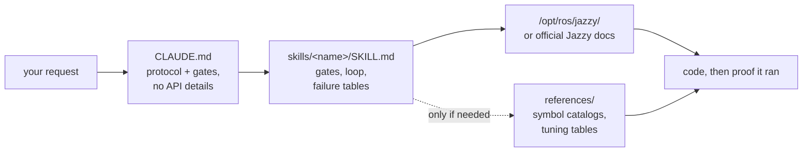

<div align="center">


**Claude Code Skills for ROS 2 Jazzy Jalisco robotics development.**

Skills, die verändern, *wie* der Agent eine ROS 2-Aufgabe bearbeitet — kläre zuerst die Unbekannten, verifiziere gegen das installierte System und beweise, dass das Ergebnis lief.


[English](README.md) | [한국어](README.ko.md) | [中文](README.zh.md) | [日本語](README.ja.md) | [Español](README.es.md) | [Français](README.fr.md) | **Deutsch**

<sub>🌐 Dieses Dokument ist eine maschinelle Übersetzung. Das Original ist auf [English](README.md).</sub>

| Skills | Immer geladenes Protokoll | Doku-Links (CI-geprüft) | Physische Roboter-Prüfungen | Evaluationen: vor dem Schreiben verifiziert |
| :---: | :---: | :---: | :---: | :---: |
| **11** | **26 Zeilen** | **38** | **4 Skripte** | **0/3 → 3/3** |

</div>

---

## Inhalt

- [Die teuren Fehlermuster](#die-teuren-fehlermuster)
- [Wie diese Skills aufgebaut sind](#wie-diese-skills-aufgebaut-sind)
- [Was es anders macht](#was-es-anders-macht)
- [Evaluationen](#evaluationen)
- [Schnellstart](#schnellstart)
- [Skills](#skills)
- [Verifikationsskripte](#verifikationsskripte)
- [Funktionsweise](#funktionsweise)
- [Aktualisierung](#aktualisierung)
- [Roadmap](#roadmap)
- [Mitwirken](#mitwirken)
- [Lizenz](#lizenz)

## Die teuren Fehlermuster

Die teuren Fehler in agentengeschriebenem ROS 2-Code sind keine Syntaxfehler. Es sind diejenigen, die unauffällig aussehen:

| Fehlermuster | Was Sie sehen | Warum ein Agent hineintappt |
| :--- | :--- | :--- |
| **Stiller No-Op** | `ros2 topic hz` zeigt 30 Hz; Ihr Callback wird nie ausgelöst | Standardmäßiger RELIABLE Subscriber gegenüber einem BEST_EFFORT Driver. Kompiliert, Code-Review unauffällig, passt auf DDS-Ebene auf nichts zusammen |
| **Falsche Ground Truth** | `/cmd_vel` sagt vorwärts, `/odom` sagt vorwärts — Roboter fährt **rückwärts** | Statische TF umgekehrt im Vergleich zur physischen Montage deklariert. Alles nachgelagerte rechnet *von der falschen Transformation aus* korrekt, sodass nichts widerspricht |
| **Falsche Ära** | Besteht das Review, stirbt zur Laufzeit an einer Methode, die „richtig klingt“ | Auswendig gelernte Foxy/Humble-Ära-API, die in Jazzy umbenannt wurde oder nie existierte |
| **Falsche Prämisse** | 200 Zeilen basieren auf einer Annahme, die Sie in einem Satz korrigiert hätten | Nichts hat dem Agenten gesagt, die Unbekannten vor dem Schreiben zu klären |

Kein Compiler, Linter oder Log-Inspektor erfasst einen dieser Fehler. Jeder einzelne kostet einen kompletten Durchlauf: Sie lesen die Ausgabe, finden heraus, was falsch ist, erklären es, und der Agent generiert neu.

## Wie diese Skills aufgebaut sind

Vier Designregeln, angewendet auf jeden Skill.

**1. Kläre die Unbekannten vor dem Schreiben.** Einige Fakten stehen in keiner Dokumentation — ob es sich um echte Hardware oder Simulation handelt, ob Sie einen bestehenden Workspace erweitern oder neu beginnen, welcher Node bereits die betroffene Transformation publiziert und die tatsächliche Geometrie des Roboters. [`CLAUDE.md`](./CLAUDE.md) veranlasst den Agenten, diese Punkte zuerst zu klären und nachzufragen, wenn die Anfrage es nicht angibt. Domänenspezifische Unbekannte befinden sich im Skill: `ros2-dev` fragt nach Footprint, Antriebsart und Lokalisierungsquelle, bevor eine einzige Nav2-Parametermenge geschrieben wird.

**2. Eine Schleife mit definiertem Ende.** Jeder Skill führt *verifizieren → schreiben → beweisen* aus: Lese die gelieferten Standardwerte auf dem installierten System, schreibe jeweils eine Änderung und bestätige dann, dass sie tatsächlich gelaufen ist. „Fertig“ bedeutet beobachtbare Nachweise — ein erfolgreicher Build, `ros2 topic echo` zeigt Daten, ein Prüfskript besteht — nicht produzierter Code.

**3. Fehlertabellen statt Prosa.** Der wertvollste Inhalt ist die Zeile Symptom → Ursache → Maßnahme, da sie nirgendwo in den offiziellen Dokus zusammengefasst ist und nicht veraltet, wenn ein Release erscheint:

> `[` ist GZ→ROS, `]` ist ROS→GZ · `16UC1` ist Millimeter, `32FC1` ist Meter · `joint_state_broadcaster` wird nicht automatisch gespawnt · `raytrace_max_range` ≤ `obstacle_max_range` bedeutet, dass Hindernisse nie gelöscht werden · rclc alloziert unbegrenzte Nachrichtenfelder nicht automatisch

**4. Drei Schichten, drei Preisschilder.** Die `description` eines Skills ist immer im Kontext vorhanden, sein Hauptteil lädt, wenn der Skill ausgelöst wird, und `references/`-Dateien werden nur gelesen, wenn die Aufgabe sie benötigt. Umfangreiche Symbolkataloge und Tuning-Tabellen befinden sich in `references/`, sodass jemand, der AMCL debuggt, nicht für die Behavior-Tree-Nodeliste zahlt — und Tiefe hinzugefügt werden kann, ohne jeden Ladevorgang zu belasten.

## Was es anders macht

Die meisten Robotik-Skill-Packs betten API-Wissen direkt in die Skill-Dateien ein. Das funktioniert, bis sich das Ökosystem weiterentwickelt — dann ist jedes eingebettete Snippet ein Fakt, der stillschweigend veralten kann. Dieses Repository setzt auf das Gegenteil:

| | Inhaltslastige Skill-Packs | **claude-ros2-skills** |
| :--- | :--- | :--- |
| Wo das Wissen lebt | Fest in Skill-Dateien eingebettet, **400–1.800 Zeilen/Skill** | Zu offiziellen Dokus geleitet; **~60-Zeilen** Skill-Hauptteile, große Details in `references/` werden **nur bei Bedarf** gelesen |
| Immer geladener Kontext | Vollständige SKILL.md | **26-Zeilen**-Protokoll |
| Wenn sich eine Jazzy-API ändert | Snippets veralten stillschweigend; erfordert für immer Doku-Regressionstests | Veralterungsfläche schrumpft auf Einstiegspunkt-Links + Symbolnamen — **38 Links** wöchentlich CI-geprüft (nur Erreichbarkeit), ein dead link lässt den Build fehlschlagen |
| Verifikation | statisch / Log-basiert | **physisch**: IMU-Gravitation, Anschubtest, TF-Montagen vs. reale Hardware, DDS QoS-Abgleich |
| Distro-Anspruch | „deckt 4 Distros ab“ über Beispiele, die auf eine abzielen | **Nur Jazzy**, im Voraus klar angegeben |

Dieses Repository optimiert für eine Sache: die geringste Wahrscheinlichkeit von plausibel aussehendem Code, der auf Jazzy nicht läuft.

## Evaluationen

Identische Prompts laufen in frischen Headless Claude Code-Sitzungen mit und ohne installierte Skills, jeweils dasselbe Modell pro Paar, Symbol für Symbol anhand von gepinnten Upstream-`jazzy`-Quellen bewertet.

| Ergebnis | Ohne Skills | Mit Skills |
| :--- | ---: | ---: |
| Falsche/erfundene Nav2 MPPI-Schlüssel (haiku) | **~30** — gar keine `critics:`-Liste, Konfiguration kann nicht laufen | **~16–20** — Plugin-String, `motion_model` und Checker-Namespaces korrekt |
| `/scan`-Callback wird auf realem BEST_EFFORT-LiDAR ausgelöst (sonnet) | **nie** — falsches Standard-QoS, stillschweigend | **ja** |
| Durchläufe, die vor dem Schreiben verifiziert haben | **0 / 3** | **3 / 3** |

Der Unterschied im Verhalten ist das deutliche Ergebnis: Baseline-Durchläufe nutzten **null** Verifikationswerkzeuge, obwohl diese verfügbar waren, während jeder Durchlauf mit Skills den Skill lud und zuerst nach den gelieferten Standardwerten suchte. Ein Durchlauf stellte im Voraus seine drei Gate-Fragen und berichtete genau, was verifiziert werden konnte und was nicht, anstatt stillschweigend zu raten.

Vollständige Bewertungstabellen, Bedingungen und Analysen pro Durchlauf: [`evals/RESULTS.md`](./evals/RESULTS.md) · Protokoll, Aufgaben-Checklisten und das Container-Rezept: [`evals/README.md`](./evals/README.md). PRs mit bewerteten Transkripten sind willkommen.

## Schnellstart

**Option A — Plugin Marketplace (empfohlen):**

```
/plugin marketplace add Leehyunbin0131/claude-ros2-skills
/plugin install claude-ros2-skills@claude-ros2-skills
```

Aktualisierungen erfolgen mit `/plugin marketplace update`.

**Option B — Manuelles Kopieren:**

```bash
git clone https://github.com/Leehyunbin0131/claude-ros2-skills.git

# Project-level (this project only)
mkdir -p your-project/.claude/skills
cp -r claude-ros2-skills/skills/* your-project/.claude/skills/
cp claude-ros2-skills/CLAUDE.md your-project/

# OR user-level (all projects)
mkdir -p ~/.claude/skills
cp -r claude-ros2-skills/skills/* ~/.claude/skills/
```

Starten Sie Claude Code neu (oder starten Sie eine neue Sitzung), um die Skills zu übernehmen.

## Skills

| Skill | Pfad | Abdeckung |
| :--- | :--- | :--- |
| **ros2-core** | `skills/ros2-core/SKILL.md` | rclcpp, rclpy, TF2, EKF-Odometrie, QoS-Profile, Parameter |
| **ros2-package** | `skills/ros2-package/SKILL.md` | `ros2 pkg create`, CMakeLists/setup.py-Einbindung, Colcon Build & Source, benutzerdefinierte Interfaces |
| **ros2-dev** | `skills/ros2-dev/SKILL.md` | Nav2 (AMCL, Costmaps, MPPI/Smac), SLAM Toolbox, RTAB-Map, Isaac ROS |
| **gazebo-sim** | `skills/gazebo-sim/SKILL.md` | Gazebo Harmonic, ros_gz_bridge, ros_gz_sim, SDFormat-Modellierung |
| **ros2-control** | `skills/ros2-control/SKILL.md` | ros2_control Hardware-Abstraktion, Controller Manager, URDF-Tags |
| **ros2-moveit** | `skills/ros2-moveit/SKILL.md` | MoveIt 2, MoveGroup C++/Python API, IK-Solver, OMPL, MoveIt Servo |
| **ros2-perception** | `skills/ros2-perception/SKILL.md` | image_transport, cv_bridge, vision_msgs, depth_image_proc, PCL |
| **ros2-testing** | `skills/ros2-testing/SKILL.md` | launch_testing, gtest/pytest, rosbag2 C++/Python APIs, ros2trace |
| **ros2-microros** | `skills/ros2-microros/SKILL.md` | micro-ROS Agent, rclc Client-API, benutzerdefinierte Transporte, statischer Speicher |
| **ros2-security** | `skills/ros2-security/SKILL.md` | SROS2, PKI Keystore-Generierung, Zugriffskontrolle, DDS Security |
| **ros2-troubleshooting** | `skills/ros2-troubleshooting/SKILL.md` | REP 103/105 Ground-Truth-TF-Baum, LiDAR/IMU-Ausrichtung, physische Verifikation |

## Verifikationsskripte

Gebündelt im `ros2-troubleshooting`-Skill (`skills/ros2-troubleshooting/scripts/`), sodass sie mit jeder Installation mitreisen. Diese verwandeln die physischen Prüfungen in ausführbare Pass/Fail-Fakten (erfordert eine gessourcte ROS 2-Umgebung; jeder beendet mit 0 = PASS, 1 = FAIL, 2 = keine Daten):

| Skript | Verifiziert |
| :--- | :--- |
| `check_imu_gravity.py` | Roboter im Ruhezustand → Gravitation beträgt ~+9,81 m/s² auf **+Z** (REP 103). Erfasst umgekehrte oder gedrehte IMU-Halterungen. |
| `check_odom_direction.py` | Roboter nach vorne schieben → Odometrie-Verschiebung ist positiv entlang seiner Ausrichtung. Erfasst invertierte Motoren, Encoder oder TF. |
| `check_tf_tree.py` | `map→odom→base_link` wird aufgelöst; gibt jede Sensorhalterung als RPY-Grad aus und markiert ~180°-Deklarationen zum Vergleich mit der physischen Montage. |
| `check_qos_compat.py` | Jedes Publisher/Subscriber-Paar auf einem Topic ist gemäß den DDS-Matching-Regeln QoS-kompatibel. Erfasst den stillen Fehler „Topic zeigt 30 Hz, aber mein Callback wird nie ausgelöst“ (BEST_EFFORT Pub vs. RELIABLE Sub sowie Durability/Deadline/Liveliness-Fehlanpassungen). |

Die reine Entscheidungslogik ist ohne ROS unit-getestet (`python3 skills/ros2-troubleshooting/scripts/test_checks.py`) und läuft bei jedem Push in der CI.

## Funktionsweise



`CLAUDE.md` enthält keine API-Details — es legt das Protokoll und die Fragen fest, die vor dem Schreiben beantwortet werden müssen. Jeder `SKILL.md`-Hauptteil enthält die Entscheidungen: was festzulegen ist, die Verifizieren-Schreiben-Beweisen-Schleife und die Fehlertabelle für diese Domäne. Umfangreiches Referenzmaterial liegt einen Schritt entfernt in `references/`. Siehe [`CLAUDE.md`](./CLAUDE.md).

## Aktualisierung

```bash
cd claude-ros2-skills
git pull
cp -r skills/* ~/.claude/skills/   # or your project's .claude/skills/
```

## Roadmap

1. **Evaluation-Paare bewertet innerhalb von `ros:jazzy`**, gegen eine Live-Installation statt gegen gepinnte Quellen — Container-Rezept in [`evals/README.md`](./evals/README.md).
2. **Ergebnisse für Task 5** — die Aufgabe mit einem binären Laufzeitergebnis (gibt `ros2 topic echo` Daten aus), die `ros2-package` und die Build/Source-Schleife durchgehend testet.
3. **Korrekturen-bis-Fertigstellung als verfolgte Metrik.** Wie viele Runden von „Nein, nicht so“ eine Aufgabe benötigt, ist die Zahl, für die Benutzer tatsächlich bezahlen.
4. **Deterministische `references/`-Auflösung**, sodass detaillierte Informationen immer dann erreicht werden, wenn sie relevant sind.
5. **Erweiterung der Aufteilung zwischen Hauptteil und `references/`** auf `ros2-core` und `gazebo-sim`, die nächsten Skills mit großem Referenzumfang und hoher Ladefrequenz.

## Mitwirken

Kurzfassung — Skill-Hauptteile bleiben Entscheidungsinhalte (Gates, Schleife, Fehlertabellen) mit großen Details in `references/`, jedes Symbol wird gegen die Jazzy-Doku oder `/opt/ros/jazzy/` verifiziert, und Skripte behalten ihre reine Logik ohne ROS unit-testbar. Vollständige Regeln, die Skill/Skript-Checklisten und Issue-Vorlagen: [`CONTRIBUTING.md`](./CONTRIBUTING.md).

## Lizenz

Apache-2.0 — siehe [LICENSE](./LICENSE).
