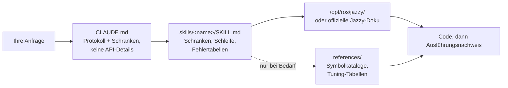

<div align="center">


**Claude Code Skills for ROS 2 Jazzy Jalisco robotics development.**

Skills, die grundlegend verändern, wie KI-Agenten die ROS 2-Entwicklung angehen: Unbekannte Parameter vorab identifizieren, Einstellungen anhand installierter Pakete überprüfen und die Ausführung durch praktische Nachweise bestätigen.


[English](README.md) | [한국어](README.ko.md) | [中文](README.zh.md) | [日本語](README.ja.md) | [Español](README.es.md) | [Français](README.fr.md) | **Deutsch**

<sub>🌐 Dieses Dokument ist eine maschinelle Übersetzung. Das Original ist auf [English](README.md).</sub>

| Skills | Dauerhaft geladenes Protokoll | Doku-Links (CI-geprüft) | Physische Robotertests | Evaluationen: Vor dem Schreiben verifiziert |
| :---: | :---: | :---: | :---: | :---: |
| **11** | **26 Zeilen** | **38** | **4 Skripte** | **0/3 → 3/3** |

</div>

---

## Inhaltsverzeichnis

- [Die teuren Fehlermuster](#die-teuren-fehlermuster)
- [Wie diese Skills aufgebaut sind](#wie-diese-skills-aufgebaut-sind)
- [Was es anders macht](#was-es-anders-macht)
- [Evaluationen](#evaluationen)
- [Schnellstart](#schnellstart)
- [Skills](#skills)
- [Verifikationsskripte](#verifikationsskripte)
- [Funktionsweise](#funktionsweise)
- [Aktualisierung](#aktualisierung)
- [Roadmap](#roadmap)
- [Mitwirken](#mitwirken)
- [Lizenz](#lizenz)

## Die teuren Fehlermuster

Die kostenintensivsten Fehler in KI-generiertem ROS 2-Code sind selten Syntaxfehler. Stattdessen handelt es sich um subtile Probleme, die auf den ersten Blick korrekt erscheinen:

| Fehlermuster | Symptom | Ursache beim KI-Agenten |
| :--- | :--- | :--- |
| **Stiller Fehler** | `ros2 topic hz` zeigt 30 Hz an; Ihr Callback wird jedoch nie ausgelöst | Ein standardmäßiger RELIABLE-Subscriber versucht, sich mit einem BEST_EFFORT-Publisher zu verbinden. Der Code kompiliert und besteht das Code-Review, schlägt aber auf DDS-Middleware-Ebene fehl. |
| **Falsche Ground Truth** | `/cmd_vel` zeigt Vorwärtsbewegung an und `/odom` meldet Vorwärtsbewegung, aber der physische Roboter bewegt sich **rückwärts** | Das statische TF-Frame ist relativ zur physischen Montage invertiert. Nachgelagerte Komponenten rechnen korrekt *unter Verwendung der falschen Transformation*, wodurch keine offensichtlichen Fehler entstehen. |
| **Veraltete API** | Code besteht das Review, schlägt aber zur Laufzeit beim Aufruf einer falschen Methode fehl | Der Agent verwendet veraltete Foxy- oder Humble-API-Methoden, die in Jazzy umbenannt oder entfernt wurden. |
| **Ungültige Prämisse** | Der Agent schreibt 200 Zeilen Code basierend auf einer Annahme, die Sie in einem einzigen Satz hätten korrigieren können | Es gibt keinen Mechanismus, der den Agenten dazu auffordert, fehlende Details vor der Codegenerierung zu überprüfen. |

Weder Compiler, Linter noch Log-Analysen erkennen diese verborgenen Probleme. Die Behebung jedes dieser Fehler erfordert einen zusätzlichen Feedback-Zyklus: Ausgabe prüfen, Ursache diagnostizieren, Korrektur erklären und den Code neu generieren.

## Wie diese Skills aufgebaut sind

Jeder Skill in diesem Repository folgt vier Designregeln:

**1. Unbekannte Variablen vorab identifizieren.** Wichtige betriebliche Details sind in der Dokumentation oft nicht enthalten – wie etwa, ob die Umgebung reale Hardware oder eine Simulation ist, ob ein bestehender Workspace erweitert oder ein neuer erstellt werden soll, welcher Node bereits eine Transformation publiziert oder wie die genaue Geometrie des Roboters aussieht. [`CLAUDE.md`](./CLAUDE.md) weist den Agenten an, diese Unbekannten vor der Codegenerierung zu klären. Domänenspezifische Skills verwalten gezielte Parameter; so fordert `ros2-dev` beispielsweise die Grundfläche des Roboters (Footprint), die Antriebskinematik und die Lokalisierungsquelle an, bevor Nav2-Parameter konfiguriert werden.

**2. Eine strukturierte Schleife mit klaren Abbruchkriterien ausführen.** Jeder Skill folgt einem Zyklus aus *Prüfen → Schreiben → Nachweisen* (verify → write → prove): Systemstandards der installierten Umgebung abfragen, inkrementelle Änderungen vornehmen und die Ausführung bestätigen. Eine Aufgabe ist erst abgeschlossen, wenn sie durch beobachtbare Nachweise belegt ist – wie etwa einen erfolgreichen Build, aktive Daten auf `ros2 topic echo` oder ein bestandenes Verifikationsskript – und nicht schon durch das bloße Erstellen von Codedateien.

**3. Strukturierte Fehlertabellen gegenüber langen Beschreibungen bevorzugen.** Strukturierte Tabellen, die Symptome → Ursachen → Abhilfemaßnahmen zuordnen, bieten klare und dauerhafte Orientierung, die in offiziellen Dokumentationen oft fehlt und über Release-Versionen hinweg zuverlässig bleibt:

> `[` ist GZ→ROS, `]` ist ROS→GZ · `16UC1` ist Millimeter, `32FC1` ist Meter · `joint_state_broadcaster` wird nicht automatisch gestartet · `raytrace_max_range` ≤ `obstacle_max_range` bedeutet, dass Hindernisse nie entfernt werden · rclc weist unbegrenzten Nachrichtenfeldern keinen automatischen Speicher zu

**4. Kontextnutzung mit einer Drei-Schichten-Architektur optimieren.** Jeder Skill balanciert die Kontexteffizienz optimal aus: Skill-Beschreibungen verbleiben im Kontext, Skill-Inhalte werden beim Aufruf geladen und tiefgehende Referenzdateien in `references/` werden nur bei Bedarf geladen. Große Symbolkataloge und detaillierte Parameter-Tuning-Tabellen befinden sich in `references/`. Dadurch bleibt Kontext erhalten, und beim Debuggen gezielter Komponenten (wie AMCL) werden keine unnötigen Dokumente (wie Behavior-Tree-Nodes) geladen.

## Was es anders macht

Die meisten Skill-Pakete für Robotik betten statisches API-Wissen direkt in die Skill-Dateien ein. Während die erste Nutzung dadurch einfach ist, bricht dieser Ansatz zusammen, wenn die zugrundeliegenden Pakete aktualisiert werden – zurück bleiben veraltete Code-Snippets, die stillschweigend fehlschlagen. Dieses Repository verfolgt einen dynamischen, dokumentationsgesteuerten Ansatz:

| Merkmal | Inhaltslastige Skill-Pakete | **claude-ros2-skills** |
| :--- | :--- | :--- |
| Ort des Wissens | In Skill-Dateien eingebettet (**400–1.800 Zeilen/Skill**) | Auf offizielle Doku verlinkt (**~60 Zeilen** Skill-Inhalt); detaillierte Referenzen werden **nur bei Bedarf** gelesen |
| Dauerhaft geladener Kontext | Vollständige `SKILL.md`-Dateien | **26 Zeilen** Kernprotokoll |
| Umgang mit Jazzy-API-Updates | Snippets veralten unbemerkt; erfordert kontinuierliche manuelle Test-Updates | Risiko veralteter Snippets auf Einstiegspunkt-Links und Symbolnamen minimiert — **38 Dokumentations-Links** wöchentlich per CI verifiziert |
| Verifikationsmethode | Statische Codeanalyse oder Log-Prüfung | **Physische & Laufzeit-Verifikation**: IMU-Schwerkraftprüfungen, Odometrie-Richtungstests, TF-Frame-Ausrichtung, DDS-QoS-Kompatibilität |
| Unterstützte Distros | Behauptet Unterstützung für mehrere ROS-Distros, deckt aber tatsächlich nur eine ab | **Nur ROS 2 Jazzy**, explizit dafür entwickelt und validiert |

Dieses Repository ist auf ein einziges Ziel optimiert: Das Risiko zu minimieren, plausibel aussehenden Code zu generieren, der auf ROS 2 Jazzy nicht ausgeführt werden kann.

## Evaluationen

Um die Leistung zu bewerten, wurden identische Prompts in frischen, Headless-Claude-Code-Sitzungen sowohl mit als auch ohne installierte Skills ausgeführt. Jedes Paar verwendete dasselbe Modell und wurde Symbol für Symbol gegen gepinnte Upstream-ROS 2-Jazzy-Quell-Repositories ausgewertet.

| Metrik / Test | Ohne Skills | Mit Skills |
| :--- | ---: | ---: |
| Falsche oder erfundene Nav2 MPPI-Schlüssel (Haiku) | **~30** — erforderliche `critics:`-Liste fehlt; Konfiguration kann nicht ausgeführt werden | **~16–20** — korrekte Plugin-Strings, `motion_model` und Checker-Namespaces |
| `/scan`-Callback wird auf einem physischen BEST_EFFORT-LiDAR ausgeführt (Sonnet) | **Nie** — schlägt aufgrund nicht übereinstimmender QoS-Standards stillschweigend fehl | **Ja** — verbindet sich erfolgreich |
| Ausführungsdurchläufe, die die Umgebung vor dem Schreiben von Code überprüften | **0 / 3** | **3 / 3** |

Die Verhaltensänderung ist das auffälligste Ergebnis: Baseline-Sitzungen nutzten **null** Verifikationswerkzeuge, selbst wenn diese verfügbar waren, während Sitzungen mit diesen Skills zuerst relevante Leitlinien luden und Systemstandards überprüften. In einem Test stellte der Agent vorab wichtige klärende Fragen und berichtete explizit über verifizierte Parameter im Vergleich zu ungeprüften Annahmen, wodurch uninformierte Vermutungen vermieden wurden.

Überprüfen Sie vollständige Auswertungstabellen, Testumgebungen und einzelne Durchlaufanalysen in [`evals/RESULTS.md`](./evals/RESULTS.md). Details zum Evaluationsprotokoll, Aufgaben-Checklisten und Container-Setup finden Sie unter [`evals/README.md`](./evals/README.md). Pull Requests mit weiteren bewerteten Transkripten sind herzlich willkommen.

## Schnellstart

**Option A — Plugin-Marketplace (Empfohlen):**

```
/plugin marketplace add Leehyunbin0131/claude-ros2-skills
/plugin install claude-ros2-skills@claude-ros2-skills
```

Aktualisieren Sie installierte Plugins jederzeit mit `/plugin marketplace update`.

**Option B — Manuelle Installation:**

```bash
git clone https://github.com/Leehyunbin0131/claude-ros2-skills.git

# Projektbasierte Installation (gilt nur für das aktuelle Projekt)
mkdir -p your-project/.claude/skills
cp -r claude-ros2-skills/skills/* your-project/.claude/skills/
cp claude-ros2-skills/CLAUDE.md your-project/

# Benutzerübergreifende Installation (gilt für alle Projekte)
mkdir -p ~/.claude/skills
cp -r claude-ros2-skills/skills/* ~/.claude/skills/
```

Starten Sie Claude Code neu (oder starten Sie eine neue Sitzung), um die installierten Skills anzuwenden.

## Skills

| Skill | Pfad | Abdeckung |
| :--- | :--- | :--- |
| **ros2-core** | `skills/ros2-core/SKILL.md` | rclcpp, rclpy, TF2, EKF-Odometrie, QoS-Profile, Parameter |
| **ros2-package** | `skills/ros2-package/SKILL.md` | `ros2 pkg create`, CMakeLists/setup.py-Konfiguration, colcon build & source, benutzerdefinierte Interfaces |
| **ros2-dev** | `skills/ros2-dev/SKILL.md` | Nav2 (AMCL, Costmaps, MPPI/Smac), SLAM Toolbox, RTAB-Map, Isaac ROS |
| **gazebo-sim** | `skills/gazebo-sim/SKILL.md` | Gazebo Harmonic, ros_gz_bridge, ros_gz_sim, SDFormat-Modellierung |
| **ros2-control** | `skills/ros2-control/SKILL.md` | ros2_control-Hardwareabstraktion, Controller Manager, URDF-Tags |
| **ros2-moveit** | `skills/ros2-moveit/SKILL.md` | MoveIt 2, MoveGroup C++/Python-API, IK-Solver, OMPL, MoveIt Servo |
| **ros2-perception** | `skills/ros2-perception/SKILL.md` | image_transport, cv_bridge, vision_msgs, depth_image_proc, PCL |
| **ros2-testing** | `skills/ros2-testing/SKILL.md` | launch_testing, gtest/pytest, rosbag2 C++/Python-APIs, ros2trace |
| **ros2-microros** | `skills/ros2-microros/SKILL.md` | micro-ROS Agent, rclc-Client-API, benutzerdefinierte Transporte, statischer Speicher |
| **ros2-security** | `skills/ros2-security/SKILL.md` | SROS2, PKI-Keystore-Erstellung, Zugriffskontrolle, DDS Security |
| **ros2-troubleshooting** | `skills/ros2-troubleshooting/SKILL.md` | REP 103/105 Ground-Truth-TF-Baum, LiDAR/IMU-Ausrichtung, physische Verifikation |

## Verifikationsskripte

Diese Verifikationsskripte sind im Skill `ros2-troubleshooting` (`skills/ros2-troubleshooting/scripts/`) enthalten und werden bei jeder Installation mitgeliefert. Sie wandeln physische Hardware-Prüfungen in ausführbare Pass/Fail-Verifikationsschritte um (erfordert eine gesourcte ROS 2-Umgebung; Rückgabecodes: 0 = PASS, 1 = FAIL, 2 = NO DATA):

| Skript | Verifiziert |
| :--- | :--- |
| `check_imu_gravity.py` | Überprüft, ob ein ruhender Roboter die Schwerkraft mit ~+9,81 m/s² entlang der **+Z**-Achse misst (REP 103). Erkennt invertierte oder fehlausgerichtete IMU-Montagen. |
| `check_odom_direction.py` | Überprüft, ob das Schieben des Roboters nach vorne eine positive Odometrie-Verschiebung entlang seiner Ausrichtung erzeugt. Erkennt invertierte Drehrichtungen der Motoren, Polaritätsprobleme der Encoder oder invertierte TF-Setups. |
| `check_tf_tree.py` | Überprüft, ob `map→odom→base_link` korrekt aufgelöst wird; zeigt jeden Sensormontage-Offset in RPY-Grad an und hebt potenzielle 180°-Orientierungsfehler hervor. |
| `check_qos_compat.py` | Überprüft die QoS-Kompatibilität für alle Publisher/Subscriber-Paare auf einem Topic unter Verwendung von DDS-Regeln. Verhindert stille Fehler (wie ein BEST_EFFORT-Publisher gepaart mit einem RELIABLE-Subscriber oder Abweichungen bei Durability, Deadline und Liveliness). |

Die Kern-Entscheidungslogik wird unabhängig von ROS per Unit-Test geprüft (`python3 skills/ros2-troubleshooting/scripts/test_checks.py`) und läuft bei jedem Push über Continuous Integration (CI).

## Funktionsweise



`CLAUDE.md` enthält keine spezifischen API-Details. Stattdessen legt es das Betriebsprotokoll fest und verlangt, dass klärende Fragen vor dem Schreiben von Code beantwortet werden. Jede `SKILL.md`-Datei steuert domänenspezifische Entscheidungen: Identifizierung unbekannter Variablen, Ausführung der Schleife aus Prüfen, Schreiben und Nachweisen sowie das Nachschlagen in Fehlertabellen. Detaillierte Referenzmaterialien sind separat im Verzeichnis `references/` abgelegt. Weitere Einzelheiten finden Sie in [`CLAUDE.md`](./CLAUDE.md).

## Aktualisierung

```bash
cd claude-ros2-skills
git pull
cp -r skills/* ~/.claude/skills/   # oder im Verzeichnis .claude/skills/ Ihres Projekts
```

## Roadmap

1. **Evaluationspaare innerhalb von `ros:jazzy`-Containern automatisieren**, um eine Live-Installations-Baseline zu etablieren – Details zum Container-Setup finden Sie in [`evals/README.md`](./evals/README.md).
2. **Evaluationsergebnisse für Task 5 veröffentlichen** – Validierung der Laufzeit-Performance mit binären Ergebnissen (Bestätigung, ob `ros2 topic echo` Daten ausgibt) über `ros2-package`-Builds und Workspace-Sourcing-Zyklen hinweg.
3. **"Korrekturen bis zur Fertigstellung" als Kernmetrik nachverfolgen** – Messung der Anzahl der erforderlichen Feedback-Iterationen, bevor der Code erfolgreich ausgeführt wird.
4. **Deterministische `references/`-Lookups implementieren**, um sicherzustellen, dass detaillierte Referenzdokumente immer dann geladen werden, wenn sie relevant sind.
5. **Aufteilung zwischen Inhalt und `references/` ausweiten** auf `ros2-core` und `gazebo-sim`, um die Kontexteffizienz für häufig genutzte Skills mit umfangreicher Referenzdokumentation zu optimieren.

## Mitwirken

Zusammenfassung: Skill-Dateien müssen sich auf die Entscheidungslogik (Validierungsschranken, Schleifenschritte und Fehlertabellen) konzentrieren, während detaillierte Dokumentationen in `references/` verbleiben. Jedes API-Symbol muss anhand der offiziellen Jazzy-Dokumentation oder lokaler `/opt/ros/jazzy/`-Installationen verifiziert werden. Verifikationsskripte müssen reine Logik enthalten, die ohne ROS-Abhängigkeiten per Unit-Test geprüft werden kann. Vollständige Richtlinien, Checklisten für Skills und Skripte sowie Vorlagen für Issues finden Sie unter [`CONTRIBUTING.md`](./CONTRIBUTING.md).

## Lizenz

Apache-2.0 — siehe [LICENSE](./LICENSE).
