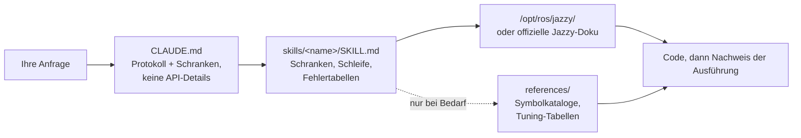

<div align="center">


**Claude Code Skills for ROS 2 Jazzy Jalisco robotics development.**

Skills, die die ROS 2-Entwicklung mit KI-Agenten grundlegend verändern: Unbekannte Parameter im Voraus identifizieren, Einstellungen anhand installierter Pakete verifizieren und die Ausführung durch funktionierende Nachweise bestätigen.


[English](README.md) | [한국어](README.ko.md) | [中文](README.zh.md) | [日本語](README.ja.md) | [Español](README.es.md) | [Français](README.fr.md) | **Deutsch**

<sub>🌐 Dieses Dokument ist eine maschinelle Übersetzung. Das Original ist auf [English](README.md).</sub>

| Skills | Immer geladenes Protokoll | Doku-Links (CI-geprüft) | Physikalische Roboter-Prüfungen | Evals: Gazebo A/B |
| :---: | :---: | :---: | :---: | :---: |
| **11** | **26 Zeilen** | **32** | **4 Skripte** | **Ziel erreicht vs. Bringup-Abbruch** |

</div>

---

## Inhalt

- [Die teuren Fehlermuster](#die-teuren-fehlermuster)
- [Wie diese Skills aufgebaut sind](#wie-diese-skills-aufgebaut-sind)
- [Was es anders macht](#was-es-anders-macht)
- [Evaluationen](#evaluationen)
- [Schnellstart](#schnellstart)
- [Skills](#skills)
- [Verifikationsskripte](#verifikationsskripte)
- [Funktionsweise](#funktionsweise)
- [Aktualisierung](#aktualisierung)
- [Roadmap](#roadmap)
- [Mitwirken](#mitwirken)
- [Lizenz](#lizenz)

## Die teuren Fehlermuster

Die kostenintensivsten Fehler in KI-generiertem ROS 2-Code sind selten Syntaxfehler. Stattdessen handelt es sich um subtile Probleme, die auf den ersten Blick korrekt wirken:

| Fehlermuster | Was Sie sehen | Warum der Agent auf das Problem stößt |
| :--- | :--- | :--- |
| **Stiller Fehlschlag** | `ros2 topic hz` zeigt 30 Hz an; Ihr Callback wird jedoch nie ausgelöst | Ein Standard-Subscriber mit RELIABLE versucht sich mit einem BEST_EFFORT-Publisher zu verbinden. Der Code kompiliert und besteht das Code-Review, schlägt aber auf DDS-Middleware-Ebene fehl. |
| **Falsche Ground Truth** | `/cmd_vel` zeigt Vorwärtsbewegung an und `/odom` meldet Vorwärtsbewegung, aber der physische Roboter bewegt sich **rückwärts** | Der statische TF-Frame ist relativ zur physischen Montage invertiert. Nachgelagerte Komponenten rechnen korrekt *unter Verwendung der falschen Transformation*, ohne offensichtliche Fehler zu erzeugen. |
| **Veraltete API** | Der Code besteht das Review, schlägt aber zur Laufzeit beim Aufruf einer falschen Methode fehl | Der Agent verwendet veraltete Foxy- oder Humble-API-Methoden, die in Jazzy umbenannt oder entfernt wurden. |
| **Ungültige Prämisse** | Der Agent schreibt 200 Zeilen Code basierend auf einer Annahme, die Sie in einem einzigen Satz hätten korrigieren können | Kein Mechanismus fordert den Agenten auf, fehlende Details vor der Codegenerierung zu verifizieren. |

Weder Compiler, Linter noch Log-Analysen erkennen diese versteckten Probleme. Die Behebung jedes Fehlers erfordert einen zusätzlichen Feedback-Zyklus: Ausgabe überprüfen, Ursache diagnostizieren, Korrektur erklären und den Code erneut generieren.

## Wie diese Skills aufgebaut sind

Vier Entwurfsregeln bestimmen jeden Skill in diesem Repository:

**1. Unbekannte Variablen im Voraus identifizieren.** Wichtige betriebliche Details sind in der Dokumentation oft nicht vorhanden – etwa ob die Umgebung reale Hardware oder Simulation ist, ob ein bestehender Workspace erweitert oder ein neuer erstellt werden soll, welcher Node bereits eine Transformation publiziert oder die genaue Geometrie des Roboters. [`CLAUDE.md`](./CLAUDE.md) weist den Agenten an, diese Unbekannten vor der Codegenerierung zu klären. Domänenspezifische Skills verwalten gezielte Parameter; beispielsweise fordert `ros2-dev` die Footprint-Geometrie des Roboters, die Antriebskinematik und die Lokalisierungsquelle an, bevor Nav2-Parameter konfiguriert werden.

**2. Eine strukturierte Schleife mit klaren Abbruchkriterien ausführen.** Jeder Skill folgt einem *Verifizieren → Schreiben → Beweisen*-Zyklus: Systemstandards in der installierten Umgebung prüfen, inkrementelle Änderungen anwenden und die Ausführung bestätigen. Eine Aufgabe ist erst dann abgeschlossen, wenn sie durch beobachtbare Nachweise gestützt wird – wie etwa einen erfolgreichen Build, aktive Daten auf `ros2 topic echo` oder ein bestandenes Verifikationsskript – anstatt einfach nur Codedateien zu erzeugen.

**3. Strukturierte Fehlertabellen gegenüber langen Beschreibungen bevorzugen.** Strukturierte Tabellen, die Symptome → Ursachen → Korrekturmaßnahmen zuordnen, bieten eine klare, dauerhafte Orientierung, die in offiziellen Dokumentationen oft fehlt und über Release-Versionen hinweg zuverlässig bleibt:

> `[` ist GZ→ROS, `]` ist ROS→GZ · `16UC1` ist Millimeter, `32FC1` ist Meter · `joint_state_broadcaster` wird nicht automatisch gestartet · `raytrace_max_range` ≤ `obstacle_max_range` bedeutet, dass Hindernisse nie gelöscht werden · rclc alloziert unbegrenzte Nachrichtenfelder nicht automatisch

**4. Kontextnutzung mit einer Drei-Schichten-Architektur optimieren.** Jeder Skill balanciert die Kontexteffizienz: Skill-Beschreibungen bleiben im Kontext, Skill-Rümpfe laden bei Aufruf und tiefer gehende Referenzdateien in `references/` laden erst bei Bedarf. Große Symbolkataloge und detaillierte Parameter-Tuning-Tabellen befinden sich in `references/`, wodurch der Kontext geschont wird und beim Debuggen gezielter Komponenten (wie AMCL) keine unnötige Dokumentation (wie Behavior-Tree-Nodes) geladen wird.

## Was es anders macht

Die meisten Robotik-Skill-Pakete betten statisches API-Wissen direkt in Skill-Dateien ein. Während die erste Nutzung einfach ist, bricht dieser Ansatz zusammen, sobald die zugrunde liegenden Pakete aktualisiert werden – zurück bleiben veraltete Code-Snippets, die stillschweigend fehlschlagen. Dieses Repository verfolgt einen dynamischen, dokumentationsgesteuerten Ansatz:

| Merkmal | Inhaltslastige Skill-Pakete | **claude-ros2-skills** |
| :--- | :--- | :--- |
| Speicherort des Wissens | In Skill-Dateien eingebettet (**400–1.800 Zeilen/Skill**) | Verlinkt auf offizielle Doku (**~60-Zeilen** Skill-Rümpfe); detaillierte Referenzen **nur bei Bedarf** gelesen |
| Immer geladener Kontext | Vollständige `SKILL.md`-Dateien | **26-Zeilen** Kernprotokoll |
| Umgang mit Jazzy-API-Updates | Snippets veralten stillschweigend; erfordert kontinuierliche manuelle Test-Updates | Risiko veralteter Snippets auf Einstiegspunkt-Links und Symbolnamen minimiert — **32 Dokumentationslinks** wöchentlich per CI verifiziert |
| Verifikationsmethode | Statische Codeanalyse oder Log-Prüfung | **Physikalische & Laufzeit-Verifikation**: IMU-Gravitationsprüfungen, Richtungs-Odometrietests, TF-Frame-Ausrichtung, DDS-QoS-Kompatibilität |
| Unterstützungsbereich | Behauptet Unterstützung für mehrere ROS-Distros, zielt aber nur auf eine ab | **Nur ROS 2 Jazzy**, explizit entwickelt und validiert |

Dieses Repository ist auf ein einziges Ziel hin optimiert: das Risiko zu minimieren, plausibel aussehenden Code zu generieren, der auf ROS 2 Jazzy nicht ausgeführt werden kann.

## Evaluationen

Jedes unten stehende Ergebnis stammt aus einem gemessenen A/B-Paar: Der **identische Prompt** wurde in frischen, headless Claude Code-Sitzungen ausgeführt – einmal ohne diese Skills, einmal mit ihnen – unter Verwendung **desselben Modells** in beiden Durchläufen. Die Bewertung erfolgte in vier Stufen: Symbol-für-Symbol-Abgleich gegen gepinnte Upstream-Jazzy-Quellen, dann gegen eine Live-Installation unter `/opt/ros/jazzy`, dann durch Laden beider Ausgaben in eine **Live-Gazebo-Simulation** und schließlich durch **Ausführen der generierten Nodes gegen laufende Publisher**. Damit liegt für jede Aufgabe der Testsuite eine Messung auf einer echten Installation vor. Vollständige Transkripte, generierter Code und Ausführungsprotokolle sind unter [`evals/runs/`](./evals/runs/) hinterlegt, der Harness zur Erzeugung der Paare liegt in [`evals/harness/`](./evals/harness/) – so kann jeder die Ergebnisse unabhängig nachprüfen oder neu erzeugen.

Die Stichprobengröße beträgt **n=1 pro Durchlauf**, und Ausführung wie Bewertung erfolgten durch dasselbe Projekt, das diese Ergebnisse veröffentlicht. Die Bewertung ist so mechanisch wie möglich gehalten (existiert das Symbol in der Installation? läuft der Befehl erfolgreich durch?), damit sie unabhängig überprüfbar bleibt.

### Nav2 MPPI-Konfiguration — Haiku, Live-Jazzy-Installation

*Prompt: richte Nav2 mit dem MPPI-Controller für einen Differentialantrieb-Roboter auf Jazzy ein und erstelle die YAML-Datei für den Controller Server.*

| | Ohne Skills | Mit Skills |
| :--- | :--- | :--- |
| Prozess | Sofort aus dem Gedächtnis beantwortet; **null** Verifikation, obwohl Werkzeuge verfügbar waren | Fragte **zuerst** nach Footprint, bestehender Konfiguration, Lokalisierung und Geschwindigkeitsgrenzen, las dann die mitgelieferten Standardwerte unter `/opt/ros/jazzy/share/nav2_bringup/params/nav2_params.yaml` |
| Plugin-String | `mppi_generic::ControllerServer` — existiert nicht | `nav2_mppi_controller::MPPIController` — korrekt |
| `critics:`-Liste | Fehlt vollständig | Alle 8 vorhanden, korrekte Namen |
| Erfundene Parameter-Keys | **~16** | **0** — jeder Schlüssel mechanisch gegen die installierten Standardwerte verglichen |
| **In eine Live-Gazebo-Simulation geladen** | **`[FATAL] Failed to create controller … does not exist` — Nav2 bricht beim Bringup ab; der Roboter bewegt sich nie** | **MPPI + alle 8 Critics werden geladen; Roboter fährt (−2.0, −0.5) → (0.5, 0.5); `NavigateToPose` gibt `SUCCEEDED` zurück** |

### Ein Paket, das tatsächlich laufen muss — Haiku, im Container

*Prompt: erstelle ein Python-Paket `demo_pkg`, das `std_msgs/msg/String` auf `/greeting` mit 1 Hz publiziert, samt einer Launch-Datei; baue es und zeige `ros2 topic echo /greeting`.*

| | Ohne Skills | Mit Skills |
| :--- | :--- | :--- |
| `ros2 run` / `ros2 launch` / `topic echo` | **Alle drei schlagen fehl** — das Paket wird nie im ament index registriert | **Alle drei erfolgreich**, bestätigt durch unabhängige erneute Ausführung jedes Befehls |
| Kosten für dieses Ergebnis | 0,17 $ · 36 Turns · 178 s | **0,08 $ · 18 Turns · 61 s** — im ersten Anlauf korrekt und **2,2-mal günstiger** |

### Sensor-Abonnement — Haiku, beide Nodes gegen einen laufenden Publisher ausgeführt

*Prompt: Schreibe eine Jazzy-Python-Node, die `/scan` abonniert und einmal pro Sekunde die minimale Distanz loggt.* Anschließend wurde jede generierte Node 6 s lang gegen einen BEST_EFFORT-`/scan`-Publisher ausgeführt.

| | Ohne Skills | Mit Skills |
| :--- | :--- | :--- |
| QoS des Abonnements | `create_subscription(..., 10)` → RELIABLE | `qos_profile_sensor_data` |
| **Zur Laufzeit empfangene Nachrichten** | **Null.** rclpy meldete selbst `offering incompatible QoS. No messages will be received from it. Last incompatible policy: RELIABILITY` | **Empfängt mit 5 Hz** |
| Gemeldetes Minimum (korrekte Antwort: 0,45 m) | hat nie eine Nachricht erhalten | **`0,450 m` — korrekt** |
| Sauberes Beenden bei SIGTERM | Traceback | kein Traceback |

Hervorgebracht hat diese Korrektur genau die vorherige Runde desselben Paares: damals filterten beide Nodes nur `inf`, sodass die Node mit Skills `0,020 m` meldete — verbunden, aber überzeugt von einem falschen Wert. `ros2-core` erhielt die Bereichsregel und das Shutdown-Muster, und der obige erneute Durchlauf ist der Nachweis, dass der Patch die Ausgabe tatsächlich verändert hat. Beide Tabellen stehen in [`evals/RESULTS.md`](./evals/RESULTS.md).

### Vor dem Schreiben fragen — Haiku, umgedreht montierter LiDAR

*Prompt: Mein LiDAR ist hinten am Chassis kopfüber und nach hinten gerichtet montiert; schreibe die statische TF und sage mir, wie ich die Korrektur bestätige.*

| | Ohne Skills | Mit Skills |
| :--- | :--- | :--- |
| Klärt zuerst die physische Montage | Antwortete in einem einzigen Zug | **Hielt inne und fragte nach dem Abstand nach hinten und den Offsets**, bevor eine Transformation ausgegeben wurde |
| Korrektheit der Transformation | roll≈180° + yaw≈180°, Eltern-/Kind-Beziehung nach REP 105 — korrekt | korrekt; beide Ausgaben wurden publiziert und von `check_tf_tree.py` exakt wie vorgesehen markiert |
| Empfehlung zur Bestätigung | RViz mit einem **PointCloud2**-Display — falscher Nachrichtentyp für einen LiDAR | `tf2_echo` plus ein **LaserScan**-Display |

### Was diese Skills nicht beheben

Festgehalten, weil das Weglassen den übrigen Ergebnissen an Glaubwürdigkeit nehmen würde:

- **Eine Regel existiert nur, wenn das Routing die Datei lädt, in der sie steht.** Bei der QoS-Diagnoseaufgabe wurden zwei Durchläufe desselben Prompts an *unterschiedliche* Skills geroutet: einmal `ros2-core`, das nächste Mal `ros2-perception`. Die Beispiele von `ros2-perception` sind ausschließlich C++, und es ist das einzige Skill ohne Python-Inhalt; um eine Python-Korrektur gebeten, mit nichts als `rclcpp::` im Kontext, verwendete die Antwort `rclcpp.qos` in Python-Code – was `ModuleNotFoundError` auslöst. **Die Baseline, ohne jedes geladene Skill, schrieb diese API korrekt.** Das ist der einzige gemessene Fall, in dem das Paket die Ausgabe verschlechtert, und die Ursache liegt im Skill-Inhalt, nicht im Modell.
- **Halluzination verschwindet nicht, sie verlagert sich.** In jeder gemessenen Runde enthielt die Ausgabe mit Skills erfundene Symbole: ein nicht existierendes Paket für das eigene Skript dieses Repositories, ein falscher Standardwert für durability, fehlende Bereichsfilterung, ein Python-Modul, das es nicht gibt. Das Routing zur Dokumentation hebt die Untergrenze; es macht das Modell nicht korrekt.
- **Bei Problemen, die das Modell längst beherrscht, kosten Skills mehr und bringen wenig.** Bei der klassischen QoS-Inkompatibilitätsdiagnose lagen beide Bedingungen in einem Zug richtig, und die Variante mit Skills fügte für etwa das 1,4-Fache der Kosten einen Fehler hinzu.
- **Skills verändern zuverlässiger, was der Agent *fragt*, als was er *überprüft*.** In allen vier Skill-Durchläufen dieser Aufgabe hat bei laufender Live-Reproduktion und erlaubtem `Bash` **keiner** das selbst empfohlene `ros2 topic info -v` ausgeführt. Die Verifikation vor dem Schreiben greift durchaus – in Aufgabe 1 führte der Agent zuerst `ros2 interface show` aus – aber das „beweise es danach“ erreicht Diagnoseantworten nicht.

### Das Muster über jedes Paar hinweg

Keine Baseline-Zelle hat in irgendeinem Durchlauf **vor** dem Schreiben gegen die installierten Pakete oder die Dokumentation verifiziert, selbst wenn WebFetch, Read und Bash explizit erlaubt waren – und eine davon meldete einen voll funktionsfähigen Build für ein Paket, das `ros2 run` nicht einmal finden kann. Die Zellen mit Skills stellten in allen Aufgaben mit offenen Unbekannten die vorgelagerten Fragen, und ihre Aussagen stimmten mit der unabhängigen erneuten Ausführung überein. Die Verifikationsskripte sind inzwischen in beide Richtungen an echten Daten erprobt: `check_qos_compat.py` lieferte gegen eine echte BEST_EFFORT/RELIABLE-Inkompatibilität sein erstes reales `[FAIL]`, und `check_tf_tree.py` markierte einen umgedrehten Sensor, ohne den korrekt montierten zu beanstanden.

Lesen Sie die vollständigen Evaluationstabellen, Testumgebungen und einzelnen Laufanalysen in [`evals/RESULTS.md`](./evals/RESULTS.md). Details zum Evaluationsprotokoll, Checklisten für Aufgaben und Container-Setup finden Sie unter [`evals/README.md`](./evals/README.md). Pull-Requests mit weiteren bewerteten Transkripten sind willkommen.

## Schnellstart

**Option A — Plugin Marketplace (Empfohlen):**

```
/plugin marketplace add Leehyunbin0131/claude-ros2-skills
/plugin install claude-ros2-skills@claude-ros2-skills
```

Aktualisieren Sie installierte Plugins jederzeit mit `/plugin marketplace update`.

**Option B — Manuelle Installation:**

```bash
git clone https://github.com/Leehyunbin0131/claude-ros2-skills.git

# Projektbasierte Installation (gilt nur für das aktuelle Projekt)
mkdir -p your-project/.claude/skills
cp -r claude-ros2-skills/skills/* your-project/.claude/skills/
cp claude-ros2-skills/CLAUDE.md your-project/

# Benutzerweite Installation (gilt für alle Projekte)
mkdir -p ~/.claude/skills
cp -r claude-ros2-skills/skills/* ~/.claude/skills/
```

Starten Sie Claude Code neu (oder beginnen Sie eine neue Sitzung), um die installierten Skills anzuwenden.

## Skills

| Skill | Pfad | Abdeckung |
| :--- | :--- | :--- |
| **ros2-core** | `skills/ros2-core/SKILL.md` | rclcpp, rclpy, TF2, EKF-Odometrie, QoS-Profile, Parameter |
| **ros2-package** | `skills/ros2-package/SKILL.md` | `ros2 pkg create`, CMakeLists/setup.py-Einbindung, colcon build & source, benutzerdefinierte Interfaces |
| **ros2-dev** | `skills/ros2-dev/SKILL.md` | Nav2 (AMCL, Costmaps, MPPI/Smac), SLAM Toolbox, RTAB-Map, Isaac ROS |
| **gazebo-sim** | `skills/gazebo-sim/SKILL.md` | Gazebo Harmonic, ros_gz_bridge, ros_gz_sim, SDFormat-Modellierung |
| **ros2-control** | `skills/ros2-control/SKILL.md` | ros2_control Hardware-Abstraktion, Controller Manager, URDF-Tags |
| **ros2-moveit** | `skills/ros2-moveit/SKILL.md` | MoveIt 2, MoveGroup C++/Python-API, IK-Solver, OMPL, MoveIt Servo |
| **ros2-perception** | `skills/ros2-perception/SKILL.md` | image_transport, cv_bridge, vision_msgs, depth_image_proc, PCL |
| **ros2-testing** | `skills/ros2-testing/SKILL.md` | launch_testing, gtest/pytest, rosbag2 C++/Python-APIs, ros2trace |
| **ros2-microros** | `skills/ros2-microros/SKILL.md` | micro-ROS Agent, rclc Client-API, benutzerdefinierte Transporte, statischer Speicher |
| **ros2-security** | `skills/ros2-security/SKILL.md` | SROS2, PKI-Keystore-Erstellung, Zugriffskontrolle, DDS-Sicherheit |
| **ros2-troubleshooting** | `skills/ros2-troubleshooting/SKILL.md` | REP 103/105 Ground-Truth-TF-Baum, LiDAR/IMU-Ausrichtung, physikalische Verifikation |

## Verifikationsskripte

Diese Verifikationsskripte sind im `ros2-troubleshooting`-Skill (`skills/ros2-troubleshooting/scripts/`) gebündelt und bei jeder Installation enthalten. Sie wandeln physikalische Hardware-Prüfungen in ausführbare Erfolgs-/Fehlerschritte (PASS/FAIL) um (erfordert eine gesourcte ROS 2-Umgebung; Rückgabecodes: 0 = PASS, 1 = FAIL, 2 = NO DATA):

| Skript | Verifiziert |
| :--- | :--- |
| `check_imu_gravity.py` | Validiert, dass ein ruhender Roboter die Schwerkraft mit ~+9,81 m/s² entlang der **+Z**-Achse misst (REP 103). Erkennt invertierte oder fehlausgerichtete IMU-Montagen. |
| `check_odom_direction.py` | Validiert, dass das Vorwärtsschieben des Roboters eine positive Odometrieverschiebung in Ausrichtungsrichtung erzeugt. Erkennt invertierte Drehrichtungen der Motoren, Polaritätsprobleme der Encoder oder invertierte TF-Setups. |
| `check_tf_tree.py` | Verifiziert, dass `map→odom→base_link` korrekt aufgelöst wird; zeigt jeden Sensormontage-Offset in RPY-Grad an und hebt potenzielle 180°-Orientierungsfehler hervor. |
| `check_qos_compat.py` | Verifiziert die QoS-Kompatibilität über alle Publisher/Subscriber-Paare auf einem Topic unter Verwendung von DDS-Regeln. Verhindert stille Fehlschläge (z. B. ein BEST_EFFORT-Publisher gepaart mit einem RELIABLE-Subscriber oder Abweichungen bei Durability, Deadline und Liveliness). |

Die Kern-Entscheidungslogik wird unabhängig von ROS per Unit-Test geprüft (`python3 skills/ros2-troubleshooting/scripts/test_checks.py`) und läuft bei jedem Push über Continuous Integration (CI).

## Funktionsweise



`CLAUDE.md` enthält keine spezifischen API-Details. Stattdessen etabliert es das Betriebsprotokoll und fordert, dass klärende Fragen vor dem Schreiben von Code beantwortet werden. Jede `SKILL.md`-Datei verwaltet domänenspezifische Entscheidungen: Unbekannte Variablen identifizieren, die Schleife aus Verifizieren-Schreiben-Beweisen ausführen und auf Fehlertabellen verweisen. Detaillierte Referenzmaterialien werden separat im Verzeichnis `references/` gespeichert. Siehe [`CLAUDE.md`](./CLAUDE.md) für Details.

## Aktualisierung

```bash
cd claude-ros2-skills
git pull
cp -r skills/* ~/.claude/skills/   # oder das .claude/skills/-Verzeichnis Ihres Projekts
```

## Roadmap

1. ~~Evaluationspaare innerhalb von `ros:jazzy`-Containern automatisieren~~ — **erledigt (25.07.2026):** Erneuter Durchlauf von Aufgabe 4 gegen eine Live-Installation von `/opt/ros/jazzy`; Ergebnisse in [`evals/RESULTS.md`](./evals/RESULTS.md).
2. ~~Evaluationsergebnisse für Aufgabe 5 veröffentlichen~~ — **erledigt (25.07.2026):** Binäres Build/Run/Echo-Ergebnis im Container gemessen; Ergebnisse in [`evals/RESULTS.md`](./evals/RESULTS.md).
3. ~~Evaluationen auf einer Live-Installation auf die Aufgaben 1–3 ausweiten~~ — **erledigt (26.07.2026):** ausgeführt auf einer nativen `ros-jazzy-ros-base`-Installation, wobei beide generierten Nodes gegen laufende Publisher ausgeführt wurden; Harness in [`evals/harness/`](./evals/harness/), Ergebnisse in [`evals/RESULTS.md`](./evals/RESULTS.md).
4. ~~Die von diesen Durchläufen aufgedeckten Mängel beheben~~ — **erledigt (26.07.2026):** `ros2-troubleshooting` nennt jetzt den wörtlichen Aufruf des Skripts (das Modell erfand ein Paket) und weist darauf hin, dass `check_tf_tree.py` eine ~180°-Montage stets zur physischen Bestätigung markiert; `ros2-core` erhielt die `range_min`/`range_max`-Bereichsregel und ein Muster für sauberes Herunterfahren. **Die Evaluationstabellen messen die Skills in dem Zustand vor diesen Korrekturen.**
5. ~~Aufgaben 1–3 mit den korrigierten Skills erneut ausführen~~ — **erledigt (26.07.2026):** Zwei der drei Mängel wurden nahezu wortgleich behoben, und Aufgabe 1 meldet zur Laufzeit nun das richtige Minimum; die dritte fiel aus einem nachvollziehbaren Grund zurück (siehe Punkt 6).
6. **Das Client-Library-Leitplanke über Skills hinweg duplizieren.** `rclpy` kommt in genau 1 von 11 Skills vor, sodass eine Python-Frage, die anderswohin geroutet wird, nur C++-Beispiele im Kontext hat. Die C++/Python-Trennung muss entweder lokal in jedem Skill stehen, das Client-Library-Code zeigt, oder in `CLAUDE.md` hochgezogen werden, wo das Routing sie nicht verpassen kann. `ros2-perception` braucht zudem Python-`cv_bridge`-Beispiele, nicht nur C++.
7. **Die Routing-Verteilung messen.** Welches Skill ausgewählt wird, schwankt zwischen identischen Durchläufen; bei n=1 liegt diese Varianz unter jeder Zahl in den Evaluationstabellen.
8. **Aufgabe 3 trennscharf machen** — da derzeit beide Bedingungen allein aus dem Gedächtnis richtig antworten, muss die QoS-Diagnose an echten Endpunkten *demonstriert* und nicht bloß empfohlen werden.
9. **„Korrekturen bis zur Fertigstellung“ als Kernmetrik erfassen** — Messung der Anzahl der Feedback-Iterationen, die erforderlich sind, bevor der Code erfolgreich läuft.
10. **Deterministische `references/`-Lookups implementieren**, um sicherzustellen, dass detaillierte Referenzdokumente geladen werden, wann immer sie relevant sind.
11. **Die Aufteilung in Rumpf/`references` auf `ros2-core` und `gazebo-sim` ausdehnen**, um die Kontexteffizienz für hochfrequente Skills mit umfangreicher Referenzdokumentation zu optimieren.

## Mitwirken

Zusammenfassung: Skill-Dateien müssen sich auf die Entscheidungslogik konzentrieren (Validierungsschranken, Schleifenschritte und Fehlertabellen), während detaillierte Dokumentationen in `references/` verbleiben. Jedes API-Symbol muss gegen die offizielle Jazzy-Dokumentation oder `/opt/ros/jazzy/`-Installationen verifiziert werden. Verifikationsskripte müssen reine Logik beibehalten, die ohne ROS-Abhängigkeiten per Unit-Test geprüft werden kann. Die vollständigen Richtlinien, Checklisten für Skills und Skripte sowie Issue-Vorlagen finden Sie unter [`CONTRIBUTING.md`](./CONTRIBUTING.md).

## Lizenz

Apache-2.0 — siehe [LICENSE](./LICENSE).
