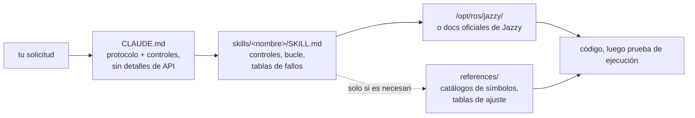

<div align="center">


**Claude Code Skills para el desarrollo de robótica con ROS 2 Jazzy Jalisco.**

Skills que cambian *cómo* aborda el agente una tarea de ROS 2: establecer primero las incógnitas, verificar contra el sistema instalado y demostrar que el resultado se ejecutó.


[English](README.md) | [한국어](README.ko.md) | [中文](README.zh.md) | [日本語](README.ja.md) | **Español** | [Français](README.fr.md) | [Deutsch](README.de.md)

<sub>🌐 Este documento es una traducción automática. El original está en [English](README.md).</sub>

| Skills | Protocolo siempre cargado | Enlaces a documentación (verificados por CI) | Verificaciones en robot físico | Evaluaciones: verificado antes de escribir |
| :---: | :---: | :---: | :---: | :---: |
| **11** | **26 líneas** | **38** | **4 scripts** | **0/3 → 3/3** |

</div>

---

## Contenido

- [Los fallos que cuestan caro](#los-fallos-que-cuestan-caro)
- [Cómo están construidos estos skills](#cómo-están-construidos-estos-skills)
- [Qué lo hace diferente](#qué-lo-hace-diferente)
- [Evaluaciones](#evaluaciones)
- [Inicio rápido](#inicio-rápido)
- [Skills](#skills)
- [Scripts de verificación](#scripts-de-verificación)
- [Cómo funciona](#cómo-funciona)
- [Actualización](#actualización)
- [Hoja de ruta](#hoja-de-ruta)
- [Contribuir](#contribuir)
- [Licencia](#licencia)

## Los fallos que cuestan caro

Los fallos costosos en el código de ROS 2 escrito por agentes no son errores de sintaxis. Son los que parecen correctos:

| Fallo | Lo que ves | Por qué el agente cae en él |
| :--- | :--- | :--- |
| **No-op silencioso** | `ros2 topic hz` muestra 30 Hz; tu callback nunca se ejecuta | Suscriptor RELIABLE por defecto frente a un controlador BEST_EFFORT. Compila, pasa la revisión limpiamente, no coincide con nada a nivel de DDS |
| **Ground truth incorrecto** | `/cmd_vel` dice adelante, `/odom` dice adelante — el robot avanza **hacia atrás** | TF estático declarado invertido respecto al montaje físico. Todo lo que está aguas abajo calcula correctamente *a partir de la transformación incorrecta*, por lo que nada entra en contradicción |
| **Era incorrecta** | Pasa la revisión, falla en tiempo de ejecución en un método que "suena bien" | API memorizada de la era Foxy/Humble que fue renombrada o nunca existió en Jazzy |
| **Premisa incorrecta** | 200 líneas construidas sobre una suposición que habrías corregido en una sola frase | Nada le dijo al agente que estableciera las incógnitas antes de escribir |

Ningún compilador, linter o inspección de logs detecta ninguno de estos problemas. Cada uno cuesta un ciclo completo: lees la salida, descifras qué está mal, lo explicas y el agente vuelve a generar el código.

## Cómo están construidos estos skills

Cuatro reglas de diseño, aplicadas a cada skill.

**1. Establecer las incógnitas antes de escribir.** Algunos datos no están en ninguna documentación: si se trata de hardware real o simulación, si estás extendiendo un workspace existente o empezando desde cero, qué nodo ya publica la transformación que se está modificando y la geometría real del robot. [`CLAUDE.md`](./CLAUDE.md) hace que el agente resuelva esto primero y pregunte cuando la solicitud no lo especifique. Las incógnitas específicas del dominio residen en el skill: `ros2-dev` solicita la huella (*footprint*), el tipo de tracción y la fuente de localización antes de escribir un solo parámetro de Nav2.

**2. Un bucle con un final definido.** Cada skill ejecuta *verificar → escribir → demostrar*: leer los valores predeterminados del sistema instalado, escribir un cambio a la vez y luego confirmar que realmente funcionó. "Terminado" significa evidencia observada: un build exitoso, `ros2 topic echo` mostrando datos, un script de verificación pasando, no solo código producido.

**3. Tablas de fallos en lugar de prosa.** El contenido de mayor valor es la fila de síntoma → causa raíz → acción, porque no está ensamblado en ninguna parte de la documentación oficial y no queda obsoleto cuando se publica una versión:

> `[` es GZ→ROS, `]` es ROS→GZ · `16UC1` son milímetros, `32FC1` son metros · `joint_state_broadcaster` no se genera (*spawn*) automáticamente · `raytrace_max_range` ≤ `obstacle_max_range` significa que los obstáculos nunca se limpian · rclc no asigna automáticamente campos de mensaje sin límite

**4. Tres capas, tres costes.** La `description` de un skill siempre está en contexto, su cuerpo se carga cuando el skill se activa, y los archivos de `references/` se leen solo cuando la tarea lo requiere. Los catálogos masivos de símbolos y las tablas de ajuste (*tuning*) residen en `references/`, por lo que alguien que depura AMCL no paga por la lista de nodos del árbol de comportamiento (*behavior-tree*), y se puede añadir profundidad sin penalizar cada carga.

## Qué lo hace diferente

La mayoría de los paquetes de skills de robótica integran el conocimiento de las API directamente en los archivos del skill. Eso funciona hasta que el ecosistema evoluciona; en ese momento, cada fragmento integrado es un dato que puede quedar obsoleto silenciosamente. Este repositorio hace la apuesta opuesta:

| | Paquetes de skills recargados de contenido | **claude-ros2-skills** |
| :--- | :--- | :--- |
| Dónde reside el conocimiento | integrado en los archivos del skill, **400–1,800 líneas/skill** | redirigido a la documentación oficial; cuerpos de skill de **~60 líneas**, detalle masivo en `references/` leído **solo cuando se necesita** |
| Contexto siempre cargado | SKILL.md completo | protocolo de **26 líneas** |
| Cuando una API de Jazzy cambia | los fragmentos quedan obsoletos silenciosamente; requiere pruebas de regresión de docs para siempre | la superficie de obsolescencia se reduce a enlaces de entrada + nombres de símbolos: **38 enlaces** verificados semanalmente por CI (solo disponibilidad), un enlace caído falla el build |
| Verificación | estática / basada en logs | **física**: gravedad de IMU, prueba de empuje, montajes TF vs. hardware real, coincidencia de QoS en DDS |
| Cobertura de distribución | "cubre 4 distribuciones" sobre ejemplos enfocados en una | **Solo Jazzy**, declarado desde el principio |

Este repositorio se optimiza para una sola cosa: la menor probabilidad de código con aspecto convincente que no se ejecute en Jazzy.

## Evaluaciones

Se ejecutaron prompts idénticos en sesiones limpias y sin interfaz gráfica de Claude Code, con y sin los skills instalados, utilizando el mismo modelo por par y evaluando símbolo por símbolo frente a fuentes fijadas (*pinned*) de `jazzy` upstream.

| Resultado | Sin skills | Con skills |
| :--- | ---: | ---: |
| Claves Nav2 MPPI incorrectas/inventadas (haiku) | **~30** — sin lista de `critics:`, la configuración no puede ejecutarse | **~16–20** — cadena de plugin, espacios de nombres de `motion_model` y verificador correctos |
| Callback de `/scan` se ejecuta en un LiDAR BEST_EFFORT real (sonnet) | **nunca** — QoS predeterminado incorrecto, de forma silenciosa | **sí** |
| Ejecuciones que verificaron antes de escribir | **0 / 3** | **3 / 3** |

La diferencia de comportamiento es el resultado más evidente: las ejecuciones base consumieron **cero** herramientas de verificación a pesar de tenerlas disponibles, mientras que cada ejecución con skills cargó el skill y buscó primero los valores predeterminados del sistema. Una ejecución formuló sus tres preguntas de control (*gate questions*) por adelantado y reportó exactamente lo que había y no había podido verificar, en lugar de adivinar en silencio.

Tablas completas de evaluación, condiciones y análisis por ejecución: [`evals/RESULTS.md`](./evals/RESULTS.md) · protocolo, listas de verificación de tareas y la receta del contenedor: [`evals/README.md`](./evals/README.md). Se aceptan PRs que añadan transcripciones evaluadas.

## Inicio rápido

**Opción A — plugin marketplace (recomendado):**

```
/plugin marketplace add Leehyunbin0131/claude-ros2-skills
/plugin install claude-ros2-skills@claude-ros2-skills
```

Las actualizaciones se aplican con `/plugin marketplace update`.

**Opción B — copia manual:**

```bash
git clone https://github.com/Leehyunbin0131/claude-ros2-skills.git

# Project-level (this project only)
mkdir -p your-project/.claude/skills
cp -r claude-ros2-skills/skills/* your-project/.claude/skills/
cp claude-ros2-skills/CLAUDE.md your-project/

# OR user-level (all projects)
mkdir -p ~/.claude/skills
cp -r claude-ros2-skills/skills/* ~/.claude/skills/
```

Reinicia Claude Code (o inicia una nueva sesión) para detectar los skills.

## Skills

| Skill | Ruta | Cobertura |
| :--- | :--- | :--- |
| **ros2-core** | `skills/ros2-core/SKILL.md` | rclcpp, rclpy, TF2, odometría EKF, perfiles de QoS, parámetros |
| **ros2-package** | `skills/ros2-package/SKILL.md` | `ros2 pkg create`, configuración de CMakeLists/setup.py, colcon build & source, interfaces personalizadas |
| **ros2-dev** | `skills/ros2-dev/SKILL.md` | Nav2 (AMCL, costmaps, MPPI/Smac), SLAM Toolbox, RTAB-Map, Isaac ROS |
| **gazebo-sim** | `skills/gazebo-sim/SKILL.md` | Gazebo Harmonic, ros_gz_bridge, ros_gz_sim, modelado SDFormat |
| **ros2-control** | `skills/ros2-control/SKILL.md` | abstracción de hardware de ros2_control, controller manager, etiquetas URDF |
| **ros2-moveit** | `skills/ros2-moveit/SKILL.md` | MoveIt 2, API de MoveGroup en C++/Python, solvers de IK, OMPL, MoveIt Servo |
| **ros2-perception** | `skills/ros2-perception/SKILL.md` | image_transport, cv_bridge, vision_msgs, depth_image_proc, PCL |
| **ros2-testing** | `skills/ros2-testing/SKILL.md` | launch_testing, gtest/pytest, APIs de rosbag2 en C++/Python, ros2trace |
| **ros2-microros** | `skills/ros2-microros/SKILL.md` | micro-ROS Agent, API cliente de rclc, transportes personalizados, memoria estática |
| **ros2-security** | `skills/ros2-security/SKILL.md` | SROS2, generación de almacén de claves PKI (*keystore*), control de acceso, DDS Security |
| **ros2-troubleshooting** | `skills/ros2-troubleshooting/SKILL.md` | árbol TF de ground-truth REP 103/105, alineación LiDAR/IMU, verificación física |

## Scripts de verificación

Incluidos dentro del skill `ros2-troubleshooting` (`skills/ros2-troubleshooting/scripts/`), por lo que viajan con cualquier instalación. Estos convierten las comprobaciones físicas en hechos ejecutables de pasa/falla (requiere un entorno de ROS 2 cargado; cada uno retorna 0 = PASA, 1 = FALLA, 2 = sin datos):

| Script | Verifica |
| :--- | :--- |
| `check_imu_gravity.py` | Robot en reposo → la gravedad es ~+9.81 m/s² en **+Z** (REP 103). Detecta montajes de IMU invertidos o rotados. |
| `check_odom_direction.py` | Empujar el robot hacia adelante → el desplazamiento de la odometría es positivo a lo largo de su orientación (*heading*). Detecta motores, codificadores (*encoders*) o TF invertidos. |
| `check_tf_tree.py` | `map→odom→base_link` se resuelve; imprime cada montaje de sensor como RPY en grados y señala declaraciones de ~180° para comparar con el montaje físico. |
| `check_qos_compat.py` | Cada par publicador/suscriptor en un topic es compatible en QoS según las reglas de coincidencia de DDS. Detecta el fallo silencioso de "el topic muestra 30 Hz pero mi callback nunca se ejecuta" (pub BEST_EFFORT vs sub RELIABLE, e inconsistencias en durabilidad/fecha límite/vitalidad). |

La lógica pura de decisión se prueba unitariamente sin ROS (`python3 skills/ros2-troubleshooting/scripts/test_checks.py`) y se ejecuta en CI con cada push.

## Cómo funciona



`CLAUDE.md` no contiene detalles de API: establece el protocolo y las preguntas que deben responderse antes de escribir. Cada cuerpo de `SKILL.md` contiene las decisiones: qué establecer, el bucle verificar-escribir-demostrar y la tabla de fallos para ese dominio. El material de referencia masivo se encuentra a un salto de distancia en `references/`. Consulta [`CLAUDE.md`](./CLAUDE.md).

## Actualización

```bash
cd claude-ros2-skills
git pull
cp -r skills/* ~/.claude/skills/   # o el .claude/skills/ de tu proyecto
```

## Hoja de ruta

1. **Pares de evaluación calificados dentro de `ros:jazzy`**, contra una instalación en vivo en lugar de fuentes fijadas: receta del contenedor en [`evals/README.md`](./evals/README.md).
2. **Resultados de la Tarea 5**: la tarea con un resultado binario en tiempo de ejecución (si `ros2 topic echo` imprime datos), ejercitando `ros2-package` y el bucle build/source de extremo a extremo.
3. **Correcciones hasta terminar como métrica rastreada.** Cuántas rondas de "no, así no" requiere una tarea es la cantidad que los usuarios realmente pagan.
4. **Resolución determinista de `references/`**, para que se acceda al detalle masivo siempre que sea relevante.
5. **Extender la separación cuerpo/`references`** a `ros2-core` y `gazebo-sim`, los siguientes skills con un volumen real de referencias y alta frecuencia de carga.

## Contribuir

Versión corta: los cuerpos de los skills mantienen contenido de decisión (controles, bucle, tablas de fallos) con detalle masivo en `references/`, cada símbolo se verifica contra la documentación de Jazzy o `/opt/ros/jazzy/`, y los scripts mantienen su lógica pura con capacidad de prueba unitaria sin ROS. Reglas completas, listas de verificación de skills/scripts y plantillas de problemas (*issues*): [`CONTRIBUTING.md`](./CONTRIBUTING.md).

## Licencia

Apache-2.0 — consulta [LICENSE](./LICENSE).
