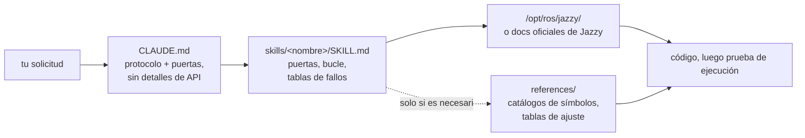

<div align="center">


**Claude Code Skills for ROS 2 Jazzy Jalisco robotics development.**

Skills que transforman la manera en que los agentes de IA abordan el desarrollo en ROS 2: identifican parámetros desconocidos por adelantado, verifican la configuración con los paquetes instalados y confirman la ejecución mediante evidencia comprobable.


[English](README.md) | [한국어](README.ko.md) | [中文](README.zh.md) | [日本語](README.ja.md) | **Español** | [Français](README.fr.md) | [Deutsch](README.de.md)

<sub>🌐 Este documento es una traducción automática. El original está en [English](README.md).</sub>

| Skills | Protocolo siempre cargado | Enlaces a docs (verificados por CI) | Comprobaciones en robot físico | Evaluaciones: verificado antes de escribir |
| :---: | :---: | :---: | :---: | :---: |
| **11** | **26 líneas** | **38** | **4 scripts** | **0/3 → 3/3** |

</div>

---

## Contenido

- [Los fallos que cuestan caro](#los-fallos-que-cuestan-caro)
- [Cómo están construidos estos skills](#cómo-están-construidos-estos-skills)
- [Qué lo hace diferente](#qué-lo-hace-diferente)
- [Evaluaciones](#evaluaciones)
- [Inicio rápido](#inicio-rápido)
- [Skills](#skills)
- [Scripts de verificación](#scripts-de-verificación)
- [Cómo funciona](#cómo-funciona)
- [Actualización](#actualización)
- [Hoja de ruta](#hoja-de-ruta)
- [Contribuir](#contribuir)
- [Licencia](#licencia)

## Los fallos que cuestan caro

Los errores más costosos en el código ROS 2 generado por IA raras veces son fallos de sintaxis. En su lugar, suelen ser problemas sutiles que parecen correctos a primera vista:

| Fallo | Lo que ves | Por qué el agente encuentra el problema |
| :--- | :--- | :--- |
| **Fallo silencioso** | `ros2 topic hz` muestra 30 Hz; tu callback nunca se ejecuta | Un subscriptor RELIABLE por defecto intenta conectarse a un publicador BEST_EFFORT. El código compila y pasa la revisión de código, pero falla a nivel de middleware DDS. |
| **Ground truth incorrecto** | `/cmd_vel` indica movimiento hacia adelante y `/odom` reporta movimiento hacia adelante, pero el robot físico se mueve **hacia atrás** | El frame TF estático está invertido con respecto al montaje físico. Los componentes aguas abajo calculan correctamente *usando la transformación incorrecta*, sin generar errores evidentes. |
| **API desactualizada** | El código pasa la revisión pero falla en tiempo de ejecución al llamar a un método incorrecto | El agente utiliza métodos de API obsoletos de Foxy o Humble que fueron renombrados o eliminados en Jazzy. |
| **Premisa inválida** | El agente escribe 200 líneas de código basándose en una suposición que podrías haber corregido en una sola frase | No hay ningún mecanismo que pida al agente verificar los detalles que faltan antes de generar código. |

Ni los compiladores, ni los linters, ni el análisis de logs detectan estos problemas ocultos. Resolver cada error requiere un ciclo de retroalimentación adicional: revisar la salida, diagnosticar la causa, explicar la solución y volver a generar el código.

## Cómo están construidos estos skills

Cuatro reglas de diseño rigen cada skill en este repositorio:

**1. Identificar variables desconocidas por adelantado.** Los detalles operativos clave a menudo no existen en la documentación: si el entorno es hardware real o simulación, si se debe extender un workspace existente o crear uno nuevo, qué nodo ya publica una transformación o la geometría precisa del robot. [`CLAUDE.md`](./CLAUDE.md) instruye al agente para aclarar estas incógnitas antes de generar código. Los skills específicos de cada dominio gestionan parámetros concretos; por ejemplo, `ros2-dev` solicita el footprint del robot, la cinemática de tracción y la fuente de localización antes de configurar cualquier parámetro de Nav2.

**2. Ejecutar un bucle estructurado con criterios de salida claros.** Cada skill sigue un ciclo de *verificar → escribir → probar*: inspeccionar los valores predeterminados del sistema en el entorno instalado, aplicar cambios incrementales y confirmar la ejecución. Una tarea se completa solo cuando está respaldada por evidencia observada —como una compilación exitosa, datos activos en `ros2 topic echo` o un script de verificación aprobado— en lugar de limitarse a producir archivos de código.

**3. Priorizar tablas de fallos estructuradas sobre descripciones largas.** Las tablas estructuradas que mapean síntomas → causas raíz → acciones correctivas brindan una orientación clara y duradera de la que la documentación oficial suele carecer y que se mantiene confiable a través de las versiones:

> `[` es GZ→ROS, `]` es ROS→GZ · `16UC1` son milímetros, `32FC1` son metros · `joint_state_broadcaster` no se inicia automáticamente · `raytrace_max_range` ≤ `obstacle_max_range` significa que los obstáculos nunca se limpian · rclc no asigna automáticamente memoria para campos de mensaje sin límite

**4. Optimizar el uso del contexto con una arquitectura de tres capas.** Cada skill equilibra la eficiencia del contexto: las descripciones de los skills permanecen en el contexto, el cuerpo del skill se carga cuando se invoca y los archivos de referencia detallados en `references/` se cargan solo bajo demanda. Los grandes catálogos de símbolos y las tablas detalladas de ajuste de parámetros residen en `references/`, garantizando que se conserve el contexto y que la depuración de componentes específicos (como AMCL) no cargue documentación innecesaria (como nodos de árboles de comportamiento).

## Qué lo hace diferente

La mayoría de los paquetes de skills de robótica integran conocimientos estáticos de la API directamente dentro de los archivos de skill. Aunque el uso inicial es sencillo, este enfoque se rompe cuando los paquetes subyacentes se actualizan, dejando fragmentos de código desactualizados que fallan silenciosamente. Este repositorio adopta un enfoque dinámico basado en documentación:

| Característica | Paquetes de skills con contenido extenso | **claude-ros2-skills** |
| :--- | :--- | :--- |
| Ubicación del conocimiento | Integrado en los archivos de skill (**400–1.800 líneas/skill**) | Enlazado a la documentación oficial (cuerpos de skill de **~60 líneas**); las referencias detalladas se leen **solo cuando es necesario** |
| Contexto siempre cargado | Archivos `SKILL.md` completos | Protocolo central de **26 líneas** |
| Gestión de actualizaciones de API en Jazzy | Los fragmentos quedan desactualizados en silencio; requiere actualizaciones manuales continuas de pruebas | El riesgo de código desactualizado se minimiza a enlaces de punto de entrada y nombres de símbolos: **38 enlaces a documentación** verificados semanalmente mediante CI |
| Método de verificación | Análisis estático de código o verificación de logs | **Verificación en tiempo de ejecución y física**: comprobaciones de gravedad en IMU, pruebas de odometría direccional, alineación de frames TF, compatibilidad de QoS en DDS |
| Alcance de distribución | Afirma ser compatible con múltiples distribuciones de ROS mientras solo apunta a una | **Solo ROS 2 Jazzy**, diseñado y validado explícitamente |

Este repositorio se optimiza para un único resultado: minimizar el riesgo de generar código con apariencia plausible pero que no funcione en ROS 2 Jazzy.

## Evaluaciones

Para evaluar el rendimiento, se ejecutaron instrucciones (prompts) idénticas en sesiones limpias y sin interfaz gráfica de Claude Code, tanto con estas skills instaladas como sin ellas. Cada par utilizó el mismo modelo y fue evaluado símbolo por símbolo frente a repositorios de código fuente oficiales de ROS 2 Jazzy.

| Métrica / Prueba | Sin skills | Con skills |
| :--- | ---: | ---: |
| Claves incorrectas o fabricadas de Nav2 MPPI (Haiku) | **~30**: falta la lista obligatoria `critics:`; la configuración falla al ejecutarse | **~16–20**: cadenas de plugin correctas, `motion_model` y namespaces de verificadores |
| El callback de `/scan` se ejecuta en un LiDAR físico BEST_EFFORT (Sonnet) | **Nunca**: falla silenciosamente debido a valores predeterminados de QoS no coincidentes | **Sí**: se conecta con éxito |
| Ejecuciones que verificaron el entorno antes de escribir código | **0 / 3** | **3 / 3** |

El cambio de comportamiento es el resultado más impactante: las sesiones de referencia utilizaron **cero** herramientas de verificación incluso cuando estaban disponibles, mientras que las sesiones equipadas con estas skills cargaron las pautas relevantes y comprobaron primero los valores predeterminados del sistema. En una prueba, el agente formuló preguntas aclaratorias clave por adelantado e informó explícitamente los parámetros verificados frente a las suposiciones no comprobadas, evitando conjeturas sin fundamento.

Revisa las tablas de evaluación completas, los entornos de prueba y los análisis de ejecuciones individuales en [`evals/RESULTS.md`](./evals/RESULTS.md). Para obtener más detalles sobre el protocolo de evaluación, las listas de verificación de tareas y la configuración del contenedor, consulta [`evals/README.md`](./evals/README.md). Se aceptan pull requests con transcripciones evaluadas adicionales.

## Inicio rápido

**Opción A — Plugin Marketplace (Recomendado):**

```
/plugin marketplace add Leehyunbin0131/claude-ros2-skills
/plugin install claude-ros2-skills@claude-ros2-skills
```

Actualiza los plugins instalados en cualquier momento con `/plugin marketplace update`.

**Opción B — Instalación manual:**

```bash
git clone https://github.com/Leehyunbin0131/claude-ros2-skills.git

# Project-level installation (applies to the current project only)
mkdir -p your-project/.claude/skills
cp -r claude-ros2-skills/skills/* your-project/.claude/skills/
cp claude-ros2-skills/CLAUDE.md your-project/

# User-level installation (applies across all projects)
mkdir -p ~/.claude/skills
cp -r claude-ros2-skills/skills/* ~/.claude/skills/
```

Reinicia Claude Code (o inicia una nueva sesión) para aplicar los skills instalados.

## Skills

| Skill | Ruta | Cobertura |
| :--- | :--- | :--- |
| **ros2-core** | `skills/ros2-core/SKILL.md` | rclcpp, rclpy, TF2, odometría EKF, perfiles de QoS, parámetros |
| **ros2-package** | `skills/ros2-package/SKILL.md` | `ros2 pkg create`, configuración de CMakeLists/setup.py, colcon build y source, interfaces personalizadas |
| **ros2-dev** | `skills/ros2-dev/SKILL.md` | Nav2 (AMCL, costmaps, MPPI/Smac), SLAM Toolbox, RTAB-Map, Isaac ROS |
| **gazebo-sim** | `skills/gazebo-sim/SKILL.md` | Gazebo Harmonic, ros_gz_bridge, ros_gz_sim, modelado SDFormat |
| **ros2-control** | `skills/ros2-control/SKILL.md` | Abstracción de hardware de ros2_control, controller manager, etiquetas URDF |
| **ros2-moveit** | `skills/ros2-moveit/SKILL.md` | MoveIt 2, API C++/Python de MoveGroup, mecanismos de IK, OMPL, MoveIt Servo |
| **ros2-perception** | `skills/ros2-perception/SKILL.md` | image_transport, cv_bridge, vision_msgs, depth_image_proc, PCL |
| **ros2-testing** | `skills/ros2-testing/SKILL.md` | launch_testing, gtest/pytest, APIs C++/Python de rosbag2, ros2trace |
| **ros2-microros** | `skills/ros2-microros/SKILL.md` | micro-ROS Agent, API de cliente rclc, transportes personalizados, memoria estática |
| **ros2-security** | `skills/ros2-security/SKILL.md` | SROS2, generación de keystores PKI, control de acceso, DDS Security |
| **ros2-troubleshooting** | `skills/ros2-troubleshooting/SKILL.md` | Árbol TF ground-truth REP 103/105, alineación de LiDAR/IMU, verificación física |

## Scripts de verificación

Estos scripts de verificación están incluidos dentro del skill `ros2-troubleshooting` (`skills/ros2-troubleshooting/scripts/`) y forman parte de cada instalación. Convierten las comprobaciones del hardware físico en pasos de verificación ejecutables de tipo pasa/falla (requieren un entorno ROS 2 cargado previamente; códigos de retorno: 0 = PASA, 1 = FALLA, 2 = SIN DATOS):

| Script | Verifica |
| :--- | :--- |
| `check_imu_gravity.py` | Valida que un robot en reposo mida la gravedad en ~+9,81 m/s² a lo largo del eje **+Z** (REP 103). Detecta montajes de IMU invertidos o desalineados. |
| `check_odom_direction.py` | Valida que empujar el robot hacia adelante produzca un desplazamiento de odometría positivo a lo largo de su orientación. Detecta direcciones de motor invertidas, problemas de polaridad del encoder o configuraciones TF invertidas. |
| `check_tf_tree.py` | Verifica que `map→odom→base_link` se resuelva correctamente; muestra el desfasaje de montaje de cada sensor en grados RPY y resalta posibles errores de orientación de 180°. |
| `check_qos_compat.py` | Verifica la compatibilidad de QoS en todos los pares publicador/subscriptor de un topic utilizando reglas de DDS. Evita fallos silenciosos (como un publicador BEST_EFFORT emparejado con un subscriptor RELIABLE, o discrepancias en durabilidad, deadline y liveliness). |

La lógica de decisión principal se prueba unitariamente de forma independiente de ROS (`python3 skills/ros2-troubleshooting/scripts/test_checks.py`) y se ejecuta mediante integración continua (CI) en cada push.

## Cómo funciona



`CLAUDE.md` no contiene detalles específicos de la API. En su lugar, establece el protocolo operativo y requiere responder preguntas aclaratorias antes de escribir código. Cada archivo `SKILL.md` gestiona decisiones específicas del dominio: identificar variables desconocidas, ejecutar el bucle verificar-escribir-probar y hacer referencia a tablas de fallos. Los materiales de referencia detallados se almacenan por separado en el directorio `references/`. Consulta [`CLAUDE.md`](./CLAUDE.md) para más información.

## Actualización

```bash
cd claude-ros2-skills
git pull
cp -r skills/* ~/.claude/skills/   # or your project's .claude/skills/
```

## Hoja de ruta

1. **Automatizar pares de evaluación dentro de contenedores `ros:jazzy`** para establecer una línea base de instalación en vivo; consulta los detalles de configuración del contenedor en [`evals/README.md`](./evals/README.md).
2. **Publicar los resultados de evaluación de la Tarea 5**: validar el rendimiento en tiempo de ejecución con resultados binarios (confirmando si `ros2 topic echo` emite datos) en compilaciones de `ros2-package` y ciclos de carga (sourcing) del workspace.
3. **Realizar seguimiento de "correcciones hasta completar" como métrica central**: medir la cantidad de iteraciones de retroalimentación requeridas antes de que el código se ejecute con éxito.
4. **Implementar búsquedas deterministas en `references/`** para garantizar que los documentos de referencia detallados se carguen siempre que sean relevantes.
5. **Expandir la división entre el cuerpo del skill y `references/`** a `ros2-core` y `gazebo-sim`, optimizando la eficiencia del contexto para skills de alta frecuencia con documentación de referencia sustancial.

## Contribuir

Resumen: Los archivos de skill deben centrarse en la lógica de decisión (puertas de validación, pasos del bucle y tablas de fallos), mientras que la documentación detallada permanece en `references/`. Cada símbolo de la API debe verificarse contra la documentación oficial de Jazzy o instalaciones en `/opt/ros/jazzy/`. Los scripts de verificación deben mantener una lógica pura que pueda probarse de forma unitaria sin dependencias de ROS. Para conocer las pautas completas, las listas de verificación de skills y scripts, y las plantillas de issues, consulta [`CONTRIBUTING.md`](./CONTRIBUTING.md).

## Licencia

Apache-2.0 — consulta [LICENSE](./LICENSE).
