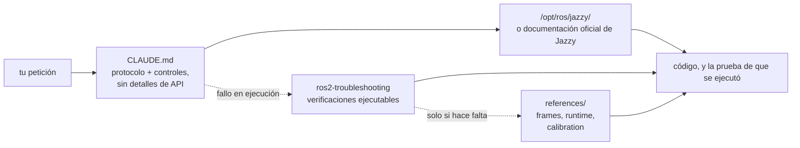

<div align="center">


**Claude Code Skills for ROS 2 Jazzy Jalisco robotics development.**

Skills que transforman la manera en que los agentes de IA abordan el desarrollo con ROS 2: identifican los parámetros desconocidos desde el principio, verifican la configuración contra los paquetes instalados y confirman la ejecución mediante evidencia real de funcionamiento.


[English](README.md) | [한국어](README.ko.md) | [中文](README.zh.md) | [日本語](README.ja.md) | **Español** | [Français](README.fr.md) | [Deutsch](README.de.md)

<sub>🌐 Este documento es una traducción automática. El original está en [English](README.md).</sub>

| Skills | Protocolo siempre cargado | Enlaces a documentación (verificados por CI) | Verificaciones en robot físico |
| :---: | :---: | :---: | :---: |
| **2** | **30 líneas** | **6** | **4 scripts** |

</div>

---

## Contenido

- [Los fallos que cuestan caro](#los-fallos-que-cuestan-caro)
- [Cómo están construidos estos skills](#cómo-están-construidos-estos-skills)
- [Qué lo hace diferente](#qué-lo-hace-diferente)
- [Evaluaciones](#evaluaciones)
- [Inicio rápido](#inicio-rápido)
- [Skills](#skills)
- [Scripts de verificación](#scripts-de-verificación)
- [Cómo funciona](#cómo-funciona)
- [Actualización](#actualización)
- [Contribuir](#contribuir)
- [Licencia](#licencia)

## Los fallos que cuestan caro

Los errores más costosos en el código ROS 2 generado por IA rara vez son fallos de sintaxis. Son problemas sutiles que a primera vista parecen correctos:

| Fallo | Lo que ves | Por qué un agente cae en ello |
| :--- | :--- | :--- |
| **Desajuste del middleware** | `ros2 topic hz` muestra 30 Hz; tu callback nunca se dispara | Un suscriptor RELIABLE por defecto no puede emparejarse con un publicador BEST_EFFORT. Compila, pasa la revisión y falla por debajo de la aplicación. rclpy sí avisa — `offering incompatible QoS ... Last incompatible policy: RELIABILITY` — pero solo en tiempo de ejecución, en el log de arranque, a quien lo esté leyendo. |
| **Referencia errónea** | `/cmd_vel` indica avance y `/odom` informa avance, pero el robot físico se mueve **hacia atrás** | El frame TF estático está invertido respecto al montaje físico. Los componentes posteriores calculan correctamente *usando la transformación equivocada*, sin producir errores evidentes. |
| **API obsoleta** | El código pasa la revisión pero falla en ejecución al llamar a un método incorrecto | El agente usa métodos de Foxy o Humble que fueron renombrados o eliminados en Jazzy. |
| **Premisa inválida** | El agente escribe 200 líneas basándose en una suposición que habrías corregido en una sola frase | Nada obliga al agente a verificar los detalles que faltan antes de generar código. |

Ni compiladores, ni linters, ni el análisis de logs detectan estos problemas ocultos. Resolver cada uno exige un ciclo de realimentación adicional: revisar la salida, diagnosticar la causa, explicar la corrección y volver a generar el código.

## Cómo están construidos estos skills

Cuatro reglas de diseño rigen cada skill de este repositorio:

**1. Identificar las variables desconocidas desde el principio.** Detalles operativos clave rara vez figuran en la documentación: si el entorno es hardware real o simulación, si se debe extender un workspace existente o crear uno nuevo, qué nodo publica ya una transformación, o la geometría precisa del robot. [`CLAUDE.md`](./CLAUDE.md) instruye al agente a aclarar estas incógnitas antes de generar código.

**2. Ejecutar un bucle estructurado con criterios de salida claros.** El ciclo *verificar → escribir → demostrar*: inspeccionar los valores por defecto en el entorno instalado, aplicar cambios incrementales y confirmar la ejecución. Una tarea solo se completa cuando la respalda evidencia observada — una compilación exitosa, datos reales en `ros2 topic echo`, un script de verificación que pasa — y no por el mero hecho de producir archivos de código.

**3. No decir nada que el modelo ya sepa o que `CLAUDE.md` ya diga.** Cada tabla síntoma→causa→acción que este paquete llegó a distribuir fue medida contra un agente de referencia sin ningún skill cargado. **Ninguna movió una sola verificación**: o bien el modelo ya alcanza esos mecanismos por sí solo, o bien la solución era un script incluido o un párrafo de `CLAUDE.md`, nunca prosa describiendo el dominio. Véase [Evaluaciones](#evaluaciones).

**4. Señalar un artefacto ejecutable, nunca describirlo.** El único contenido de este paquete que ha demostrado cambiar un resultado es un script con código de salida (`scripts/check_*.py`, incluido en `ros2-troubleshooting`). Un párrafo que *describe* lo que ese script te diría no movió nada; solo ejecutarlo lo hizo.

## Qué lo hace diferente

La mayoría de los paquetes de skills de robótica incrustan conocimiento estático de API dentro de los propios archivos. El uso inicial es cómodo, pero este enfoque se rompe cuando los paquetes subyacentes se actualizan, dejando fragmentos obsoletos que fallan en silencio. Este repositorio adopta un enfoque dinámico, guiado por la documentación:

| Característica | Paquetes de skills con mucho contenido | **claude-ros2-skills** |
| :--- | :--- | :--- |
| Ubicación del conocimiento | Incrustado en los archivos de skill (**400–1.800 líneas por skill**) | Enlazado a la documentación oficial (cuerpos de skill de **~60 líneas**); las referencias detalladas se leen **solo cuando hacen falta** |
| Contexto siempre cargado | Archivos `SKILL.md` completos | Protocolo central de **30 líneas** |
| Gestión de cambios de API en Jazzy | Los fragmentos se quedan obsoletos en silencio; requiere actualización manual continua | El riesgo de obsolescencia se reduce a enlaces de entrada y nombres de símbolos — **6 enlaces de documentación** verificados semanalmente por CI |
| Método de verificación | Análisis estático de código o revisión de logs | **Verificación física y en tiempo de ejecución**: comprobación de gravedad del IMU, prueba direccional de odometría, alineación de frames TF, compatibilidad QoS de DDS |
| Alcance de distribución | Afirma soportar varias distribuciones de ROS apuntando en realidad a una sola | **Solo ROS 2 Jazzy**, por diseño — sin rodeos del tipo "también funciona en Humble" |

Este repositorio optimiza un único resultado: minimizar el riesgo de generar código con apariencia plausible que no llega a ejecutarse en ROS 2 Jazzy.

## Evaluaciones

**El criterio.** Un skill se gana su sitio solo si aporta algo que el agente **no puede alcanzar por sí mismo**, teniendo ya su propio conocimiento, búsqueda web y una instalación real de Jazzy delante. Un texto que solo le dice al agente lo que iba a hacer de todos modos es coste sin beneficio.

**Cómo se mide.** Una tarea real en un contenedor limpio, diez ejecuciones con el elemento bajo prueba y diez sin él, evaluadas *ejecutando* lo que salió — una compilación, un topic con datos, un código de salida — nunca leyéndolo. Test exacto de Fisher, con corrección de Benjamini–Hochberg sobre toda la ronda.

**Qué quedó resuelto.** Ocho dominios pasaron por una escalera de tres peldaños — 24 peldaños en total, cada uno añadiendo un mecanismo concreto y evaluado por una verificación que ejecuta el artefacto. El agente de referencia alcanzó **todos los mecanismos que se le pidieron**:

| Dominio | L1 → L2 → L3, mecanismos añadidos por peldaño | Sin ayuda |
| :--- | :--- | ---: |
| Empaquetado y compilación | `ament_python`/`ament_cmake` → `.srv` entre paquetes → nodo componible + `colcon test` | **190/190** |
| Simulación | Mundo SDF + tracción diferencial → `ros_gz_bridge` + `gpu_lidar` → spawn de URDF + `use_sim_time` | **108/110** |
| Ejecutores | Servicio de 1 s desde un timer → desde un callback de suscripción + heartbeat → 5 llamadas concurrentes | **110/110** |
| `ros2_control` | Hardware simulado + broadcaster → segundo controlador reclamando interfaces → **plugin `SystemInterface` en C++ propio** | **90/90** |
| Testing | pytest que `colcon test` realmente ejecuta → `launch_testing` sobre un nodo vivo → rosbag2 grabado y releído | **110/110** |
| MoveIt 2 | URDF+SRDF propios cargados por `move_group` → `GetMotionPlan` real → objeto de colisión en la escena de planificación | **100/100** |
| Núcleo | TF estático desde parámetros → TF dinámico + `ExtrapolationException` → nodo lifecycle en silencio hasta activarse | **110/110** |
| Nav2 | Archivo de parámetros que los servidores aceptan tal cual → pila llevada hasta `active` → costmap marcando obstáculos con escaneo en vivo | véase más abajo |
| Percepción | Ida y vuelta con `cv_bridge` → proyección con `CameraInfo` → profundidad 16UC1 → `PointCloud2` | **106/120** |

**Ni un solo fallo se cerró aportando información.** Se encontraron cuatro carencias, todas de comportamiento:

| Lo que el modelo no hace por sí solo | Referencia | Qué lo cerró | Después |
| :--- | ---: | :--- | ---: |
| Verificar contra la instalación en vez de responder de memoria | **2/10** | un párrafo de `CLAUDE.md` | **10/10** (q=0,002) |
| Producir un veredicto con código de salida en lugar de "parece correcto" | **0/10** | un script ejecutable incluido | **10/10** (q<0,001) |
| Ejecutar el código QoS que escribe antes de entregarlo | **5/10** | el "hecho significa que se ejecutó" de `CLAUDE.md` | **9/10** (potencia insuficiente) |
| Ejecutar la configuración Nav2 que escribe antes de entregarla | **0/10** | una tarea que exige llegar a `active` | **30/30** |

La última fila es el resultado más limpio aquí. Al pedir un archivo de parámetros de Nav2, 10 de 10 celdas escribieron uno que **sus propios servidores se niegan a configurar**. Al pedir el mismo archivo *y además* que la pila alcanzara `active`, todas las celdas se toparon con el mismo error, lo diagnosticaron desde el log, lo corrigieron y pasaron. **Mismo modelo, misma creencia equivocada, cero diferencia de información**: lo único que cambia es la exigencia de ejecutar.

**Consecuencia para este paquete.** Se eliminaron por completo seis skills de dominio, además de los dos ya eliminados antes: el modelo alcanza su contenido por sí mismo y ninguna prosa de este repositorio ha movido nunca una verificación. Lo que queda es un protocolo de 30 líneas, cuatro scripts ejecutables y el material de referencia que los respalda. Método, resultados por dominio y cada ejecución en bruto: [`evals/`](./evals/).

## Inicio rápido

**Opción A — Marketplace de plugins (recomendado):**

```
/plugin marketplace add Leehyunbin0131/claude-ros2-skills
/plugin install claude-ros2-skills@claude-ros2-skills
```

Actualiza los plugins instalados en cualquier momento con `/plugin marketplace update`.

**Opción B — Instalación manual:**

```bash
git clone https://github.com/Leehyunbin0131/claude-ros2-skills.git

# Instalación a nivel de proyecto (solo para el proyecto actual)
mkdir -p your-project/.claude/skills
cp -r claude-ros2-skills/skills/* your-project/.claude/skills/
cp claude-ros2-skills/CLAUDE.md your-project/

# Instalación a nivel de usuario (para todos los proyectos)
mkdir -p ~/.claude/skills
cp -r claude-ros2-skills/skills/* ~/.claude/skills/
```

Reinicia Claude Code (o abre una sesión nueva) para aplicar los skills instalados.

## Skills

| Skill | Ruta | Cobertura |
| :--- | :--- | :--- |
| **ros2-troubleshooting** | `skills/ros2-troubleshooting/SKILL.md` | Cuatro verificaciones ejecutables de aprobado/fallo — compatibilidad QoS, árbol TF, montaje del IMU, dirección de odometría — más las convenciones de frames REP 103/105, el comportamiento en ejecución de Jazzy y la calibración de odometría en hardware que las respaldan |
| **ros2-microros** | `skills/ros2-microros/SKILL.md` | Agente micro-ROS, API cliente rclc, transportes personalizados, memoria estática |

**Por qué solo dos.** Todos los demás skills se midieron contra un agente de referencia sin ningún skill cargado y se eliminaron cuando el agente produjo el mismo resultado sin ellos — `ros2-core`, `ros2-dev`, `ros2-control`, `ros2-moveit`, `ros2-perception`, `ros2-testing`, `ros2-package` y `gazebo-sim`, en ese orden de medición. `ros2-microros` es el único dominio sin escalera: aquí no hay hardware para ejecutarla, así que se conserva y **no se declara verificado**. Véase [Evaluaciones](#evaluaciones).

## Scripts de verificación

Estos scripts vienen incluidos en el skill `ros2-troubleshooting` (`skills/ros2-troubleshooting/scripts/`) y se distribuyen con cada instalación. Convierten comprobaciones de hardware físico en pasos ejecutables de aprobado/fallo (requiere un entorno ROS 2 cargado con source; códigos de retorno: 0 = APROBADO, 1 = FALLO, 2 = SIN DATOS):

| Script | Verifica |
| :--- | :--- |
| `check_imu_gravity.py` | Que un robot en reposo mida la gravedad a ~+9,81 m/s² sobre el eje **+Z** (REP 103). Detecta montajes de IMU invertidos o desalineados. |
| `check_odom_direction.py` | Que empujar el robot hacia adelante produzca un desplazamiento de odometría positivo a lo largo de su rumbo. Detecta direcciones de motor invertidas, problemas de polaridad de encoders o configuraciones TF invertidas. |
| `check_tf_tree.py` | Que `map→odom→base_link` se resuelva correctamente; muestra el offset de montaje de cada sensor en grados RPY y destaca posibles errores de orientación de 180°. |
| `check_qos_compat.py` | La compatibilidad QoS entre todos los pares publicador/suscriptor de un topic según las reglas DDS. Previene fallos silenciosos (como un publicador BEST_EFFORT junto a un suscriptor RELIABLE, o desajustes de durability, deadline y liveliness). |

La lógica de decisión central se prueba unitariamente sin depender de ROS (`python3 skills/ros2-troubleshooting/scripts/test_checks.py`) y se ejecuta mediante integración continua (CI) en cada push.

## Cómo funciona



`CLAUDE.md` no contiene detalles concretos de API. Establece el protocolo operativo: verificar contra la instalación, fijar primero las incógnitas que ninguna documentación puede aportar, y dar una tarea por terminada solo cuando se ha observado algo en ejecución. El conocimiento de dominio que de otro modo cargaría queda en manos del modelo y de la instalación, porque es ahí donde la medición lo situó. `ros2-troubleshooting` entra en juego únicamente cuando un sistema registra logs normales y no funciona, y responde con un código de salida en lugar de un párrafo. Véase [`CLAUDE.md`](./CLAUDE.md) para más detalles.

## Actualización

```bash
cd claude-ros2-skills
git pull
cp -r skills/* ~/.claude/skills/   # o el .claude/skills/ de tu proyecto
```

## Contribuir

Resumen: el contenido nuevo de un skill tiene que ganarse su sitio frente a un agente de referencia que no lo tiene — una tarea real, diez ejecuciones por condición, evaluadas ejecutando la salida. El contenido que el agente produce por sí solo no se añade, por muy correcto que sea. Los scripts de verificación deben mantener su lógica de decisión pura para poder probarla unitariamente sin ROS. Para el protocolo de medición, las listas de comprobación y las plantillas de issues, véase [`CONTRIBUTING.md`](./CONTRIBUTING.md).

## Licencia

Apache-2.0 — véase [LICENSE](./LICENSE).
