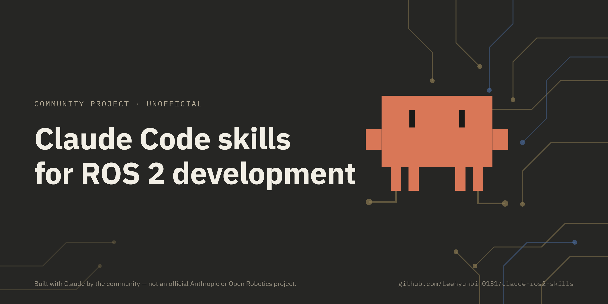
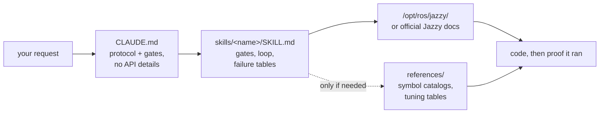

<div align="center">



**Claude Code Skills for ROS 2 Jazzy Jalisco robotics development.**

Skills que transforman la manera en que los agentes de IA abordan el desarrollo en ROS 2: identifican parámetros desconocidos desde el principio, verifican la configuración con respecto a los paquetes instalados y confirman la ejecución mediante evidencia concreta.


[English](README.md) | [한국어](README.ko.md) | [中文](README.zh.md) | [日本語](README.ja.md) | **Español** | [Français](README.fr.md) | [Deutsch](README.de.md)

<sub>🌐 Este documento es una traducción automática. El original está en [English](README.md).</sub>

| Skills | Protocolo siempre cargado | Enlaces a documentación (verificados por CI) | Verificaciones en robot físico |
| :---: | :---: | :---: | :---: |
| **11** | **28 líneas** | **32** | **4 scripts** |

</div>

---

## Contenido

- [Los fallos que cuestan caro](#los-fallos-que-cuestan-caro)
- [Cómo están construidos estos skills](#cómo-están-construidos-estos-skills)
- [Qué lo hace diferente](#qué-lo-hace-diferente)
- [Evaluaciones](#evaluaciones)
- [Inicio rápido](#inicio-rápido)
- [Skills](#skills)
- [Scripts de verificación](#scripts-de-verificación)
- [Cómo funciona](#cómo-funciona)
- [Actualización](#actualización)
- [Contribuir](#contribuir)
- [Licencia](#licencia)

## Los fallos que cuestan caro

Los errores más costosos en el código de ROS 2 generado por IA raras veces son fallos de sintaxis. En su lugar, suelen ser problemas sutiles que parecen correctos a primera vista:

| Fallo | Lo que ves | Por qué el agente encuentra el problema |
| :--- | :--- | :--- |
| **Fallo silencioso** | `ros2 topic hz` muestra 30 Hz; tu callback nunca se ejecuta | Un subscriptor RELIABLE por defecto intenta conectarse a un publicador BEST_EFFORT. El código compila y pasa la revisión de código, pero falla a nivel del middleware DDS. |
| **Ground truth incorrecto** | `/cmd_vel` indica movimiento hacia adelante y `/odom` reporta movimiento hacia adelante, pero el robot físico se mueve hacia **atrás** | El frame de TF estático está invertido con respecto al montaje físico. Los componentes posteriores calculan correctamente *utilizando la transformación incorrecta*, sin generar errores evidentes. |
| **API desactualizada** | El código pasa la revisión pero falla en tiempo de ejecución al llamar a un método incorrecto | El agente utiliza métodos de la API en Foxy o Humble obsoletos que fueron renombrados o eliminados en Jazzy. |
| **Premisa inválida** | El agente escribe 200 líneas de código basándose en una suposición que habrías podido corregir en una sola frase | No existe un mecanismo que pida al agente verificar detalles faltantes antes de generar código. |

Ni los compiladores, ni los linters, ni el análisis de logs detectan estos problemas ocultos. Resolver cada error requiere un ciclo de retroalimentación adicional: revisar la salida, diagnosticar la causa, explicar la solución y regenerar el código.

## Cómo están construidos estos skills

Cuatro reglas de diseño rigen cada skill de este repositorio:

**1. Identificar las variables desconocidas desde el principio.** Los detalles operativos clave con frecuencia no figuran en la documentación: si el entorno es hardware real o simulación, si se debe extender un workspace existente o crear uno nuevo, qué nodo ya publica una transformación o la geometría precisa del robot. [`CLAUDE.md`](./CLAUDE.md) instruye al agente a aclarar estas incógnitas antes de generar código. Los skills específicos de dominio gestionan parámetros concretos; por ejemplo, `ros2-dev` solicita el footprint del robot, la cinemática de tracción y la fuente de localización antes de configurar cualquier parámetro de Nav2.

**2. Ejecutar un bucle estructurado con criterios de salida claros.** Cada skill sigue un ciclo *verificar → escribir → probar*: inspeccionar los valores por defecto del sistema en el entorno instalado, aplicar cambios incrementales y confirmar la ejecución. Una tarea finaliza únicamente cuando está respaldada por evidencia observada —como una compilación exitosa, datos activos en `ros2 topic echo` o un script de verificación superado— en lugar de simplemente generar archivos de código.

**3. Priorizar tablas de fallos estructuradas sobre descripciones extensas.** Las tablas estructuradas que mapean síntomas → causas raíz → acciones correctivas brindan una guía clara y duradera de la que la documentación oficial suele carecer y que se mantiene confiable a través de las distintas versiones:

> `[` es GZ→ROS, `]` es ROS→GZ · `16UC1` son milímetros, `32FC1` son metros · `joint_state_broadcaster` no se lanza automáticamente · `raytrace_max_range` ≤ `obstacle_max_range` significa que los obstáculos nunca se limpian · rclc no asigna automáticamente campos de mensaje sin límite

**4. Optimizar el uso del contexto mediante una arquitectura de tres capas.** Cada skill equilibra la eficiencia del contexto: las descripciones del skill permanecen en el contexto, el cuerpo del skill se carga al ser invocado y los archivos de referencia detallados en `references/` se cargan solo según se requiera. Los catálogos extensos de símbolos y las tablas detalladas de ajuste de parámetros residen en `references/`, garantizando la conservación del contexto y evitando que la depuración de componentes específicos (como AMCL) cargue documentación innecesaria (como nodos de behavior-tree).

## Qué lo hace diferente

La mayoría de los paquetes de skills de robótica incluyen conocimiento estático de las API directamente dentro de sus archivos. Aunque su uso inicial es sencillo, este enfoque falla cuando se actualizan los paquetes subyacentes, dejando fragmentos desactualizados que fallan silenciosamente. Este repositorio adopta un enfoque dinámico orientado a la documentación:

| Característica | Paquetes de skills recargados de contenido | **claude-ros2-skills** |
| :--- | :--- | :--- |
| Ubicación del conocimiento | Integrado en los archivos del skill (**400–1.800 líneas/skill**) | Enlazado a la documentación oficial (cuerpo de skill de **~60 líneas**); las referencias detalladas se leen **solo cuando es necesario** |
| Contexto siempre cargado | Archivos `SKILL.md` completos | Protocolo principal de **28 líneas** |
| Gestión de actualizaciones de la API en Jazzy | Los fragmentos quedan obsoletos silenciosamente; requiere actualizaciones manuales continuas de pruebas | El riesgo de fragmentos obsoletos se minimiza a enlaces de punto de entrada y nombres de símbolos; **32 enlaces a documentación** se verifican semanalmente vía CI |
| Método de verificación | Análisis estático de código o verificación de logs | **Verificación física y en tiempo de ejecución**: comprobaciones de gravedad en IMU, pruebas de odometría direccional, alineación de frames TF, compatibilidad de QoS en DDS |
| Alcance de distribución | Afirma soportar múltiples distribuciones de ROS cuando solo apunta a una | **Exclusivo para ROS 2 Jazzy**, por diseño — sin evasivas de "también funciona en Humble" |

Este repositorio se optimiza para un único resultado: minimizar el riesgo de generar código con apariencia válida pero que falla al ejecutarse en ROS 2 Jazzy.

## Evaluaciones

**Un skill se considera verificado aquí solo cuando se responden dos preguntas:** ¿cambia lo que el agente produce en una tarea que ejercita su propio contenido, y es este cuerpo el *más pequeño* que produce dicho cambio? Lo correcto es el suelo, no el listón: menos tokens y menos texto pueden lograr el mismo resultado, y hasta que eso se pruebe, "el agente lo usó" es solo la mitad de una respuesta.

**Ningún skill ha completado la verificación aún.** El estado por skill se encuentra en [`evals/RESULTS.md`](./evals/RESULTS.md); los resultados se publicarán allí a medida que cada skill supere ambos ejes, incluidos los que fallen. Las mediciones provisionales se retienen deliberadamente: una ronda anterior produjo una conclusión plausible a partir de una sola ejecución que una reejecución controlada desmintió posteriormente, y los resultados parciales propagan ese tipo de error más rápido de lo que se puede detectar.

Qué se mide, cómo se califica y cómo reejecutar cualquier prueba: [`evals/README.md`](./evals/README.md). El criterio actual — una skill aporta lo que el agente **no puede alcanzar por sí mismo** (con el conocimiento del modelo, la búsqueda web y una instalación real disponibles) — está en [`evals/DESIGN.md`](./evals/DESIGN.md), y el estado de cada skill en [`evals/RESULTS.md`](./evals/RESULTS.md).

## Inicio rápido

**Opción A — Plugin Marketplace (Recomendado):**

```
/plugin marketplace add Leehyunbin0131/claude-ros2-skills
/plugin install claude-ros2-skills@claude-ros2-skills
```

Actualiza los plugins instalados en cualquier momento con `/plugin marketplace update`.

**Opción B — Instalación manual:**

```bash
git clone https://github.com/Leehyunbin0131/claude-ros2-skills.git

# Instalación a nivel de proyecto (se aplica solo al proyecto actual)
mkdir -p your-project/.claude/skills
cp -r claude-ros2-skills/skills/* your-project/.claude/skills/
cp claude-ros2-skills/CLAUDE.md your-project/

# Instalación a nivel de usuario (se aplica a todos los proyectos)
mkdir -p ~/.claude/skills
cp -r claude-ros2-skills/skills/* ~/.claude/skills/
```

Reinicia Claude Code (o inicia una nueva sesión) para aplicar los skills instalados.

## Skills

| Skill | Ruta | Cobertura |
| :--- | :--- | :--- |
| **ros2-core** | `skills/ros2-core/SKILL.md` | rclcpp, rclpy, TF2, odometría EKF, perfiles de QoS, parámetros |
| **ros2-package** | `skills/ros2-package/SKILL.md` | `ros2 pkg create`, configuración de CMakeLists/setup.py, colcon build y source, interfaces personalizadas |
| **ros2-dev** | `skills/ros2-dev/SKILL.md` | Nav2 (AMCL, costmaps, MPPI/Smac), SLAM Toolbox, RTAB-Map, Isaac ROS |
| **gazebo-sim** | `skills/gazebo-sim/SKILL.md` | Gazebo Harmonic, ros_gz_bridge, ros_gz_sim, modelado SDFormat |
| **ros2-control** | `skills/ros2-control/SKILL.md` | abstracción de hardware en ros2_control, controller manager, etiquetas URDF |
| **ros2-moveit** | `skills/ros2-moveit/SKILL.md` | MoveIt 2, API C++/Python de MoveGroup, solucionadores IK, OMPL, MoveIt Servo |
| **ros2-perception** | `skills/ros2-perception/SKILL.md` | image_transport, cv_bridge, vision_msgs, depth_image_proc, PCL |
| **ros2-testing** | `skills/ros2-testing/SKILL.md` | launch_testing, gtest/pytest, API C++/Python de rosbag2, ros2trace |
| **ros2-microros** | `skills/ros2-microros/SKILL.md` | micro-ROS Agent, API cliente rclc, transportes personalizados, memoria estática |
| **ros2-troubleshooting** | `skills/ros2-troubleshooting/SKILL.md` | árbol TF de referencia REP 103/105, alineación de LiDAR/IMU, verificación física |

## Scripts de verificación

Estos scripts de verificación están incluidos dentro del skill `ros2-troubleshooting` (`skills/ros2-troubleshooting/scripts/`) y forman parte de cada instalación. Convierten las comprobaciones de hardware físico en pasos de verificación ejecutables con resultado de éxito/fallo (requiere un entorno ROS 2 cargado previamente; códigos de retorno: 0 = PASS, 1 = FAIL, 2 = NO DATA):

| Script | Verifica |
| :--- | :--- |
| `check_imu_gravity.py` | Valida que un robot en reposo mida la gravedad en ~+9.81 m/s² a lo largo del eje **+Z** (REP 103). Detecta montajes de IMU invertidos o desalineados. |
| `check_odom_direction.py` | Valida que empujar el robot hacia adelante produzca un desplazamiento positivo de odometría a lo largo de su orientación. Detecta direcciones de motor invertidas, problemas de polaridad en encoders o configuraciones de TF invertidas. |
| `check_tf_tree.py` | Verifica que `map→odom→base_link` se resuelva correctamente; muestra el desfase de montaje de cada sensor en grados RPY y resalta posibles errores de orientación de 180°. |
| `check_qos_compat.py` | Verifica la compatibilidad de QoS entre todos los pares publicador/subscriptor en un tema (topic) utilizando las reglas de DDS. Previene fallos silenciosos (como un publicador BEST_EFFORT emparejado con un subscriptor RELIABLE, o desajustes en durabilidad, deadline y liveliness). |

La lógica principal de decisión cuenta con pruebas unitarias independientes de ROS (`python3 skills/ros2-troubleshooting/scripts/test_checks.py`) y se ejecuta mediante integración continua (CI) en cada push.

## Cómo funciona



`CLAUDE.md` no contiene detalles específicos de la API. En su lugar, establece el protocolo operativo y requiere responder preguntas aclaratorias antes de escribir código. Cada archivo `SKILL.md` gestiona decisiones específicas de su dominio: identificar variables desconocidas, ejecutar el ciclo de verificar-escribir-probar y consultar tablas de fallos. Los materiales de referencia detallados se almacenan por separado en el directorio `references/`. Consulta [`CLAUDE.md`](./CLAUDE.md) para más detalles.

## Actualización

```bash
cd claude-ros2-skills
git pull
cp -r skills/* ~/.claude/skills/   # o el .claude/skills/ de tu proyecto
```

## Contribuir

Resumen: Los archivos de los skills deben enfocarse en la lógica de decisión (puertas de validación, pasos de bucle y tablas de fallos), mientras que la documentación detallada permanece en `references/`. Cada símbolo de la API debe ser verificado contra la documentación oficial de Jazzy o instalaciones en `/opt/ros/jazzy/`. Los scripts de verificación deben mantener una lógica pura que pueda ser sometida a pruebas unitarias sin dependencias de ROS. Para consultar las guías completas, listas de verificación de skills y scripts, y plantillas de issues, consulta [`CONTRIBUTING.md`](./CONTRIBUTING.md).

## Licencia

Apache-2.0 — consulta [LICENSE](./LICENSE).
