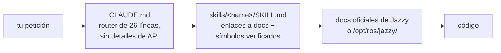

<div align="center">


**Claude Code Skills para el desarrollo robótico con ROS 2 Jazzy Jalisco.**

Skills de referencia contra alucinaciones — cada skill enruta a la documentación oficial en lugar de adivinar nombres de API.


[English](README.md) | [한국어](README.ko.md) | [中文](README.zh.md) | [日本語](README.ja.md) | **Español** | [Français](README.fr.md) | [Deutsch](README.de.md)

<sub>🌐 Este documento es una traducción automática. El original está en [English](README.md).</sub>

| Skills | Router siempre cargado | Enlaces de doc (comprobados por CI) | Comprobaciones físicas del robot | Evals: parámetros alucinados |
| :---: | :---: | :---: | :---: | :---: |
| **11** | **26 líneas** | **38** | **4 scripts** | **21 → 0** |

</div>

---

## Contenido

- [Por qué existe](#por-qué-existe)
- [Qué lo hace diferente](#qué-lo-hace-diferente)
- [Evaluaciones](#evaluaciones)
- [Inicio rápido](#inicio-rápido)
- [Skills](#skills)
- [Scripts de verificación](#scripts-de-verificación)
- [Cómo funciona](#cómo-funciona)
- [Actualización](#actualización)
- [Contribuir](#contribuir)
- [Licencia](#licencia)

## Por qué existe

Los logs demuestran que un sistema es *consistente*, nunca que es *correcto* — y un agente no tiene ninguna razón por defecto para desconfiar de una historia consistente. Dos modos de fallo aparecen una y otra vez:

| Modo de fallo | Qué aspecto tiene | Causa real |
| :--- | :--- | :--- |
| **Verdad de referencia incorrecta** | `/cmd_vel` dice adelante, `/odom` dice adelante, todo sano — el robot conduce **hacia atrás** | TF estático declarado invertido respecto al montaje físico real; todo lo posterior calcula correctamente *a partir de esa transformación errónea*, así que nada contradice nada |
| **Época incorrecta** | El código pasa la revisión, muere en runtime con un método que "suena bien" | El agente codifica desde datos de entrenamiento memorizados de la era Foxy/Humble; la API fue renombrada o nunca existió en Jazzy |

Ambos provienen de confiar en algo que *parece* autoritativo en lugar de comprobar la verdad de referencia. `ros2-troubleshooting` fuerza comprobaciones físicas (empujar el robot, hacer echo del TF crudo, confirmar la gravedad del IMU) antes de confiar en un topic. Todos los demás skills aplican la misma regla al código: verificar nombres de clases, mensajes y flags contra la documentación oficial de Jazzy o `/opt/ros/jazzy/` — nunca de memoria.

## Qué lo hace diferente

La mayoría de los packs de skills de robótica incrustan el conocimiento de las API en los archivos de skill. En cuanto el ecosistema se mueve, cada snippet incrustado se convierte en un hecho que puede pudrirse en silencio. Este repositorio apuesta por lo contrario:

| | Packs de skills cargados de contenido | **claude-ros2-skills** |
| :--- | :--- | :--- |
| Dónde vive el conocimiento | incrustado en archivos de skill, **400–1.800 líneas/skill** | enrutado a docs oficiales; cuerpos de **~60 líneas**, el detalle voluminoso en `references/` leído **solo cuando hace falta** |
| Contexto siempre cargado | SKILL.md completo | router de **26 líneas** |
| Cuando una API de Jazzy cambia | los snippets se pudren en silencio; tests de regresión de docs para siempre | la superficie de podredumbre se reduce a enlaces + nombres de símbolos — **38 enlaces** comprobados semanalmente por CI (solo vitalidad), enlace muerto rompe la build |
| Verificación | estática / basada en logs | **física**: gravedad del IMU, prueba de empuje, montajes TF vs. hardware real, matching de QoS DDS |
| Declaración de distribución | "cubre 4 distribuciones" sobre ejemplos que apuntan a una | **solo Jazzy**, declarado desde el principio |

El compromiso, dicho claramente: para temas donde la documentación oficial es escasa (tuning de vendors DDS, interioridades de PREEMPT_RT), un pack cargado de contenido puede servirte mejor. Este repositorio optimiza una sola cosa — la probabilidad más baja de código de aspecto plausible que no funciona en Jazzy.

## Evaluaciones

Medido, no afirmado — con una salvedad declarada: las ejecuciones y la calificación las realizó la propia sesión de agente del autor del repositorio, no una parte independiente. Todos los artefactos están comprometidos para recalificación por terceros. Prompts idénticos se ejecutaron en sesiones headless nuevas de Claude Code con y sin los skills instalados (mismo modelo por par); las salidas se calificaron símbolo a símbolo contra las fuentes de Jazzy fijadas.

| Resultado | Sin skills | Con skills |
| :--- | ---: | ---: |
| Parámetros MPPI de Nav2 inventados/erróneos (haiku) | **21** — Nav2 muere al arrancar | **0** |
| Parámetros MPPI de Nav2 inventados/erróneos (sonnet) | 0 *(memoria sin verificar)* | **0** *(verificado en vivo)* |
| El callback `/scan` se dispara con un LiDAR BEST_EFFORT real (sonnet) | **nunca** — QoS por defecto incorrecto, en silencio | **sí** |
| Ejecuciones que verificaron antes de escribir | **0 / 3** | **3 / 3** |


Tablas de calificación completas, condiciones y todos los artefactos generados: [`evals/RESULTS.md`](./evals/RESULTS.md) · protocolo y listas de verificación: [`evals/README.md`](./evals/README.md) — n=1 por celda de momento; se aceptan PRs con transcripciones calificadas.

<details>
<summary>Qué significan estos números</summary>

Dos patrones que merecen nombre: con un modelo potente, los skills convierten "probablemente correcto" en "verificado como correcto"; con un modelo más pequeño, son la diferencia entre una configuración que no puede arrancar y la correcta. Y en una ejecución donde las herramientas de verificación no estaban disponibles, el agente con skills **se negó a emitir parámetros sin verificar** en lugar de adivinar — la línea base ni siquiera notó que no había comprobado nada.

</details>

## Inicio rápido

**Opción A — marketplace de plugins (recomendado):**

```
/plugin marketplace add Leehyunbin0131/claude-ros2-skills
/plugin install claude-ros2-skills@claude-ros2-skills
```

Las actualizaciones llegan con `/plugin marketplace update`.

**Opción B — copia manual:**

```bash
git clone https://github.com/Leehyunbin0131/claude-ros2-skills.git

# Nivel de proyecto (solo este proyecto)
mkdir -p your-project/.claude/skills
cp -r claude-ros2-skills/skills/* your-project/.claude/skills/
cp claude-ros2-skills/CLAUDE.md your-project/

# O nivel de usuario (todos los proyectos)
mkdir -p ~/.claude/skills
cp -r claude-ros2-skills/skills/* ~/.claude/skills/
```

Reinicia Claude Code (o inicia una sesión nueva) para cargar los skills.

## Skills

| Skill | Ruta | Cobertura |
| :--- | :--- | :--- |
| **ros2-core** | `skills/ros2-core/SKILL.md` | rclcpp, rclpy, TF2, odometría EKF, perfiles QoS, parámetros |
| **ros2-package** | `skills/ros2-package/SKILL.md` | `ros2 pkg create`, cableado de CMakeLists/setup.py, colcon build y source, interfaces propias |
| **ros2-dev** | `skills/ros2-dev/SKILL.md` | Nav2 (AMCL, costmaps, MPPI/Smac), SLAM Toolbox, RTAB-Map, Isaac ROS |
| **gazebo-sim** | `skills/gazebo-sim/SKILL.md` | Gazebo Harmonic, ros_gz_bridge, ros_gz_sim, modelado SDFormat |
| **ros2-control** | `skills/ros2-control/SKILL.md` | Abstracción de hardware ros2_control, controller manager, etiquetas URDF |
| **ros2-moveit** | `skills/ros2-moveit/SKILL.md` | MoveIt 2, API MoveGroup C++/Python, solvers IK, OMPL, MoveIt Servo |
| **ros2-perception** | `skills/ros2-perception/SKILL.md` | image_transport, cv_bridge, vision_msgs, depth_image_proc, PCL |
| **ros2-testing** | `skills/ros2-testing/SKILL.md` | launch_testing, gtest/pytest, APIs rosbag2 C++/Python, ros2trace |
| **ros2-microros** | `skills/ros2-microros/SKILL.md` | micro-ROS Agent, API cliente rclc, transportes personalizados, memoria estática |
| **ros2-security** | `skills/ros2-security/SKILL.md` | SROS2, generación de keystore PKI, control de acceso, DDS Security |
| **ros2-troubleshooting** | `skills/ros2-troubleshooting/SKILL.md` | Árbol TF de verdad de referencia REP 103/105, alineación LiDAR/IMU, anti-alucinación |

## Scripts de verificación

Empaquetados dentro del skill `ros2-troubleshooting` (`skills/ros2-troubleshooting/scripts/`), así viajan con cualquier instalación. Convierten las comprobaciones físicas en hechos ejecutables de pasa/falla (requiere un entorno ROS 2 con source; cada uno sale con 0 = PASS, 1 = FAIL, 2 = sin datos):

| Script | Verifica |
| :--- | :--- |
| `check_imu_gravity.py` | Robot en reposo → la gravedad es ~+9,81 m/s² en **+Z** (REP 103). Detecta IMUs montados invertidos o rotados. |
| `check_odom_direction.py` | Empuja el robot hacia adelante → el desplazamiento de odometría es positivo a lo largo de su rumbo. Detecta motores, encoders o TF invertidos. |
| `check_tf_tree.py` | `map→odom→base_link` se resuelve; imprime cada montaje de sensor en grados RPY y marca las declaraciones de ~180° para compararlas con el montaje físico. |
| `check_qos_compat.py` | Cada par publicador/suscriptor de un topic es compatible en QoS según las reglas de matching de DDS. Detecta el fallo silencioso de "el topic muestra 30 Hz pero mi callback nunca se dispara" (pub BEST_EFFORT vs sub RELIABLE, y desajustes de durability/deadline/liveliness). |

La lógica de decisión pura se testea unitariamente sin ROS (`python3 skills/ros2-troubleshooting/scripts/test_checks.py`) y corre en CI en cada push.

## Cómo funciona



`CLAUDE.md` nunca incrusta detalles de API — solo enruta. Cada `SKILL.md` es un catálogo ligero de enlaces a documentación oficial más los nombres exactos de clases/mensajes/parámetros, de modo que Claude verifica en lugar de adivinar. Ver [`CLAUDE.md`](./CLAUDE.md).

## Actualización

```bash
cd claude-ros2-skills
git pull
cp -r skills/* ~/.claude/skills/   # o el .claude/skills/ de tu proyecto
```

## Contribuir

Versión corta — los skills se mantienen como catálogos de enlaces a docs (no tutoriales), cada símbolo se verifica contra la documentación de Jazzy o `/opt/ros/jazzy/`, los scripts mantienen su lógica pura testeable sin ROS. Reglas completas, checklists de skills/scripts y plantillas de issues: [`CONTRIBUTING.md`](./CONTRIBUTING.md).

## Licencia

Apache-2.0 — ver [LICENSE](./LICENSE).
