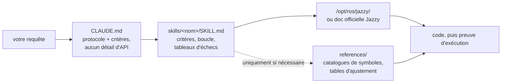

<div align="center">


**Claude Code Skills for ROS 2 Jazzy Jalisco robotics development.**

Des skills qui transforment la façon dont les agents IA abordent le développement ROS 2 : identifier les paramètres inconnus dès le départ, vérifier les configurations par rapport aux packages installés et confirmer l'exécution grâce à des preuves tangibles.


[English](README.md) | [한국어](README.ko.md) | [中文](README.zh.md) | [日本語](README.ja.md) | [Español](README.es.md) | **Français** | [Deutsch](README.de.md)

<sub>🌐 Ce document est une traduction automatique. L'original est en [English](README.md).</sub>

| Skills | Protocole chargé en permanence | Liens de doc (vérifiés par CI) | Contrôles sur robot physique |
| :---: | :---: | :---: | :---: |
| **11** | **28 lignes** | **32** | **4 scripts** |

</div>

---

## Sommaire

- [Les échecs qui coûtent cher](#les-échecs-qui-coûtent-cher)
- [Comment ces skills sont conçus](#comment-ces-skills-sont-conçus)
- [Ce qui le différencie](#ce-qui-le-différencie)
- [Évaluations](#évaluations)
- [Démarrage rapide](#démarrage-rapide)
- [Skills](#skills)
- [Scripts de vérification](#scripts-de-vérification)
- [Fonctionnement](#fonctionnement)
- [Mise à jour](#mise-à-jour)
- [Contribuer](#contribuer)
- [Licence](#licence)

## Les échecs qui coûtent cher

Les erreurs les plus coûteuses dans le code ROS 2 généré par IA sont rarement des fautes de syntaxe. Il s'agit plutôt de problèmes subtils qui semblent corrects à première vue :

| Échec | Ce que vous observez | Pourquoi l'agent rencontre ce problème |
| :--- | :--- | :--- |
| **Échec silencieux** | `ros2 topic hz` indique 30 Hz ; votre callback ne se déclenche jamais | Un subscriber par défaut en RELIABLE tente de se connecter à un publisher en BEST_EFFORT. Le code compile et passe la revue de code, mais échoue au niveau du middleware DDS. |
| **Vérité terrain erronée** | `/cmd_vel` indique une avance et `/odom` signale une avance, mais le robot physique se déplace **vers l'arrière** | Le repère (frame) TF statique est inversé par rapport au montage physique. Les composants en aval calculent correctement *en utilisant la mauvaise transformation*, sans produire d'erreur apparente. |
| **API obsolète** | Le code passe la revue mais échoue à l'exécution lors de l'appel d'une méthode incorrecte | L'agent utilise des méthodes d'API obsolètes de Foxy ou Humble qui ont été renommées ou supprimées dans Jazzy. |
| **Prémisse invalide** | L'agent écrit 200 lignes de code basées sur une hypothèse que vous auriez pu corriger en une seule phrase | Aucun mécanisme n'incite l'agent à vérifier les détails manquants avant de générer le code. |

Ni les compilateurs, ni les linters, ni les analyses de logs ne détectent ces problèmes cachés. La résolution de chaque erreur nécessite un cycle de retour supplémentaire : examiner le résultat, diagnostiquer la cause, expliquer le correctif et régénérer le code.

## Comment ces skills sont conçus

Quatre règles de conception régissent chaque skill de ce dépôt :

**1. Identifier les variables inconnues dès le départ.** Les détails opérationnels clés ne figurent souvent pas dans la documentation — par exemple si l'environnement est du matériel réel ou une simulation, s'il faut étendre un workspace existant ou en créer un nouveau, quel nœud publie déjà une transformation, ou la géométrie précise du robot. [`CLAUDE.md`](./CLAUDE.md) donne pour instruction à l'agent de clarifier ces inconnues avant de générer du code. Les skills spécifiques à un domaine gèrent les paramètres ciblés ; par exemple, `ros2-dev` demande le footprint du robot, la cinématique de transmission et la source de localisation avant de configurer les paramètres Nav2.

**2. Exécuter une boucle structurée avec des critères de sortie clairs.** Chaque skill suit un cycle *vérifier → écrire → prouver* : inspecter les valeurs par défaut du système sur l'environnement installé, appliquer des modifications incrémentales et confirmer l'exécution. Une tâche ne s'achève que lorsqu'elle s'appuie sur des preuves observées — comme un build réussi, des données actives sur `ros2 topic echo` ou le succès d'un script de vérification — et non simplement par la production de fichiers de code.

**3. Privilégier les tableaux d'échecs structurés aux longues descriptions.** Les tableaux structurés associant symptômes → causes racines → actions correctives fournissent des directives claires et durables qui manquent souvent dans la documentation officielle et qui restent fiables au fil des versions :

> `[` est GZ→ROS, `]` est ROS→GZ · `16UC1` est en millimètres, `32FC1` est en mètres · `joint_state_broadcaster` n'est pas lancé automatiquement · `raytrace_max_range` ≤ `obstacle_max_range` signifie que les obstacles ne s'effacent jamais · rclc n'alloue pas automatiquement les champs de message non bornés

**4. Optimiser l'utilisation du contexte avec une architecture à trois couches.** Chaque skill équilibre l'efficacité du contexte : les descriptions de skills restent en contexte, les corps de skills se chargent lors de leur invocation, et les fichiers de référence approfondis dans `references/` ne se chargent qu'à la demande. Les grands catalogues de symboles et les tableaux détaillés d'ajustement de paramètres résident dans `references/`, ce qui préserve le contexte et évite que le débogage de composants ciblés (comme AMCL) ne charge de la documentation inutile (comme les nœuds d'arbres de comportement).

## Ce qui le différencie

La plupart des packs de skills en robotique intègrent directement des connaissances d'API statiques dans les fichiers de skills. Bien que l'utilisation initiale soit simple, cette approche échoue lorsque les packages sous-jacents sont mis à jour — laissant des extraits de code obsolètes qui échouent silencieusement. Ce dépôt adopte une approche dynamique guidée par la documentation :

| Fonctionnalité | Packs de skills à fort contenu | **claude-ros2-skills** |
| :--- | :--- | :--- |
| Emplacement des connaissances | Intégré dans les fichiers de skills (**400–1 800 lignes/skill**) | Lié à la doc officielle (corps de skill de **~60 lignes**) ; références détaillées lues **uniquement si nécessaire** |
| Contexte chargé en permanence | Fichiers `SKILL.md` complets | Protocole cœur de **28 lignes** |
| Gestion des mises à jour d'API Jazzy | Les extraits deviennent obsolètes discrètement ; nécessite des mises à jour manuelles continues des tests | Le risque d'extraits obsolètes est réduit aux liens d'entrée et noms de symboles — **32 liens de documentation** vérifiés chaque semaine via la CI |
| Méthode de vérification | Analyse statique de code ou vérification de logs | **Vérification physique & à l'exécution** : contrôles de gravité IMU, tests d'odométrie directionnelle, alignement des repères TF, compatibilité QoS DDS |
| Portée de support | Prétend supporter plusieurs distributions ROS tout en ne ciblant qu'une seule | **ROS 2 Jazzy uniquement**, par conception — sans faux-fuyant du type « fonctionne aussi sur Humble » |

Ce dépôt est optimisé pour un objectif unique : minimiser le risque de générer du code d'apparence plausible mais qui échoue à s'exécuter sur ROS 2 Jazzy.

## Évaluations

**Un skill n'est considéré comme vérifié ici que lorsque deux questions ont trouvé réponse :** modifie-t-il ce que l'agent produit sur une tâche mettant en œuvre son propre contenu, et ce corps est-il le *plus petit* qui produise ce changement ? Être correct est le plancher, pas la barre — moins de tokens et moins de texte peuvent obtenir le même résultat, et tant que cela n'est pas testé, « l'agent l'a utilisé » n’est qu'une demi-réponse.

**Aucun skill n'a encore terminé sa vérification.** Le statut par skill se trouve dans [`evals/RESULTS.md`](./evals/RESULTS.md) ; les résultats y sont publiés au fur et à mesure que chaque skill valide les deux axes, y compris ceux qui échouent. Les mesures intermédiaires sont délibérément retenues — une série précédente avait produit une conclusion plausible à partir d'une seule exécution qu'une réexécution contrôlée a ensuite infirmée, et des résultats partiels propagent ce genre d'erreur plus vite qu'elle ne peut être détectée.

Ce qui est mesuré, la façon dont c'est noté et la manière de tout réexécuter : [`evals/README.md`](./evals/README.md). Le critère actuel — une skill fournit ce que l'agent **ne peut pas atteindre seul** (avec les connaissances du modèle, la recherche web et une installation réelle disponibles) — se trouve dans [`evals/DESIGN.md`](./evals/DESIGN.md), et l'état de chaque skill dans [`evals/RESULTS.md`](./evals/RESULTS.md).

## Démarrage rapide

**Option A — Plugin Marketplace (Recommandé) :**

```
/plugin marketplace add Leehyunbin0131/claude-ros2-skills
/plugin install claude-ros2-skills@claude-ros2-skills
```

Mettez à jour les plugins installés à tout moment avec `/plugin marketplace update`.

**Option B — Installation manuelle :**

```bash
git clone https://github.com/Leehyunbin0131/claude-ros2-skills.git

# Installation au niveau du projet (s'applique uniquement au projet actuel)
mkdir -p your-project/.claude/skills
cp -r claude-ros2-skills/skills/* your-project/.claude/skills/
cp claude-ros2-skills/CLAUDE.md your-project/

# Installation au niveau de l'utilisateur (s'applique à tous les projets)
mkdir -p ~/.claude/skills
cp -r claude-ros2-skills/skills/* ~/.claude/skills/
```

Redémarrez Claude Code (ou démarrez une nouvelle session) pour appliquer les skills installés.

## Skills

| Skill | Chemin | Couverture |
| :--- | :--- | :--- |
| **ros2-core** | `skills/ros2-core/SKILL.md` | rclcpp, rclpy, TF2, odométrie EKF, profils QoS, paramètres |
| **ros2-package** | `skills/ros2-package/SKILL.md` | `ros2 pkg create`, configuration CMakeLists/setup.py, build & source colcon, interfaces personnalisées |
| **ros2-dev** | `skills/ros2-dev/SKILL.md` | Nav2 (AMCL, costmaps, MPPI/Smac), SLAM Toolbox, RTAB-Map, Isaac ROS |
| **gazebo-sim** | `skills/gazebo-sim/SKILL.md` | Gazebo Harmonic, ros_gz_bridge, ros_gz_sim, modélisation SDFormat |
| **ros2-control** | `skills/ros2-control/SKILL.md` | Abstraction matérielle ros2_control, controller manager, balises URDF |
| **ros2-moveit** | `skills/ros2-moveit/SKILL.md` | MoveIt 2, API C++/Python MoveGroup, solveurs IK, OMPL, MoveIt Servo |
| **ros2-perception** | `skills/ros2-perception/SKILL.md` | image_transport, cv_bridge, vision_msgs, depth_image_proc, PCL |
| **ros2-testing** | `skills/ros2-testing/SKILL.md` | launch_testing, gtest/pytest, API C++/Python rosbag2, ros2trace |
| **ros2-microros** | `skills/ros2-microros/SKILL.md` | Agent micro-ROS, API client rclc, transports personnalisés, mémoire statique |
| **ros2-troubleshooting** | `skills/ros2-troubleshooting/SKILL.md` | Arbre TF de vérité terrain REP 103/105, alignement LiDAR/IMU, vérification physique |

## Scripts de vérification

Ces scripts de vérification sont intégrés au skill `ros2-troubleshooting` (`skills/ros2-troubleshooting/scripts/`) et sont inclus avec chaque installation. Ils transforment les contrôles matériels physiques en étapes de vérification exécutables de type succès/échec (nécessite un environnement ROS 2 sourcé ; codes de retour : 0 = SUCCÈS, 1 = ÉCHEC, 2 = AUCUNE DONNÉE) :

| Script | Vérifie |
| :--- | :--- |
| `check_imu_gravity.py` | Valide qu'un robot au repos mesure la gravité à environ +9,81 m/s² le long de l'axe **+Z** (REP 103). Détecte les montages d'IMU inversés ou mal alignés. |
| `check_odom_direction.py` | Valide que le fait de pousser le robot vers l'avant produit un déplacement d'odométrie positif le long de son cap. Détecte les directions de moteur inversées, les problèmes de polarité d'encodeur ou les configurations TF inversées. |
| `check_tf_tree.py` | Vérifie que `map→odom→base_link` se résout correctement ; affiche chaque décalage de montage de capteur en degrés RPY et met en évidence les erreurs d'orientation potentielles de 180°. |
| `check_qos_compat.py` | Vérifie la compatibilité QoS sur toutes les paires publisher/subscriber d'un topic à l'aide des règles DDS. Prévient les échecs silencieux (comme un publisher BEST_EFFORT associé à un subscriber RELIABLE, ou des incompatibilités de durabilité, d'échéance et de réactivité). |

La logique de décision principale est testée unitairement indépendamment de ROS (`python3 skills/ros2-troubleshooting/scripts/test_checks.py`) et s'exécute via l'intégration continue (CI) à chaque push.

## Fonctionnement



`CLAUDE.md` ne contient aucun détail d'API spécifique. À la place, il établit le protocole opérationnel et exige que des questions de clarification soient répondues avant d'écrire du code. Chaque fichier `SKILL.md` gère les décisions spécifiques à son domaine : identifier les variables inconnues, exécuter la boucle vérifier-écrire-prouver et se référer aux tableaux d'échecs. Les documents de référence détaillés sont stockés séparément dans le répertoire `references/`. Consultez [`CLAUDE.md`](./CLAUDE.md) pour plus de détails.

## Mise à jour

```bash
cd claude-ros2-skills
git pull
cp -r skills/* ~/.claude/skills/   # ou dans le répertoire .claude/skills/ de votre projet
```

## Contribuer

Résumé : les fichiers de skills doivent se concentrer sur la logique de décision (critères de validation, étapes de boucle et tableaux d'échecs), tandis que la documentation détaillée reste dans `references/`. Chaque symbole d'API doit être vérifié par rapport à la documentation officielle de Jazzy ou aux installations sous `/opt/ros/jazzy/`. Les scripts de vérification doivent conserver une logique pure pouvant être testée unitairement sans dépendances ROS. Pour obtenir l'ensemble des directives, les listes de contrôle des skills et des scripts, ainsi que les modèles de ticket, consultez [`CONTRIBUTING.md`](./CONTRIBUTING.md).

## Licence

Apache-2.0 — voir [LICENSE](./LICENSE).
