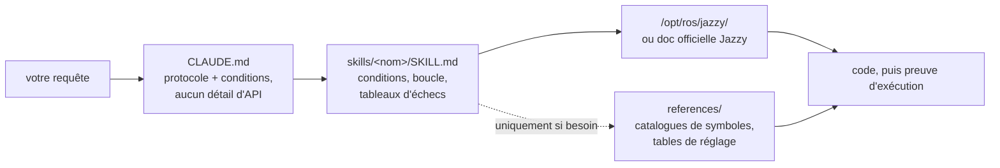

<div align="center">


**Skills Claude Code pour le développement robotique sous ROS 2 Jazzy Jalisco.**

Des skills qui changent *la façon dont* l'agent exécute une tâche ROS 2 — identifier d'abord les inconnues, vérifier par rapport au système installé et prouver que le résultat s'est exécuté.


[English](README.md) | [한국어](README.ko.md) | [中文](README.zh.md) | [日本語](README.ja.md) | [Español](README.es.md) | **Français** | [Deutsch](README.de.md)

<sub>🌐 Ce document est une traduction automatique. L'original est en [English](README.md).</sub>

| Skills | Protocole toujours chargé | Liens de doc (vérifiés par CI) | Vérifications sur robot physique | Évals : vérifié avant d'écrire |
| :---: | :---: | :---: | :---: | :---: |
| **11** | **26 lignes** | **38** | **4 scripts** | **0/3 → 3/3** |

</div>

---

## Sommaire

- [Les échecs qui coûtent cher](#les-échecs-qui-coûtent-cher)
- [Comment ces skills sont conçus](#comment-ces-skills-sont-conçus)
- [Ce qui le différencie](#ce-qui-le-différencie)
- [Évaluations](#évaluations)
- [Démarrage rapide](#démarrage-rapide)
- [Skills](#skills)
- [Scripts de vérification](#scripts-de-vérification)
- [Fonctionnement](#fonctionnement)
- [Mise à jour](#mise-à-jour)
- [Feuille de route](#feuille-de-route)
- [Contribuer](#contribuer)
- [Licence](#licence)

## Les échecs qui coûtent cher

Les échecs les plus coûteux dans le code ROS 2 écrit par un agent ne sont pas des erreurs de syntaxe. Ce sont ceux qui ont l'air corrects à première vue :

| Échec | Ce que vous voyez | Pourquoi l'agent tombe dedans |
| :--- | :--- | :--- |
| **Opération nulle silencieuse (silent no-op)** | `ros2 topic hz` affiche 30 Hz ; votre callback ne se déclenche jamais | Subscriber RELIABLE par défaut vs. driver BEST_EFFORT. Compile, passe la revue sans problème, mais ne correspond à rien au niveau DDS |
| **Mauvaise vérité terrain (ground truth)** | `/cmd_vel` indique d'avancer, `/odom` indique d'avancer — le robot va en **arrière** | TF statique déclarée inversée par rapport au montage physique. Tout l'aval calcule correctement *à partir de la mauvaise transformation*, sans la moindre contradiction |
| **Mauvaise époque** | Passe la revue, plante à l'exécution sur une méthode qui "semble correcte" | API mémorisée de l'époque Foxy/Humble qui a été renommée ou n'a jamais existé dans Jazzy |
| **Prémisse erronée** | 200 lignes construites sur une hypothèse que vous auriez corrigée en une phrase | Rien n'a demandé à l'agent d'identifier les inconnues avant d'écrire du code |

Aucun compilateur, linter ou inspection de logs ne détecte ces erreurs. Chacune d'elles coûte un aller-retour : vous lisez le résultat, vous comprenez le problème, vous l'expliquez, et l'agent régénère le code.

## Comment ces skills sont conçus

Quatre règles de conception, appliquées à chaque skill.

**1. Identifier les inconnues avant d'écrire.** Certains faits ne se trouvent dans aucune documentation — s'il s'agit de matériel réel ou de simulation, si vous étendez un workspace existant ou partez de zéro, quel nœud publie déjà la transformation modifiée, et la géométrie réelle du robot. [`CLAUDE.md`](./CLAUDE.md) oblige l'agent à établir ces éléments en premier et à poser des questions si la requête ne le précise pas. Les inconnues propres au domaine résident dans le skill : `ros2-dev` demande l'empreinte (footprint), le type de transmission et la source de localisation avant d'écrire le moindre paramètre Nav2.

**2. Une boucle avec une fin définie.** Chaque skill s'exécute selon la séquence *vérifier → écrire → prouver* : lire les valeurs par défaut fournies sur le système installé, écrire une modification à la fois, puis confirmer qu'elle a réellement fonctionné. "Terminé" signifie une preuve observée — un build réussi, `ros2 topic echo` affichant des données, un script de vérification qui passe — et non du code produit.

**3. Privilégier les tableaux d'échecs à la prose.** Le contenu avec la plus haute valeur ajoutée est la ligne symptôme → cause racine → action, car elle n'est rassemblée nulle part dans la doc officielle et ne devient pas obsolète lorsqu'une version sort :

> `[` désigne GZ→ROS, `]` désigne ROS→GZ · `16UC1` est en millimètres, `32FC1` en mètres · `joint_state_broadcaster` n'est pas instancié automatiquement · `raytrace_max_range` ≤ `obstacle_max_range` signifie que les obstacles ne sont jamais effacés · rclc n'alloue pas automatiquement les champs de messages non bornés

**4. Trois couches, trois coûts de contexte.** La `description` d'un skill est toujours chargée dans le contexte, son corps se charge au déclenchement du skill, et les fichiers de `references/` ne sont lus que si la tâche le nécessite. Les catalogues de symboles volumineux et les tables de réglage résident dans `references/`, ainsi une personne déboguant AMCL ne paie pas le coût de la liste de nœuds d'arbre de comportement — et de la profondeur peut être ajoutée sans alourdir chaque chargement.

## Ce qui le différencie

La plupart des packs de skills robotiques intègrent la connaissance de l'API directement dans les fichiers de skill. Cela fonctionne jusqu'à ce que l'écosystème évolue — chaque extrait intégré devient alors une information susceptible d'obsolescence silencieuse. Ce dépôt fait le pari inverse :

| | Packs de skills chargés en contenu | **claude-ros2-skills** |
| :--- | :--- | :--- |
| Emplacement de la connaissance | intégrée dans les fichiers de skill, **400 à 1 800 lignes/skill** | orientée vers la doc officielle ; corps de skill de **~60 lignes**, détails volumineux dans `references/` lus **uniquement au besoin** |
| Contexte toujours chargé | fichier SKILL.md complet | protocole de **26 lignes** |
| Quand une API Jazzy change | les extraits deviennent obsolètes en silence ; nécessite des tests de régression de doc permanents | la surface d'obsolescence se réduit aux liens d'entrée + noms de symboles — **38 liens** vérifiés en CI chaque semaine (disponibilité uniquement), un lien mort fait échouer le build |
| Vérification | statique / basée sur les logs | **physique** : gravité IMU, test de poussée, montages TF vs matériel réel, correspondance QoS DDS |
| Prétention sur les distributions | "couvre 4 distributions" sur des exemples qui n'en ciblent qu'une | **Jazzy uniquement**, annoncé d'emblée |

Ce dépôt s'optimise pour une seule chose : réduire au minimum la probabilité de générer du code d'apparence plausible mais qui ne s'exécute pas sous Jazzy.

## Évaluations

Des prompts identiques sont exécutés dans des sessions fraîches de Claude Code en mode headless avec et sans les skills installés, le même modèle par paire, évalués symbole par symbole par rapport au code source officiel de `jazzy`.

| Résultat | Sans skills | Avec skills |
| :--- | ---: | ---: |
| Clés Nav2 MPPI erronées/inventées (haiku) | **~30** — aucune liste `critics:` du tout, la configuration ne peut s'exécuter | **~16–20** — chaîne de plugin, espaces de noms `motion_model` et de vérificateur corrects |
| Le callback `/scan` se déclenche sur un vrai LiDAR BEST_EFFORT (sonnet) | **jamais** — mauvaise QoS par défaut, silencieusement | **oui** |
| Exécutions ayant vérifié avant d'écrire | **0 / 3** | **3 / 3** |

L'écart de comportement est le résultat le plus marquant : les exécutions de référence n'ont utilisé **aucun** outil de vérification bien qu'ils fussent disponibles, tandis que chaque exécution avec les skills a chargé le skill et a d'abord cherché les valeurs par défaut installées. Une exécution a posé ses trois questions préalables au préalable et a rapporté exactement ce qu'elle avait pu et n'avait pas pu vérifier, plutôt que de deviner en silence.

Tableaux de notation complets, conditions et analyse par exécution : [`evals/RESULTS.md`](./evals/RESULTS.md) · protocole, listes de contrôle des tâches et recette du conteneur : [`evals/README.md`](./evals/README.md). Les PR ajoutant des transcriptions évaluées sont les bienvenues.

## Démarrage rapide

**Option A — marketplace de plugins (recommandé) :**

```
/plugin marketplace add Leehyunbin0131/claude-ros2-skills
/plugin install claude-ros2-skills@claude-ros2-skills
```

Les mises à jour s'effectuent avec `/plugin marketplace update`.

**Option B — copie manuelle :**

```bash
git clone https://github.com/Leehyunbin0131/claude-ros2-skills.git

# Project-level (this project only)
mkdir -p your-project/.claude/skills
cp -r claude-ros2-skills/skills/* your-project/.claude/skills/
cp claude-ros2-skills/CLAUDE.md your-project/

# OR user-level (all projects)
mkdir -p ~/.claude/skills
cp -r claude-ros2-skills/skills/* ~/.claude/skills/
```

Redémarrez Claude Code (ou démarrez une nouvelle session) pour prendre en compte les skills.

## Skills

| Skill | Chemin | Couverture |
| :--- | :--- | :--- |
| **ros2-core** | `skills/ros2-core/SKILL.md` | rclcpp, rclpy, TF2, odométrie EKF, profils QoS, paramètres |
| **ros2-package** | `skills/ros2-package/SKILL.md` | `ros2 pkg create`, configuration de CMakeLists/setup.py, colcon build & source, interfaces personnalisées |
| **ros2-dev** | `skills/ros2-dev/SKILL.md` | Nav2 (AMCL, costmaps, MPPI/Smac), SLAM Toolbox, RTAB-Map, Isaac ROS |
| **gazebo-sim** | `skills/gazebo-sim/SKILL.md` | Gazebo Harmonic, ros_gz_bridge, ros_gz_sim, modélisation SDFormat |
| **ros2-control** | `skills/ros2-control/SKILL.md` | abstraction matérielle ros2_control, gestionnaire de contrôleurs, balises URDF |
| **ros2-moveit** | `skills/ros2-moveit/SKILL.md` | MoveIt 2, API C++/Python MoveGroup, solveurs IK, OMPL, MoveIt Servo |
| **ros2-perception** | `skills/ros2-perception/SKILL.md` | image_transport, cv_bridge, vision_msgs, depth_image_proc, PCL |
| **ros2-testing** | `skills/ros2-testing/SKILL.md` | launch_testing, gtest/pytest, APIs C++/Python rosbag2, ros2trace |
| **ros2-microros** | `skills/ros2-microros/SKILL.md` | Agent micro-ROS, API client rclc, transports personnalisés, mémoire statique |
| **ros2-security** | `skills/ros2-security/SKILL.md` | SROS2, génération de keystore PKI, contrôle d'accès, DDS Security |
| **ros2-troubleshooting** | `skills/ros2-troubleshooting/SKILL.md` | arbre TF vérité terrain REP 103/105, alignement LiDAR/IMU, vérification physique |

## Scripts de vérification

Intégrés au sein du skill `ros2-troubleshooting` (`skills/ros2-troubleshooting/scripts/`), ils accompagnent ainsi toute installation. Ils transforment les vérifications physiques en faits exécutables Succès/Échec (nécessite un environnement ROS 2 chargé ; chaque script renvoie 0 = SUCCÈS, 1 = ÉCHEC, 2 = pas de données) :

| Script | Vérifie |
| :--- | :--- |
| `check_imu_gravity.py` | Robot au repos → la gravité est de ~+9,81 m/s² sur **+Z** (REP 103). Détecte les montages IMU inversés ou pivotés. |
| `check_odom_direction.py` | Pousser le robot vers l'avant → le déplacement odométrique est positif le long de son cap. Détecte les moteurs, encodeurs ou TF inversés. |
| `check_tf_tree.py` | `map→odom→base_link` se résout ; affiche le montage de chaque capteur en degrés RPY et signale les déclarations proches de ~180° à comparer au montage physique. |
| `check_qos_compat.py` | Chaque paire publisher/subscriber sur un topic est compatible au niveau QoS selon les règles de correspondance DDS. Détecte l'échec silencieux "le topic affiche 30 Hz mais mon callback ne s'exécute jamais" (pub BEST_EFFORT vs sub RELIABLE, ainsi que les incohérences de durabilité/deadline/liveliness). |

La logique de décision pure est testée unitairement sans ROS (`python3 skills/ros2-troubleshooting/scripts/test_checks.py`) et s'exécute en CI à chaque push.

## Fonctionnement



`CLAUDE.md` ne contient aucun détail d'API — il définit le protocole et les questions auxquelles il faut répondre avant d'écrire du code. Chaque corps de `SKILL.md` contient les décisions : ce qu'il faut établir, la boucle vérifier-écrire-prouver et le tableau d'échecs propre à ce domaine. La documentation de référence volumineuse se trouve à un saut dans `references/`. Voir [`CLAUDE.md`](./CLAUDE.md).

## Mise à jour

```bash
cd claude-ros2-skills
git pull
cp -r skills/* ~/.claude/skills/   # or your project's .claude/skills/
```

## Feuille de route

1. **Paires d'évaluations notées dans `ros:jazzy`**, par rapport à une installation réelle plutôt qu'à des sources figées — recette du conteneur dans [`evals/README.md`](./evals/README.md).
2. **Résultats de la tâche 5** — la tâche avec un résultat binaire à l'exécution (est-ce que `ros2 topic echo` affiche des données), testant `ros2-package` et la boucle build/source de bout en bout.
3. **Nombre de corrections jusqu'à finalisation comme métrique suivie.** Le nombre d'allers-retours "non, pas comme ça" qu'exige une tâche est le coût réel payé par les utilisateurs.
4. **Résolution déterministe de `references/`**, afin que les détails volumineux soient consultés dès qu'ils sont pertinents.
5. **Étendre la séparation corps/`references`** à `ros2-core` et `gazebo-sim`, les prochains skills disposant d'un volume de référence important et d'une fréquence de chargement élevée.

## Contribuer

Version courte — les corps de skill restent concentrés sur le contenu décisionnel (conditions, boucle, tableaux d'échecs) avec les détails volumineux dans `references/`, chaque symbole est vérifié par rapport à la doc Jazzy ou `/opt/ros/jazzy/`, et la logique pure des scripts reste testable unitairement sans ROS. Règles complètes, listes de contrôle des skills/scripts et modèles d'issues : [`CONTRIBUTING.md`](./CONTRIBUTING.md).

## Licence

Apache-2.0 — voir [LICENSE](./LICENSE).
