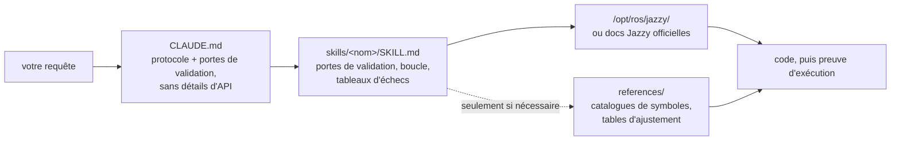

<div align="center">


**Skills Claude Code pour le développement robotique sous ROS 2 Jazzy Jalisco.**

Des skills qui transforment la manière dont les agents IA abordent le développement ROS 2 : identifier les paramètres inconnus dès le départ, vérifier les configurations par rapport aux paquets installés et confirmer l'exécution par des preuves tangibles.


[English](README.md) | [한국어](README.ko.md) | [中文](README.zh.md) | [日本語](README.ja.md) | [Español](README.es.md) | **Français** | [Deutsch](README.de.md)
<sub>🌐 Ce document est une traduction automatique. L'original est en [English](README.md).</sub>

| Skills | Protocole chargé en permanence | Liens doc (vérifiés par CI) | Vérifications sur robot physique | Évaluations : vérifié avant d'écrire |
| :---: | :---: | :---: | :---: | :---: |
| **11** | **26 lignes** | **38** | **4 scripts** | **0/3 → 3/3** |

</div>

---

## Sommaire

- [Les échecs qui coûtent cher](#les-échecs-qui-coûtent-cher)
- [Comment ces skills sont conçus](#comment-ces-skills-sont-conçus)
- [Ce qui le différencie](#ce-qui-le-différencie)
- [Évaluations](#évaluations)
- [Démarrage rapide](#démarrage-rapide)
- [Skills](#skills)
- [Scripts de vérification](#scripts-de-vérification)
- [Fonctionnement](#fonctionnement)
- [Mise à jour](#mise-à-jour)
- [Feuille de route](#feuille-de-route)
- [Contribuer](#contribuer)
- [Licence](#licence)

## Les échecs qui coûtent cher

Les erreurs les plus coûteuses dans le code ROS 2 généré par IA sont rarement des fautes de syntaxe. Il s'agit plutôt de problèmes subtils qui semblent corrects au premier coup d'œil :

| Échec | Ce que vous observez | Pourquoi l'agent rencontre ce problème |
| :--- | :--- | :--- |
| **Échec silencieux** | `ros2 topic hz` indique 30 Hz, mais votre callback ne se déclenche jamais | Un subscriber RELIABLE par défaut tente de se connecter à un publisher BEST_EFFORT. Le code compile et passe la revue de code, mais échoue au niveau du middleware DDS. |
| **Vérité terrain erronée** | `/cmd_vel` indique un déplacement vers l'avant et `/odom` rapporte une avance, mais le robot physique recule | Le repère (frame) TF statique est inversé par rapport au montage physique. Les composants en aval calculent correctement *en utilisant la mauvaise transformation*, sans produire d'erreur évidente. |
| **API obsolète** | Le code passe la revue mais échoue à l'exécution lors de l'appel d'une méthode incorrecte | L'agent utilise des méthodes d'API obsolètes de Foxy ou Humble qui ont été renommées ou supprimées dans Jazzy. |
| **Prémisse invalide** | L'agent écrit 200 lignes de code sur la base d'une hypothèse que vous auriez pu corriger en une seule phrase | Aucun mécanisme n'incite l'agent à vérifier les détails manquants avant de générer du code. |

Ni les compilateurs, ni les linters, ni l'analyse des journaux (logs) ne détectent ces problèmes cachés. Résoudre chaque erreur nécessite un cycle de retour supplémentaire : examiner la sortie, diagnostiquer la cause, expliquer la correction et régénérer le code.

## Comment ces skills sont conçus

Quatre règles de conception régissent chaque skill de ce dépôt :

**1. Identifier les variables inconnues dès le départ.** Les détails opérationnels clés sont souvent absents de la documentation — comme le fait que l'environnement soit un matériel réel ou une simulation, s'il faut étendre un workspace existant ou en créer un nouveau, quel nœud publie déjà une transformation, ou encore la géométrie exacte du robot. [`CLAUDE.md`](./CLAUDE.md) ordonne à l'agent de clarifier ces inconnues avant de générer du code. Les skills spécifiques à un domaine gèrent les paramètres ciblés ; par exemple, `ros2-dev` demande le footprint du robot, la cinématique de déplacement et la source de localisation avant de configurer le moindre paramètre Nav2.

**2. Exécuter une boucle structurée avec des critères de sortie clairs.** Chaque skill suit un cycle *vérifier → écrire → prouver* : inspecter les valeurs par défaut du système sur l'environnement installé, appliquer des modifications incrémentales et confirmer l'exécution. Une tâche ne se termine que lorsqu'elle est étayée par des preuves observées — comme un build réussi, des données actives sur `ros2 topic echo` ou un script de vérification validé — et non en produisant simplement des fichiers de code.

**3. Privilégier les tableaux d'échecs structurés aux longues descriptions.** Les tableaux structurés associant symptômes → causes racines → actions correctives offrent des instructions claires et durables qui manquent souvent dans la documentation officielle et qui restent fiables au fil des versions :

> `[` est GZ→ROS, `]` est ROS→GZ · `16UC1` est en millimètres, `32FC1` est en mètres · `joint_state_broadcaster` n'est pas instancié automatiquement · `raytrace_max_range` ≤ `obstacle_max_range` signifie que les obstacles ne sont jamais effacés · rclc n'alloue pas automatiquement les champs de message non bornés

**4. Optimiser l'utilisation du contexte avec une architecture à trois niveaux.** Chaque skill équilibre l'efficacité du contexte : les descriptions des skills restent dans le contexte, le corps des skills se charge lors de leur appel, et les fichiers de référence approfondis dans `references/` ne se chargent qu'à la demande. Les catalogues de symboles volumineux et les tableaux détaillés d'ajustement de paramètres se trouvent dans `references/`, ce qui garantit la préservation du contexte et évite que le débogage de composants ciblés (comme AMCL) ne charge de la documentation inutile (comme les nœuds d'arbres de comportement).

## Ce qui le différencie

La plupart des packs de skills en robotique intègrent directement des connaissances d'API statiques dans les fichiers de skills. Bien que la prise en main initiale soit simple, cette approche s'effondre lorsque les paquets sous-jacents sont mis à jour — laissant des extraits de code obsolètes qui échouent silencieusement. Ce dépôt adopte une approche dynamique et guidée par la documentation :

| Fonctionnalité | Packs de skills chargés en contenu | **claude-ros2-skills** |
| :--- | :--- | :--- |
| Emplacement des connaissances | Intégré dans les fichiers de skills (**400–1 800 lignes/skill**) | Lié aux documentations officielles (corps de skill de **~60 lignes**) ; références détaillées lues **uniquement si nécessaire** |
| Contexte chargé en permanence | Fichiers `SKILL.md` complets | Protocole central de **26 lignes** |
| Gestion des mises à jour d'API Jazzy | Les extraits deviennent obsolètes discrètement ; nécessite des mises à jour manuelles continues des tests | Le risque d'extraits obsolètes est réduit aux liens de points d'entrée et aux noms de symboles — **38 liens de documentation** vérifiés chaque semaine par CI |
| Méthode de vérification | Analyse statique du code ou vérification des logs | **Vérification physique et à l'exécution** : tests de gravité IMU, tests d'odométrie directionnelle, alignement des repères TF, compatibilité QoS DDS |
| Portée de support | Prétend supporter plusieurs distributions ROS tout en n'en ciblant qu'une seule | **ROS 2 Jazzy uniquement**, conçu et validé explicitement |

Ce dépôt est optimisé dans un unique but : minimiser le risque de générer du code d'apparence plausible mais qui échoue à l'exécution sous ROS 2 Jazzy.

## Évaluations

Pour évaluer les performances, des prompts identiques ont été exécutés dans des sessions Claude Code autonomes (headless) et neuves, avec et sans ces skills installés. Chaque paire a utilisé le même modèle et a été évaluée symbole par symbole par rapport aux dépôts sources ROS 2 Jazzy amont figés.

| Métrique / Test | Sans les skills | Avec les skills |
| :--- | ---: | ---: |
| Clés Nav2 MPPI incorrectes ou fabulées (Haiku) | **~30** — liste `critics:` requise manquante ; la configuration échoue à l'exécution | **~16–20** — chaînes de plugins, `motion_model` et espaces de noms de vérificateurs corrects |
| Le callback `/scan` s'exécute sur un LiDAR physique en BEST_EFFORT (Sonnet) | **Jamais** — échoue silencieusement en raison de valeurs QoS par défaut incompatibles | **Oui** — se connecte avec succès |
| Sessions d'exécution ayant vérifié l'environnement avant d'écrire du code | **0 / 3** | **3 / 3** |

Le changement de comportement est le résultat le plus frappant : les sessions de référence n'ont utilisé **aucun** outil de vérification même lorsqu'ils étaient disponibles, alors que les sessions équipées de ces skills ont chargé les directives pertinentes et vérifié d'abord les paramètres par défaut du système. Lors d'un test, l'agent a posé des questions de clarification clés dès le départ et a explicitement indiqué les paramètres vérifiés par rapport aux hypothèses non contrôlées, évitant ainsi les devinettes sans fondement.

Consultez les tableaux d'évaluation complets, les environnements de test et les analyses de chaque session dans [`evals/RESULTS.md`](./evals/RESULTS.md). Pour plus de détails sur le protocole d'évaluation, les listes de contrôle des tâches et la configuration des conteneurs, consultez [`evals/README.md`](./evals/README.md). Les pull requests contenant des transcriptions évaluées supplémentaires sont les bienvenues.

## Démarrage rapide

**Option A — Marketplace de plugins (Recommandée) :**

```
/plugin marketplace add Leehyunbin0131/claude-ros2-skills
/plugin install claude-ros2-skills@claude-ros2-skills
```

Mettez à jour les plugins installés à tout moment avec `/plugin marketplace update`.

**Option B — Installation manuelle :**

```bash
git clone https://github.com/Leehyunbin0131/claude-ros2-skills.git

# Project-level installation (applies to the current project only)
mkdir -p your-project/.claude/skills
cp -r claude-ros2-skills/skills/* your-project/.claude/skills/
cp claude-ros2-skills/CLAUDE.md your-project/

# User-level installation (applies across all projects)
mkdir -p ~/.claude/skills
cp -r claude-ros2-skills/skills/* ~/.claude/skills/
```

Redémarrez Claude Code (ou démarrez une nouvelle session) pour appliquer les skills installés.

## Skills

| Skill | Chemin | Couverture |
| :--- | :--- | :--- |
| **ros2-core** | `skills/ros2-core/SKILL.md` | rclcpp, rclpy, TF2, odométrie EKF, profils QoS, paramètres |
| **ros2-package** | `skills/ros2-package/SKILL.md` | `ros2 pkg create`, configuration CMakeLists/setup.py, colcon build & source, interfaces personnalisées |
| **ros2-dev** | `skills/ros2-dev/SKILL.md` | Nav2 (AMCL, costmaps, MPPI/Smac), SLAM Toolbox, RTAB-Map, Isaac ROS |
| **gazebo-sim** | `skills/gazebo-sim/SKILL.md` | Gazebo Harmonic, ros_gz_bridge, ros_gz_sim, modélisation SDFormat |
| **ros2-control** | `skills/ros2-control/SKILL.md` | Abstraction matérielle ros2_control, gestionnaire de contrôleurs, balises URDF |
| **ros2-moveit** | `skills/ros2-moveit/SKILL.md` | MoveIt 2, API C++/Python MoveGroup, solveurs cinématique inverse (IK), OMPL, MoveIt Servo |
| **ros2-perception** | `skills/ros2-perception/SKILL.md` | image_transport, cv_bridge, vision_msgs, depth_image_proc, PCL |
| **ros2-testing** | `skills/ros2-testing/SKILL.md` | launch_testing, gtest/pytest, API C++/Python rosbag2, ros2trace |
| **ros2-microros** | `skills/ros2-microros/SKILL.md` | Agent micro-ROS, API client rclc, transports personnalisés, mémoire statique |
| **ros2-security** | `skills/ros2-security/SKILL.md` | SROS2, génération de trousseau de clés (keystore) PKI, contrôle d'accès, sécurité DDS |
| **ros2-troubleshooting** | `skills/ros2-troubleshooting/SKILL.md` | Arbre TF vérité terrain REP 103/105, alignement LiDAR/IMU, vérification physique |

## Scripts de vérification

Ces scripts de vérification sont intégrés dans le skill `ros2-troubleshooting` (`skills/ros2-troubleshooting/scripts/`) et sont inclus avec chaque installation. Ils transforment les vérifications du matériel physique en étapes d'exécutions réussies/échouées (nécessite un environnement ROS 2 sourcé ; codes de retour : 0 = PASS, 1 = FAIL, 2 = NO DATA) :

| Script | Vérifie |
| :--- | :--- |
| `check_imu_gravity.py` | Valide qu'un robot au repos mesure une gravité d'environ +9,81 m/s² le long de l'axe **+Z** (REP 103). Détecte les montages d'IMU inversés ou mal alignés. |
| `check_odom_direction.py` | Valide que le fait de pousser le robot vers l'avant produit un déplacement d'odométrie positif le long de son cap. Détecte les directions de moteur inversées, les problèmes de polarité des encodeurs ou les configurations TF inversées. |
| `check_tf_tree.py` | Vérifie que `map→odom→base_link` se résout correctement ; affiche le décalage de montage de chaque capteur en degrés RPY et met en évidence les erreurs d'orientation potentielles de 180°. |
| `check_qos_compat.py` | Vérifie la compatibilité QoS sur toutes les paires publisher/subscriber d'un topic en utilisant les règles DDS. Évite les échecs silencieux (tels qu'un publisher BEST_EFFORT associé à un subscriber RELIABLE, ou des incompatibilités de durabilité, de délai limite (deadline) et de réactivité (liveliness)). |

La logique de décision centrale fait l'objet de tests unitaires indépendamment de ROS (`python3 skills/ros2-troubleshooting/scripts/test_checks.py`) et s'exécute via l'intégration continue (CI) à chaque push.

## Fonctionnement



`CLAUDE.md` ne contient aucun détail d'API spécifique. À la place, il établit le protocole opérationnel et exige de répondre à des questions de clarification avant d'écrire du code. Chaque fichier `SKILL.md` gère les décisions spécifiques à un domaine : identifier les variables inconnues, exécuter la boucle vérifier-écrire-prouver et se référer aux tableaux d'échecs. Les documents de référence détaillés sont stockés séparément dans le répertoire `references/`. Consultez [`CLAUDE.md`](./CLAUDE.md) pour plus de détails.

## Mise à jour

```bash
cd claude-ros2-skills
git pull
cp -r skills/* ~/.claude/skills/   # or your project's .claude/skills/
```

## Feuille de route

1. **Automatiser les paires d'évaluation au sein de conteneurs `ros:jazzy`** afin d'établir une référence d'installation en direct — voir les détails de configuration du conteneur dans [`evals/README.md`](./evals/README.md).
2. **Publier les résultats d'évaluation de la tâche 5** — validation des performances à l'exécution avec des résultats binaires (confirmation que `ros2 topic echo` affiche des données) à travers les builds de `ros2-package` et les cycles de sourcing du workspace.
3. **Suivre les « corrections jusqu'à l'achèvement » comme métrique clé** — mesure du nombre d'itérations de retour nécessaires avant que le code ne s'exécute avec succès.
4. **Implémenter des recherches déterministes dans `references/`** afin de garantir que les documents de référence détaillés se chargent chaque fois qu'ils sont pertinents.
5. **Étendre la séparation corps/`references`** à `ros2-core` et `gazebo-sim`, optimisant l'efficacité du contexte pour les skills à haute fréquence disposant d'une documentation de référence conséquente.

## Contribuer

Résumé : Les fichiers de skill doivent se concentrer sur la logique de décision (portes de validation, étapes de boucle et tableaux d'échecs), tandis que la documentation détaillée reste dans `references/`. Chaque symbole d'API doit être vérifié par rapport à la documentation officielle de Jazzy ou aux installations sous `/opt/ros/jazzy/`. Les scripts de vérification doivent conserver une logique pure pouvant faire l'objet de tests unitaires sans dépendances ROS. Pour obtenir l'ensemble des directives, les listes de contrôle des skills et des scripts, ainsi que les modèles d'tickets (issues), consultez [`CONTRIBUTING.md`](./CONTRIBUTING.md).

## Licence

Apache-2.0 — voir [LICENSE](./LICENSE).
