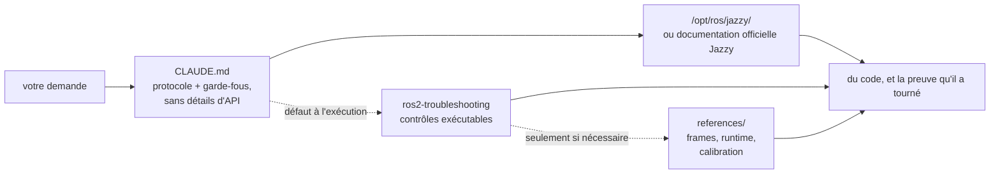

<div align="center">


**Claude Code Skills for ROS 2 Jazzy Jalisco robotics development.**

Des skills qui transforment la façon dont les agents IA abordent le développement ROS 2 : identifier les paramètres inconnus en amont, vérifier la configuration contre les paquets installés, et confirmer l'exécution par des preuves de fonctionnement réel.


[English](README.md) | [한국어](README.ko.md) | [中文](README.zh.md) | [日本語](README.ja.md) | [Español](README.es.md) | **Français** | [Deutsch](README.de.md)

<sub>🌐 Ce document est une traduction automatique. L'original est en [English](README.md).</sub>

| Skills | Protocole chargé en permanence | Liens de doc (vérifiés par CI) | Contrôles sur robot physique |
| :---: | :---: | :---: | :---: |
| **2** | **30 lignes** | **6** | **4 scripts** |

</div>

---

## Sommaire

- [Les échecs qui coûtent cher](#les-échecs-qui-coûtent-cher)
- [Comment ces skills sont conçus](#comment-ces-skills-sont-conçus)
- [Ce qui le différencie](#ce-qui-le-différencie)
- [Évaluations](#évaluations)
- [Démarrage rapide](#démarrage-rapide)
- [Skills](#skills)
- [Scripts de vérification](#scripts-de-vérification)
- [Fonctionnement](#fonctionnement)
- [Mise à jour](#mise-à-jour)
- [Contribuer](#contribuer)
- [Licence](#licence)

## Les échecs qui coûtent cher

Les erreurs les plus coûteuses dans le code ROS 2 généré par IA sont rarement des fautes de syntaxe. Ce sont des problèmes subtils qui semblent corrects au premier coup d'œil :

| Échec | Ce que vous voyez | Pourquoi un agent y tombe |
| :--- | :--- | :--- |
| **Incompatibilité du middleware** | `ros2 topic hz` affiche 30 Hz ; votre callback ne se déclenche jamais | Un abonné RELIABLE par défaut ne peut pas s'apparier à un publieur BEST_EFFORT. Le code compile, passe la revue, et échoue sous la couche applicative. rclpy avertit bien — `offering incompatible QoS ... Last incompatible policy: RELIABILITY` — mais uniquement à l'exécution, dans le log de démarrage, pour qui le lit. |
| **Mauvaise référence** | `/cmd_vel` commande une marche avant et `/odom` rapporte une marche avant, mais le robot physique recule | Le frame TF statique est inversé par rapport au montage physique. Les composants en aval calculent correctement *en utilisant la mauvaise transformation*, sans produire d'erreur visible. |
| **API obsolète** | Le code passe la revue mais échoue à l'exécution en appelant une méthode incorrecte | L'agent utilise des méthodes Foxy ou Humble renommées ou supprimées dans Jazzy. |
| **Prémisse invalide** | L'agent écrit 200 lignes sur la base d'une hypothèse que vous auriez corrigée en une phrase | Rien n'oblige l'agent à vérifier les détails manquants avant de générer du code. |

Ni les compilateurs, ni les linters, ni l'analyse des logs ne détectent ces problèmes cachés. Résoudre chacun d'eux exige un cycle de retour supplémentaire : examiner la sortie, diagnostiquer la cause, expliquer la correction, régénérer.

## Comment ces skills sont conçus

Quatre règles de conception régissent chaque skill de ce dépôt :

**1. Identifier les variables inconnues en amont.** Des détails opérationnels essentiels ne figurent souvent pas dans la documentation — l'environnement est-il du matériel réel ou une simulation, faut-il étendre un workspace existant ou en créer un nouveau, quel nœud publie déjà une transformation, quelle est la géométrie précise du robot. [`CLAUDE.md`](./CLAUDE.md) demande à l'agent de clarifier ces inconnues avant de générer du code.

**2. Exécuter une boucle structurée avec des critères de sortie clairs.** Le cycle *vérifier → écrire → prouver* : inspecter les valeurs par défaut dans l'environnement installé, appliquer des changements incrémentaux, puis confirmer l'exécution. Une tâche n'est achevée que lorsqu'elle est étayée par une preuve observée — une compilation réussie, des données réelles sur `ros2 topic echo`, un script de vérification qui passe — et non par la seule production de fichiers de code.

**3. Ne rien dire que le modèle sache déjà ou que `CLAUDE.md` dise déjà.** Chaque tableau symptôme→cause→action que ce pack a livré a été mesuré face à un agent de référence sans aucun skill chargé. **Aucun n'a fait bouger la moindre vérification** : soit le modèle atteint déjà ces mécanismes sans aide, soit le correctif était un script fourni ou un paragraphe de `CLAUDE.md`, jamais de la prose décrivant le domaine. Voir [Évaluations](#évaluations).

**4. Pointer vers un artefact exécutable, jamais le décrire.** Le seul contenu de ce pack dont on ait démontré qu'il change un résultat est un script avec un code de sortie (`scripts/check_*.py`, fourni dans `ros2-troubleshooting`). Un paragraphe *décrivant* ce que ce script vous dirait n'a rien fait bouger ; seule son exécution l'a fait.

## Ce qui le différencie

La plupart des packs de skills robotiques intègrent des connaissances d'API statiques directement dans les fichiers de skill. L'usage initial est simple, mais cette approche se casse dès que les paquets sous-jacents évoluent — laissant des extraits obsolètes qui échouent silencieusement. Ce dépôt adopte une approche dynamique, guidée par la documentation :

| Caractéristique | Packs de skills riches en contenu | **claude-ros2-skills** |
| :--- | :--- | :--- |
| Emplacement du savoir | Intégré aux fichiers de skill (**400–1 800 lignes par skill**) | Lié à la documentation officielle (corps de skill d'**~60 lignes**) ; les références détaillées ne sont lues **qu'en cas de besoin** |
| Contexte chargé en permanence | Fichiers `SKILL.md` complets | Protocole central de **30 lignes** |
| Gestion des évolutions d'API Jazzy | Les extraits deviennent obsolètes en silence ; mise à jour manuelle continue nécessaire | Le risque d'obsolescence se limite aux liens d'entrée et aux noms de symboles — **6 liens de documentation** vérifiés chaque semaine par la CI |
| Méthode de vérification | Analyse statique du code ou lecture des logs | **Vérification physique et à l'exécution** : contrôle de gravité de l'IMU, test directionnel d'odométrie, alignement des frames TF, compatibilité QoS DDS |
| Portée de distribution | Annonce le support de plusieurs distributions ROS tout en n'en visant qu'une | **ROS 2 Jazzy uniquement**, par conception — sans le « ça marche aussi sur Humble » |

Ce dépôt optimise un seul résultat : minimiser le risque de générer du code plausible en apparence mais qui ne s'exécute pas sur ROS 2 Jazzy.

## Évaluations

**Le critère.** Un skill ne gagne sa place que s'il apporte quelque chose que l'agent **ne peut pas atteindre seul** — alors qu'il dispose déjà de ses propres connaissances, de la recherche web et d'une installation Jazzy réelle sous les yeux. Un texte qui ne fait que dire à l'agent ce qu'il aurait fait de toute façon est un coût sans bénéfice.

**Comment c'est mesuré.** Une tâche réelle dans un conteneur propre, dix exécutions avec l'élément testé et dix sans, évaluées en *exécutant* ce qui est sorti — une compilation, un topic qui porte des données, un code de sortie — jamais en le lisant. Test exact de Fisher, correction de Benjamini–Hochberg sur l'ensemble de la série.

**Ce que cela a tranché.** Huit domaines ont été passés sur une échelle à trois barreaux — 24 barreaux au total, chacun ajoutant un mécanisme nommé et évalué par une vérification qui exécute l'artefact. L'agent de référence a atteint **tous les mécanismes qui lui étaient demandés** :

| Domaine | L1 → L2 → L3, mécanismes ajoutés par barreau | Sans aide |
| :--- | :--- | ---: |
| Packaging et compilation | `ament_python`/`ament_cmake` → `.srv` inter-paquets → nœud composable + `colcon test` | **190/190** |
| Simulation | Monde SDF + traction différentielle → `ros_gz_bridge` + `gpu_lidar` → spawn URDF + `use_sim_time` | **108/110** |
| Exécuteurs | Service de 1 s depuis un timer → depuis un callback d'abonnement + heartbeat → 5 appels concurrents | **110/110** |
| `ros2_control` | Matériel simulé + broadcaster → second contrôleur réclamant des interfaces → **plugin `SystemInterface` C++ maison** | **90/90** |
| Tests | pytest que `colcon test` exécute réellement → `launch_testing` sur un nœud vivant → rosbag2 enregistré puis relu | **110/110** |
| MoveIt 2 | URDF+SRDF écrits à la main chargés par `move_group` → vrai `GetMotionPlan` → objet de collision dans la scène de planification | **100/100** |
| Cœur | TF statique piloté par paramètres → TF dynamique + `ExtrapolationException` → nœud lifecycle silencieux jusqu'à activation | **110/110** |
| Nav2 | Fichier de paramètres accepté tel quel par les serveurs → pile amenée jusqu'à `active` → costmap marquant les obstacles depuis un scan en direct | voir ci-dessous |
| Perception | Aller-retour `cv_bridge` → projection `CameraInfo` → profondeur 16UC1 → `PointCloud2` | **106/120** |

**Aucun échec n'a été comblé en fournissant de l'information.** Quatre lacunes ont été trouvées, toutes comportementales :

| Ce que le modèle ne fait pas seul | Référence | Ce qui l'a comblé | Après |
| :--- | ---: | :--- | ---: |
| Vérifier contre l'installation au lieu de répondre de mémoire | **2/10** | un paragraphe de `CLAUDE.md` | **10/10** (q=0,002) |
| Produire un verdict avec code de sortie plutôt qu'un « ça a l'air correct » | **0/10** | un script exécutable fourni | **10/10** (q<0,001) |
| Exécuter le code QoS qu'il écrit avant de le livrer | **5/10** | le « terminé veut dire exécuté » de `CLAUDE.md` | **9/10** (puissance insuffisante) |
| Exécuter la configuration Nav2 qu'il écrit avant de la livrer | **0/10** | une tâche qui exige d'atteindre `active` | **30/30** |

La dernière ligne est le résultat le plus net ici. À la demande d'un fichier de paramètres Nav2, 10 cellules sur 10 en ont écrit un que **leurs propres serveurs refusent de configurer**. À la demande du même fichier *et* d'une pile atteignant `active`, chaque cellule a rencontré exactement la même erreur, l'a diagnostiquée depuis le log, l'a corrigée et a réussi. **Même modèle, même croyance erronée, aucune différence d'information** — seule l'exigence d'exécuter change.

**Conséquence pour ce pack.** Six skills de domaine ont été supprimés intégralement, en plus des deux supprimés auparavant : le modèle atteint déjà leur contenu, et aucune prose de ce dépôt n'a jamais fait bouger une vérification. Il reste un protocole de 30 lignes, quatre scripts exécutables et le matériel de référence qui les soutient. Méthode, résultats par domaine et chaque exécution brute : [`evals/`](./evals/).

## Démarrage rapide

**Option A — Marketplace de plugins (recommandé) :**

```
/plugin marketplace add Leehyunbin0131/claude-ros2-skills
/plugin install claude-ros2-skills@claude-ros2-skills
```

Mettez à jour les plugins installés à tout moment avec `/plugin marketplace update`.

**Option B — Installation manuelle :**

```bash
git clone https://github.com/Leehyunbin0131/claude-ros2-skills.git

# Installation au niveau du projet (s'applique au projet courant uniquement)
mkdir -p your-project/.claude/skills
cp -r claude-ros2-skills/skills/* your-project/.claude/skills/
cp claude-ros2-skills/CLAUDE.md your-project/

# Installation au niveau utilisateur (s'applique à tous les projets)
mkdir -p ~/.claude/skills
cp -r claude-ros2-skills/skills/* ~/.claude/skills/
```

Redémarrez Claude Code (ou ouvrez une nouvelle session) pour appliquer les skills installés.

## Skills

| Skill | Chemin | Couverture |
| :--- | :--- | :--- |
| **ros2-troubleshooting** | `skills/ros2-troubleshooting/SKILL.md` | Quatre contrôles exécutables réussite/échec — compatibilité QoS, arbre TF, montage de l'IMU, direction de l'odométrie — plus les conventions de frames REP 103/105, le comportement à l'exécution de Jazzy et l'étalonnage d'odométrie sur matériel qui les sous-tendent |
| **ros2-microros** | `skills/ros2-microros/SKILL.md` | Agent micro-ROS, API cliente rclc, transports personnalisés, mémoire statique |

**Pourquoi seulement deux.** Tous les autres skills ont été mesurés face à un agent de référence sans skill chargé, puis supprimés dès lors que l'agent produisait le même résultat sans eux — `ros2-core`, `ros2-dev`, `ros2-control`, `ros2-moveit`, `ros2-perception`, `ros2-testing`, `ros2-package` et `gazebo-sim`, dans cet ordre de mesure. `ros2-microros` est le seul domaine sans échelle : le matériel nécessaire pour en exécuter une n'est pas disponible ici, il est donc conservé et **n'est pas déclaré vérifié**. Voir [Évaluations](#évaluations).

## Scripts de vérification

Ces scripts sont fournis dans le skill `ros2-troubleshooting` (`skills/ros2-troubleshooting/scripts/`) et livrés avec chaque installation. Ils convertissent des contrôles matériels physiques en étapes de vérification exécutables réussite/échec (nécessite un environnement ROS 2 sourcé ; codes de retour : 0 = RÉUSSITE, 1 = ÉCHEC, 2 = AUCUNE DONNÉE) :

| Script | Vérifie |
| :--- | :--- |
| `check_imu_gravity.py` | Qu'un robot au repos mesure la gravité à ~+9,81 m/s² selon l'axe **+Z** (REP 103). Détecte les montages d'IMU inversés ou désalignés. |
| `check_odom_direction.py` | Que pousser le robot vers l'avant produise un déplacement d'odométrie positif le long de son cap. Détecte les sens moteurs inversés, les problèmes de polarité d'encodeur ou les configurations TF inversées. |
| `check_tf_tree.py` | Que `map→odom→base_link` se résolve correctement ; affiche l'offset de montage de chaque capteur en degrés RPY et signale les erreurs d'orientation à 180° possibles. |
| `check_qos_compat.py` | La compatibilité QoS de toutes les paires publieur/abonné d'un topic selon les règles DDS. Prévient les échecs silencieux (publieur BEST_EFFORT associé à un abonné RELIABLE, ou incompatibilités de durability, deadline et liveliness). |

La logique de décision centrale est testée unitairement indépendamment de ROS (`python3 skills/ros2-troubleshooting/scripts/test_checks.py`) et s'exécute via l'intégration continue (CI) à chaque push.

## Fonctionnement



`CLAUDE.md` ne contient aucun détail d'API spécifique. Il établit le protocole opérationnel : vérifier contre l'installation, fixer d'abord les inconnues qu'aucune documentation ne peut fournir, et ne considérer une tâche terminée que lorsqu'on a observé quelque chose s'exécuter. Le savoir de domaine qu'il porterait autrement est laissé au modèle et à l'installation, car c'est là que la mesure l'a situé. `ros2-troubleshooting` n'intervient que lorsqu'un système journalise normalement et ne fonctionne pas, et il répond par un code de sortie plutôt que par un paragraphe. Voir [`CLAUDE.md`](./CLAUDE.md) pour le détail.

## Mise à jour

```bash
cd claude-ros2-skills
git pull
cp -r skills/* ~/.claude/skills/   # ou le .claude/skills/ de votre projet
```

## Contribuer

Résumé : tout nouveau contenu de skill doit gagner sa place face à un agent de référence qui ne l'a pas — une tâche réelle, dix exécutions par condition, évaluées en exécutant la sortie. Le contenu que l'agent produit sans aide n'est pas ajouté, aussi correct soit-il. Les scripts de vérification doivent garder une logique de décision pure afin de pouvoir être testés unitairement sans ROS. Pour le protocole de mesure, les check-lists et les modèles d'issues, voir [`CONTRIBUTING.md`](./CONTRIBUTING.md).

## Licence

Apache-2.0 — voir [LICENSE](./LICENSE).
