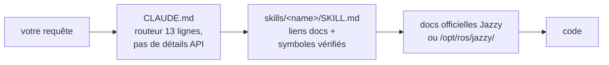

<div align="center">


**Claude Code Skills pour le développement robotique ROS 2 Jazzy Jalisco.**

Skills de référence anti-hallucination — chaque skill route vers la documentation officielle au lieu de deviner les noms d'API.


[English](README.md) | [한국어](README.ko.md) | [中文](README.zh.md) | [日本語](README.ja.md) | [Español](README.es.md) | **Français** | [Deutsch](README.de.md)

<sub>🌐 Ce document est une traduction automatique. L'original est en [English](README.md).</sub>

| Skills | Routeur toujours chargé | Liens doc (vérifiés par CI) | Vérifications physiques du robot | Évals : paramètres hallucinés |
| :---: | :---: | :---: | :---: | :---: |
| **11** | **13 lignes** | **38** | **4 scripts** | **21 → 0** |

</div>

---

## Sommaire

- [Pourquoi ce dépôt existe](#pourquoi-ce-dépôt-existe)
- [Ce qui le différencie](#ce-qui-le-différencie)
- [Évaluations](#évaluations)
- [Démarrage rapide](#démarrage-rapide)
- [Skills](#skills)
- [Scripts de vérification](#scripts-de-vérification)
- [Fonctionnement](#fonctionnement)
- [Mise à jour](#mise-à-jour)
- [Contribuer](#contribuer)
- [Licence](#licence)

## Pourquoi ce dépôt existe

Les logs prouvent qu'un système est *cohérent*, jamais qu'il est *correct* — et un agent n'a par défaut aucune raison de se méfier d'une histoire cohérente. Deux modes de défaillance reviennent sans cesse :

| Mode de défaillance | À quoi ça ressemble | Cause réelle |
| :--- | :--- | :--- |
| **Vérité terrain erronée** | `/cmd_vel` dit avant, `/odom` dit avant, tout semble sain — le robot roule **en arrière** | TF statique déclaré inversé par rapport au montage physique réel ; tout ce qui suit calcule correctement *à partir de cette transformation erronée*, donc rien ne se contredit jamais |
| **Mauvaise époque** | Le code passe la revue, meurt à l'exécution sur une méthode qui « sonne juste » | L'agent code à partir de données d'entraînement mémorisées de l'ère Foxy/Humble ; l'API a été renommée ou n'a jamais existé sur Jazzy |

Les deux viennent de la confiance accordée à ce qui *semble* faire autorité au lieu de vérifier la vérité terrain. `ros2-troubleshooting` impose des vérifications physiques (pousser le robot, faire un echo du TF brut, confirmer la gravité de l'IMU) avant de faire confiance à un topic. Chaque autre skill applique la même règle au code : vérifier les noms de classes, les messages et les flags contre la documentation officielle Jazzy ou `/opt/ros/jazzy/` — jamais de mémoire.

## Ce qui le différencie

La plupart des packs de skills robotiques figent la connaissance des API dans les fichiers de skill. Dès que l'écosystème bouge, chaque snippet figé devient un fait qui peut pourrir en silence. Ce dépôt fait le pari inverse :

| | Packs de skills riches en contenu | **claude-ros2-skills** |
| :--- | :--- | :--- |
| Où vit la connaissance | figée dans les fichiers de skill, **400–1 800 lignes/skill** | routée vers la doc officielle, **45–130 lignes/skill** |
| Contexte toujours chargé | SKILL.md complet | routeur de **13 lignes** |
| Quand une API Jazzy change | les snippets pourrissent en silence ; tests de régression de la doc pour toujours | la surface de pourrissement se réduit aux liens + noms de symboles — **38 liens** vérifiés chaque semaine par CI (vitalité seulement), lien mort = build cassé |
| Vérification | statique / basée sur les logs | **physique** : gravité IMU, test de poussée, montages TF vs matériel réel, matching QoS DDS |
| Annonce de distribution | « couvre 4 distributions » sur des exemples qui n'en visent qu'une | **Jazzy uniquement**, annoncé d'emblée |

Le compromis, dit clairement : pour les sujets où la documentation officielle est mince (tuning des vendors DDS, internals de PREEMPT_RT), un pack riche en contenu peut mieux vous servir. Ce dépôt optimise une seule chose — la probabilité la plus faible de code à l'air plausible qui ne tourne pas sur Jazzy.

## Évaluations

Mesuré, pas affirmé — avec une réserve déclarée : les exécutions et la notation ont été réalisées par la session d'agent de l'auteur du dépôt, pas par une partie indépendante. Tous les artefacts sont commités pour permettre une re-notation par des tiers. Des prompts identiques ont tourné dans des sessions headless Claude Code neuves avec et sans les skills installés (même modèle par paire) ; les sorties ont été notées symbole par symbole contre les sources Jazzy épinglées.

| Résultat | Sans skills | Avec skills |
| :--- | ---: | ---: |
| Paramètres MPPI Nav2 inventés/faux (haiku) | **21** — Nav2 meurt au démarrage | **0** |
| Paramètres MPPI Nav2 inventés/faux (sonnet) | 0 *(rappel non vérifié)* | **0** *(vérifié en direct)* |
| Callback `/scan` déclenché sur un vrai LiDAR BEST_EFFORT (sonnet) | **jamais** — mauvais QoS par défaut, en silence | **oui** |
| Exécutions ayant vérifié avant d'écrire | **0 / 3** | **3 / 3** |


Tableaux de notation complets, conditions et chaque artefact généré : [`evals/RESULTS.md`](./evals/RESULTS.md) · protocole et checklists : [`evals/README.md`](./evals/README.md) — n=1 par cellule pour l'instant ; les PRs ajoutant des transcriptions notées sont les bienvenues.

<details>
<summary>Ce que signifient ces chiffres</summary>

Deux patterns qui méritent un nom : avec un modèle puissant, les skills transforment « probablement juste » en « vérifié juste » ; avec un modèle plus petit, ils font la différence entre une config qui ne peut pas démarrer et la bonne. Et dans une exécution où les outils de vérification étaient indisponibles, l'agent avec skills a **refusé d'émettre des paramètres non vérifiés** plutôt que de deviner — la baseline n'a même pas remarqué qu'elle n'avait rien vérifié.

</details>

## Démarrage rapide

**Option A — marketplace de plugins (recommandé) :**

```
/plugin marketplace add Leehyunbin0131/claude-ros2-skills
/plugin install claude-ros2-skills@claude-ros2-skills
```

Les mises à jour arrivent avec `/plugin marketplace update`.

**Option B — copie manuelle :**

```bash
git clone https://github.com/Leehyunbin0131/claude-ros2-skills.git

# Niveau projet (ce projet uniquement)
mkdir -p your-project/.claude/skills
cp -r claude-ros2-skills/skills/* your-project/.claude/skills/
cp claude-ros2-skills/CLAUDE.md your-project/

# OU niveau utilisateur (tous les projets)
mkdir -p ~/.claude/skills
cp -r claude-ros2-skills/skills/* ~/.claude/skills/
```

Redémarrez Claude Code (ou démarrez une nouvelle session) pour charger les skills.

## Skills

| Skill | Chemin | Couverture |
| :--- | :--- | :--- |
| **ros2-core** | `skills/ros2-core/SKILL.md` | rclcpp, rclpy, TF2, odométrie EKF, profils QoS, paramètres |
| **ros2-package** | `skills/ros2-package/SKILL.md` | `ros2 pkg create`, câblage CMakeLists/setup.py, colcon build et source, interfaces personnalisées |
| **ros2-dev** | `skills/ros2-dev/SKILL.md` | Nav2 (AMCL, costmaps, MPPI/Smac), SLAM Toolbox, RTAB-Map, Isaac ROS |
| **gazebo-sim** | `skills/gazebo-sim/SKILL.md` | Gazebo Harmonic, ros_gz_bridge, ros_gz_sim, modélisation SDFormat |
| **ros2-control** | `skills/ros2-control/SKILL.md` | Abstraction matérielle ros2_control, controller manager, balises URDF |
| **ros2-moveit** | `skills/ros2-moveit/SKILL.md` | MoveIt 2, API MoveGroup C++/Python, solveurs IK, OMPL, MoveIt Servo |
| **ros2-perception** | `skills/ros2-perception/SKILL.md` | image_transport, cv_bridge, vision_msgs, depth_image_proc, PCL |
| **ros2-testing** | `skills/ros2-testing/SKILL.md` | launch_testing, gtest/pytest, APIs rosbag2 C++/Python, ros2trace |
| **ros2-microros** | `skills/ros2-microros/SKILL.md` | micro-ROS Agent, API client rclc, transports personnalisés, mémoire statique |
| **ros2-security** | `skills/ros2-security/SKILL.md` | SROS2, génération de keystore PKI, contrôle d'accès, DDS Security |
| **ros2-troubleshooting** | `skills/ros2-troubleshooting/SKILL.md` | Arbre TF vérité terrain REP 103/105, alignement LiDAR/IMU, anti-hallucination |

## Scripts de vérification

Embarqués dans le skill `ros2-troubleshooting` (`skills/ros2-troubleshooting/scripts/`), ils suivent donc n'importe quelle installation. Ils transforment les vérifications physiques en faits exécutables pass/fail (nécessite un environnement ROS 2 sourcé ; chacun sort avec 0 = PASS, 1 = FAIL, 2 = pas de données) :

| Script | Vérifie |
| :--- | :--- |
| `check_imu_gravity.py` | Robot au repos → la gravité est ~+9,81 m/s² sur **+Z** (REP 103). Détecte les IMU montés à l'envers ou tournés. |
| `check_odom_direction.py` | Poussez le robot vers l'avant → le déplacement d'odométrie est positif le long de son cap. Détecte les moteurs, encodeurs ou TF inversés. |
| `check_tf_tree.py` | `map→odom→base_link` se résout ; imprime chaque montage de capteur en degrés RPY et signale les déclarations à ~180° pour comparaison avec le montage physique. |
| `check_qos_compat.py` | Chaque paire éditeur/souscripteur d'un topic est compatible QoS selon les règles de matching DDS. Détecte l'échec silencieux « le topic affiche 30 Hz mais mon callback ne se déclenche jamais » (pub BEST_EFFORT vs sub RELIABLE, et désaccords durability/deadline/liveliness). |

La logique de décision pure est testée unitairement sans ROS (`python3 skills/ros2-troubleshooting/scripts/test_checks.py`) et tourne en CI à chaque push.

## Fonctionnement



`CLAUDE.md` n'inline jamais de détails d'API — il ne fait que router. Chaque `SKILL.md` est un catalogue léger de liens vers la documentation officielle plus les noms exacts de classes/messages/paramètres, pour que Claude vérifie au lieu de deviner. Voir [`CLAUDE.md`](./CLAUDE.md).

## Mise à jour

```bash
cd claude-ros2-skills
git pull
cp -r skills/* ~/.claude/skills/   # ou le .claude/skills/ de votre projet
```

## Contribuer

Version courte — les skills restent des catalogues de liens docs (pas des tutoriels), chaque symbole est vérifié contre la documentation Jazzy ou `/opt/ros/jazzy/`, les scripts gardent leur logique pure testable sans ROS. Règles complètes, checklists skills/scripts et modèles d'issues : [`CONTRIBUTING.md`](./CONTRIBUTING.md).

## Licence

Apache-2.0 — voir [LICENSE](./LICENSE).
