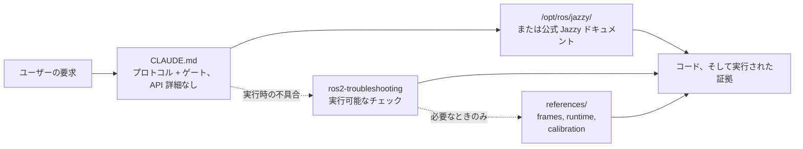

<div align="center">


**Claude Code Skills for ROS 2 Jazzy Jalisco robotics development.**

AI エージェントの ROS 2 開発の進め方を変えるスキル群：不明なパラメータを事前に特定し、設定をインストール済みパッケージと照合し、実際に動作した証拠によって実行を確認します。


[English](README.md) | [한국어](README.ko.md) | [中文](README.zh.md) | **日本語** | [Español](README.es.md) | [Français](README.fr.md) | [Deutsch](README.de.md)

<sub>🌐 本ドキュメントは機械翻訳です。原文は [English](README.md) をご覧ください。</sub>

| スキル数 | 常時読み込みプロトコル | ドキュメントリンク（CI検証済み） | 実機ロボット検証 |
| :---: | :---: | :---: | :---: |
| **2** | **30行** | **6** | **4スクリプト** |

</div>

---

## 目次

- [コストのかかる失敗](#コストのかかる失敗)
- [このスキルの設計原則](#このスキルの設計原則)
- [何が違うのか](#何が違うのか)
- [実測評価](#実測評価)
- [クイックスタート](#クイックスタート)
- [スキル一覧](#スキル一覧)
- [検証スクリプト](#検証スクリプト)
- [仕組み](#仕組み)
- [更新](#更新)
- [コントリビュート](#コントリビュート)
- [ライセンス](#ライセンス)

## コストのかかる失敗

AI が生成した ROS 2 コードで最も高くつく誤りは、構文ミスであることはほとんどありません。一見正しく見える、微妙な問題です：

| 失敗 | 表面上の症状 | エージェントがこの問題に陥る理由 |
| :--- | :--- | :--- |
| **ミドルウェアの不整合** | `ros2 topic hz` は 30 Hz を示すのにコールバックが一度も発火しない | デフォルトの RELIABLE サブスクライバは BEST_EFFORT パブリッシャとマッチできません。コンパイルは通り、レビューも通り、アプリケーションより下の層で失敗します。rclpy は警告を出します — `offering incompatible QoS ... Last incompatible policy: RELIABILITY` — ただし実行時に、起動ログの中で、それを読む人にだけ。 |
| **誤った基準座標** | `/cmd_vel` は前進を指示し `/odom` も前進を報告しているのに、実機は**後退**する | 静的 TF フレームが実際の取り付け方向と反転しています。下流のコンポーネントは*誤った変換を使って*正しく計算するため、明白なエラーが出ません。 |
| **古い API** | レビューは通るが、誤ったメソッドを呼び出して実行時に失敗する | Jazzy でリネームまたは削除された Foxy / Humble の API を使用しています。 |
| **前提の誤り** | 一文で訂正できたはずの仮定に基づいて 200 行のコードを書く | コード生成前に不足情報を確認させる仕組みがありません。 |

コンパイラもリンタもログ解析も、これらの隠れた問題を検出しません。一つ解決するたびに追加のフィードバックサイクルが必要です：出力の確認、原因の診断、修正の説明、再生成。

## このスキルの設計原則

このリポジトリのすべてのスキルは、4 つの設計原則に従います：

**1. 不明な変数を事前に特定する。** 実機かシミュレーションか、既存のワークスペースを拡張するか新規作成するか、どのノードが既にトランスフォームをパブリッシュしているか、ロボットの正確な形状はどうか — こうした重要な運用上の詳細は、ドキュメントに存在しないことが多くあります。[`CLAUDE.md`](./CLAUDE.md) は、コードを生成する前にこれらの不明点を明確にするようエージェントに指示します。

**2. 終了条件の明確なループを実行する。** *検証 → 記述 → 証明* のサイクル：インストール済み環境でシステムのデフォルトを確認し、段階的に変更を適用し、実行を確認します。コードファイルを生成しただけでは完了ではなく、ビルドの成功、`ros2 topic echo` に流れる実データ、検証スクリプトの通過といった観測された証拠に裏付けられて初めてタスクが完了します。

**3. モデルが既に知っていること、`CLAUDE.md` が既に述べていることは書かない。** このパックがこれまで出荷したすべての「症状→原因→対処」表を、スキル未読み込みのベースラインエージェントと対照して測定しました。**一つとしてチェックを動かしませんでした** — モデルは既に無支援でそのメカニズムに到達しているか、あるいは解決策が同梱スクリプトか `CLAUDE.md` の一段落であって、ドメインを説明する散文ではありませんでした。[実測評価](#実測評価)を参照。

**4. 実行可能な成果物を指し示し、それを説明しない。** このパックで結果を変えたと確認された唯一のコンテンツは、終了コードを返すスクリプトです（`ros2-troubleshooting` に同梱の `scripts/check_*.py`）。そのスクリプトが何を教えてくれるかを*説明する*段落は何も動かしませんでした。動かしたのは実行だけです。

## 何が違うのか

多くのロボティクススキルパックは、静的な API 知識をスキルファイル内に直接埋め込みます。初期の使用は容易ですが、下位パッケージが更新されると破綻します — 静かに失敗する古いスニペットが残るためです。このリポジトリは動的でドキュメント駆動のアプローチを採ります：

| 項目 | コンテンツ重視のスキルパック | **claude-ros2-skills** |
| :--- | :--- | :--- |
| 知識の所在 | スキルファイルに埋め込み（**スキルあたり 400〜1,800 行**） | 公式ドキュメントへリンク（**約 60 行**のスキル本文）、詳細リファレンスは**必要なときのみ**読み込み |
| 常時読み込みコンテキスト | `SKILL.md` 全文 | **30 行**のコアプロトコル |
| Jazzy API 更新への対応 | スニペットが静かに陳腐化し、継続的な手動更新が必要 | 陳腐化リスクをエントリポイントのリンクとシンボル名に限定 — **6 本のドキュメントリンク**を CI が毎週検証 |
| 検証方法 | 静的コード解析またはログ確認 | **物理・実行時検証**：IMU 重力チェック、オドメトリ方向テスト、TF フレーム整合、DDS QoS 互換性 |
| 配布範囲 | 複数の ROS ディストリ対応を謳いながら実際は一つのみ対象 | 設計上 **ROS 2 Jazzy 専用** — 「Humble でも動きます」といった曖昧さなし |

このリポジトリは一つの結果に最適化されています：ROS 2 Jazzy で実行できない、もっともらしく見えるコードが生成されるリスクを最小化すること。

## 実測評価

**基準。** スキルがその場所を得るのは、エージェントが**自力で到達できない**何かを提供する場合だけです — 自身の知識、ウェブ検索、そして目の前の実際の Jazzy インストールをすべて備えた状態で、です。エージェントがどのみち行ったであろうことを伝えるだけのテキストは、利益なきコストです。

**測定方法。** クリーンなコンテナで実際のタスクを実行し、対象要素を入れた 10 回と入れない 10 回を比較します。採点は出力を*実行して*行います — ビルド、データの流れるトピック、終了コード — 読んで採点することはありません。Fisher の正確確率検定、ラウンド全体に Benjamini–Hochberg 補正。

**何が決着したか。** 8 つのドメインを 3 段のはしごにかけました — 計 24 段、各段が名前のついたメカニズムを一つずつ追加し、それぞれ成果物を実行するチェックで採点されます。ベースラインエージェントは**求められたすべてのメカニズムに到達しました**：

| ドメイン | L1 → L2 → L3、段ごとに追加されるメカニズム | 無支援 |
| :--- | :--- | ---: |
| パッケージング・ビルド | `ament_python`/`ament_cmake` → パッケージ間 `.srv` → composable ノード + `colcon test` | **190/190** |
| シミュレーション | SDF ワールド + 差動駆動 → `ros_gz_bridge` + `gpu_lidar` → URDF スポーン + `use_sim_time` | **108/110** |
| エグゼキュータ | タイマーから 1 秒サービス呼び出し → サブスクリプションから呼び出し + ハートビート → 同時 5 呼び出し | **110/110** |
| `ros2_control` | モックハードウェア + ブロードキャスタ → インターフェースを要求する 2 つ目のコントローラ → **カスタム C++ `SystemInterface` プラグイン** | **90/90** |
| テスティング | `colcon test` が実際に実行する pytest → 稼働中ノードに対する `launch_testing` → rosbag2 の記録と読み戻し | **110/110** |
| MoveIt 2 | 自作 URDF+SRDF を `move_group` がロード → 実際の `GetMotionPlan` → プランニングシーン上の衝突オブジェクト | **100/100** |
| コア | パラメータ駆動の静的 TF → 動的 TF + `ExtrapolationException` → アクティブ化まで沈黙するライフサイクルノード | **110/110** |
| Nav2 | サーバがそのまま受理するパラメータファイル → スタックを `active` まで駆動 → ライブスキャンで障害物をマークするコストマップ | 下記参照 |
| 認識（Perception） | `cv_bridge` ラウンドトリップ → `CameraInfo` 投影 → 16UC1 深度 → `PointCloud2` | **106/120** |

**情報を与えることで閉じた失敗は一つもありませんでした。** 発見された 4 つのギャップはすべて振る舞い（behavioural）に関するものです：

| モデルが無支援では行わないこと | ベースライン | 何が閉じたか | 以後 |
| :--- | ---: | :--- | ---: |
| 記憶から答えず、インストール済み環境と照合して検証する | **2/10** | `CLAUDE.md` の一段落 | **10/10**（q=0.002） |
| 「正しそう」ではなく終了コードによる判定を出す | **0/10** | 同梱の実行可能スクリプト | **10/10**（q<0.001） |
| 書いた QoS コードを引き渡す前に実行する | **5/10** | `CLAUDE.md` の「実行して初めて完了」 | **9/10**（検出力不足） |
| 書いた Nav2 設定を引き渡す前に実行する | **0/10** | `active` 到達を要求するタスク | **30/30** |

最後の行がここで最も明快な結果です。Nav2 パラメータファイルを求めると、10/10 のセルが**自分のサーバが configure を拒否する**ファイルを書きました。同じファイルに*加えて*スタックが `active` に到達することを求めると、すべてのセルが同一のエラーに遭遇し、ログから診断し、修正し、通過しました。**同じモデル、同じ誤った思い込み、情報量の差はゼロ** — 違いは実行せよという要求だけです。

**このパックへの帰結。** 先に削除された 2 つに加え、6 つのドメインスキルを全面的に削除しました：モデルは既にその内容に到達しており、このリポジトリのいかなる散文もチェックを動かしたことがないためです。残るのは 30 行のプロトコル、4 つの実行可能スクリプト、そしてその背後にあるリファレンス資料です。手法、ドメイン別の結果、すべての生の実行記録：[`evals/`](./evals/)。

## クイックスタート

**オプション A — プラグインマーケットプレイス（推奨）：**

```
/plugin marketplace add Leehyunbin0131/claude-ros2-skills
/plugin install claude-ros2-skills@claude-ros2-skills
```

インストール済みプラグインは `/plugin marketplace update` でいつでも更新できます。

**オプション B — 手動インストール：**

```bash
git clone https://github.com/Leehyunbin0131/claude-ros2-skills.git

# プロジェクト単位のインストール（現在のプロジェクトにのみ適用）
mkdir -p your-project/.claude/skills
cp -r claude-ros2-skills/skills/* your-project/.claude/skills/
cp claude-ros2-skills/CLAUDE.md your-project/

# ユーザー単位のインストール（すべてのプロジェクトに適用）
mkdir -p ~/.claude/skills
cp -r claude-ros2-skills/skills/* ~/.claude/skills/
```

Claude Code を再起動する（または新しいセッションを開始する）と適用されます。

## スキル一覧

| スキル | パス | 対象範囲 |
| :--- | :--- | :--- |
| **ros2-troubleshooting** | `skills/ros2-troubleshooting/SKILL.md` | 実行可能な合否チェック 4 種 — QoS 互換性、TF ツリー、IMU 取り付け、オドメトリ方向 — およびその背後にある REP 103/105 のフレーム規約、Jazzy の実行時挙動、実機オドメトリ較正 |
| **ros2-microros** | `skills/ros2-microros/SKILL.md` | micro-ROS エージェント、rclc クライアント API、カスタムトランスポート、静的メモリ |

**なぜ 2 つだけなのか。** 他のすべてのスキルは、スキルを読み込んでいないベースラインエージェントと対照して測定し、エージェントがそれなしでも同じ結果を出した時点で削除しました — 測定順に `ros2-core`、`ros2-dev`、`ros2-control`、`ros2-moveit`、`ros2-perception`、`ros2-testing`、`ros2-package`、`gazebo-sim`。`ros2-microros`ははしごを持たない唯一のドメインです：それを走らせるハードウェアがここにないため残してありますが、**検証済みとは主張していません**。[実測評価](#実測評価)を参照。

## 検証スクリプト

これらの検証スクリプトは `ros2-troubleshooting` スキル（`skills/ros2-troubleshooting/scripts/`）に同梱され、すべてのインストール経路に付属します。物理的なハードウェア確認を、実行可能な合否検証ステップに変換します（ROS 2 環境の source が必要、戻り値：0 = 合格、1 = 不合格、2 = データなし）：

| スクリプト | 検証内容 |
| :--- | :--- |
| `check_imu_gravity.py` | 静止したロボットが **+Z** 軸方向に約 +9.81 m/s² の重力を計測することを検証（REP 103）。反転・ずれた IMU 取り付けを検出します。 |
| `check_odom_direction.py` | ロボットを前方へ押したとき、進行方向に正のオドメトリ変位が生じることを検証。モータ方向の反転、エンコーダ極性の問題、反転した TF 設定を検出します。 |
| `check_tf_tree.py` | `map→odom→base_link` が正しく解決することを検証し、各センサ取り付けオフセットを RPY（度）で表示、180° の向き誤りの可能性を強調表示します。 |
| `check_qos_compat.py` | DDS のルールに従い、あるトピック上のすべてのパブリッシャ／サブスクライバ対の QoS 互換性を検証。BEST_EFFORT パブリッシャと RELIABLE サブスクライバの組み合わせや、durability・deadline・liveliness の不一致といった静かな失敗を防ぎます。 |

中核となる判定ロジックは ROS に依存せず単体テストされ（`python3 skills/ros2-troubleshooting/scripts/test_checks.py`）、プッシュのたびに CI（継続的インテグレーション）で実行されます。

## 仕組み



`CLAUDE.md` には具体的な API の詳細はありません。運用プロトコルのみを定めます — インストール済み環境と照合して検証すること、ドキュメントが提供できない不明点を先に確定すること、何かが実行されるのを観測して初めて完了とみなすこと。本来なら抱え込んでいたドメイン知識は、モデルとインストール済み環境に委ねます。測定がそこを指したからです。`ros2-troubleshooting` は、システムが正常なログを出しながら動作しないときにのみ登場し、段落ではなく終了コードで答えます。詳細は [`CLAUDE.md`](./CLAUDE.md) を参照してください。

## 更新

```bash
cd claude-ros2-skills
git pull
cp -r skills/* ~/.claude/skills/   # またはプロジェクトの .claude/skills/
```

## コントリビュート

概要：新しいスキルコンテンツは、それを持たないベースラインエージェントと競ってその場所を勝ち取る必要があります — 実際のタスク、条件ごとに 10 回、出力を実行して採点。エージェントが無支援で生成する内容は、どれほど正確であっても追加されません。検証スクリプトは ROS なしで単体テストできるよう、判定ロジックを純粋に保つ必要があります。測定プロトコル、チェックリスト、Issue テンプレートについては [`CONTRIBUTING.md`](./CONTRIBUTING.md) を参照してください。

## ライセンス

Apache-2.0 — [LICENSE](./LICENSE) を参照。
