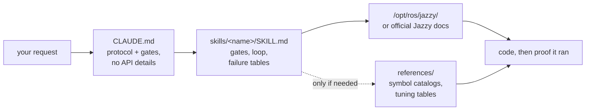

<div align="center">


**Claude Code Skills for ROS 2 Jazzy Jalisco robotics development.**

事前での未知のパラメータ特定、インストール済みパッケージとの照合による設定検証、そして実動エビデンスによる動作確認により、AIエージェントのROS 2開発アプローチを根本から革新するスキル群。


[English](README.md) | [한국어](README.ko.md) | [中文](README.zh.md) | **日本語** | [Español](README.es.md) | [Français](README.fr.md) | [Deutsch](README.de.md)
<sub>🌐 本ドキュメントは機械翻訳です。原文は [English](README.md) をご覧ください。</sub>

| スキル数 | 常時ロード型プロトコル | 公式ドキュメントリンク（CI検証済） | 実機ロボット検証 | 実測評価：コード生成前の事前検証 |
| :---: | :---: | :---: | :---: | :---: |
| **11** | **26行** | **38** | **4スクリプト** | **0/3 → 3/3** |

</div>

---

## 目次

- [コストのかかる失敗](#コストのかかる失敗)
- [このスキルの設計原則](#このスキルの設計原則)
- [何が違うのか](#何が違うのか)
- [実測評価](#実測評価)
- [クイックスタート](#クイックスタート)
- [スキル一覧](#スキル一覧)
- [検証スクリプト](#検証スクリプト)
- [仕組み](#仕組み)
- [更新](#更新)
- [ロードマップ](#ロードマップ)
- [コントリビュート](#コントリビュート)
- [ライセンス](#ライセンス)

## コストのかかる失敗

AIが生成したROS 2コードにおける最もコストのかかるエラーは、単なる文法上のミスであることは稀です。一見正しく見えるものの、裏に潜む微妙な問題こそが深刻な失敗を引き起こします：

| 失敗パターン | 表面的に発生する現象 | なぜAIエージェントがこの問題に直面するのか |
| :--- | :--- | :--- |
| **サイレント失敗** | `ros2 topic hz` は 30 Hz と表示されるが、コールバック関数が一切実行されない | デフォルトの RELIABLE サブスクライバーが BEST_EFFORT パブリッシャーに接続しようと試みています。コードは正常にビルドされコードレビューも通りますが、DDSミドルウェア層で通信が失敗します。 |
| **誤ったグラウンドトゥルース** | `/cmd_vel` は前進を示し `/odom` も前進を報告しているのに、実際のロボットは**後退**する | 静的TFフレームが物理的な取り付け位置に対して反転しています。後続コンポーネントは*誤った座標変換のまま*正しく計算を行うため、明確なエラーが表面化しません。 |
| **非推奨・削除済みの古いAPI** | レビューを通過したコードが、誤ったメソッドの呼び出しにより実行時に失敗する | Foxy や Humble で非推奨となり、Jazzy で名称変更または削除された古いAPIメソッドをエージェントが使用してしまいます。 |
| **無効な前提に基づく実装** | ユーザーが1文で訂正できたはずの誤った前提に基づいて、エージェントが200行ものコードを書き上げる | コード生成前に不足している詳細を検証するようエージェントに促す仕組みが存在しません。 |

コンパイラもリンターもログ解析ツールも、こうした潜在的な問題を検出することはできません。エラーを解決するたびに、出力結果の確認、原因の特定、修正指示の説明、コードの再生成という余分なフィードバックサイクルが発生します。

## このスキルの設計原則

本リポジトリに含まれるすべてのスキルは、以下の4つの設計原則に基づいています：

**1. 事前に不明な変数を特定する。** システムの稼働に関する重要な詳細（実機かシミュレーションか、既存ワークスペースの拡張か新規作成か、どのノードがどの座標変換をパブリッシュ済みか、ロボットの正確な形状など）は、ドキュメントに記載されていないことが多々あります。[`CLAUDE.md`](./CLAUDE.md) は、コード生成を開始する前にこれらの不明点を明確にするようエージェントに指示します。各領域に特化したスキルが特定のパラメータを管理します。たとえば `ros2-dev` は、Nav2のパラメータを設定する前に、ロボットのフットプリント、駆動キネマティクス、自己位置推定（Localization）のソースを事前に要求します。

**2. 明確な終了条件を持つ構造化されたループを実行する。** すべてのスキルは *検証 → 実装 → 実証*（verify → write → prove）のサイクルに従います。インストール環境におけるシステムのデフォルト状態を検査し、段階的に変更を適用して、実行結果を確認します。単にコードファイルを生成して終わるのではなく、ビルドの成功、`ros2 topic echo` でのデータ受信確認、検証スクリプトの通過といった観察可能な証拠（エビデンス）が得られて初めてタスク完了とみなします。

**3. 長文の説明よりも構造化された失敗対応表を重視する。** 「症状 → 根本原因 → 修正アクション」をマッピングした構造化テーブルは、公式ドキュメントでは不足しがちな明確かつ持続性の高いガイドラインを提供し、ROSのバージョンが変わっても信頼性を維持します：

> `[` は GZ→ROS、`]` は ROS→GZ · `16UC1` はミリメートル、`32FC1` はメートル · `joint_state_broadcaster` は自動起動しない · `raytrace_max_range` ≤ `obstacle_max_range` の場合は障害物がクリアされない · rclc はサイズ不定のメッセージフィールドを自動割り当てしない

**4. 3層アーキテクチャによりコンテキスト消費を最適化する。** 各スキルはコンテキストの利用効率を考慮して最適化されています。スキルの概要説明は常時コンテキスト内に保持され、スキル本体は呼び出し時にロードされ、`references/` 内の深い参照ファイルは必要時にのみロードされます。大型のシンボルカタログや詳細なパラメータチューニング表は `references/` 内に分離配置されているため、コンテキストウィンドウが保護され、特定コンポーネント（AMCLなど）のデバッグ時に不要なドキュメント（ビヘイビアツリーノードなど）が読み込まれるのを防ぎます。

## 何が違うのか

多くのロボティクス向けスキルパックは、静的なAPI知識をスキルファイル内に直接埋め込んでいます。この方法は使い始めこそ簡単ですが、依存するパッケージがアップデートされた際に壊れ、古くなったコードスニペットが静かに実行失敗を引き起こします。本リポジトリは、動的かつドキュメント駆動のアプローチを採用しています：

| 機能・特徴 | 記述量の多いスキルパック | **claude-ros2-skills** |
| :--- | :--- | :--- |
| 知識の配置場所 | スキルファイル内に埋め込み（**1スキルあたり400〜1,800行**） | 公式ドキュメントへリンク（スキル本体は**約60行**）。詳細なリファレンスは**必要な時のみ**読み込み |
| 常時ロードされるコンテキスト | 完全な `SKILL.md` ファイル全体 | **26行**のコアプロトコルのみ |
| Jazzy API更新への対応 | スニペットが気づかぬうちに古くなり、手動でのテスト更新が絶えず必要 | スニペット陳腐化のリスクをエントリーポイントリンクとシンボル名のみに最小化 — **38のドキュメントリンク**をCIで毎週検証 |
| 検証方法 | 静的コード解析またはログ確認 | **実機・実行時検証**: IMU重力チェック、オドメトリ進行方向テスト、TFフレーム整合性確認、DDS QoS互換性チェック |
| 対応バージョン範囲 | 複数のROSディストリビューションに対応していると主張しつつ、実際は1つのみを対象とする | **ROS 2 Jazzy 専用**として明確に設計・検証 |

本リポジトリは、「一見正しそうに見えて、実際にはROS 2 Jazzy上で動作しないコードが生成されるリスクを極限まで減らす」という単一の目的に特化して最適化されています。

## 実測評価

本スキルの性能を評価するため、本スキルがインストールされていない状態とインストールされた状態のそれぞれにおいて、新しく起動したヘッドレスな Claude Code セッションで同一のプロンプトを実行しました。各比較対では同じモデルを使用し、固定されたアップストリームの ROS 2 Jazzy ソースリポジトリに対してシンボル単位で厳密に採点を行いました。

| 評価指標 / テスト項目 | スキルなし | スキルあり |
| :--- | ---: | ---: |
| 不正確または捏造された Nav2 MPPI キー数 (Haiku) | **約30個** — 必須の `critics:` リストが欠落し、設定の実行に失敗 | **約16〜20個** — 正しいプラグイン文字列、`motion_model`、チェッカーの名前空間を適用 |
| 実機の BEST_EFFORT LiDAR における `/scan` コールバックの実行 (Sonnet) | **実行不可** — 不一致なQoSデフォルトによりサイレント失敗 | **成功** — 正常に接続してデータを受信 |
| コード生成前に環境検証を実施したセッション実行数 | **0 / 3** | **3 / 3** |

最も顕著な成果はエージェントの行動の変化です。ベースライン（スキルなし）のセッションでは検証ツールが利用可能であっても**一切**使用しませんでしたが、本スキルを搭載したセッションでは関連するガイドラインを読み込み、まずシステムのデフォルト設定を検査しました。あるテストでは、エージェントが事前に重要な確認質問を行い、検証済みのパラメータと未検証の前提条件を明示的にレポートすることで、根拠のない推測を回避しました。

評価テーブルの全容、テスト環境、および個別の実行分析については [`evals/RESULTS.md`](./evals/RESULTS.md) を参照してください。評価プロトコル、タスクチェックリスト、コンテナセットアップの詳細については [`evals/README.md`](./evals/README.md) をご覧ください。採点済みの実行ログを追加するプルリクエストを歓迎します。

## クイックスタート

**方法 A — プラグインマーケットプレイス（推奨）:**

```
/plugin marketplace add Leehyunbin0131/claude-ros2-skills
/plugin install claude-ros2-skills@claude-ros2-skills
```

インストール済みプラグインは、いつでも `/plugin marketplace update` で更新できます。

**方法 B — 手動インストール:**

```bash
git clone https://github.com/Leehyunbin0131/claude-ros2-skills.git

# Project-level installation (applies to the current project only)
mkdir -p your-project/.claude/skills
cp -r claude-ros2-skills/skills/* your-project/.claude/skills/
cp claude-ros2-skills/CLAUDE.md your-project/

# User-level installation (applies across all projects)
mkdir -p ~/.claude/skills
cp -r claude-ros2-skills/skills/* ~/.claude/skills/
```

Claude Code を再起動する（または新しいセッションを開始する）ことで、インストールしたスキルが適用されます。

## スキル一覧

| スキル | パス | カバー範囲 |
| :--- | :--- | :--- |
| **ros2-core** | `skills/ros2-core/SKILL.md` | rclcpp、rclpy、TF2、EKFオドメトリ、QoSプロファイル、パラメータ |
| **ros2-package** | `skills/ros2-package/SKILL.md` | `ros2 pkg create`、CMakeLists/setup.py の構築、colcon ビルド＆ソース設定、カスタムインターフェース |
| **ros2-dev** | `skills/ros2-dev/SKILL.md` | Nav2 (AMCL、コストマップ、MPPI/Smac)、SLAM Toolbox、RTAB-Map、Isaac ROS |
| **gazebo-sim** | `skills/gazebo-sim/SKILL.md` | Gazebo Harmonic、ros_gz_bridge、ros_gz_sim、SDFormat モデリング |
| **ros2-control** | `skills/ros2-control/SKILL.md` | ros2_control ハードウェア抽象化、コントローラーマネージャー、URDFタグ |
| **ros2-moveit** | `skills/ros2-moveit/SKILL.md` | MoveIt 2、MoveGroup C++/Python API、IKソルバー、OMPL、MoveIt Servo |
| **ros2-perception** | `skills/ros2-perception/SKILL.md` | image_transport、cv_bridge、vision_msgs、depth_image_proc、PCL |
| **ros2-testing** | `skills/ros2-testing/SKILL.md` | launch_testing、gtest/pytest、rosbag2 C++/Python API、ros2trace |
| **ros2-microros** | `skills/ros2-microros/SKILL.md` | micro-ROS Agent、rclc クライアント API、カスタムトランスポート、静的メモリ割り当て |
| **ros2-security** | `skills/ros2-security/SKILL.md` | SROS2、PKIキーストア生成、アクセス制御、DDS Security |
| **ros2-troubleshooting** | `skills/ros2-troubleshooting/SKILL.md` | REP 103/105 グラウンドトゥルース TF ツリー、LiDAR/IMU のアライメント調整、実機検証 |

## 検証スクリプト

これらの検証スクリプトは `ros2-troubleshooting` スキル (`skills/ros2-troubleshooting/scripts/`) に同梱されており、すべてのインストールに含まれます。物理的なハードウェア検証を、実行可能な合否確認ステップへと変換します（ROS 2 の環境設定 `source` が必要です。リターンコード: 0 = PASS, 1 = FAIL, 2 = NO DATA）：

| スクリプト | 検証内容 |
| :--- | :--- |
| `check_imu_gravity.py` | 静止状態のロボットが **+Z** 軸方向に約 +9.81 m/s² の重力を測定しているかを検証します（REP 103）。IMUの上下逆付けや取り付け方向のズレを検出します。 |
| `check_odom_direction.py` | ロボットを前方に押した際に、進行方向に沿って正のオドメトリ変位が記録されるかを検証します。モータ駆動方向の反転、エンコーダの極性問題、あるいは反転したTF設定を検出します。 |
| `check_tf_tree.py` | `map→odom→base_link` が正しく解決されるかを検証します。各センサーの取り付けオフセットを RPY（ロール・ピッチ・ヨー）度数法で表示し、180°の向きの反転エラーを強調表示します。 |
| `check_qos_compat.py` | DDSルールに基づき、トピック上のすべてのパブリッシャー/サブスクライバーペア間の QoS 互換性を検証します。サイレント失敗（BEST_EFFORT パブリッシャーと RELIABLE サブスクライバーのペアリング、または Durability, Deadline, Liveliness の不一致など）を防止します。 |

コアとなる判定ロジックは ROS 環境から独立して単体テストされており（`python3 skills/ros2-troubleshooting/scripts/test_checks.py`）、プッシュのたびに継続的インテグレーション（CI）経由で実行されます。

## 仕組み



`CLAUDE.md` には特定の API に関する詳細は含まれていません。代わりに、運用プロトコルを確立し、コードを記述する前に不明な点について質問して明確にすることを義務付けています。各 `SKILL.md` ファイルは領域固有の判断（不明な変数の特定、検証・実装・実証ループの実行、失敗対応表の参照）を管理します。詳細なリファレンス資料は `references/` ディレクトリに分離して格納されています。詳細は [`CLAUDE.md`](./CLAUDE.md) をご覧ください。

## 更新

```bash
cd claude-ros2-skills
git pull
cp -r skills/* ~/.claude/skills/   # or your project's .claude/skills/
```

## ロードマップ

1. **`ros:jazzy` コンテナ内での評価ペアの自動化**: 実機環境のインストールベースラインを確立します。コンテナのセットアップ詳細については [`evals/README.md`](./evals/README.md) を参照してください。
2. **Task 5 の評価結果の公開**: `ros2-package` のビルドおよびワークスペースの `source` 実行サイクル全体において、二元的な結果（`ros2 topic echo` がデータを出力するかどうか）による実行時パフォーマンスの検証結果を公開します。
3. **「完了までの修正回数」をコア指標として追跡**: コードが正常に動作するまでに必要なフィードバック反復回数を計測します。
4. **決定論的な `references/` 参照機能の実装**: 関連する場面で詳細な参照ドキュメントが確実にロードされるようにします。
5. **`ros2-core` および `gazebo-sim` への「本体 / `references`」分離構成の拡張**: 参照ドキュメントの記述量が多く利用頻度の高いスキルにおいて、コンテキスト効率を最適化します。

## コントリビュート

概要: スキルファイルは意思決定ロジック（検証ゲート、ループステップ、失敗対応表）に集中させ、詳細なドキュメントは `references/` に配置する必要があります。すべての API シンボルは、公式 Jazzy ドキュメントまたは `/opt/ros/jazzy/` インストール環境と照らし合わせて検証しなければなりません。検証スクリプトは、ROS の依存関係なしで単体テストできる純粋なロジックを維持する必要があります。完全なガイドライン、スキルとスクリプトのチェックリスト、および Issue テンプレートについては [`CONTRIBUTING.md`](./CONTRIBUTING.md) をご覧ください。

## ライセンス

Apache-2.0 — 詳細は [LICENSE](./LICENSE) を参照してください。
