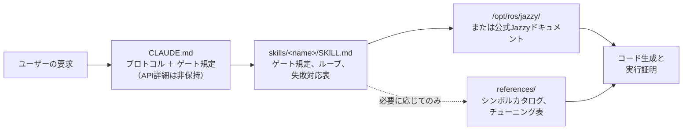

<div align="center">


**Claude Code Skills for ROS 2 Jazzy Jalisco robotics development.**

AIエージェントによるROS 2開発のアプローチを革新するスキルセット。事前におよその未知のパラメータを特定し、インストール済みパッケージと設定を検証し、動作の証拠に基づいて実行を確認します。


[English](README.md) | [한국어](README.ko.md) | [中文](README.zh.md) | **日本語** | [Español](README.es.md) | [Français](README.fr.md) | [Deutsch](README.de.md)

<sub>🌐 本ドキュメントは機械翻訳です。原文は [English](README.md) をご覧ください。</sub>

| スキル数 | 常時読み込みプロトコル | ドキュメントリンク（CI検証済み） | 実機ロボット検証 | 評価: Gazebo A/B |
| :---: | :---: | :---: | :---: | :---: |
| **11** | **26行** | **38** | **4スクリプト** | **目標到達 vs ブリングアップ中断** |

</div>

---

## 目次

- [コストのかかる失敗](#コストのかかる失敗)
- [このスキルの設計原則](#このスキルの設計原則)
- [何が違うのか](#何が違うのか)
- [実測評価](#実測評価)
- [クイックスタート](#クイックスタート)
- [スキル一覧](#スキル一覧)
- [検証スクリプト](#検証スクリプト)
- [仕組み](#仕組み)
- [更新](#更新)
- [ロードマップ](#ロードマップ)
- [コントリビュート](#コントリビュート)
- [ライセンス](#ライセンス)

## コストのかかる失敗

AIが生成したROS 2コードにおいて、最も大きなコストをもたらすエラーは文法エラー（構文エラー）ではありません。一見正しく見えるものの、潜んでいる微妙な問題です。

| 失敗ケース | 表面的な現象 | なぜエージェントがこの問題を起こすのか |
| :--- | :--- | :--- |
| **サイレントエラー（無音の失敗）** | `ros2 topic hz` は30 Hzを示しているのに、コールバック関数が実行されない | デフォルトの RELIABLE サブスクライバーが BEST_EFFORT パブリッシャーに接続しようとしています。コードはコンパイルされコードレビューも通過しますが、DDSミドルウェア層で失敗します。 |
| **誤ったグラウンドトゥルース（正解値）** | `/cmd_vel` は前進を示し、`/odom` も前進を報告しているが、実機ロボットは**後退**している | 静的TFフレームが物理的な取り付け向きに対して反転しています。後続コンポーネントは*誤った変換を用いて*正常に計算を行うため、明確なエラーが出力されません。 |
| **非推奨・古くなったAPI** | コードレビューはパスするが、実行時に無効なメソッドの呼び出しでエラーになる | エージェントが、Jazzyで名前が変更されたか削除された、非推奨のFoxyやHumbleのAPIメソッドを使用しています。 |
| **前提の誤り** | 一言で指摘できたはずの前提の勘違いに基づき、エージェントが200行のコードを記述してしまう | コード生成前に不足している詳細を検証するようエージェントに促すメカニズムが存在しないためです。 |

コンパイラ、リンター、ログ解析のいずれも、これらの潜在的な問題を検出することはできません。各エラーを解決するには、出力の確認、原因の特定、修正内容の説明、再生成といった追加のフィードバックサイクルが発生します。

## このスキルの設計原則

本リポジトリのすべてのスキルは、4つの設計原則に基づいて構築されています。

**1. 事前に未知の変数を特定する。** 実装環境が実機かシミュレーションか、既存のワークスペースを拡張するのか新規作成するのか、どのノードが既にトランスフォームをパブリッシュしているか、ロボットの正確な幾何形状など、重要な運用上の詳細は公式ドキュメントに記載されていないことがよくあります。[`CLAUDE.md`](./CLAUDE.md) は、コードを生成する前にこれらの不明点をクリアにするようエージェントに指示します。ドメイン固有のスキルは特定のパラメータを管理します。たとえば、`ros2-dev` は Nav2 のパラメータを設定する前に、ロボットのフットプリント、駆動キネマティクス、自己位置推定（Localization）のソースを確認します。

**2. 明確な終了条件を持つ構造化されたループを実行する。** すべてのスキルは *検証（verify） → 記述（write） → 証明（prove）* のサイクルに従います。インストールされた環境のシステムデフォルトを検査し、段階的な変更を適用し、実行を確認します。タスクの完了は単にコードファイルを生成することではなく、ビルドの成功、`ros2 topic echo` でのデータ受信確認、検証スクリプトの合格など、観察された証拠によって裏付けられた場合にのみ認められます。

**3. 長い説明文よりも構造化された失敗対応表を優先する。** 症状 → 根本原因 → 修正アクションを対応させた構造化テーブルは、公式ドキュメントには欠けがちな、かつリリースバージョンを跨いでも信頼性の高い、明確で持続的なガイドラインを提供します。

> `[` は GZ→ROS、`]` は ROS→GZ ・ `16UC1` はミリメートル、`32FC1` はメートル ・ `joint_state_broadcaster` は自動起動されない ・ `raytrace_max_range` ≤ `obstacle_max_range` の場合障害物は消去されない ・ rclc はサイズ無制限のメッセージフィールドを自動割り当てしない

**4. 3層アーキテクチャによりコンテキスト消費を最適化する。** 各スキルはコンテキストの効率性を保持します。スキル記述はコンテキスト内に維持され、スキル本体は呼び出し時にロードされ、`references/` 内の深い参照ファイルは要求があった場合にのみロードされます。大規模なシンボルカタログや詳細なパラメータチューニング表は `references/` に配置されているため、コンテキストが保護され、特定のコンポーネント（AMCLなど）のデバッグ時に不要なドキュメント（ビヘイビアツリーノードなど）がロードされることを防ぎます。

## 何が違うのか

多くのロボティクス向けスキルパックは、静的なAPI知識をスキルファイル内に直接埋め込んでいます。この方法は初期導入が容易な反面、依存するパッケージがアップデートされた際に古いコードスニペットが残り、サイレントエラーを引き起こす原因となります。本リポジトリでは、動的かつドキュメント駆動のアプローチを採用しています。

| 機能 | コンテンツ盛り込み型スキルパック | **claude-ros2-skills** |
| :--- | :--- | :--- |
| 知識の保持場所 | スキルファイル内に埋め込み（**1スキルあたり400〜1,800行**） | 公式ドキュメントにリンク（スキル本体は**約60行**）。詳細なリファレンスは**必要な場合のみ読み込み** |
| 常時ロードされるコンテキスト | 完全な `SKILL.md` ファイル | **26行** のコアプロトコル |
| Jazzy API更新への対応 | スニペットが静かに陳腐化。継続的な手動テスト更新が必要 | 古いスニペットによるリスクをエントリーポイントのリンクとシンボル名に最小化 — **38個のドキュメントリンク**をCIで毎週自動検証 |
| 検証方法 | 静的コード解析またはログ確認 | **実機および実行時検証**: IMU重力チェック、オドメティ方向テスト、TFフレーム整合性、DDS QoS互換性 |
| サポート範囲 | 単一のディストロのみをターゲットにしながら、複数のROSディストロ対応を主張 | **ROS 2 Jazzy 専用**として明示的に設計・検証済み |

本リポジトリは、「一見正しそうに見えてROS 2 Jazzy上で動作しないコードが生成されるリスクを最小限に抑える」という単一の成果に特化して最適化されています。

## 実測評価

以下のすべての結果は、同一のモデルを使用し、新規のヘッドレス Claude Code セッションで**全く同じプロンプト**を実行したA/Bテストの比較に基づいています（本スキルなしと本スキルあり）。採点は4段階で行われました。固定されたアップストリーム Jazzy ソースコードとのシンボル単位の照合、実際の `/opt/ros/jazzy` インストール環境との照合、両方の出力を**実稼働中の Gazebo シミュレーション**にロードする検証、そして最後に**生成されたノードを稼働中のパブリッシャに対して実際に実行**する検証です。これによりテストスイート内のすべてのタスクが実インストール環境で測定されました。すべてのトランスクリプト、生成コード、実行ログは [`evals/runs/`](./evals/runs/) にコミットされ、ペアを生成するハーネスは [`evals/harness/`](./evals/harness/) にあるため、誰でも再評価または再実行できます。

サンプルサイズは**セルあたり n=1** であり、実行と採点はこの結果を公開しているプロジェクト自身が行っています。採点は可能な限り機械的な基準（そのシンボルはインストール環境に存在するか、コマンドは成功するか）で設計されているため、独立した検証が可能です。

### Nav2 MPPI 設定の検証 — Haiku、Jazzy実環境

*プロンプト: Jazzy上の差動駆動ロボット用に MPPI コントローラーを使用した Nav2 を設定し、controller server の YAML を生成する。*

| | スキルなし | スキルあり |
| :--- | :--- | :--- |
| プロセス | 記憶に基づいて即座に回答。利用可能なツールがあるにもかかわらず検証は**ゼロ** | **最初に**フットプリント、既存設定、自己位置推定、速度制限を確認し、その後 `/opt/ros/jazzy/share/nav2_bringup/params/nav2_params.yaml` の標準デフォルト設定を読み込み |
| プラグイン文字列 | `mppi_generic::ControllerServer` — 存在しない | `nav2_mppi_controller::MPPIController` — 正しい |
| `critics:` リスト | 完全に欠落 | 全8種類、正しい名称 |
| 架空のパラメータキー | **約16個** | **0個** — すべてのキーがインストール済みのデフォルト値と機械的に差分チェック済み |
| **実際の Gazebo シミュレーションにロード** | **`[FATAL] Failed to create controller … does not exist` — Nav2 がブリングアップ時に中断し、ロボットは一切動かず** | **MPPI と全8個の critics がロードされ、ロボットが (−2.0, −0.5) → (0.5, 0.5) へ走行。`NavigateToPose` が `SUCCEEDED` を返却** |

### 実際に実行可能なパッケージの作成 — Haiku、コンテナ内環境

*プロンプト: `/greeting` トピックに `std_msgs/msg/String` を 1 Hz でパブリッシュする Python パッケージ `demo_pkg` をローンチファイル付きで作成し、ビルドして `ros2 topic echo /greeting` を確認する。*

| | スキルなし | スキルあり |
| :--- | :--- | :--- |
| `ros2 run` / `ros2 launch` / `topic echo` | **3つすべて失敗** — ament インデックスにパッケージが登録されない | **3つすべて成功**、各コマンドの独立した再実行で確認済み |
| 結果に至るコスト | $0.17 · 36 ターン · 178 秒 | **$0.08 · 18 ターン · 61 秒** — 初回で正しく動作し、**2.2倍低コスト** |

### センサーのサブスクリプション — Haiku、両ノードを稼働中のパブリッシャに対して実行

*プロンプト：`/scan` をサブスクライブし、最小距離を1秒に1回ログ出力する Jazzy の Python ノードを書いてください。* 生成された2つのノードを、BEST_EFFORT の `/scan` パブリッシャに対してそれぞれ6秒間実行しました。

| | スキルなし | スキルあり |
| :--- | :--- | :--- |
| サブスクリプションの QoS | `create_subscription(..., 10)` → RELIABLE | `qos_profile_sensor_data` |
| **実行時に受信したメッセージ** | **ゼロ件。** rclpy 自身が `offering incompatible QoS. No messages will be received from it. Last incompatible policy: RELIABILITY` を出力 | **5 Hz で正常に受信** |
| 報告された最小値（正解：0.45 m） | 1件も受信できなかった | `0.020 m` — **こちらも誤り**：両ノードとも `range_min`/`range_max` による境界フィルタを行っていない |

接続できるかどうかの差はセンサーパイプラインが存在するか否かを決める項目であり、再現性があります。一方、数値の誤りは両条件に共通する実際の欠陥であるため、成果ではなく `ros2-core` の今後の課題として記録しました。

### 書く前に質問する — Haiku、上下逆に取り付けられた LiDAR

*プロンプト：LiDAR がシャーシ後部に上下逆・後ろ向きで取り付けられています。static TF を書き、修正を確認する方法を教えてください。*

| | スキルなし | スキルあり |
| :--- | :--- | :--- |
| 物理的な取り付け情報を先に確定 | 1ターンで即答 | **transform を出す前に、後方距離とオフセットを先に質問した** |
| Transform の正確性 | roll≈180° + yaw≈180°、REP 105 の親子関係 — 正しい | 正しい。両者の出力を実際に配信すると `check_tf_tree.py` が設計通り指摘した |
| 確認方法の助言 | RViz の **PointCloud2** ディスプレイ — LiDAR のメッセージ型と不一致 | `tf2_echo` と **LaserScan** ディスプレイ |

### これらのスキルが解決しないこと

これを省くと他の結論の信頼性が下がるため、併せて記録します。

- **ハルシネーションは消えず、移動します。** 最新の3タスクでも、スキルあり側の出力に `ros2_troubleshooting_helpers`（存在しないパッケージ。しかも*本リポジトリ自身のスクリプト*を説明する文脈で）と誤ったデフォルト durability 値が現れました。ドキュメントへのルーティングは下限を引き上げますが、モデルを正確にするわけではありません。
- **モデルが既に熟知している問題では、コストだけが増えて得るものは少ないです。** 典型的な QoS 不一致の診断では両条件とも1ターンで正解し、スキルあり側は約1.4倍のコストで事実誤認を1つ追加しました。
- **スキルはエージェントが*何を尋ねるか*は安定して変えますが、*何を確認するか*は同じように変えません。** 再現環境が稼働し `Bash` も許可された状態で、両セルとも `ros2 topic info -v` を勧めただけで、実行はしませんでした。
- **タスク1では両条件とも数値を誤りました。** 生成された2つのノードはいずれも `range_min`/`range_max` のフィルタリングを欠いており、最小距離未満の測定値を最も近い障害物として報告してしまいます。

### すべてのペアに共通するパターン

WebFetch、Read、Bash の使用が明示的に許可されていても、どの実行においてもベースラインのセルはコード作成**前に**インストール環境やドキュメントを検証しませんでした。さらに、あるベースラインは `ros2 run` で検出すらできないパッケージについて「完全にビルドが成功した」と報告しました。一方スキルありのセルは、未確定情報のあるすべてのタスクで事前質問ゲートを実行し、その主張は独立した再実行結果と一致しました。検証スクリプト自体も実データで双方向に確認されました。`check_qos_compat.py` は実際の BEST_EFFORT/RELIABLE 不一致に対して初の実 `[FAIL]` を出力し、`check_tf_tree.py` は上下逆のセンサーを指摘しつつ、正しく取り付けられたセンサーは誤検出しませんでした。

完全な評価テーブル、テスト環境、個別の実行分析については [`evals/RESULTS.md`](./evals/RESULTS.md) をご覧ください。評価プロトコル、タスクチェックリスト、コンテナのセットアップ詳細については [`evals/README.md`](./evals/README.md) を参照してください。評価済みトランスクリプトを追加するプルリクエストを歓迎します。

## クイックスタート

**方法 A — プラグインマーケットプレイス（推奨）:**

```
/plugin marketplace add Leehyunbin0131/claude-ros2-skills
/plugin install claude-ros2-skills@claude-ros2-skills
```

インストール済みプラグインはいつでも `/plugin marketplace update` で更新できます。

**方法 B — 手動インストール:**

```bash
git clone https://github.com/Leehyunbin0131/claude-ros2-skills.git

# プロジェクトレベルでのインストール（現在のプロジェクトのみに適用）
mkdir -p your-project/.claude/skills
cp -r claude-ros2-skills/skills/* your-project/.claude/skills/
cp claude-ros2-skills/CLAUDE.md your-project/

# ユーザーレベルでのインストール（すべてのプロジェクトに適用）
mkdir -p ~/.claude/skills
cp -r claude-ros2-skills/skills/* ~/.claude/skills/
```

インストールしたスキルを反映するには、Claude Code を再起動するか、新しいセッションを開始してください。

## スキル一覧

| スキル名 | パス | 対象範囲・機能 |
| :--- | :--- | :--- |
| **ros2-core** | `skills/ros2-core/SKILL.md` | rclcpp, rclpy, TF2, EKF オドメティ, QoS プロファイル, パラメータ |
| **ros2-package** | `skills/ros2-package/SKILL.md` | `ros2 pkg create`, CMakeLists/setup.py 設定, colcon build & source, カスタムインターフェース |
| **ros2-dev** | `skills/ros2-dev/SKILL.md` | Nav2 (AMCL, コストマップ, MPPI/Smac), SLAM Toolbox, RTAB-Map, Isaac ROS |
| **gazebo-sim** | `skills/gazebo-sim/SKILL.md` | Gazebo Harmonic, ros_gz_bridge, ros_gz_sim, SDFormat モデリング |
| **ros2-control** | `skills/ros2-control/SKILL.md` | ros2_control ハードウェア抽象化, controller manager, URDF タグ |
| **ros2-moveit** | `skills/ros2-moveit/SKILL.md` | MoveIt 2, MoveGroup C++/Python API, 逆運動学(IK)ソルバー, OMPL, MoveIt Servo |
| **ros2-perception** | `skills/ros2-perception/SKILL.md` | image_transport, cv_bridge, vision_msgs, depth_image_proc, PCL |
| **ros2-testing** | `skills/ros2-testing/SKILL.md` | launch_testing, gtest/pytest, rosbag2 C++/Python API, ros2trace |
| **ros2-microros** | `skills/ros2-microros/SKILL.md` | micro-ROS Agent, rclc クライアント API, カスタムトランスポート, 静的メモリ割り当て |
| **ros2-security** | `skills/ros2-security/SKILL.md` | SROS2, PKI キーストア生成, アクセス制御, DDS Security |
| **ros2-troubleshooting** | `skills/ros2-troubleshooting/SKILL.md` | REP 103/105 グラウンドトゥルース TF ツリー, LiDAR/IMU アライメント, 実機検証 |

## 検証スクリプト

これらの検証スクリプトは `ros2-troubleshooting` スキル（`skills/ros2-troubleshooting/scripts/`）に同梱されており、すべてのインストールに含まれます。物理ハードウェアの確認手順を実行可能な Pass/Fail 検証ステップに変換します（セットアップされた ROS 2 環境が必要。リターンコード: 0 = PASS, 1 = FAIL, 2 = NO DATA）:

| スクリプト | 検証内容 |
| :--- | :--- |
| `check_imu_gravity.py` | 静止状態のロボットが **+Z** 軸方向に約 +9.81 m/s² の重力を測定しているかを検証します (REP 103)。IMU の表裏逆取りつけやアライメント異常を検出します。 |
| `check_odom_direction.py` | ロボットを前に押した際に、進行方向に正のオドメティ変位が発生するか検証します。モーターの回転方向反転、エンコーダーの極性問題、TF設定の反転を検出します。 |
| `check_tf_tree.py` | `map→odom→base_link` が正しく解決されているか確認します。各センサーの取り付けオフセットを RPY（ロール・ピッチ・ヨー）度数で表示し、180°の回転エラーの可能性を強調表示します。 |
| `check_qos_compat.py` | DDS ルールに基づき、トピック上のすべてのパブリッシャー／サブスクライバーペア間の QoS 互換性を検証します。サイレントエラー（BEST_EFFORT パブリッシャーと RELIABLE サブスクライバーのペアリング、Durability・Deadline・Liveliness の不一致など）を防ぎます。 |

コアとなる判定ロジックは ROS から独立して単体テスト可能であり（`python3 skills/ros2-troubleshooting/scripts/test_checks.py`）、プッシュごとに継続的インテグレーション（CI）経由で実行されます。

## 仕組み



`CLAUDE.md` には特定のAPIの詳細は含まれていません。代わりに、運用プロトコルを確立し、コードを書く前に確認の質問に回答することを義務付けています。各 `SKILL.md` ファイルは、未知の変数の特定、検証-記述-証明（verify-write-prove）ループの実行、失敗対応表の参照など、ドメイン固有の意思決定を制御します。詳細なリファレンス資料は `references/` ディレクトリに分けて格納されています。詳細は [`CLAUDE.md`](./CLAUDE.md) を参照してください。

## 更新

```bash
cd claude-ros2-skills
git pull
cp -r skills/* ~/.claude/skills/   # またはプロジェクトの .claude/skills/
```

## ロードマップ

1. ~~`ros:jazzy` コンテナ内での評価ペア実行の自動化~~ — **完了 (2026-07-25):** 実際の `/opt/ros/jazzy` インストール環境に対してタスク4を再実行。結果は [`evals/RESULTS.md`](./evals/RESULTS.md) に掲載。
2. ~~タスク5の評価結果の公開~~ — **完了 (2026-07-25):** コンテナ内でのバイナリビルド/実行/echo 結果を測定。結果は [`evals/RESULTS.md`](./evals/RESULTS.md) に掲載。
3. ~~実インストール環境での評価をタスク1〜3にも拡張~~ — **完了 (2026-07-26):** ネイティブの `ros-jazzy-ros-base` 環境で実行し、生成された2つのノードを稼働中のパブリッシャに対して実際に走らせて採点。ハーネスは [`evals/harness/`](./evals/harness/)、結果は [`evals/RESULTS.md`](./evals/RESULTS.md) に掲載。
4. ~~それらの実行で判明した欠陥の修正~~ — **完了 (2026-07-26):** `ros2-troubleshooting` にスクリプトの実際の呼び出し方（モデルがパッケージ名を捏造していた）と、`check_tf_tree.py` が ~180° の取り付けを常に物理確認対象として表示する旨を明記。`ros2-core` に `range_min`/`range_max` の境界ルールと正常終了パターンを追加。**上記の評価表は、これらの修正前のスキルを測定した結果です。**
5. **修正後のスキルでタスク1〜3を再実行** — 修正が実際に出力を変えるかを確認する。上記の表がいまだ修正前バージョンを説明しているのはこのためです。
6. **タスク3に判別力を持たせる** — 現状では両条件とも記憶だけで正解できるため、QoS 診断を推奨ではなく実エンドポイントに対する*実演*として要求する形に変更。
7. **主要指標として「完了までの修正回数（corrections-to-completion）」を追跡** — コードが正常に動作するまでに必要なフィードバック反復回数を測定。
8. **決定論的な `references/` 検索の実装**により、関連する詳細リファレンスドキュメントが確実にロードされる仕組みの構築。
9. **本体と `references` の分割を `ros2-core` および `gazebo-sim` に拡大**し、大規模な参照ドキュメントを持つ高頻度利用スキルのコンテキスト効率を最適化。

## コントリビュート

要約: スキルファイルは意思決定ロジック（検証ゲート、ループステップ、失敗対応表）に集中させ、詳細なドキュメントは `references/` 内に維持する必要があります。すべての API シンボルは、公式 Jazzy ドキュメントまたは `/opt/ros/jazzy/` インストール環境と照合して検証されなければなりません。検証スクリプトは、ROS の依存関係なしで単体テストが可能な純粋なロジックを保持する必要があります。ガイドラインの詳細、スキルおよびスクリプトのチェックリスト、イシューテンプレートについては [`CONTRIBUTING.md`](./CONTRIBUTING.md) を参照してください。

## ライセンス

Apache-2.0 — 詳細は [LICENSE](./LICENSE) をご覧ください。
