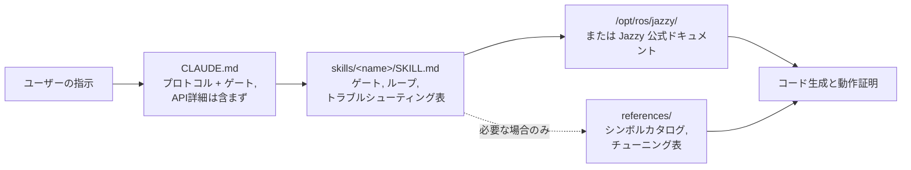

<div align="center">


**Claude Code Skills for ROS 2 Jazzy Jalisco robotics development.**

エージェントが ROS 2 タスクに取り組む*プロセス*を根本から変えるスキル — 不確実な要素をあらかじめ明確化し、インストール環境と照合し、動作結果を実証します。


[English](README.md) | [한국어](README.ko.md) | [中文](README.zh.md) | **日本語** | [Español](README.es.md) | [Français](README.fr.md) | [Deutsch](README.de.md)

<sub>🌐 本ドキュメントは機械翻訳です。原文は [English](README.md) をご覧ください。</sub>

| スキル | 常時読み込みプロトコル | ドキュメントリンク (CI確認済) | 実機検証スクリプト | 実測評価: コード記述前の検証 |
| :---: | :---: | :---: | :---: | :---: |
| **11** | **26行** | **38** | **4スクリプト** | **0/3 → 3/3** |

</div>

---

## 目次

- [コストのかかる失敗](#コストのかかる失敗)
- [このスキルの設計原則](#このスキルの設計原則)
- [何が違うのか](#何が違うのか)
- [実測評価](#実測評価)
- [クイックスタート](#クイックスタート)
- [スキル一覧](#スキル一覧)
- [検証スクリプト](#検証スクリプト)
- [仕組み](#仕組み)
- [更新](#更新)
- [ロードマップ](#ロードマップ)
- [コントリビュート](#コントリビュート)
- [ライセンス](#ライセンス)

## コストのかかる失敗

AIエージェントが生成した ROS 2 コードで発生するコストのかかる失敗は、構文エラーではありません。一見正常に動作しているように見えるものこそが問題です。

| 失敗の類型 | 表面上の現象 | エージェントが陥る理由 |
| :--- | :--- | :--- |
| **サイレント無効化** | `ros2 topic hz` では 30 Hz と表示されるが、コールバックが一度も呼び出されない | サブスクライバのデフォルト設定（RELIABLE）とドライバ（BEST_EFFORT）のミスマッチ。コンパイルもコードレビューもパスするが、DDSレイヤーで通信が合致しない |
| **誤ったグラウンドトゥルース** | `/cmd_vel` も `/odom` も前進を示しているのに、ロボットが**後退**する | 静的 TF が物理的な取り付け方向と逆で定義されている。後続の処理はすべて*誤った座標変換をもとに正確に計算*されるため、矛盾が検知されない |
| **世代の錯覚** | コードレビューを通過するが、実行時に「ありそうな名前」のメソッドでエラー終了する | Foxy/Humble 時代の古い API を記憶しており、Jazzy で変更されたか存在しないメソッドを記述してしまう |
| **誤った前提に基づく実装** | 1文の指示で訂正できたはずの誤った前提のもとに 200 行のコードを構築してしまう | コードを記述する前に不確実な要素を確認・特定する指示がない |

これらはコンパイラ、リンター、ログ確認のいずれでも検知できません。そのたびに出力を確認し、問題を特定し、説明して再生成させるという無駄なやり取り（ラウンドトリップ）が発生します。

## このスキルの設計原則

すべてのスキルに適用されている 4 つの設計原則。

**1. コードを書き始める前に不確実な要素を明確にする。** 実機かシミュレーションか、既存のワークスペースの拡張か新規作成か、変更対象の座標変換をどのノードが配信しているか、実機の幾何構造（ジオメトリ）など、公式ドキュメントには載っていない事実があります。[`CLAUDE.md`](./CLAUDE.md) は、エージェントにこれらを最初に確定させ、指示に記載がない場合は質問するよう強制します。ドメイン固有の不確実要素はスキル内に定義されており、例えば `ros2-dev` は Nav2 のパラメータを 1 つ書く前に、フットプリント、駆動方式、自己位置推定のソースを確認します。

**2. 明確な終了条件を持つループ。** すべてのスキルは *検証 (verify) → 記述 (write) → 実証 (prove)* のループを実行します。インストール済みシステム上のデフォルト設定を確認し、変更を1つずつ適用した上で、実際に動作したことを確認します。「完了」とはコードが生成されたことではなく、ビルドの成功、`ros2 topic echo` によるデータ出力の確認、検証スクリプトのパスなど、観察可能な証拠が得られた状態を指します。

**3. トラブルシューティング表を優先。** 最も価値の高いコンテンツは「症状 → 根本原因 → 対処法」のテーブルです。これは公式ドキュメントにはまとめられておらず、新しいリリースが出ても陳腐化しにくいためです。

> `[` は GZ→ROS、`]` は ROS→GZ ・ `16UC1` はミリメートル、`32FC1` はメートル ・ `joint_state_broadcaster` は自動起動されない ・ `raytrace_max_range` ≤ `obstacle_max_range` の設定では障害物が消去されない ・ rclc はサイズ無制限のメッセージフィールドを自動割り当てしない

**4. 3つのレイヤー、3つのトークンコスト。** スキルの `description` は常にコンテキストに含まれ、スキルの本文は発動時に読み込まれ、`references/` 内のファイルはタスクで必要な場合のみ読み込まれます。大容量のシンボルカタログやチューニング表は `references/` に配置されているため、AMCL のデバッグ中に Behavior Tree ノード一覧のトークンコストを支払う必要がなく、全体のコンテキスト量を圧迫することなく詳細な情報を保持できます。

## 何が違うのか

既存のロボティクス向けスキルパックの多くは、APIの知識をスキルファイル内に直接埋め込んでいます。これはエコシステムが更新されると、埋め込まれたスニペットが静かに陳腐化するリスクがあります。本リポジトリは逆のアプローチを取っています：

| | 情報埋め込み型スキルパック | **claude-ros2-skills** |
| :--- | :--- | :--- |
| 知識の保持場所 | スキルファイル内に埋め込み（**スキルあたり 400〜1,800 行**） | 公式ドキュメントへルーティング。スキル本文は**約60行**で、詳細は `references/` から**必要な時のみ**読み込み |
| 常時読み込みコンテキスト | SKILL.md 全体 | **26行**のプロトコルのみ |
| Jazzy API 変更時 | スニペットが静かに陳腐化。永続的な回帰テストが必要 | 陳腐化リスクを主要リンクとシンボル名のみに削減 — **38 個のリンク**を毎週 CI で有効性確認し、リンク切れでビルド失敗 |
| 検証方法 | 静的解析 / ログベース | **実機検証**: IMU 重力、押しテスト、実機に対する TF 取り付け状態、DDS QoS 適合性 |
| ディストリビューション対応 | 1つに対応した例で「4つのディストリ対応」を謳う | **Jazzy 専用**と明示 |

本リポジトリは単一の目的に最適化されています：Jazzy 上で動作しない「一見正しそうなコード」が生成される確率を最小限に抑えることです。

## 実測評価

スキルの有無による比較のため、新規のヘッドレス Claude Code セッションで同一のプロンプトを実行（ペアごとに同一モデルを使用）。アップストリームの `jazzy` ソースコードと照らし合わせてシンボル単位で評価しました。

| 評価項目 | スキルなし | スキルあり |
| :--- | ---: | ---: |
| Nav2 MPPI の誤った/架空のキー数 (haiku) | **約 30** — `critics:` リストが存在せず設定実行不可 | **約 16–20** — プラグイン文字列、`motion_model`、チェッカーのネームスペースが正常 |
| 実機の BEST_EFFORT LiDAR で `/scan` コールバックが動作するか (sonnet) | **動作しない** — デフォルト QoS が不適合（エラー表示なし） | **動作する** |
| コード記述前に検証を実行した回数 | **0 / 3** | **3 / 3** |

最も顕著な違いは行動パターンに現れました。ベースライン（スキルなし）の実行では、検証ツールが利用可能であるにもかかわらず**一度も**使用されなかったのに対し、スキルありの実行では毎回スキルを読み込み、まず最初に環境のデフォルト設定を確認しに行きました。また、ある実行では推測で進めるのではなく、最初に 3 つの確認質問を行って確認できた事項とできなかった事項を明確に報告しました。

完全な評価テーブル、実施条件、各実行の分析詳細: [`evals/RESULTS.md`](./evals/RESULTS.md) · プロトコル、タスクチェックリスト、コンテナ構成レシピ: [`evals/README.md`](./evals/README.md)。評価ログを追加する PR を歓迎します。

## クイックスタート

**方法 A — プラグインマーケットプレイス（推奨）:**

```
/plugin marketplace add Leehyunbin0131/claude-ros2-skills
/plugin install claude-ros2-skills@claude-ros2-skills
```

`/plugin marketplace update` で最新版に更新できます。

**方法 B — 手動コピー:**

```bash
git clone https://github.com/Leehyunbin0131/claude-ros2-skills.git

# プロジェクト単位（該当プロジェクトのみ）
mkdir -p your-project/.claude/skills
cp -r claude-ros2-skills/skills/* your-project/.claude/skills/
cp claude-ros2-skills/CLAUDE.md your-project/

# または ユーザー単位（全プロジェクト共通）
mkdir -p ~/.claude/skills
cp -r claude-ros2-skills/skills/* ~/.claude/skills/
```

Claude Code を再起動する（または新しいセッションを開始する）とスキルが読み込まれます。

## スキル一覧

| スキル名 | パス | 対象範囲 |
| :--- | :--- | :--- |
| **ros2-core** | `skills/ros2-core/SKILL.md` | rclcpp, rclpy, TF2, EKF オドメトリ, QoS プロファイル, パラメータ |
| **ros2-package** | `skills/ros2-package/SKILL.md` | `ros2 pkg create`, CMakeLists/setup.py 設定, colcon ビルド & source, カスタムインターフェース |
| **ros2-dev** | `skills/ros2-dev/SKILL.md` | Nav2 (AMCL, コストマップ, MPPI/Smac), SLAM Toolbox, RTAB-Map, Isaac ROS |
| **gazebo-sim** | `skills/gazebo-sim/SKILL.md` | Gazebo Harmonic, ros_gz_bridge, ros_gz_sim, SDFormat モデリング |
| **ros2-control** | `skills/ros2-control/SKILL.md` | ros2_control ハードウェア抽象化, controller manager, URDF タグ |
| **ros2-moveit** | `skills/ros2-moveit/SKILL.md` | MoveIt 2, MoveGroup C++/Python API, IK ソルバー, OMPL, MoveIt Servo |
| **ros2-perception** | `skills/ros2-perception/SKILL.md` | image_transport, cv_bridge, vision_msgs, depth_image_proc, PCL |
| **ros2-testing** | `skills/ros2-testing/SKILL.md` | launch_testing, gtest/pytest, rosbag2 C++/Python API, ros2trace |
| **ros2-microros** | `skills/ros2-microros/SKILL.md` | micro-ROS Agent, rclc クライアント API, カスタムトランスポート, 静的メモリ |
| **ros2-security** | `skills/ros2-security/SKILL.md` | SROS2, PKI キーストア生成, アクセス制御, DDS Security |
| **ros2-troubleshooting** | `skills/ros2-troubleshooting/SKILL.md` | REP 103/105 基準 TF ツリー, LiDAR/IMU アライメント, 実機検証 |

## 検証スクリプト

`ros2-troubleshooting` スキル（`skills/ros2-troubleshooting/scripts/`）内に同梱されているため、インストール時に一緒に移動します。これらは実機チェックを実行可能な Pass/Fail の判定結果に変換します（ROS 2 環境の `source` が必要。終了ステータス: 0 = PASS, 1 = FAIL, 2 = データなし）:

| スクリプト | 検証内容 |
| :--- | :--- |
| `check_imu_gravity.py` | 静止状態のロボット → **+Z** 軸方向の重力が約 +9.81 m/s² であること（REP 103）。反転または回転している IMU のマウント設定を検出します。 |
| `check_odom_direction.py` | ロボットを前方に押す → オドメトリの変位が進行方向に正の値を示すこと。モータ、エンコーダ、TF の反転を検出します。 |
| `check_tf_tree.py` | `map→odom→base_link` が正常に解決されること。各センサーマウントの RPY（度）を出力し、物理マウントと比較するために約 180° の宣言にフラグを立てます。 |
| `check_qos_compat.py` | トピック上のすべての Publisher/Subscriber ペアが DDS マッチングルールに従って QoS 互換性を持っていること。「トピックは 30 Hz で配信されているのにコールバックが呼ばれない」無症状の失敗（BEST_EFFORT pub 対 RELIABLE sub、耐久性/デッドライン/ライブネスのミスマッチなど）を検出します。 |

ROS に依存しない純粋な判定ロジックはユニットテストされており（`python3 skills/ros2-troubleshooting/scripts/test_checks.py`）、プッシュごとに CI で自動実行されます。

## 仕組み



`CLAUDE.md` には API の詳細は含まれていません。プロトコルとコード記述前に回答すべき質問のみを定義しています。各 `SKILL.md` 本文には決定ロジック（確認項目、検証-記述-実証ループ、そのドメインのトラブルシューティング表）が含まれます。大容量のリファレンス資料は 1 ステップ離れた `references/` に配置されています。詳細は [`CLAUDE.md`](./CLAUDE.md) を参照してください。

## 更新

```bash
cd claude-ros2-skills
git pull
cp -r skills/* ~/.claude/skills/   # またはプロジェクトの .claude/skills/
```

## ロードマップ

1. **`ros:jazzy` 環境内での評価ペアの採点**：固定ソースではなく、実際のライブ環境に対する評価（コンテナレシピは [`evals/README.md`](./evals/README.md) に記載）。
2. **タスク 5 の結果公開**：バイナリ実行結果（`ros2 topic echo` がデータを出力するかどうか）を検証するタスクで、`ros2-package` とビルド/source のループをエンドツーエンドでテスト。
3. **完了までの修正回数の追跡**：「そうではなくて…」という手戻りの回数こそが、ユーザーが実際に支払うコスト（時間・トークン）であるため。
4. **決定論的な `references/` 参照解決**：関連する詳細情報へ常に正確にアクセスできるように改良。
5. **本文と `references/` の分離の拡張**：リファレンス量が多く使用頻度が高い `ros2-core` および `gazebo-sim` へ適用。

## コントリビュート

要約 — スキル本文は決定コンテンツ（ゲート、ループ、トラブルシューティング表）に留め、大容量の詳細は `references/` に配置します。すべてのシンボルは Jazzy ドキュメントまたは `/opt/ros/jazzy/` と照らし合わせて検証し、スクリプトの純粋ロジックは ROS なしでユニットテスト可能な状態を維持します。完全なルール、スキル/スクリプトのチェックリスト、イシューテンプレートについては [`CONTRIBUTING.md`](./CONTRIBUTING.md) を参照してください。

## ライセンス

Apache-2.0 — 詳細は [LICENSE](./LICENSE) を参照してください。
