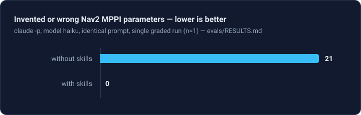
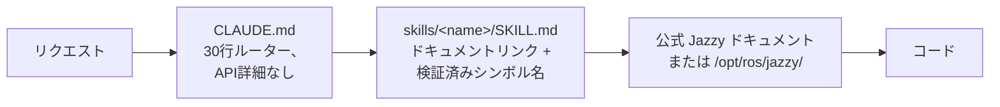

<div align="center">


**ROS 2 Jazzy Jalisco ロボット開発のための Claude Code Skills。**

ハルシネーション対策のリファレンススキル — すべてのスキルが API 名を推測する代わりに公式ドキュメントへルーティングします。


[English](README.md) | [한국어](README.ko.md) | [中文](README.zh.md) | **日本語** | [Español](README.es.md) | [Français](README.fr.md) | [Deutsch](README.de.md)

<sub>🌐 本ドキュメントは機械翻訳です。原文は [English](README.md) をご覧ください。</sub>

| スキル | 常時ロードルーター | ドキュメントリンク（CI チェック） | ロボット実機チェック | 評価：ハルシネーションパラメータ |
| :---: | :---: | :---: | :---: | :---: |
| **11 個** | **30 行** | **101 個** | **4 スクリプト** | **21 → 0** |

</div>

---

## 目次

- [なぜ作ったか](#なぜ作ったか)
- [何が違うのか](#何が違うのか)
- [実測評価](#実測評価)
- [クイックスタート](#クイックスタート)
- [スキル一覧](#スキル一覧)
- [検証スクリプト](#検証スクリプト)
- [仕組み](#仕組み)
- [更新](#更新)
- [コントリビュート](#コントリビュート)
- [ライセンス](#ライセンス)

## なぜ作ったか

ログはシステムが*一貫している*ことを証明するだけで、*正しい*ことは決して証明しません — そしてエージェントには、一貫したストーリーを疑うデフォルトの理由がありません。繰り返し現れる失敗モードが2つあります：

| 失敗モード | 表面上の症状 | 実際の原因 |
| :--- | :--- | :--- |
| **誤ったグラウンドトゥルース** | `/cmd_vel` は前進、`/odom` も前進、全トピック正常 — ロボットは**後ろ向きに**走行 | 静的 TF がセンサーの実際の取り付け向きと反転して宣言；下流すべてが*その誤った変換を基準に*正しく計算され、何も矛盾しない |
| **誤った時代** | レビューは通過、ランタイムで「もっともらしい名前」のメソッドで死亡 | エージェントが暗記した Foxy/Humble 時代のデータでコーディング；その API は Jazzy でリネーム済みか存在しない |

どちらも、グラウンドトゥルースを確認する代わりに*権威がありそうに見える*ものを信頼することから生じます。`ros2-troubleshooting` は、トピックを信頼する前に物理的な確認（ロボットを押す、生の TF を echo する、IMU の重力を確認する）を強制します。他のすべてのスキルは同じルールをコードに適用します：クラス名、メッセージ、フラグを公式 Jazzy ドキュメントまたは `/opt/ros/jazzy/` で検証し — 決して記憶に頼りません。

## 何が違うのか

ほとんどのロボティクススキルパックは API 知識をスキルファイルに焼き込みます。エコシステムが動いた瞬間、焼き込まれたすべてのスニペットは静かに腐りうる「事実」になります。このリポジトリは正反対に賭けます：

| | コンテンツ重厚型スキルパック | **claude-ros2-skills** |
| :--- | :--- | :--- |
| 知識の所在 | スキルファイルに焼き込み、**スキルあたり 400–1,800 行** | 公式ドキュメントへルーティング、**スキルあたり 50–120 行** |
| 常時ロードコンテキスト | SKILL.md 全体 | **30 行**のルーター |
| Jazzy API が変わったら | スニペットが静かに腐る；自分のドキュメントを永遠にリグレッションテスト | 腐る表面がリンク + シンボル名に縮小 — **101 リンク**を週次 CI が検査（生存確認のみ）、デッドリンクはビルド失敗 |
| 検証方式 | 静的 / ログベース | **物理的**：IMU 重力、押しテスト、実機と TF マウントの照合、DDS QoS マッチング |
| ディストリビューション表記 | 1つだけを対象にした例の上に「4つ対応」 | **Jazzy のみ**、最初から明記 |

トレードオフを率直に言えば：公式ドキュメントが薄いトピック（DDS ベンダーチューニング、PREEMPT_RT 内部）では、コンテンツ重厚型パックの方が役立つことがあります。このリポジトリはただ1つ — もっともらしく見えて Jazzy で動かないコードが出る確率の最小化 — に最適化されています。

## 実測評価

主張ではなく、測定です — ただし開示すべき制約が1つ：実行と採点は独立した第三者ではなく、リポジトリ作者側のエージェントセッションが行いました。すべての成果物は第三者が再採点できるようコミット済みです。同一のプロンプトを、スキルのインストール有無だけを変えて新規の headless Claude Code セッションで実行し（ペアごとに同一モデル）、出力をピン留めした Jazzy ソースとシンボル単位で照合採点しました。

| 結果 | スキルなし | スキルあり |
| :--- | ---: | ---: |
| 捏造/誤った Nav2 MPPI パラメータ (haiku) | **21 個** — Nav2 は起動時に死亡 | **0 個** |
| 捏造/誤った Nav2 MPPI パラメータ (sonnet) | 0 個 *(未検証の暗記)* | **0 個** *(ライブ検証済み)* |
| 実際の BEST_EFFORT LiDAR で `/scan` コールバックが発火 (sonnet) | **永遠に発火せず** — 誤ったデフォルト QoS、無音 | **発火する** |
| 書く前に検証した実行 | **0 / 3** | **3 / 3** |



完全な採点表、条件、生成された全アーティファクト：[`evals/RESULTS.md`](./evals/RESULTS.md) · プロトコルとチェックリスト：[`evals/README.md`](./evals/README.md) — 現時点でセルあたり n=1；採点済みトランスクリプトを追加する PR を歓迎します。

<details>
<summary>この数字が意味すること</summary>

名前を付ける価値のある2つのパターン：強いモデルではスキルが「たぶん正しい」を「検証済みで正しい」に変えます；小さいモデルでは、起動すらできない設定と正しい設定の違いになります。そして検証ツールが使えなかった実行では、スキルありのエージェントは推測する代わりに**未検証パラメータの出力を拒否**しました — ベースラインは自分が何も確認していないことにすら気づきませんでした。

</details>

## クイックスタート

**オプション A — プラグインマーケットプレイス（推奨）：**

```
/plugin marketplace add Leehyunbin0131/claude-ros2-skills
/plugin install claude-ros2-skills@claude-ros2-skills
```

更新は `/plugin marketplace update` で反映されます。

**オプション B — 手動コピー：**

```bash
git clone https://github.com/Leehyunbin0131/claude-ros2-skills.git

# プロジェクトレベル（このプロジェクトのみ）
mkdir -p your-project/.claude/skills
cp -r claude-ros2-skills/skills/* your-project/.claude/skills/
cp claude-ros2-skills/CLAUDE.md your-project/

# またはユーザーレベル（全プロジェクト）
mkdir -p ~/.claude/skills
cp -r claude-ros2-skills/skills/* ~/.claude/skills/
```

Claude Code を再起動（または新しいセッションを開始）するとスキルが読み込まれます。

## スキル一覧

| スキル | パス | カバレッジ |
| :--- | :--- | :--- |
| **ros2** | `skills/ros2/SKILL.md` | マスタールーター — 下の適切なドメインスキルへ誘導 |
| **ros2-core** | `skills/ros2-core/SKILL.md` | rclcpp、rclpy、TF2、EKF オドメトリ、QoS プロファイル、パラメータ |
| **ros2-dev** | `skills/ros2-dev/SKILL.md` | Nav2（AMCL、コストマップ、MPPI/Smac）、SLAM Toolbox、RTAB-Map、Isaac ROS |
| **gazebo-sim** | `skills/gazebo-sim/SKILL.md` | Gazebo Harmonic、ros_gz_bridge、ros_gz_sim、SDFormat モデリング |
| **ros2-control** | `skills/ros2-control/SKILL.md` | ros2_control ハードウェア抽象化、コントローラーマネージャ、URDF タグ |
| **ros2-moveit** | `skills/ros2-moveit/SKILL.md` | MoveIt 2、MoveGroup C++/Python API、IK ソルバー、OMPL、MoveIt Servo |
| **ros2-perception** | `skills/ros2-perception/SKILL.md` | image_transport、cv_bridge、vision_msgs、depth_image_proc、PCL |
| **ros2-testing** | `skills/ros2-testing/SKILL.md` | launch_testing、gtest/pytest、rosbag2 C++/Python API、ros2trace |
| **ros2-microros** | `skills/ros2-microros/SKILL.md` | micro-ROS Agent、rclc クライアント API、カスタムトランスポート、静的メモリ |
| **ros2-security** | `skills/ros2-security/SKILL.md` | SROS2、PKI キーストア生成、アクセス制御、DDS Security |
| **ros2-troubleshooting** | `skills/ros2-troubleshooting/SKILL.md` | REP 103/105 グラウンドトゥルース TF ツリー、LiDAR/IMU アライメント、反ハルシネーション |

## 検証スクリプト

`scripts/` は物理チェックを実行可能な pass/fail の事実に変えます（source 済み ROS 2 環境が必要；終了コード 0 = PASS、1 = FAIL、2 = データなし）：

| スクリプト | 検証内容 |
| :--- | :--- |
| `check_imu_gravity.py` | 静止中のロボット → 重力が **+Z** 軸に約 +9.81 m/s²（REP 103）。反転・回転した IMU マウントを捕捉。 |
| `check_odom_direction.py` | ロボットを前に押す → オドメトリ変位が進行方向に正。反転したモーター、エンコーダ、TF を捕捉。 |
| `check_tf_tree.py` | `map→odom→base_link` の解決を確認；各センサーマウントを RPY 度で出力し、約 180° の宣言をフラグして物理的な取り付けと比較。 |
| `check_qos_compat.py` | トピック上のすべてのパブリッシャ/サブスクライバのペアが DDS マッチングルール上 QoS 互換かを確認。「トピックは 30 Hz なのにコールバックが発火しない」という無音の失敗（BEST_EFFORT pub vs RELIABLE sub、durability/deadline/liveliness の不一致）を捕捉。 |

純粋な判定ロジックは ROS なしでユニットテストされ（`python3 scripts/test_checks.py`）、プッシュのたびに CI で実行されます。

## 仕組み



`CLAUDE.md` は API 詳細を決してインラインしません — ルーティングだけを行います。各 `SKILL.md` は公式ドキュメントリンクと正確なクラス/メッセージ/パラメータ名の薄いカタログであり、Claude は推測する代わりに検証します。[`CLAUDE.md`](./CLAUDE.md) を参照。

## 更新

```bash
cd claude-ros2-skills
git pull
cp -r skills/* ~/.claude/skills/   # またはプロジェクトの .claude/skills/
```

## コントリビュート

要約 — スキルはドキュメントリンクのカタログのまま（チュートリアルではない）、すべてのシンボルは Jazzy ドキュメントまたは `/opt/ros/jazzy/` で検証、スクリプトの純粋ロジックは ROS なしでユニットテスト可能に保つ。完全なルール、スキル/スクリプトのチェックリスト、Issue テンプレート：[`CONTRIBUTING.md`](./CONTRIBUTING.md)。

## ライセンス

Apache-2.0 — [LICENSE](./LICENSE) を参照。
