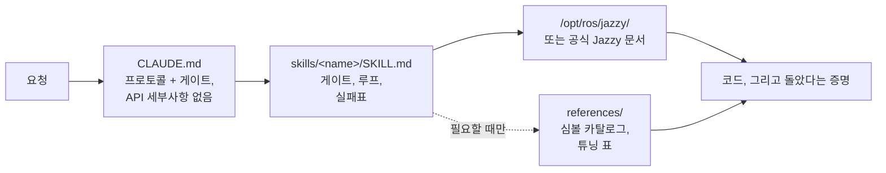

<div align="center">


**ROS 2 Jazzy Jalisco 로봇 개발을 위한 Claude Code Skills.**

에이전트가 ROS 2 작업을 *어떻게* 수행하는지를 바꾸는 스킬 — 모르는 것을 먼저 확정하고, 설치된 시스템으로 검증하고, 실제로 돌았음을 증명합니다.


[English](README.md) | **한국어** | [中文](README.zh.md) | [日本語](README.ja.md) | [Español](README.es.md) | [Français](README.fr.md) | [Deutsch](README.de.md)

<sub>🌐 이 문서는 기계 번역본입니다. 원문은 [English](README.md)입니다.</sub>

| 스킬 | 상시 로드 프로토콜 | 문서 링크(CI 점검) | 물리 로봇 체크 | Evals: 작성 전 검증 |
| :---: | :---: | :---: | :---: | :---: |
| **11개** | **26줄** | **38개** | **4개 스크립트** | **0/3 → 3/3** |

</div>

---

## 목차

- [비용이 드는 실패들](#비용이-드는-실패들)
- [이 스킬들의 설계 원칙](#이-스킬들의-설계-원칙)
- [무엇이 다른가](#무엇이-다른가)
- [실측 평가](#실측-평가)
- [빠른 시작](#빠른-시작)
- [스킬 목록](#스킬-목록)
- [검증 스크립트](#검증-스크립트)
- [동작 방식](#동작-방식)
- [업데이트](#업데이트)
- [로드맵](#로드맵)
- [기여하기](#기여하기)
- [라이선스](#라이선스)

## 비용이 드는 실패들

에이전트가 작성한 ROS 2 코드에서 비싼 실패는 문법 오류가 아닙니다. **멀쩡해 보이는** 것들입니다:

| 실패 | 겉으로 보이는 것 | 에이전트가 빠지는 이유 |
| :--- | :--- | :--- |
| **무증상 무동작** | `ros2 topic hz`는 30 Hz인데 콜백이 안 불림 | 기본 RELIABLE 서브스크라이버 vs BEST_EFFORT 드라이버. 컴파일되고 리뷰도 통과하지만 DDS 레벨에서 아무것과도 매칭되지 않음 |
| **잘못된 그라운드트루스** | `/cmd_vel` 전진, `/odom` 전진 — 로봇은 **뒤로** 주행 | 정적 TF가 실제 장착과 뒤집힌 채 선언됨. 하류 전체가 *그 잘못된 변환 기준으로* 올바르게 계산되어 아무것도 모순되지 않음 |
| **잘못된 시대** | 리뷰는 통과, 런타임에 "그럴듯한 이름"의 메서드로 사망 | 암기된 Foxy/Humble 시절 API가 Jazzy에서 개명됐거나 존재한 적 없음 |
| **잘못된 전제** | 한 문장이면 바로잡았을 가정 위에 200줄을 쌓음 | 쓰기 전에 모르는 것을 확정하라고 아무도 시키지 않음 |

컴파일러도, 린터도, 로그 검사도 이 중 무엇 하나 잡아내지 못합니다. 하나하나가 왕복 비용입니다 — 출력을 읽고, 뭐가 틀렸는지 알아내고, 설명하고, 에이전트가 다시 생성합니다.

## 이 스킬들의 설계 원칙

모든 스킬에 적용된 네 가지 규칙.

**1. 쓰기 전에 모르는 것을 확정합니다.** 어떤 사실은 어느 문서에도 없습니다 — 실기인지 시뮬레이션인지, 기존 워크스페이스를 확장하는지 새로 만드는지, 지금 건드리는 변환을 이미 어느 노드가 퍼블리시하는지, 로봇의 실제 형상은 어떤지. [`CLAUDE.md`](./CLAUDE.md)가 이것들을 먼저 매듭짓게 하고, 요청에 없으면 묻게 합니다. 도메인 고유의 미지수는 스킬에 있습니다: `ros2-dev`는 Nav2 파라미터를 한 줄 쓰기 전에 footprint, 구동 방식, 위치추정 소스를 묻습니다.

**2. 끝이 정의된 루프.** 모든 스킬이 *검증 → 작성 → 증명*으로 돕니다: 설치된 시스템의 기본값을 읽고, 한 번에 하나씩 바꾸고, 실제로 돌았는지 확인합니다. "완료"는 관찰된 증거를 뜻합니다 — 빌드 성공, `ros2 topic echo`에 데이터가 뜸, 체크 스크립트 통과 — 코드를 만들어냈다는 것이 아니라.

**3. 산문보다 실패표.** 가장 값어치 있는 콘텐츠는 증상 → 근본 원인 → 조치 한 행입니다. 공식 문서 어디에도 그렇게 조합되어 있지 않고, 릴리스가 나와도 썩지 않기 때문입니다:

> `[`는 GZ→ROS, `]`는 ROS→GZ · `16UC1`은 밀리미터, `32FC1`은 미터 · `joint_state_broadcaster`는 자동 스폰되지 않음 · `raytrace_max_range` ≤ `obstacle_max_range`면 장애물이 영영 안 지워짐 · rclc는 unbounded 메시지 필드를 자동 할당하지 않음

**4. 세 개의 층, 세 개의 가격표.** 스킬의 `description`은 항상 컨텍스트에 있고, 본문은 스킬이 발동할 때 로드되며, `references/` 파일은 작업에 필요할 때만 읽힙니다. 벌크 심볼 카탈로그와 튜닝 표는 `references/`에 있어서, AMCL을 디버깅하는 사람이 비헤이비어 트리 노드 목록까지 지불하지 않습니다 — 그리고 모든 로드에 세금을 매기지 않으면서 깊이를 더할 수 있습니다.

## 무엇이 다른가

대부분의 로보틱스 스킬 팩은 API 지식을 스킬 파일 안에 박제합니다. 생태계가 움직이는 순간, 박제된 모든 스니펫은 조용히 썩어갈 수 있는 사실이 됩니다. 이 레포는 정반대에 베팅합니다:

| | 콘텐츠 중심 스킬 팩 | **claude-ros2-skills** |
| :--- | :--- | :--- |
| 지식의 위치 | 스킬 파일에 박제, **스킬당 400–1,800줄** | 공식 문서로 라우팅; 본문 **~60줄**, 벌크 상세는 `references/`에 두고 **필요할 때만** 읽음 |
| 상시 로드 컨텍스트 | SKILL.md 전체 | **26줄** 프로토콜 |
| Jazzy API가 바뀌면 | 스니펫이 조용히 썩음; 자기 문서 회귀 테스트를 영원히 | 썩을 표면이 진입점 링크 + 심볼 이름으로 축소 — **38개 링크**를 주간 CI가 검사(생존 여부만), 죽은 링크는 빌드 실패 |
| 검증 방식 | 정적 / 로그 기반 | **물리적**: IMU 중력, 밀기 테스트, 실제 하드웨어 대비 TF 마운트, DDS QoS 매칭 |
| distro 표기 | 한 distro만 겨냥한 예제 위에 "4개 지원" | **Jazzy 단일**, 처음부터 명시 |

이 레포는 단 하나에 최적화되어 있습니다: Jazzy에서 실행되지 않는 그럴싸한 코드가 나올 확률의 최소화.

## 실측 평가

동일한 프롬프트를 스킬 설치 유무만 다르게 하여 새 헤드리스 Claude Code 세션에서 실행하고(쌍마다 동일 모델), 핀 고정된 업스트림 `jazzy` 소스와 심볼 단위로 대조 채점했습니다.

| 결과 | 스킬 없음 | 스킬 있음 |
| :--- | ---: | ---: |
| 오류/발명 Nav2 MPPI 키 (haiku) | **~30개** — `critics:` 목록 자체가 없어 기동 불가 | **~16–20개** — 플러그인 문자열·`motion_model`·체커 네임스페이스는 정확 |
| 실제 BEST_EFFORT LiDAR에서 `/scan` 콜백 동작 (sonnet) | **영원히 안 불림** — 잘못된 기본 QoS, 무증상 | **동작** |
| 작성 전 검증을 수행한 런 | **0 / 3** | **3 / 3** |

가장 선명한 결과는 행동의 차이입니다: 베이스라인은 검증 도구를 쓸 수 있었는데도 모든 런에서 **0회** 사용한 반면, 스킬을 적용한 런은 매번 스킬을 로드하고 먼저 기본값을 찾아 나섰습니다. 한 런은 게이트 질문 세 개를 먼저 던지고, 조용히 넘겨짚는 대신 무엇을 확인했고 무엇을 확인하지 못했는지 정확히 보고했습니다.

전체 채점표·조건·런별 분석: [`evals/RESULTS.md`](./evals/RESULTS.md) · 프로토콜, 태스크 체크리스트, 컨테이너 레시피: [`evals/README.md`](./evals/README.md). 채점된 트랜스크립트를 추가하는 PR을 환영합니다.

## 빠른 시작

**옵션 A — 플러그인 마켓플레이스 (권장):**

```
/plugin marketplace add Leehyunbin0131/claude-ros2-skills
/plugin install claude-ros2-skills@claude-ros2-skills
```

업데이트는 `/plugin marketplace update`로 반영됩니다.

**옵션 B — 수동 복사:**

```bash
git clone https://github.com/Leehyunbin0131/claude-ros2-skills.git

# 프로젝트 수준 (이 프로젝트만)
mkdir -p your-project/.claude/skills
cp -r claude-ros2-skills/skills/* your-project/.claude/skills/
cp claude-ros2-skills/CLAUDE.md your-project/

# 또는 사용자 수준 (모든 프로젝트)
mkdir -p ~/.claude/skills
cp -r claude-ros2-skills/skills/* ~/.claude/skills/
```

Claude Code를 재시작(또는 새 세션 시작)하면 스킬이 반영됩니다.

## 스킬 목록

| 스킬 | 경로 | 커버리지 |
| :--- | :--- | :--- |
| **ros2-core** | `skills/ros2-core/SKILL.md` | rclcpp, rclpy, TF2, EKF 오도메트리, QoS 프로파일, 파라미터 |
| **ros2-package** | `skills/ros2-package/SKILL.md` | `ros2 pkg create`, CMakeLists/setup.py 배선, colcon 빌드 및 소싱, 커스텀 인터페이스 |
| **ros2-dev** | `skills/ros2-dev/SKILL.md` | Nav2 (AMCL, 코스트맵, MPPI/Smac), SLAM Toolbox, RTAB-Map, Isaac ROS |
| **gazebo-sim** | `skills/gazebo-sim/SKILL.md` | Gazebo Harmonic, ros_gz_bridge, ros_gz_sim, SDFormat 모델링 |
| **ros2-control** | `skills/ros2-control/SKILL.md` | ros2_control 하드웨어 추상화, 컨트롤러 매니저, URDF 태그 |
| **ros2-moveit** | `skills/ros2-moveit/SKILL.md` | MoveIt 2, MoveGroup C++/Python API, IK 솔버, OMPL, MoveIt Servo |
| **ros2-perception** | `skills/ros2-perception/SKILL.md` | image_transport, cv_bridge, vision_msgs, depth_image_proc, PCL |
| **ros2-testing** | `skills/ros2-testing/SKILL.md` | launch_testing, gtest/pytest, rosbag2 C++/Python API, ros2trace |
| **ros2-microros** | `skills/ros2-microros/SKILL.md` | micro-ROS Agent, rclc 클라이언트 API, 커스텀 트랜스포트, 정적 메모리 |
| **ros2-security** | `skills/ros2-security/SKILL.md` | SROS2, PKI 키스토어 생성, 접근 제어, DDS Security |
| **ros2-troubleshooting** | `skills/ros2-troubleshooting/SKILL.md` | REP 103/105 그라운드트루스 TF 트리, LiDAR/IMU 정렬, 물리 검증 |

## 검증 스크립트

`ros2-troubleshooting` 스킬 안에 번들되어(`skills/ros2-troubleshooting/scripts/`) 어떤 설치 경로로도 함께 따라옵니다. 물리적 확인을 실행 가능한 pass/fail 사실로 바꿉니다 (소싱된 ROS 2 환경 필요; 종료 코드 0 = PASS, 1 = FAIL, 2 = 데이터 없음):

| 스크립트 | 검증 내용 |
| :--- | :--- |
| `check_imu_gravity.py` | 정지 상태의 로봇 → 중력이 **+Z**축에 ~+9.81 m/s² (REP 103). 뒤집히거나 회전된 IMU 마운트를 잡아냅니다. |
| `check_odom_direction.py` | 로봇을 앞으로 밀기 → 오도메트리 변위가 헤딩 방향으로 양수. 반전된 모터, 엔코더, TF를 잡아냅니다. |
| `check_tf_tree.py` | `map→odom→base_link` 해석 확인; 각 센서 마운트를 RPY 도 단위로 출력하고 ~180° 선언을 표시해 실제 장착과 비교하게 합니다. |
| `check_qos_compat.py` | 토픽의 모든 퍼블리셔/서브스크라이버 쌍이 DDS 매칭 규칙상 QoS 호환인지 확인. "토픽은 30 Hz인데 내 콜백은 안 불림"이라는 무증상 실패(BEST_EFFORT pub vs RELIABLE sub, durability/deadline/liveliness 불일치)를 잡아냅니다. |

순수 판정 로직은 ROS 없이 단위 테스트되며(`python3 skills/ros2-troubleshooting/scripts/test_checks.py`) 모든 푸시마다 CI에서 실행됩니다.

## 동작 방식



`CLAUDE.md`는 API 세부사항을 담지 않습니다 — 프로토콜과, 쓰기 전에 답해야 할 질문을 정합니다. 각 `SKILL.md` 본문은 결정을 담습니다: 무엇을 확정할지, 검증-작성-증명 루프, 그리고 그 도메인의 실패표. 벌크 참조 자료는 한 홉 떨어진 `references/`에 있습니다. [`CLAUDE.md`](./CLAUDE.md) 참고.

## 업데이트

```bash
cd claude-ros2-skills
git pull
cp -r skills/* ~/.claude/skills/   # 또는 프로젝트의 .claude/skills/
```

## 로드맵

1. **`ros:jazzy` 컨테이너 안에서 채점하는 eval 쌍** — 핀 고정 소스가 아니라 실제 설치본 대비. 컨테이너 레시피는 [`evals/README.md`](./evals/README.md)에 있습니다.
2. **Task 5 결과** — 이진 런타임 결과(`ros2 topic echo`에 데이터가 뜨는가)를 가진 태스크로, `ros2-package`와 빌드/소싱 루프를 끝에서 끝까지 검증합니다.
3. **corrections-to-done 지표화.** "아니 그거 말고"를 몇 번 반복하는지가 유저가 실제로 지불하는 숫자입니다.
4. **`references/` 해석의 결정론화** — 벌크 상세가 관련 있을 때 항상 도달하도록.
5. **본문/`references` 분리 확대** — 참조 벌크가 실제로 크고 로드 빈도가 높은 `ros2-core`와 `gazebo-sim`이 다음 후보입니다.

## 기여하기

요약 — 스킬 본문은 결정 콘텐츠(게이트, 루프, 실패표)로 유지하고 벌크 상세는 `references/`에, 모든 심볼은 Jazzy 문서나 `/opt/ros/jazzy/`로 검증, 스크립트의 순수 로직은 ROS 없이 단위 테스트 가능하게 유지. 전체 규칙, 스킬/스크립트 체크리스트, 이슈 템플릿: [`CONTRIBUTING.md`](./CONTRIBUTING.md).

## 라이선스

Apache-2.0 — [LICENSE](./LICENSE) 참고.
