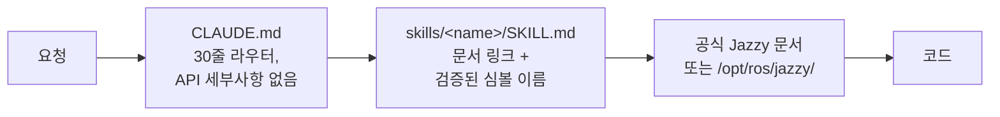

<div align="center">


**ROS 2 Jazzy Jalisco 로봇 개발을 위한 Claude Code Skills.**

환각 제로 레퍼런스 스킬 — 모든 스킬이 API 이름을 추측하는 대신 공식 문서로 라우팅합니다.


[English](README.md) | **한국어** | [中文](README.zh.md) | [日本語](README.ja.md) | [Español](README.es.md) | [Français](README.fr.md) | [Deutsch](README.de.md)

<sub>🌐 이 문서는 기계 번역본입니다. 원문은 [English](README.md)입니다.</sub>

| 스킬 | 상시 로드 라우터 | 검증된 문서 링크 | 로봇 그라운드트루스 체크 | Evals: 환각 파라미터 |
| :---: | :---: | :---: | :---: | :---: |
| **11개** | **30줄** | **101개** | **4개 스크립트** | **21 → 0** |

</div>

---

## 목차

- [왜 만들었나](#왜-만들었나)
- [무엇이 다른가](#무엇이-다른가)
- [실측 평가](#실측-평가)
- [빠른 시작](#빠른-시작)
- [스킬 목록](#스킬-목록)
- [검증 스크립트](#검증-스크립트)
- [동작 방식](#동작-방식)
- [업데이트](#업데이트)
- [기여하기](#기여하기)
- [라이선스](#라이선스)

## 왜 만들었나

로그는 시스템이 *일관적*임을 증명할 뿐, *올바름*을 증명하지 못합니다 — 그리고 에이전트에게는 일관된 이야기를 의심할 이유가 기본적으로 없습니다. 반복해서 나타나는 실패 유형이 두 가지 있습니다:

| 실패 유형 | 겉으로 보이는 증상 | 실제 원인 |
| :--- | :--- | :--- |
| **잘못된 그라운드트루스** | `/cmd_vel`은 전진, `/odom`도 전진, 모든 토픽 정상 — 로봇은 **뒤로** 주행 | 정적 TF가 실제 센서 장착 방향과 뒤집힌 채 선언됨; 하류 전체가 *그 잘못된 변환 기준으로* 올바르게 계산되어 아무것도 모순되지 않음 |
| **잘못된 시대** | 리뷰에선 통과, 런타임에서 "그럴듯한 이름"의 메서드로 사망 | 에이전트가 암기된 Foxy/Humble 시절 데이터로 코딩; 해당 API는 Jazzy에서 개명됐거나 존재한 적 없음 |

둘 다 그라운드트루스를 확인하는 대신 *권위 있어 보이는* 것을 신뢰한 데서 옵니다. `ros2-troubleshooting`은 토픽을 신뢰하기 전에 물리적 확인(로봇을 밀어보고, 원시 TF를 echo하고, IMU 중력을 확인)을 강제합니다. 나머지 모든 스킬은 같은 규칙을 코드에 적용합니다: 클래스 이름, 메시지, 플래그를 공식 Jazzy 문서나 `/opt/ros/jazzy/`로 검증하고 — 절대 기억에 의존하지 않습니다.

## 무엇이 다른가

대부분의 로보틱스 스킬 팩은 API 지식을 스킬 파일 안에 박제합니다. 생태계가 움직이는 순간, 박제된 모든 스니펫은 조용히 썩어갈 수 있는 사실이 됩니다. 이 레포는 정반대에 베팅합니다:

| | 콘텐츠 중심 스킬 팩 | **claude-ros2-skills** |
| :--- | :--- | :--- |
| 지식의 위치 | 스킬 파일에 박제, **스킬당 400–1,800줄** | 공식 문서로 라우팅, **스킬당 50–120줄** |
| 상시 로드 컨텍스트 | SKILL.md 전체 | **30줄** 라우터 |
| Jazzy API가 바뀌면 | 스니펫이 조용히 썩음; 자기 문서 회귀 테스트를 영원히 | 썩을 표면이 링크 + 심볼 이름으로 축소 — **101개 링크**를 주간 CI가 검사(생존 여부만), 죽은 링크는 빌드 실패 |
| 검증 방식 | 정적 / 로그 기반 | **물리적**: IMU 중력, 밀기 테스트, 실제 하드웨어 대비 TF 마운트, DDS QoS 매칭 |
| distro 표기 | 한 distro만 겨냥한 예제 위에 "4개 지원" | **Jazzy 단일**, 처음부터 명시 |

트레이드오프를 솔직히 말하면: 공식 문서가 빈약한 주제(DDS 벤더 튜닝, PREEMPT_RT 내부)에서는 콘텐츠 중심 팩이 더 나을 수 있습니다. 이 레포는 단 하나 — Jazzy에서 실행되지 않는 그럴싸한 코드가 나올 확률의 최소화 — 에 최적화되어 있습니다.

## 실측 평가

주장이 아니라 측정입니다 — 단, 공시할 한계가 하나 있습니다: 실행과 채점을 독립된 제3자가 아니라 레포 저자 측 에이전트 세션이 수행했습니다. 모든 산출물은 제3자 재채점이 가능하도록 커밋되어 있습니다. 동일한 프롬프트를 스킬 설치 유무만 다르게 하여 새 헤드리스 Claude Code 세션에서 실행했고(쌍마다 동일 모델), 출력물을 핀 고정된 Jazzy 소스와 심볼 단위로 대조 채점했습니다.

| 결과 | 스킬 없음 | 스킬 있음 |
| :--- | ---: | ---: |
| 발명/오류 Nav2 MPPI 파라미터 (haiku) | **21개** — Nav2 기동 시 사망 | **0개** |
| 발명/오류 Nav2 MPPI 파라미터 (sonnet) | 0개 *(검증 없는 암기)* | **0개** *(라이브 검증)* |
| 실제 BEST_EFFORT LiDAR에서 `/scan` 콜백 동작 (sonnet) | **영원히 안 불림** — 잘못된 기본 QoS, 무증상 | **동작** |
| 작성 전 검증을 수행한 런 | **0 / 3** | **3 / 3** |


전체 채점표·조건·생성 산출물: [`evals/RESULTS.md`](./evals/RESULTS.md) · 프로토콜과 체크리스트: [`evals/README.md`](./evals/README.md) — 아직 셀당 n=1이며, 채점된 트랜스크립트를 추가하는 PR을 환영합니다.

<details>
<summary>숫자의 의미</summary>

이름 붙일 만한 패턴 두 가지: 강한 모델에서는 스킬이 "아마 맞을 것"을 "검증되어 맞음"으로 바꿉니다; 작은 모델에서는 기동조차 못 하는 설정과 올바른 설정의 차이입니다. 그리고 검증 도구가 없던 런에서 스킬 적용 에이전트는 추측하는 대신 **검증되지 않은 파라미터 출력을 거부**했습니다 — 베이스라인은 자신이 아무것도 확인하지 않았다는 사실조차 인지하지 못했습니다.

</details>

## 빠른 시작

**옵션 A — 플러그인 마켓플레이스 (권장):**

```
/plugin marketplace add Leehyunbin0131/claude-ros2-skills
/plugin install claude-ros2-skills@claude-ros2-skills
```

업데이트는 `/plugin marketplace update`로 반영됩니다.

**옵션 B — 수동 복사:**

```bash
git clone https://github.com/Leehyunbin0131/claude-ros2-skills.git

# 프로젝트 수준 (이 프로젝트만)
mkdir -p your-project/.claude/skills
cp -r claude-ros2-skills/skills/* your-project/.claude/skills/
cp claude-ros2-skills/CLAUDE.md your-project/

# 또는 사용자 수준 (모든 프로젝트)
mkdir -p ~/.claude/skills
cp -r claude-ros2-skills/skills/* ~/.claude/skills/
```

Claude Code를 재시작(또는 새 세션 시작)하면 스킬이 반영됩니다.

## 스킬 목록

| 스킬 | 경로 | 커버리지 |
| :--- | :--- | :--- |
| **ros2** | `skills/ros2/SKILL.md` | 마스터 라우터 — 아래의 알맞은 도메인 스킬로 안내 |
| **ros2-core** | `skills/ros2-core/SKILL.md` | rclcpp, rclpy, TF2, EKF 오도메트리, QoS 프로파일, 파라미터 |
| **ros2-dev** | `skills/ros2-dev/SKILL.md` | Nav2 (AMCL, 코스트맵, MPPI/Smac), SLAM Toolbox, RTAB-Map, Isaac ROS |
| **gazebo-sim** | `skills/gazebo-sim/SKILL.md` | Gazebo Harmonic, ros_gz_bridge, ros_gz_sim, SDFormat 모델링 |
| **ros2-control** | `skills/ros2-control/SKILL.md` | ros2_control 하드웨어 추상화, 컨트롤러 매니저, URDF 태그 |
| **ros2-moveit** | `skills/ros2-moveit/SKILL.md` | MoveIt 2, MoveGroup C++/Python API, IK 솔버, OMPL, MoveIt Servo |
| **ros2-perception** | `skills/ros2-perception/SKILL.md` | image_transport, cv_bridge, vision_msgs, depth_image_proc, PCL |
| **ros2-testing** | `skills/ros2-testing/SKILL.md` | launch_testing, gtest/pytest, rosbag2 C++/Python API, ros2trace |
| **ros2-microros** | `skills/ros2-microros/SKILL.md` | micro-ROS Agent, rclc 클라이언트 API, 커스텀 트랜스포트, 정적 메모리 |
| **ros2-security** | `skills/ros2-security/SKILL.md` | SROS2, PKI 키스토어 생성, 접근 제어, DDS Security |
| **ros2-troubleshooting** | `skills/ros2-troubleshooting/SKILL.md` | REP 103/105 그라운드트루스 TF 트리, LiDAR/IMU 정렬, 반환각 |

## 검증 스크립트

`scripts/`는 물리적 확인을 실행 가능한 pass/fail 사실로 바꿉니다 (소싱된 ROS 2 환경 필요; 종료 코드 0 = PASS, 1 = FAIL, 2 = 데이터 없음):

| 스크립트 | 검증 내용 |
| :--- | :--- |
| `check_imu_gravity.py` | 정지 상태의 로봇 → 중력이 **+Z**축에 ~+9.81 m/s² (REP 103). 뒤집히거나 회전된 IMU 마운트를 잡아냅니다. |
| `check_odom_direction.py` | 로봇을 앞으로 밀기 → 오도메트리 변위가 헤딩 방향으로 양수. 반전된 모터, 엔코더, TF를 잡아냅니다. |
| `check_tf_tree.py` | `map→odom→base_link` 해석 확인; 각 센서 마운트를 RPY 도 단위로 출력하고 ~180° 선언을 표시해 실제 장착과 비교하게 합니다. |
| `check_qos_compat.py` | 토픽의 모든 퍼블리셔/서브스크라이버 쌍이 DDS 매칭 규칙상 QoS 호환인지 확인. "토픽은 30 Hz인데 내 콜백은 안 불림"이라는 무증상 실패(BEST_EFFORT pub vs RELIABLE sub, durability/deadline/liveliness 불일치)를 잡아냅니다. |

순수 판정 로직은 ROS 없이 단위 테스트되며(`python3 scripts/test_checks.py`) 모든 푸시마다 CI에서 실행됩니다.

## 동작 방식



`CLAUDE.md`는 API 세부사항을 절대 인라인하지 않습니다 — 오직 라우팅만 합니다. 각 `SKILL.md`는 공식 문서 링크와 정확한 클래스/메시지/파라미터 이름의 얇은 카탈로그이며, 그래서 Claude는 추측하는 대신 검증합니다. [`CLAUDE.md`](./CLAUDE.md) 참고.

## 업데이트

```bash
cd claude-ros2-skills
git pull
cp -r skills/* ~/.claude/skills/   # 또는 프로젝트의 .claude/skills/
```

## 기여하기

요약 — 스킬은 문서 링크 카탈로그로 유지(튜토리얼 아님), 모든 심볼은 Jazzy 문서나 `/opt/ros/jazzy/`로 검증, 스크립트의 순수 로직은 ROS 없이 단위 테스트 가능하게 유지. 전체 규칙, 스킬/스크립트 체크리스트, 이슈 템플릿: [`CONTRIBUTING.md`](./CONTRIBUTING.md).

## 라이선스

Apache-2.0 — [LICENSE](./LICENSE) 참고.
