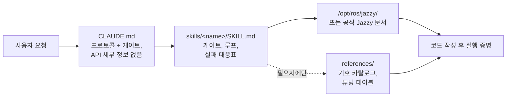

<div align="center">


**Claude Code Skills for ROS 2 Jazzy Jalisco robotics development.**

AI 에이전트의 ROS 2 개발 방식을 혁신하는 스킬: 작업 시작 전 미확인 파라미터 사전 파악, 설치된 패키지 기반 설정 검증, 실제 동작 증거를 통한 실행 확정.


[English](README.md) | **한국어** | [中文](README.zh.md) | [日本語](README.ja.md) | [Español](README.es.md) | [Français](README.fr.md) | [Deutsch](README.de.md)

<sub>🌐 이 문서는 기계 번역본입니다. 원문은 [English](README.md)입니다.</sub>

| 스킬 수 | 항상 로드되는 프로토콜 | 문서 링크 (CI 검증) | 실물 로봇 검증 스크립트 | 실측 평가: 작성 전 검증 |
| :---: | :---: | :---: | :---: | :---: |
| **11** | **26줄** | **38개** | **4개** | **0/3 → 3/3** |

</div>

---

## 목차

- [비용이 드는 실패들](#비용이-드는-실패들)
- [이 스킬들의 설계 원칙](#이-스킬들의-설계-원칙)
- [무엇이 다른가](#무엇이-다른가)
- [실측 평가](#실측-평가)
- [빠른 시작](#빠른-시작)
- [스킬 목록](#스킬-목록)
- [검증 스크립트](#검증-스크립트)
- [동작 방식](#동작-방식)
- [업데이트](#업데이트)
- [로드맵](#로드맵)
- [기여하기](#기여하기)
- [라이선스](#라이선스)

## 비용이 드는 실패들

AI가 생성한 ROS 2 코드에서 가장 비싼 비용을 치르게 하는 오류는 단순한 구문 오류(syntax error)가 아닙니다. 언뜻 보기에는 전혀 문제가 없어 보이는 미묘한 결함들입니다:

| 실패 유형 | 표면적 증상 | 에이전트가 이 문제에 직면하는 이유 |
| :--- | :--- | :--- |
| **조용한 실패 (Silent failure)** | `ros2 topic hz`에는 30 Hz가 출력되지만 콜백 함수가 호출되지 않음 | 기본 설정인 RELIABLE subscriber가 BEST_EFFORT publisher에 연결을 시도함. 코드는 정상 컴파일되고 코드 리뷰를 통과하지만, DDS 미들웨어 수준에서 통신이 실패함. |
| **잘못된 참값 (Wrong ground truth)** | `/cmd_vel`과 `/odom` 모두 전진으로 표시되지만, 실제 로봇은 **후진**함 | 정적 TF 프레임이 실물 장착 상태와 반대로 뒤집혀 있음. 하위 컴포넌트가 *잘못된 트랜스폼*을 기반으로 정상 계산하므로 겉으로는 오류가 나타나지 않음. |
| **구버전 API 사용** | 코드가 리뷰를 통과했으나 런타임에 잘못된 메서드를 호출하여 실패함 | 에이전트가 Jazzy에서 이름이 변경되었거나 삭제된 Foxy 또는 Humble의 더 이상 사용되지 않는(deprecated) API 메서드를 사용함. |
| **잘못된 전제** | 한 문장이면 바로잡을 수 있었을 추측을 바탕으로 에이전트가 200줄의 코드를 작성함 | 코드 생성 전에 누락된 정보를 확인하도록 에이전트에 요청하는 메커니즘이 없음. |

컴파일러, 린터, 로그 분석 도구 모두 이러한 숨겨진 문제들을 감지하지 못합니다. 이러한 오류를 하나 해결할 때마다 출력 검토, 원인 진단, 수정 사항 설명, 코드 재생성이라는 피드백 주기를 추가로 거쳐야 합니다.

## 이 스킬들의 설계 원칙

본 리포지토리의 모든 스킬은 다음 4가지 설계 원칙을 따릅니다:

**1. 작업 시작 전 미확인 변수 우선 식별.** 실기기인지 시뮬레이션 환경인지, 기존 워크스페이스를 확장할지 신규 생성할지, 특정 트랜스폼을 이미 발행 중인 노드가 있는지, 로봇의 정확한 형상이 어떠한지 등 주요 운용 정보는 문서에 명시되어 있지 않은 경우가 많습니다. [`CLAUDE.md`](./CLAUDE.md)는 에이전트가 코드를 생성하기 전에 이러한 불확실한 사항을 먼저 확인하도록 지시합니다. 도메인 특화 스킬은 세부 파라미터를 관리합니다. 예를 들어 `ros2-dev`는 Nav2 파라미터를 설정하기 전에 로봇의 Footprint, 구동 역학(kinematics), 위치 추정(localization) 소스를 먼저 확인합니다.

**2. 명확한 종료 조건을 갖춘 구조화된 루프 실행.** 모든 스킬은 *검증(verify) → 작성(write) → 증명(prove)* 주기를 따릅니다. 설치된 환경에서 시스템 기본값을 점검하고, 점진적으로 변경 사항을 적용하며, 실행 상태를 확인합니다. 단순히 코드 파일을 작성하는 것에 그치지 않고, 성공적인 빌드, `ros2 topic echo`의 실시간 데이터 수신, 검증 스크립트 통과 등 관측된 증거가 확보되어야만 작업이 완료됩니다.

**3. 장문의 설명보다 구조화된 실패 대응표 우선.** 증상 → 근본 원인 → 조치 사항을 매핑한 구조화된 테이블은 공식 문서에서 놓치기 쉬운 명확하고 지속 가능한 지침을 제공하며, 버전이 바뀌어도 높은 신뢰성을 유지합니다:

> `[`는 GZ→ROS, `]`는 ROS→GZ · `16UC1`은 밀리미터 단위, `32FC1`은 미터 단위 · `joint_state_broadcaster`는 자동 생성되지 않음 · `raytrace_max_range` ≤ `obstacle_max_range` 설정 시 장애물이 제거되지 않음 · rclc는 크기 미지정(unbounded) 메시지 필드를 자동 할당하지 않음

**4. 3계층 아키텍처를 통한 컨텍스트 사용 최적화.** 각 스킬은 컨텍스트 효율성의 균형을 맞춥니다. 스킬 설명은 상시 컨텍스트에 유지되고, 스킬 본문은 호출 시 로드되며, `references/` 하위의 심층 참조 파일은 필요할 때만 로드됩니다. 방대한 기호(symbol) 카탈로그와 세부 파라미터 튜닝 테이블은 `references/`에 위치하므로 컨텍스트 낭비를 방지하고, 특정 컴포넌트(예: AMCL)를 디버깅할 때 불필요한 문서(예: 행동 트리 노드)가 로드되지 않도록 합니다.

## 무엇이 다른가

대부분의 로보틱스 스킬 팩은 정적 API 지식을 스킬 파일에 직접 포함합니다. 처음에는 사용하기 쉽지만, 바탕이 되는 패키지가 업데이트되면 구버전 스니펫이 남아 조용한 실패를 일으키게 됩니다. 본 리포지토리는 동적이고 문서 중심적인(documentation-driven) 방식을 채택합니다:

| 기능 / 특징 | 기존의 내용 집약형 스킬 팩 | **claude-ros2-skills** |
| :--- | :--- | :--- |
| 지식 저장 위치 | 스킬 파일 내 직접 포함 (**스킬당 400~1,800줄**) | 공식 문서와 연결 (**약 60줄**의 스킬 본문); 세부 참조 문서는 **필요시에만** 조회 |
| 상시 로드되는 컨텍스트 | `SKILL.md` 파일 전체 | **26줄** 분량의 핵심 프로토콜 |
| Jazzy API 업데이트 대응 | 스니펫이 감지 없이 구버전화됨; 지속적인 수동 테스트 업데이트 필요 | 구버전 스니펫 위험이 진입점 링크 및 기호 이름 수준으로 최소화됨 — **38개 문서 링크**를 CI로 매주 검증 |
| 검증 방식 | 정적 코드 분석 또는 로그 확인 | **실물 및 런타임 검증**: IMU 중력 검증, 오도메트리 방향 테스트, TF 프레임 정렬, DDS QoS 호환성 검증 |
| 지원 배포판 범위 | 단일 배포판만 대상으로 하면서 여러 ROS 배포판 지원을 주장 | **ROS 2 Jazzy 전용**, 명확하게 설계 및 검증됨 |

본 리포지토리는 단 하나의 목적에 최적화되어 있습니다: 그럴듯해 보이지만 ROS 2 Jazzy에서 실행되지 않는 코드가 생성될 위험을 최소화하는 것입니다.

## 실측 평가

성능 평가를 위해 동일한 프롬프트를 이 스킬 설치 전후의 깨끗한 헤드리스(headless) Claude Code 세션에서 각각 실행했습니다. 각 평가 쌍은 동일한 모델을 사용했으며, 고정된(pinned) 업스트림 ROS 2 Jazzy 소스 리포지토리를 기준으로 기호 단위(symbol-by-symbol) 검증을 수행했습니다.

| 지표 / 테스트 항목 | 스킬 미적용 | 스킬 적용 |
| :--- | ---: | ---: |
| 잘못되거나 환각(fabrication)된 Nav2 MPPI 키 수 (Haiku) | **약 30개** — 필수 `critics:` 목록 누락; 설정 실행 실패 | **약 16~20개** — 올바른 플러그인 문자열, `motion_model` 및 checker 네임스페이스 사용 |
| 실물 BEST_EFFORT LiDAR에서 `/scan` 콜백 실행 여부 (Sonnet) | **실패** — QoS 기본값 불일치로 인한 조용한 실패 | **성공** — 정상적으로 연결됨 |
| 코드 작성 전 환경을 먼저 검증한 실행 횟수 | **0 / 3** | **3 / 3** |

가장 눈에 띄는 결과는 행동 방식의 변화입니다. 스킬이 없는 베이스라인 세션은 검증 도구가 제공되어도 **단 하나도** 사용하지 않은 반면, 본 스킬을 갖춘 세션은 관련 지침을 로드하고 시스템 기본값을 먼저 점검했습니다. 한 테스트에서 에이전트는 작업 시작 전 핵심 명확화 질문을 던지고, 확인된 파라미터와 확인되지 않은 가정을 명시적으로 구분하여 보고함으로써 근거 없는 추측을 방지했습니다.

전체 평가 테이블, 테스트 환경 및 개별 실행 분석 결과는 [`evals/RESULTS.md`](./evals/RESULTS.md)에서 확인하실 수 있습니다. 평가 프로토콜, 작업 체크리스트 및 컨테이너 설정에 대한 자세한 내용은 [`evals/README.md`](./evals/README.md)를 참조하세요. 추가 평가 트랜스크립트를 포함한 Pull Request를 환영합니다.

## 빠른 시작

**방법 A — 플러그인 마켓플레이스 (권장):**

```
/plugin marketplace add Leehyunbin0131/claude-ros2-skills
/plugin install claude-ros2-skills@claude-ros2-skills
```

설치된 플러그인은 언제든지 `/plugin marketplace update`로 업데이트할 수 있습니다.

**방법 B — 수동 설치:**

```bash
git clone https://github.com/Leehyunbin0131/claude-ros2-skills.git

# 프로젝트 단위 설치 (현재 프로젝트에만 적용)
mkdir -p your-project/.claude/skills
cp -r claude-ros2-skills/skills/* your-project/.claude/skills/
cp claude-ros2-skills/CLAUDE.md your-project/

# 사용자 단위 설치 (모든 프로젝트에 적용)
mkdir -p ~/.claude/skills
cp -r claude-ros2-skills/skills/* ~/.claude/skills/
```

설치된 스킬을 적용하려면 Claude Code를 재시작(또는 새 세션 시작)하세요.

## 스킬 목록

| 스킬 | 경로 | 다루는 범위 |
| :--- | :--- | :--- |
| **ros2-core** | `skills/ros2-core/SKILL.md` | rclcpp, rclpy, TF2, EKF odometry, QoS profiles, parameters |
| **ros2-package** | `skills/ros2-package/SKILL.md` | `ros2 pkg create`, CMakeLists/setup.py wiring, colcon build & source, custom interfaces |
| **ros2-dev** | `skills/ros2-dev/SKILL.md` | Nav2 (AMCL, costmaps, MPPI/Smac), SLAM Toolbox, RTAB-Map, Isaac ROS |
| **gazebo-sim** | `skills/gazebo-sim/SKILL.md` | Gazebo Harmonic, ros_gz_bridge, ros_gz_sim, SDFormat modeling |
| **ros2-control** | `skills/ros2-control/SKILL.md` | ros2_control hardware abstraction, controller manager, URDF tags |
| **ros2-moveit** | `skills/ros2-moveit/SKILL.md` | MoveIt 2, MoveGroup C++/Python API, IK solvers, OMPL, MoveIt Servo |
| **ros2-perception** | `skills/ros2-perception/SKILL.md` | image_transport, cv_bridge, vision_msgs, depth_image_proc, PCL |
| **ros2-testing** | `skills/ros2-testing/SKILL.md` | launch_testing, gtest/pytest, rosbag2 C++/Python APIs, ros2trace |
| **ros2-microros** | `skills/ros2-microros/SKILL.md` | micro-ROS Agent, rclc client API, custom transports, static memory |
| **ros2-security** | `skills/ros2-security/SKILL.md` | SROS2, PKI keystore generation, access control, DDS Security |
| **ros2-troubleshooting** | `skills/ros2-troubleshooting/SKILL.md` | REP 103/105 ground-truth TF tree, LiDAR/IMU alignment, physical verification |

## 검증 스크립트

이 검증 스크립트들은 `ros2-troubleshooting` 스킬(`skills/ros2-troubleshooting/scripts/`)에 번들로 포함되어 있으며 모든 설치에 함께 제공됩니다. 실물 하드웨어 점검 항목을 실행 가능한 성공/실패 검증 단계로 전환합니다 (ROS 2 환경이 소스(source)되어 있어야 함; 반환 코드: 0 = PASS, 1 = FAIL, 2 = NO DATA):

| 스크립트 | 검증 항목 |
| :--- | :--- |
| `check_imu_gravity.py` | 정지 상태의 로봇이 **+Z**축 방향으로 ~+9.81 m/s²의 중력을 측정하는지 검증합니다 (REP 103). 뒤집히거나 정렬이 잘못된 IMU 장착 상태를 감지합니다. |
| `check_odom_direction.py` | 로봇을 앞으로 밀었을 때 진행 방향으로 양(+)의 오도메트리 변위가 발생하는지 검증합니다. 모터 회전 방향 반전, 엔코더 극성 문제, 뒤집힌 TF 설정을 감지합니다. |
| `check_tf_tree.py` | `map→odom→base_link` 트리가 올바르게 구성되었는지 검증하며, 각 센서의 장착 오프셋을 RPY 도(degree) 단위로 표시하고 180° 방향 오류 가능성을 강조합니다. |
| `check_qos_compat.py` | DDS 규칙을 기반으로 토픽의 모든 publisher/subscriber 쌍 간 QoS 호환성을 검증합니다. 조용한 실패(BEST_EFFORT publisher와 RELIABLE subscriber의 조합, 또는 durability, deadline, liveliness 불일치 등)를 방지합니다. |

핵심 결정 로직은 ROS 독립적으로 단체 테스트(unit test)를 거치며 (`python3 skills/ros2-troubleshooting/scripts/test_checks.py`), 매 push 시 지속적 통합(CI)을 통해 실행됩니다.

## 동작 방식



`CLAUDE.md`에는 구체적인 API 세부 정보가 포함되어 있지 않습니다. 대신 운용 프로토콜을 정립하고 코드 작성 전 명확화 질문에 답변하도록 요구합니다. 각 `SKILL.md` 파일은 미확인 변수 식별, 검증-작성-증명 루프 실행, 실패 대응표 참조 등 도메인 특화 결정을 관리합니다. 세부 참조 자료는 `references/` 디렉터리에 별도로 저장됩니다. 자세한 내용은 [`CLAUDE.md`](./CLAUDE.md)를 참조하세요.

## 업데이트

```bash
cd claude-ros2-skills
git pull
cp -r skills/* ~/.claude/skills/   # 또는 프로젝트의 .claude/skills/
```

## 로드맵

1. **`ros:jazzy` 컨테이너 내 평가 쌍 자동화**를 통한 실제 설치 베이스라인 구축 — 컨테이너 설정 세부 사항은 [`evals/README.md`](./evals/README.md) 참조.
2. **Task 5 실측 평가 결과 공개** — `ros2-package` 빌드 및 워크스페이스 소싱 주기 전반에 걸쳐 이분법적 결과(`ros2 topic echo` 데이터 출력 여부 확인)로 런타임 성능 검증.
3. **"완료까지의 수정 횟수(corrections-to-completion)"를 핵심 지표로 추적** — 코드가 성공적으로 실행될 때까지 필요한 피드백 반복 횟수 측정.
4. **결정론적 `references/` 조회 구현**을 통해 관련성이 있을 때마다 세부 참조 문서가 확실히 로드되도록 개선.
5. **본문/`references` 분리 구조를 `ros2-core` 및 `gazebo-sim`으로 확대**하여 참조 문서 비중이 높은 고빈도 사용 스킬의 컨텍스트 효율성 최적화.

## 기여하기

요약: 스킬 파일은 결정 로직(검증 게이트, 루프 단계, 실패 대응표)에 집중해야 하며, 세부 문서는 `references/`에 유지되어야 합니다. 모든 API 기호(symbol)는 공식 Jazzy 문서 또는 `/opt/ros/jazzy/` 설치 환경을 바탕으로 검증되어야 합니다. 검증 스크립트는 ROS 의존성 없이 단체 테스트가 가능한 순수 로직을 유지해야 합니다. 전체 지침, 스킬 및 스크립트 체크리스트, 이슈 템플릿은 [`CONTRIBUTING.md`](./CONTRIBUTING.md)를 참조하세요.

## 라이선스

Apache-2.0 — [LICENSE](./LICENSE)를 참조하세요.
