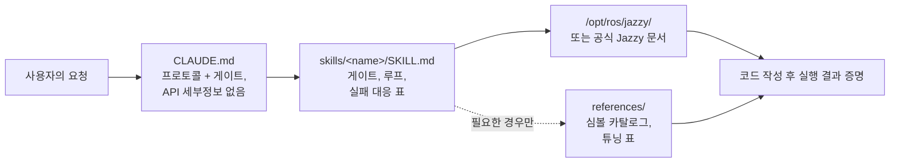

<div align="center">


**Claude Code Skills for ROS 2 Jazzy Jalisco robotics development.**

AI 에이전트의 ROS 2 개발 방식을 혁신하는 스킬: 불명확한 파라미터를 사전에 파악하고, 설치된 패키지를 기준으로 설정을 검증하며, 실제 동작 증거를 통해 실행을 확인합니다.


[English](README.md) | **한국어** | [中文](README.zh.md) | [日本語](README.ja.md) | [Español](README.es.md) | [Français](README.fr.md) | [Deutsch](README.de.md)

<sub>🌐 이 문서는 기계 번역본입니다. 원문은 [English](README.md)입니다.</sub>

| 스킬 | 상시 로드 프로토콜 | 문서 링크 (CI 검증됨) | 로봇 실기 검증 | 실측 평가: Gazebo A/B |
| :---: | :---: | :---: | :---: | :---: |
| **11개** | **26줄** | **38개** | **4개 스크립트** | **목표 도달 vs. 브링업 중단** |

</div>

---

## 목차

- [비용이 드는 실패들](#비용이-드는-실패들)
- [이 스킬들의 설계 원칙](#이-스킬들의-설계-원칙)
- [무엇이 다른가](#무엇이-다른가)
- [실측 평가](#실측-평가)
- [빠른 시작](#빠른-시작)
- [스킬 목록](#스킬-목록)
- [검증 스크립트](#검증-스크립트)
- [동작 방식](#동작-방식)
- [업데이트](#업데이트)
- [로드맵](#로드맵)
- [기여하기](#기여하기)
- [라이선스](#라이선스)

## 비용이 드는 실패들

AI가 생성한 ROS 2 코드에서 가장 비싼 비용을 치르게 하는 오류는 단순한 구문(syntax) 실수가 아닙니다. 오히려 겉보기에는 정상처럼 보이는 미묘한 문제입니다.

| 실패 유형 | 현상 | 에이전트가 이 문제에 직면하는 이유 |
| :--- | :--- | :--- |
| **소리 없는 실패** | `ros2 topic hz`에는 30 Hz로 출력되지만 콜백이 전혀 실행되지 않음 | 기본값인 RELIABLE 구독자가 BEST_EFFORT 발행자에 연결을 시도함. 코드는 정상적으로 컴파일되고 코드 리뷰도 통과하지만 DDS 미들웨어 수준에서 실패함. |
| **잘못된 기준 좌표** | `/cmd_vel`은 전진을 나타내고 `/odom`도 전진을 보고하지만, 실제 로봇은 **후진**함 | 고정 TF 프레임이 실제 물리적 장착 상태와 반대로 뒤집혀 있음. 하위 구성 요소가 *잘못된 트랜스폼을 사용하여* 계산을 정상 수행하므로 명시적인 오류가 발생하지 않음. |
| **구버전 API 사용** | 코드 리뷰는 통과하지만 런타임에 잘못된 메서드를 호출하여 실패함 | 에이전트가 Jazzy에서 이름이 변경되거나 제거된 Foxy 또는 Humble의 더 이상 사용되지 않는(deprecated) API 메서드를 사용함. |
| **잘못된 전제** | 한 문장으로 바로잡을 수 있었을 전제를 바탕으로 에이전트가 200줄의 코드를 작성함 | 코드 생성 전에 누락된 세부 정보를 검증하도록 에이전트에 요청하는 메커니즘이 없음. |

컴파일러, 린터, 로그 분석기 그 무엇도 이러한 숨겨진 문제를 감지하지 못합니다. 이러한 오류를 하나 해결할 때마다 출력 검토, 원인 진단, 수정 사항 설명, 코드 재생성이라는 추가 피드백 주기가 소모됩니다.

## 이 스킬들의 설계 원칙

이 리포지토리의 모든 스킬은 4가지 설계 원칙을 따릅니다.

**1. 불명확한 변수를 사전에 파악합니다.** 실제 하드웨어인지 시뮬레이션 환경인지, 기존 워크스페이스를 확장할지 새 워크스페이스를 생성할지, 어떤 노드가 이미 트랜스폼을 발행 중인지, 로봇의 정확한 형상이 어떠한지 등 주요 운용 세부 사항은 문서에 명시되어 있지 않은 경우가 많습니다. [`CLAUDE.md`](./CLAUDE.md)는 에이전트가 코드를 생성하기 전에 이러한 미지의 항목을 명확히 하도록 지시합니다. 도메인 특화 스킬은 타깃 파라미터를 관리합니다. 예를 들어 `ros2-dev`는 Nav2 파라미터를 설정하기 전에 로봇 footprint, 구동 키네마틱스(drive kinematics), 위치 추정 소스(localization source)를 요청합니다.

**2. 명확한 종료 조건이 있는 구조화된 루프를 실행합니다.** 모든 스킬은 *검증(verify) → 작성(write) → 증명(prove)* 주기를 따릅니다. 설치된 환경에서 시스템 기본값을 검사하고, 단계적 변경 사항을 적용하며, 실행을 확인합니다. 단순히 코드 파일을 생성하는 것이 아니라 빌드 성공, `ros2 topic echo`의 실시간 데이터 수집, 검증 스크립트 통과 등 관찰된 증거가 뒷받침될 때만 작업이 완료됩니다.

**3. 긴 설명보다 구조화된 실패 대응 표를 우선시합니다.** 증상 → 근본 원인 → 시정 조치를 매핑한 구조화된 표는 공식 문서에 부족한 명확하고 지속 가능한 지침을 제공하며, 버전에 관계없이 높은 신뢰성을 유지합니다.

> `[`는 GZ→ROS, `]`는 ROS→GZ · `16UC1`은 밀리미터, `32FC1`은 미터 · `joint_state_broadcaster`는 자동 스폰되지 않음 · `raytrace_max_range` ≤ `obstacle_max_range`이면 장애물이 삭제되지 않음 · rclc는 바운드되지 않은 메시지 필드를 자동 할당하지 않음

**4. 3계층 아키텍처로 컨텍스트 사용을 최적화합니다.** 각 스킬은 컨텍스트 효율성의 균형을 맞춥니다. 스킬 설명은 컨텍스트에 유지되고, 스킬 본문은 호출될 때 로드되며, `references/`의 심층 참조 파일은 필요한 경우에만 로드됩니다. 방대한 심볼 카탈로그와 세부 파라미터 튜닝 표는 `references/`에 위치하므로, 컨텍스트를 절약하고 특정 구성 요소(예: AMCL)를 디버깅할 때 불필요한 문서(예: 행동 트리 노드)가 로드되지 않도록 합니다.

## 무엇이 다른가

대부분의 로보틱스 스킬 팩은 정적 API 지식을 스킬 파일에 직접 내장합니다. 초기 사용은 쉬울지 몰라도, 기반 패키지가 업데이트되면 이 방식은 무너지며 소리 없이 실패하는 구버전 코드 조각(snippet)을 남기게 됩니다. 본 리포지토리는 동적 문서 기반 접근 방식을 취합니다.

| 기능 | 콘텐츠 중심의 스킬 팩 | **claude-ros2-skills** |
| :--- | :--- | :--- |
| 지식 저장 위치 | 스킬 파일 내에 내장 (**스킬당 400~1,800줄**) | 공식 문서와 연결 (**~60줄**의 스킬 본문); 세부 참조 문서는 **필요할 때만** 로드 |
| 상시 로드 컨텍스트 | 전체 `SKILL.md` 파일 | **26줄** 핵심 프로토콜 |
| Jazzy API 업데이트 대응 | 스니펫이 눈에 띄지 않게 오래됨; 지속적인 수동 테스트 업데이트 필요 | 구버전 스니펫 위험이 진입점 링크 및 심볼 이름 수준으로 최소화됨 — **38개 문서 링크**를 CI로 매주 검증 |
| 검증 방식 | 정적 코드 분석 또는 로그 확인 | **물리 및 런타임 검증**: IMU 중력 검사, 방향성 오도메트리 테스트, TF 프레임 정렬, DDS QoS 호환성 |
| 지원 범위 | 단일 배포판만 지원하면서 여러 ROS 배포판을 지원한다고 주장 | **ROS 2 Jazzy 전용**, 명시적으로 설계 및 검증됨 |

본 리포지토리는 하나의 결과에 최적화되어 있습니다. 바로 ROS 2 Jazzy에서 실행 시 실패하는 '그럴듯해 보이는 코드'가 생성될 위험을 최소화하는 것입니다.

## 실측 평가

아래의 모든 결과는 측정된 A/B 쌍에서 도출되었습니다. 새로 시작된 헤드리스(headless) Claude Code 세션에서 **동일한 프롬프트**를 스킬 미적용과 적용 상태로 각각 실행했으며, 두 조건 모두 **동일한 모델**을 사용했습니다. 채점은 고정된 상류(upstream) Jazzy 소스 코드에 대한 심볼 단위 대조, 실제 `/opt/ros/jazzy` 설치본 대조, 두 결과물을 **실제 Gazebo 시뮬레이션**에 로드하는 검증, 그리고 마지막으로 **생성된 노드를 실행 중인 퍼블리셔에 직접 실행**하는 방식으로 이루어졌습니다. 이제 평가 스위트의 모든 작업이 실제 설치 환경에서 측정되었습니다. 전체 트랜스크립트, 생성된 코드, 실행 로그는 [`evals/runs/`](./evals/runs/)에 커밋되어 있고 A/B 쌍을 생성하는 하니스는 [`evals/harness/`](./evals/harness/)에 있으므로, 누구나 직접 재평가하거나 재실행할 수 있습니다.

표본 크기는 **셀당 n=1**이며, 실행과 채점은 이 결과를 공개하는 프로젝트 본인이 수행했습니다. 채점은 가능한 한 기계적으로(해당 심볼이 설치본에 존재하는가? 명령이 성공하는가?) 설계되어 있어 독립적인 검증이 가능합니다.

### Nav2 MPPI 설정 — Haiku, 실제 Jazzy 설치 환경

*프롬프트: Jazzy 환경의 차동 구동(differential-drive) 로봇을 위해 MPPI 컨트롤러로 Nav2를 설정하고 controller server YAML을 생성하세요.*

| | 스킬 미적용 | 스킬 적용 |
| :--- | :--- | :--- |
| 진행 과정 | 도구가 제공되었음에도 검증 없이 기억에만 의존하여 즉시 답변함 | footprint, 기존 설정, 위치 추정(localization), 속도 제한을 **먼저** 질의한 후 `/opt/ros/jazzy/share/nav2_bringup/params/nav2_params.yaml`에 배포된 기본값을 읽음 |
| 플러그인 문자열 | `mppi_generic::ControllerServer` — 존재하지 않음 | `nav2_mppi_controller::MPPIController` — 올바름 |
| `critics:` 목록 | 전혀 없음 | 8개 전체 제공, 올바른 이름 |
| 날조된 파라미터 키 | **~16개** | **0개** — 설치된 기본값과 비교하여 모든 키를 기계적으로 검증함 |
| **실제 Gazebo 시뮬레이션 로드** | **`[FATAL] Failed to create controller … does not exist` — 브링업 단계에서 Nav2 중단; 로봇이 전혀 움직이지 않음** | **MPPI 및 8개 critics 모두 로드됨; 로봇이 (−2.0, −0.5) → (0.5, 0.5)로 주행; `NavigateToPose`가 `SUCCEEDED` 반환** |

### 실제 실행되어야 하는 패키지 생성 — Haiku, 컨테이너 내부

*프롬프트: `/greeting` 토픽으로 1 Hz 주기로 `std_msgs/msg/String`을 발행하는 Python 패키지 `demo_pkg`와 런치 파일을 생성하고, 이를 빌드한 뒤 `ros2 topic echo /greeting`을 보여주세요.*

| | 스킬 미적용 | 스킬 적용 |
| :--- | :--- | :--- |
| `ros2 run` / `ros2 launch` / `topic echo` | **3가지 모두 실패** — 패키지가 ament 인덱스에 등록되지 않음 | **3가지 모두 통과**, 각 명령의 독립적인 재실행을 통해 확인됨 |
| 결과 도달 비용 | $0.17 · 36턴 · 178초 | **$0.08 · 18턴 · 61초** — 첫 시도에 성공했으며 **2.2배 저렴함** |

### 센서 구독 — Haiku, 양쪽 노드를 실제 퍼블리셔에 실행

*프롬프트: `/scan`을 구독하여 최소 거리를 1초에 한 번 로깅하는 Jazzy Python 노드를 작성하세요.* 생성된 두 노드를 BEST_EFFORT `/scan` 퍼블리셔에 각각 6초간 실행했습니다.

| | 스킬 미적용 | 스킬 적용 |
| :--- | :--- | :--- |
| 구독 QoS | `create_subscription(..., 10)` → RELIABLE | `qos_profile_sensor_data` |
| **런타임에 수신한 메시지** | **0개.** rclpy가 직접 `offering incompatible QoS. No messages will be received from it. Last incompatible policy: RELIABILITY`를 출력함 | **5 Hz로 정상 수신** |
| 보고된 최솟값 (정답: 0.45 m) | 한 건도 수신하지 못함 | `0.020 m` — **역시 오답**: 두 노드 모두 `range_min`/`range_max` 범위 필터가 없음 |

연결 여부의 차이는 센서 파이프라인의 존재 자체를 결정하는 항목이며, 재현됩니다. 반면 수치 오류는 두 조건 모두의 실제 결함이므로, 주장이 아니라 `ros2-core`의 후속 과제로 기록했습니다.

### 작성 전에 질문하기 — Haiku, 뒤집힌 LiDAR 장착

*프롬프트: LiDAR가 섀시 뒤쪽에 거꾸로, 뒤를 향해 장착되어 있습니다. static TF를 작성하고 수정을 확인할 방법을 알려주세요.*

| | 스킬 미적용 | 스킬 적용 |
| :--- | :--- | :--- |
| 물리적 장착 정보를 먼저 확정 | 한 턴에 바로 답변 | **transform을 내놓기 전에 후방 거리와 오프셋을 먼저 질문함** |
| Transform 정확성 | roll≈180° + yaw≈180°, REP 105 부모/자식 관계 — 올바름 | 올바름. 양쪽 출력을 실제로 발행하자 `check_tf_tree.py`가 설계대로 지적함 |
| 확인 방법 안내 | RViz의 **PointCloud2** 디스플레이 — LiDAR에 맞지 않는 메시지 타입 | `tf2_echo` 및 **LaserScan** 디스플레이 |

### 스킬이 해결하지 못하는 것

빼놓으면 나머지 결과의 신뢰도가 떨어지므로 함께 기록합니다.

- **환각은 사라지지 않고 이동합니다.** 최신 3개 작업의 스킬 적용 출력에도 `ros2_troubleshooting_helpers`(존재하지 않는 패키지 — 그것도 *이 레포 자신의 스크립트*를 설명하면서)와 잘못된 기본 durability 값이 등장했습니다. 문서로 라우팅하는 것은 하한선을 올리지만, 모델을 정확하게 만들지는 못합니다.
- **모델이 이미 잘 아는 문제에서는 비용만 늘고 얻는 것이 적습니다.** 고전적인 QoS 불일치 진단에서는 양쪽 조건 모두 한 턴에 정답을 냈고, 스킬 적용 쪽이 약 1.4배의 비용으로 사실 오류 하나를 추가했습니다.
- **스킬은 에이전트가 무엇을 *묻는지*는 안정적으로 바꾸지만, 무엇을 *확인하는지*는 그렇지 않습니다.** 실제 재현 환경이 돌아가고 `Bash`가 허용된 상태에서 양쪽 셀 모두 `ros2 topic info -v`를 권했을 뿐 직접 실행하지 않았습니다.
- **Task 1에서는 두 조건 모두 수치를 틀렸습니다.** 생성된 두 노드 모두 `range_min`/`range_max` 필터링을 누락해, 최소 거리 미만의 측정값을 가장 가까운 장애물로 보고합니다.

### 모든 비교 쌍에서 나타난 패턴

베이스라인 셀은 WebFetch, Read, Bash 사용이 명시적으로 허용되었음에도 어떤 실행에서도 코드 작성 **전에** 설치본이나 문서를 검증하지 않았으며, 한 베이스라인은 `ros2 run`으로 찾을 수도 없는 패키지에 대해 완벽히 동작하는 빌드라고 보고했습니다. 스킬 적용 셀은 미확정 정보가 있는 모든 작업에서 사전 질문 게이트를 실행했고, 그 주장은 독립적인 재실행 결과와 일치했습니다. 검증 스크립트도 이제 양방향으로 실제 데이터에서 검증되었습니다. `check_qos_compat.py`는 실제 BEST_EFFORT/RELIABLE 불일치에 대해 최초의 실제 `[FAIL]`을 출력했고, `check_tf_tree.py`는 뒤집힌 센서를 지적하면서 정상 장착된 센서는 건드리지 않았습니다.

[`evals/RESULTS.md`](./evals/RESULTS.md)에서 전체 평가 표, 테스트 환경 및 개별 실행 분석을 확인하세요. 평가 프로토콜, 작업 체크리스트 및 컨테이너 설정에 대한 자세한 내용은 [`evals/README.md`](./evals/README.md)를 참조하세요. 추가 평가 트랜스크립트를 포함한 Pull Request를 환영합니다.

## 빠른 시작

**옵션 A — 플러그인 마켓플레이스 (권장):**

```
/plugin marketplace add Leehyunbin0131/claude-ros2-skills
/plugin install claude-ros2-skills@claude-ros2-skills
```

언제든지 `/plugin marketplace update` 명령어로 설치된 플러그인을 업데이트할 수 있습니다.

**옵션 B — 수동 설치:**

```bash
git clone https://github.com/Leehyunbin0131/claude-ros2-skills.git

# 프로젝트 단위 설치 (현재 프로젝트에만 적용)
mkdir -p your-project/.claude/skills
cp -r claude-ros2-skills/skills/* your-project/.claude/skills/
cp claude-ros2-skills/CLAUDE.md your-project/

# 사용자 단위 설치 (모든 프로젝트에 적용)
mkdir -p ~/.claude/skills
cp -r claude-ros2-skills/skills/* ~/.claude/skills/
```

설치된 스킬을 적용하려면 Claude Code를 재시작(또는 새 세션 시작)하세요.

## 스킬 목록

| 스킬 | 경로 | 커버리지 |
| :--- | :--- | :--- |
| **ros2-core** | `skills/ros2-core/SKILL.md` | rclcpp, rclpy, TF2, EKF 오도메트리, QoS 프로필, 파라미터 |
| **ros2-package** | `skills/ros2-package/SKILL.md` | `ros2 pkg create`, CMakeLists/setup.py 연결, colcon 빌드 및 소스 적용, 커스텀 인터페이스 |
| **ros2-dev** | `skills/ros2-dev/SKILL.md` | Nav2 (AMCL, costmaps, MPPI/Smac), SLAM Toolbox, RTAB-Map, Isaac ROS |
| **gazebo-sim** | `skills/gazebo-sim/SKILL.md` | Gazebo Harmonic, ros_gz_bridge, ros_gz_sim, SDFormat 모델링 |
| **ros2-control** | `skills/ros2-control/SKILL.md` | ros2_control 하드웨어 추상화, controller manager, URDF 태그 |
| **ros2-moveit** | `skills/ros2-moveit/SKILL.md` | MoveIt 2, MoveGroup C++/Python API, IK 솔버, OMPL, MoveIt Servo |
| **ros2-perception** | `skills/ros2-perception/SKILL.md` | image_transport, cv_bridge, vision_msgs, depth_image_proc, PCL |
| **ros2-testing** | `skills/ros2-testing/SKILL.md` | launch_testing, gtest/pytest, rosbag2 C++/Python API, ros2trace |
| **ros2-microros** | `skills/ros2-microros/SKILL.md` | micro-ROS Agent, rclc 클라이언트 API, 커스텀 트랜스포트, 정적 메모리 |
| **ros2-security** | `skills/ros2-security/SKILL.md` | SROS2, PKI 키스토어 생성, 접근 제어, DDS Security |
| **ros2-troubleshooting** | `skills/ros2-troubleshooting/SKILL.md` | REP 103/105 기준 좌표 TF 트리, LiDAR/IMU 정렬, 물리 검증 |

## 검증 스크립트

이 검증 스크립트들은 `ros2-troubleshooting` 스킬(`skills/ros2-troubleshooting/scripts/`)에 번들로 포함되어 있으며 모든 설치에 함께 제공됩니다. 물리 하드웨어 검사를 실행 가능한 성공/실패 검증 단계로 변환합니다(ROS 2 환경 소싱 필요; 반환 코드: 0 = PASS, 1 = FAIL, 2 = NO DATA):

| 스크립트 | 검증 내용 |
| :--- | :--- |
| `check_imu_gravity.py` | 정지 상태의 로봇이 **+Z** 축을 따라 ~+9.81 m/s²의 중력을 측정하는지 검증합니다(REP 103). 뒤집히거나 잘못 정렬된 IMU 장착을 감지합니다. |
| `check_odom_direction.py` | 로봇을 앞으로 밀었을 때 헤딩(heading) 방향을 따라 양(+)의 오도메트리 변위가 발생하는지 검증합니다. 모터 방향 반전, 인코더 극성 문제 또는 뒤집힌 TF 설정을 감지합니다. |
| `check_tf_tree.py` | `map→odom→base_link`가 올바르게 확인(resolve)되는지 검증합니다. 각 센서의 장착 오프셋을 RPY 도(degree) 단위로 표시하고 잠재적인 180° 방향 오류를 강조합니다. |
| `check_qos_compat.py` | DDS 규칙을 사용하여 토픽의 모든 발행자/구독자 쌍 간의 QoS 호환성을 검증합니다. 소리 없는 실패(BEST_EFFORT 발행자와 RELIABLE 구독자의 조합, 또는 내구성, 마감일, 생동성 불일치 등)를 방지합니다. |

핵심 결정 로직은 ROS와 독립적으로 단위 테스트되며(`python3 skills/ros2-troubleshooting/scripts/test_checks.py`), 푸시할 때마다 지속적 통합(CI)을 통해 실행됩니다.

## 동작 방식



`CLAUDE.md`에는 구체적인 API 세부 정보가 포함되어 있지 않습니다. 대신 운용 프로토콜을 수립하고 코드를 작성하기 전에 불명확한 질문에 답하도록 요구합니다. 각 `SKILL.md` 파일은 불명확한 변수 식별, 검증-작성-증명 루프 실행, 실패 대응 표 참조 등 도메인 특화 결정을 관리합니다. 세부 참조 자료는 `references/` 디렉토리에 별도로 저장됩니다. 자세한 내용은 [`CLAUDE.md`](./CLAUDE.md)를 참조하세요.

## 업데이트

```bash
cd claude-ros2-skills
git pull
cp -r skills/* ~/.claude/skills/   # 또는 프로젝트의 .claude/skills/
```

## 로드맵

1. ~~`ros:jazzy` 컨테이너 내부의 평가 쌍 자동화~~ — **완료 (2026-07-25):** 실제 `/opt/ros/jazzy` 설치본 대상 Task 4 재실행; 결과는 [`evals/RESULTS.md`](./evals/RESULTS.md) 참조.
2. ~~Task 5 평가 결과 게시~~ — **완료 (2026-07-25):** 컨테이너 내부에서 측정된 바이너리 빌드/실행/echo 결과; 결과는 [`evals/RESULTS.md`](./evals/RESULTS.md) 참조.
3. ~~실제 설치 환경 평가를 Tasks 1–3으로 확장~~ — **완료 (2026-07-26):** 네이티브 `ros-jazzy-ros-base` 설치본에서 실행하고, 생성된 두 노드를 실제 퍼블리셔에 직접 실행하여 채점. 하니스는 [`evals/harness/`](./evals/harness/), 결과는 [`evals/RESULTS.md`](./evals/RESULTS.md) 참조.
4. ~~해당 실행에서 드러난 결함 수정~~ — **완료 (2026-07-26):** `ros2-troubleshooting`에 스크립트의 리터럴 호출 방법(모델이 패키지 이름을 날조하고 있었음)과 `check_tf_tree.py`가 ~180° 장착을 항상 물리 확인 대상으로 표시한다는 사실을 명시. `ros2-core`에는 `range_min`/`range_max` 범위 규칙과 정상 종료 패턴을 추가. **위의 평가 표는 이 수정 이전 상태의 스킬을 측정한 결과입니다.**
5. **패치된 스킬로 Tasks 1–3 재실행** — 수정이 실제로 출력을 바꾸는지 확인. 위의 표가 아직 수정 이전 버전을 설명하는 이유가 이것입니다.
6. **Task 3의 판별력 확보** — 현재는 양쪽 조건 모두 기억만으로 정답을 내므로, QoS 진단을 권고가 아니라 실제 엔드포인트에 대해 *시연*하도록 요구하게 변경.
7. **핵심 지표로 "완료까지의 수정 횟수(corrections-to-completion)" 추적** — 코드가 성공적으로 실행되기까지 필요한 피드백 반복 횟수 측정.
8. **결정론적 `references/` 조회 구현**을 통해 관련 세부 참조 문서가 필요한 시점에 항상 로드되도록 보장.
9. **본문/`references` 분리를 `ros2-core` 및 `gazebo-sim`으로 확장**하여 방대한 참조 문서를 가진 고빈도 스킬의 컨텍스트 효율성 최적화.

## 기여하기

요약: 스킬 파일은 결정 로직(검증 게이트, 루프 단계, 실패 대응 표)에 집중해야 하며, 세부 문서는 `references/`에 유지되어야 합니다. 모든 API 심볼은 공식 Jazzy 문서 또는 `/opt/ros/jazzy/` 설치 환경을 기준으로 검증되어야 합니다. 검증 스크립트는 ROS 의존성 없이 단위 테스트가 가능한 순수 로직을 유지해야 합니다. 전체 가이드라인, 스킬 및 스크립트 체크리스트, 이슈 템플릿은 [`CONTRIBUTING.md`](./CONTRIBUTING.md)를 참조하세요.

## 라이선스

Apache-2.0 — [LICENSE](./LICENSE)를 참조하세요.
