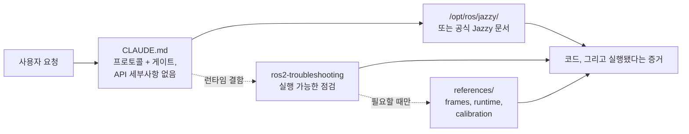

<div align="center">


**Claude Code Skills for ROS 2 Jazzy Jalisco robotics development.**

AI 에이전트의 ROS 2 개발 방식을 혁신하는 스킬 세트: 불확실한 요소를 사전에 확인하고, 설치된 패키지 환경을 기준으로 설정을 검증하며, 실제 동작 증거로 실행을 입증합니다.


[English](README.md) | **한국어** | [中文](README.zh.md) | [日本語](README.ja.md) | [Español](README.es.md) | [Français](README.fr.md) | [Deutsch](README.de.md)

<sub>🌐 이 문서는 [English](README.md) 원문의 한국어 번역본입니다.</sub>

| 스킬 수 | 상시 로드 프로토콜 | 문서 링크 (CI 검증됨) | 로봇 실기 검증 스크립트 |
| :---: | :---: | :---: | :---: |
| **2개** | **30줄** | **6개** | **4개** |

</div>

---

## 목차

- [비용이 드는 실패들](#비용이-드는-실패들)
- [이 스킬들의 설계 원칙](#이-스킬들의-설계-원칙)
- [무엇이 다른가](#무엇이-다른가)
- [측정 결과](#측정-결과)
- [빠른 시작](#빠른-시작)
- [스킬](#스킬)
- [검증 스크립트](#검증-스크립트)
- [동작 방식](#동작-방식)
- [업데이트](#업데이트)
- [기여](#기여)
- [라이선스](#라이선스)

## 비용이 드는 실패들

AI가 생성한 ROS 2 코드에서 가장 큰 대가를 치르게 하는 오류는 문법 실수가 아닙니다. 언뜻 보기에는 정상처럼 보이지만 런타임에 실질적인 문제를 일으키는 미묘한 이슈들입니다:

| 오류 유형 | 관측 증상 | 발생 원인 |
| :--- | :--- | :--- |
| **미들웨어 불일치** | `ros2 topic hz`는 30 Hz를 출력하지만 콜백 함수가 호출되지 않음 | 기본 QoS 설정인 RELIABLE 구독자는 BEST_EFFORT 발행자와 매칭될 수 없습니다. 코드는 컴파일과 리뷰를 모두 통과하지만, 애플리케이션 하위의 DDS 계층에서 데이터 수신이 실패합니다. `rclpy`가 런타임 시작 로그에 경고(`offering incompatible QoS ... Last incompatible policy: RELIABILITY`)를 남기지만, 로그를 직접 확인하지 않으면 놓치기 쉽습니다. |
| **잘못된 기준 좌표** | `/cmd_vel`과 `/odom` 모두 전진을 나타내지만 실제 로봇은 **후진** | 정적 TF 프레임 설정이 실제 센서 장착 방향과 반대로 뒤집혀 있습니다. 하위 컴포넌트들은 잘못된 변환 값을 바탕으로 계산을 정상 수행하므로 명시적인 에러 메시지가 발생하지 않습니다. |
| **구식 API 사용** | 코드 리뷰는 통과하지만 잘못된 메서드를 호출하여 런타임에 실패 | Jazzy 버전에서 변경되거나 삭제된 이전 Foxy/Humble API 메서드를 에이전트가 그대로 사용합니다. |
| **잘못된 전제 설정** | 간단한 질문으로 바로잡을 수 있었을 가정에 기반하여 200줄의 코드를 작성 | 코드를 작성하기 전에 누락되거나 불확실한 세부 정보를 에이전트가 스스로 재확인하도록 강제하는 장치가 없습니다. |

컴파일러, 린터, 일반 로그 분석 도구는 이러한 숨은 문제를 사전에 감지하지 못합니다. 결국 오류를 하나 발견할 때마다 '출력 결과 검토 → 원인 진단 → 수정 요청 설명 → 코드 재배포'라는 피드백 사이클을 추가로 반복해야 합니다.

## 이 스킬들의 설계 원칙

본 저장소의 모든 스킬은 네 가지 핵심 설계 원칙을 따릅니다:

**1. 불확실한 변수를 사전에 확인합니다.** 실제 하드웨어인지 시뮬레이션 환경인지, 기존 워크스페이스 확장인지 신규 생성인지, 어떤 노드가 이미 TF를 발행 중인지, 로봇의 정확한 형상이 어떠한지 등 핵심 운용 정보는 일반 문서에 나오지 않는 경우가 많습니다. [`CLAUDE.md`](./CLAUDE.md)는 에이전트가 코드를 작성하기 전에 이러한 불확실한 요소들을 먼저 확인하도록 강제합니다.

**2. 명확한 완료 기준을 가진 구조적 루프를 실행합니다.** 모든 스킬은 *검증(Verify) → 작성(Write) → 증명(Prove)* 단계를 따릅니다. 설치된 로컬 환경의 기본 설정을 먼저 확인하고, 변경 사항을 단계적으로 적용한 뒤, 실제 동작을 검증합니다. 단지 코드 파일만 생성했다고 작업이 끝나는 것이 아니라, 빌드 성공, `ros2 topic echo`의 실시간 데이터 수신, 검증 스크립트 통과 등 관측 가능한 증거가 확인되어야 완료로 간주합니다.

**3. 모델이 이미 알고 있거나 `CLAUDE.md`에 명시된 내용을 중복 기술하지 않습니다.** 과거 본 스킬 팩에 포함되었던 '증상-원인-조치' 진단표들을 스킬이 로드되지 않은 순수 모델과 비교 검증했습니다. 그 결과, 설명 문단은 평가 지표를 단 하나도 개선하지 못했습니다. 모델은 도움 없이도 해당 해결책에 스스로 도달하거나, 실행 가능한 스크립트 및 `CLAUDE.md` 프로토콜 규칙만이 실질적인 개선을 만들어냈습니다. 자세한 내용은 [측정 결과](#측정-결과)를 참조하세요.

**4. 텍스트 설명 대신 실행 가능한 결과물(스크립트)을 제공합니다.** 정량 평가 결과, 모델의 동작을 실제로 변화시킨 유일한 요소는 명확한 종료 코드(exit code)를 반환하는 검증 스크립트(`ros2-troubleshooting` 내 `scripts/check_*.py`)였습니다. 스크립트가 수행할 역할을 텍스트 설명으로 제공하는 것은 효과가 없었으며, 실제로 스크립트를 **실행**하게 만드는 것만이 동작을 개선했습니다.

## 무엇이 다른가

기존의 대부분의 로보틱스 스킬 팩은 정적 API 지식을 스킬 파일에 직접 포함시킵니다. 처음에는 사용하기 편하지만, 하위 패키지가 업데이트되면 구버전 코드 스니펫이 런타임 오류를 일으킵니다. 반면 본 저장소는 동적이고 문서 지향적인 접근 방식을 취합니다:

| 항목 | 기존 스킬 팩 | **claude-ros2-skills** |
| :--- | :--- | :--- |
| 지식의 위치 | 스킬 파일 내 직접 매핑 (**스킬당 400~1,800줄**) | 공식 문서 링크 중심 (**스킬 본문 ~60줄**), 상세 레퍼런스는 **필요시에만** 참조 |
| 상시 로드 컨텍스트 | `SKILL.md` 전문 상시 로드 | **30줄** 핵심 프로토콜만 상시 로드 |
| Jazzy API 변경 대응 | 스니펫이 노후화되어 지속적인 수동 업데이트 필요 | 진입점 링크와 심볼명 위주로 갱신 위험 최소화 — **6개 핵심 문서 링크**를 CI가 매주 검증 |
| 검증 방식 | 정적 코드 분석 또는 단순 로그 확인 | **실제 물리·런타임 검증**: IMU 중력 가속도 측정, 오도메트리 이동 방향, TF 프레임 정합, DDS QoS 호환성 검사 |
| 배포 범위 | 여러 ROS 배포판 지원을 표방하나 실제로는 특정 버전에 치우침 | **ROS 2 Jazzy 전용** 명시 — "Humble 지원"과 같은 모호한 타협 없음 |

본 저장소는 단 하나의 목표에 집중합니다: **ROS 2 Jazzy 환경에서 겉보기에는 그럴듯하지만 런타임에 실패하는 코드가 생성될 위험을 최소화하는 것**.

## 측정 결과

**평가 기준.** 스킬은 모델이 사전 지식, 웹 검색, 실제 Jazzy 환경을 갖추었음에도 **스스로 해결하지 못하는 요소**를 제공할 때만 가치를 가집니다. 어차피 모델이 수행했을 행동을 설명하는 텍스트는 토큰 비용만 늘릴 뿐입니다.

**측정 방법.** 격리된 깨끗한 컨테이너 환경에서 실제 개발 과제를 수행하여, 스킬 적용 10회와 미적용(베이스라인) 10회 결과를 비교합니다. 평가 방식은 코드 텍스트를 읽는 것이 아니라, 빌드 성공 여부, 토픽 데이터 수신, 스크립트 반환 코드 등 **실제 실행 결과**를 기반으로 채점합니다. 통계 검정은 Fisher 정확 검정(Fisher's exact test)과 Benjamini–Hochberg 다중비교 보정을 적용했습니다.

**검증 결과.** 8개 개발 도메인에 대해 3단계 기술 사다리(총 24개 평가 항목)를 구축하여 평가했습니다. 그 결과, 아무런 스킬도 받지 않은 베이스라인 모델조차 **요구된 모든 개발 메커니즘에 스스로 도달했습니다**:

| 도메인 | L1 → L2 → L3 (단계별 추가 메커니즘) | 무보조 성공률 |
| :--- | :--- | ---: |
| 패키징·빌드 | `ament_python`/`ament_cmake` → 패키지 간 `.srv` 파일 → Composable 노드 + `colcon test` | **190/190** |
| 시뮬레이션 | SDF 월드 + 차동 구동 → `ros_gz_bridge` + `gpu_lidar` → URDF 스폰 + `use_sim_time` | **108/110** |
| 실행기(Executors) | 타이머 기반 1초 서비스 호출 → 구독 콜백 호출 + 하트비트 → 5개 동시 호출 | **110/110** |
| `ros2_control` | Mock 하드웨어 + 브로드캐스터 → 인터페이스 경합 2차 컨트롤러 → **커스텀 C++ `SystemInterface` 플러그인** | **90/90** |
| 테스팅 | pytest 기반 `colcon test` → 실제 노드 대상 `launch_testing` → rosbag2 기록 및 읽기 | **110/110** |
| MoveIt 2 | 직접 작성한 URDF+SRDF를 `move_group`이 로드 → 실제 `GetMotionPlan` → 플래닝 씬 충돌 객체 추가 | **100/100** |
| 코어 | 파라미터 기반 정적 TF → 동적 TF + `ExtrapolationException` 처리 → 활성화 전까지 대기하는 라이프사이클 노드 | **110/110** |
| Nav2 | 서버 정상 수용 파라미터 파일 → `active` 상태까지 스택 구동 → 실시간 스캔 장애물 코스트맵 반영 | 아래 참조 |
| 인식(Perception) | `cv_bridge` 변환 → `CameraInfo` 투영 → 16UC1 깊이 이미지 → `PointCloud2` | **106/120** |

**단순 지식 및 정보 제공으로는 단 하나의 실패도 해결되지 않았습니다.** 발견된 4가지 문제점은 지식 부족이 아닌 모두 **행동적(behavioural) 제약** 때문이었습니다:

| 모델이 무보조로 수행하지 않는 행동 | 베이스라인 | 문제 해결 요소 | 개선 후 |
| :--- | ---: | :--- | ---: |
| 기억에 의존해 답변하지 않고 실제 설치본 환경 대조 검증 | **2/10** | `CLAUDE.md` 규칙 1개 문단 추가 | **10/10** (q=0.002) |
| "맞아 보인다"는 텍스트 대신 실행 가능한 종료 코드 판정 생성 | **0/10** | 실행 가능한 번들 검증 스크립트 제공 | **10/10** (q<0.001) |
| 작성한 QoS 코드를 완료 처리 전 직접 실행 검증 | **5/10** | `CLAUDE.md`의 "실행 확인이 완료 기준" 지침 | **9/10** (검정력 부족) |
| 작성한 Nav2 설정을 완료 처리 전 직접 실행 검증 | **0/10** | 스택이 `active` 상태에 도달해야 하는 과제 부여 | **30/30** |

마지막 Nav2 지표가 이를 가장 분명하게 보여줍니다. 단순히 Nav2 파라미터 파일 작성을 요청했을 때, 10번의 시도 모두 Nav2 서버가 로드를 거부하는 잘못된 설정 파일을 작성했습니다. 그러나 동일한 파라미터 파일 작성과 함께 **Nav2 스택을 `active` 상태까지 구동할 것**을 요구하자, 모든 시도에서 실행 중 오류를 확인하고 로그를 통해 원인을 진단·수정하여 과제를 통과했습니다. **동일한 모델, 동일한 오개념, 동일한 정보 조건**에서 차이를 만든 것은 오직 **직접 실행하라는 요구**뿐이었습니다.

**본 스킬 팩에 적용된 변경 사항.** 기존에 삭제된 2개 스킬에 더해 6개 도메인 스킬을 추가로 삭제했습니다. 모델이 이미 해당 도메인 지식을 갖추고 있어, 스킬의 설명 문장이 실제 검증 결과를 전혀 개선하지 못했기 때문입니다. 이에 따라 본 저장소는 **30줄 핵심 프로토콜, 4개의 실행 가능 검증 스크립트, 그리고 최소한의 레퍼런스 자료**만 남겼습니다. 상세 평가 방법론, 도메인별 세부 결과 및 전체 실행 기록은 [`evals/`](./evals/)에서 확인할 수 있습니다.

## 빠른 시작

**옵션 A — 플러그인 마켓플레이스 (권장):**

```
/plugin marketplace add Leehyunbin0131/claude-ros2-skills
/plugin install claude-ros2-skills@claude-ros2-skills
```

설치된 플러그인은 `/plugin marketplace update`로 언제든 갱신할 수 있습니다.

**옵션 B — 수동 설치:**

```bash
git clone https://github.com/Leehyunbin0131/claude-ros2-skills.git

# 프로젝트 단위 설치 (해당 프로젝트에만 적용)
mkdir -p your-project/.claude/skills
cp -r claude-ros2-skills/skills/* your-project/.claude/skills/
cp claude-ros2-skills/CLAUDE.md your-project/

# 사용자 단위 설치 (모든 프로젝트에 적용)
mkdir -p ~/.claude/skills
cp -r claude-ros2-skills/skills/* ~/.claude/skills/
```

Claude Code를 재시작하거나 새 세션을 시작하면 설치된 스킬이 적용됩니다.

## 스킬

| 스킬 | 경로 | 범위 |
| :--- | :--- | :--- |
| **ros2-troubleshooting** | `skills/ros2-troubleshooting/SKILL.md` | 실행 가능한 통과/실패 점검 스크립트 4개(QoS 호환성, TF 트리, IMU 장착, 오도메트리 방향)와 REP 103/105 프레임 규약, Jazzy 런타임 동작, 하드웨어 오도메트리 캘리브레이션 레퍼런스 포함 |
| **ros2-microros** | `skills/ros2-microros/SKILL.md` | micro-ROS Agent, rclc 클라이언트 API, 커스텀 트랜스포트, 정적 메모리 관리 |

**스킬이 2개만 남은 이유.** 다른 모든 도메인 스킬은 스킬이 로드되지 않은 베이스라인 모델과 비교 정량 평가를 거쳤으며, 스킬 없이도 동일한 성능을 보여줌에 따라 순차적으로 제거되었습니다 (`ros2-core`, `ros2-dev`, `ros2-control`, `ros2-moveit`, `ros2-perception`, `ros2-testing`, `ros2-package`, `gazebo-sim`). 예외적으로 `ros2-microros`는 하드웨어 제약으로 인해 자동화 평가 사다리를 구축하지 못했기에 스킬을 유지하였으며, **실제 정량 검증이 완료된 것으로 간주하지 않습니다**. 자세한 내용은 [측정 결과](#측정-결과)를 참조하세요.

## 검증 스크립트

다음 검증 스크립트들은 `ros2-troubleshooting` 스킬(`skills/ros2-troubleshooting/scripts/`)에 포함되어 함께 배포됩니다. 로봇 하드웨어 및 런타임 점검 항목을 실행 가능하고 명확한 성공/실패 단계로 자동화합니다 (ROS 2 환경 `source` 필요. 반환 코드: `0` = 통과, `1` = 실패, `2` = 데이터 없음):

| 스크립트 | 검증 내용 |
| :--- | :--- |
| `check_imu_gravity.py` | 정지 상태의 로봇이 **+Z** 축 방향으로 ~+9.81 m/s²의 중력 가속도를 측정하는지 검증(REP 103). 센서가 뒤집히거나 장착 축이 어긋난 IMU 오류를 탐지합니다. |
| `check_odom_direction.py` | 로봇을 전진시켰을 때 진행 방향으로 양(+)의 오도메트리 변위가 생성되는지 검증. 모터 회전 방향 반전, 엔코더 극성 오류, 뒤집힌 TF 설정을 탐지합니다. |
| `check_tf_tree.py` | `map → odom → base_link` 변환 트리가 정상적으로 연결되어 있는지 검증하고, 각 센서 장착 오프셋(RPY 도 단위) 표시 및 180° 방향 뒤집힘 오류를 탐지합니다. |
| `check_qos_compat.py` | DDS 규칙에 따라 토픽의 모든 발행자(Publisher) 및 구독자(Subscriber) 쌍 간의 QoS 호환성을 검증. BEST_EFFORT 발행자에 RELIABLE 구독자를 연결하거나, Durability·Deadline·Liveliness 불일치로 발생하는 무반응 오류를 방지합니다. |

각 스크립트의 핵심 판정 로직은 ROS 환경 독립적으로 단위 테스트(`python3 skills/ros2-troubleshooting/scripts/test_checks.py`)를 수행할 수 있도록 작성되었으며, GitHub Actions CI를 통해 커밋마다 자동 검증됩니다.

## 동작 방식



[`CLAUDE.md`](./CLAUDE.md)에는 구체적인 API 코드가 포함되어 있지 않습니다. 대신 에이전트의 핵심 작업 프로토콜(설치본 환경 대조 검증, 문서에 나오지 않는 불확실한 요소 사전 확정, 실제 실행 및 관측 결과 기반 완료 판정)을 정의합니다. 정적 도메인 지식은 모델 자체 성능 및 실제 설치본에 위임하도록 설계되었습니다. 정량 평가 결과 지식 전달보다 동작 규칙 강제가 효과적임이 입증되었기 때문입니다. `ros2-troubleshooting` 스킬은 시스템 로그상 문제는 없으나 실제로 동작하지 않는 런타임 오류가 발생했을 때만 작동하며, 설명 문장 대신 명확한 반환 코드로 결과를 출력합니다. 자세한 내용은 [`CLAUDE.md`](./CLAUDE.md)를 참조하세요.

## 업데이트

```bash
cd claude-ros2-skills
git pull
cp -r skills/* ~/.claude/skills/   # 또는 프로젝트의 .claude/skills/
```

## 기여

**요약:** 새로운 스킬 콘텐츠가 추가되기 위해서는 스킬이 없는 베이스라인 모델과의 비교 정량 평가를 통과해야 합니다 (실제 개발 과제 수행, 조건별 10회 실행, 실제 생성물 실행 채점). 모델이 도움 없이도 생성할 수 있는 정보는 아무리 유용하더라도 추가하지 않습니다. 검증 스크립트는 ROS 독립적으로 단위 테스트가 가능하도록 순수한 판정 로직을 유지해야 합니다. 평가 프로토콜, 기여 체크리스트 및 이슈 템플릿은 [`CONTRIBUTING.md`](./CONTRIBUTING.md)를 참조하세요.

## 라이선스

Apache-2.0 — [LICENSE](./LICENSE) 참조.
