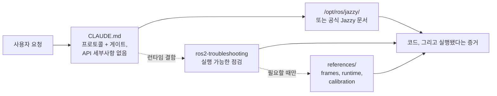

<div align="center">


**Claude Code Skills for ROS 2 Jazzy Jalisco robotics development.**

AI 에이전트의 ROS 2 개발 방식을 바꾸는 스킬 세트: 명확하지 않은 파라미터를 사전에 파악하고, 설치된 패키지를 기준으로 설정을 검증하며, 실제 동작 증거를 통해 실행을 확인합니다.


[English](README.md) | **한국어** | [中文](README.zh.md) | [日本語](README.ja.md) | [Español](README.es.md) | [Français](README.fr.md) | [Deutsch](README.de.md)

<sub>🌐 이 문서는 기계 번역을 바탕으로 작성되었습니다. 원문은 [English](README.md)입니다.</sub>

| 스킬 | 상시 로드 프로토콜 | 문서 링크 (CI 검증됨) | 로봇 실기 검증 |
| :---: | :---: | :---: | :---: |
| **2개** | **30줄** | **6개** | **4개 스크립트** |

</div>

---

## 목차

- [비용이 드는 실패들](#비용이-드는-실패들)
- [이 스킬들의 설계 원칙](#이-스킬들의-설계-원칙)
- [무엇이 다른가](#무엇이-다른가)
- [측정 결과](#측정-결과)
- [빠른 시작](#빠른-시작)
- [스킬](#스킬)
- [검증 스크립트](#검증-스크립트)
- [동작 방식](#동작-방식)
- [업데이트](#업데이트)
- [기여](#기여)
- [라이선스](#라이선스)

## 비용이 드는 실패들

AI가 생성한 ROS 2 코드에서 가장 비싼 오류는 문법 실수가 아닙니다. 언뜻 보기에 맞아 보이는, 미묘한 문제들입니다:

| 실패 | 눈에 보이는 현상 | 에이전트가 이 문제를 겪는 이유 |
| :--- | :--- | :--- |
| **미들웨어 불일치** | `ros2 topic hz`는 30 Hz를 보여주는데 콜백이 한 번도 호출되지 않음 | 기본값 RELIABLE 구독자는 BEST_EFFORT 발행자와 매칭될 수 없습니다. 컴파일되고, 코드 리뷰를 통과하고, 애플리케이션 아래 계층에서 실패합니다. rclpy가 경고를 남기긴 합니다 — `offering incompatible QoS ... Last incompatible policy: RELIABILITY` — 하지만 런타임에, 시작 로그에, 그것을 읽는 사람에게만 보입니다. |
| **잘못된 기준 좌표** | `/cmd_vel`도 전진을 지시하고 `/odom`도 전진을 보고하는데 실제 로봇은 **후진** | 정적 TF 프레임이 실제 장착 방향과 반대입니다. 하위 컴포넌트들은 *틀린 변환을 사용해* 정확히 계산하므로 눈에 띄는 오류가 나오지 않습니다. |
| **구식 API** | 코드 리뷰는 통과하지만 잘못된 메서드를 호출해 런타임에 실패 | Jazzy에서 이름이 바뀌었거나 제거된 Foxy/Humble API를 사용합니다. |
| **잘못된 전제** | 한 문장이면 바로잡을 수 있었을 가정 위에 200줄의 코드를 작성 | 코드 생성 전에 누락된 정보를 확인하도록 만드는 장치가 없습니다. |

컴파일러도, 린터도, 로그 분석도 이런 문제를 잡아내지 못합니다. 하나를 해결할 때마다 추가 피드백 사이클이 듭니다: 출력 검토, 원인 진단, 수정 설명, 재생성.

## 이 스킬들의 설계 원칙

이 저장소의 모든 스킬은 네 가지 원칙을 따릅니다:

**1. 불명확한 요소를 사전에 파악합니다.** 실제 하드웨어인지 시뮬레이션 환경인지, 기존 워크스페이스를 확장할지 새로 생성할지, 어떤 노드가 이미 트랜스폼을 발행 중인지, 로봇의 정확한 형상이 어떠한지 등 주요 운용 세부 사항은 문서에 존재하지 않는 경우가 많습니다. [`CLAUDE.md`](./CLAUDE.md)는 에이전트가 코드를 생성하기 전에 이러한 미지의 항목을 명확히 하도록 지시합니다.

**2. 종료 조건이 명확한 구조적 루프를 실행합니다.** *검증 → 작성 → 증명* 사이클: 설치된 환경에서 시스템 기본값을 확인하고, 점진적으로 변경을 적용하고, 실행을 확인합니다. 코드 파일을 생산한 것만으로는 완료가 아니며, 빌드 성공·`ros2 topic echo`의 실제 데이터·검증 스크립트 통과와 같이 관측된 증거가 뒷받침될 때만 과제가 완료됩니다.

**3. 모델이 이미 아는 것, `CLAUDE.md`가 이미 말한 것은 적지 않습니다.** 이 팩이 배포했던 모든 증상→원인→조치 표를 스킬 없는 베이스라인 에이전트와 대조해 측정했습니다. **단 하나도 체크를 움직이지 못했습니다** — 모델이 이미 무보조로 해당 메커니즘에 도달하거나, 해결책이 번들 스크립트 또는 `CLAUDE.md` 문단이었지 도메인을 설명하는 산문이 아니었습니다. [측정 결과](#측정-결과) 참조.

**4. 실행 가능한 아티팩트를 가리키고, 설명하지 않습니다.** 이 팩에서 결과를 바꾼 것으로 확인된 유일한 콘텐츠는 종료 코드를 반환하는 스크립트입니다(`ros2-troubleshooting`에 번들된 `scripts/check_*.py`). 그 스크립트가 무엇을 알려줄지 *설명하는* 문단은 아무것도 움직이지 못했고, 실행만이 움직였습니다.

## 무엇이 다른가

대부분의 로보틱스 스킬 팩은 정적인 API 지식을 스킬 파일 안에 직접 넣습니다. 초기 사용은 쉽지만 하위 패키지가 업데이트되면 무너집니다 — 조용히 실패하는 낡은 스니펫만 남습니다. 이 저장소는 동적이고 문서 기반인 접근 방식을 취합니다:

| 항목 | 콘텐츠 중심 스킬 팩 | **claude-ros2-skills** |
| :--- | :--- | :--- |
| 지식의 위치 | 스킬 파일에 내장 (**스킬당 400–1,800줄**) | 공식 문서에 연결 (**~60줄** 스킬 본문), 상세 레퍼런스는 **필요할 때만** 읽음 |
| 상시 로드 컨텍스트 | `SKILL.md` 전문 | **30줄** 코어 프로토콜 |
| Jazzy API 변경 대응 | 스니펫이 조용히 낡아가며 지속적인 수동 갱신 필요 | 낡을 위험을 진입점 링크와 심볼 이름으로 최소화 — **문서 링크 6개**를 CI가 매주 검증 |
| 검증 방식 | 정적 코드 분석 또는 로그 확인 | **물리·런타임 검증**: IMU 중력 점검, 오도메트리 방향 시험, TF 프레임 정합, DDS QoS 호환성 |
| 배포 범위 | 여러 ROS 배포판 지원을 표방하나 실제로는 하나만 대상 | 설계상 **ROS 2 Jazzy 전용** — "Humble에서도 동작합니다" 식의 얼버무림 없음 |

이 저장소는 단 하나의 결과를 최적화합니다: ROS 2 Jazzy에서 실행되지 않는, 그럴듯해 보이는 코드가 생성될 위험을 최소화하는 것.

## 측정 결과

**기준.** 스킬은 에이전트가 **스스로 도달할 수 없는** 무언가를 제공할 때만 자리를 얻습니다 — 자체 지식, 웹 검색, 그리고 눈앞의 실제 Jazzy 설치본을 모두 갖춘 상태에서 말입니다. 에이전트가 어차피 했을 일을 알려주기만 하는 텍스트는 이득 없는 비용입니다.

**측정 방법.** 깨끗한 컨테이너에서 실제 과제를 수행하고, 대상 요소를 넣은 10회와 뺀 10회를 비교합니다. 채점은 결과물을 *실행해서* 합니다 — 빌드, 데이터가 흐르는 토픽, 종료 코드 — 읽어서 채점하지 않습니다. Fisher 정확검정, 라운드 전체에 Benjamini–Hochberg 보정.

**무엇이 결론났는가.** 8개 도메인을 3단 사다리에 올렸습니다 — 총 24개 단, 각 단은 명명된 메커니즘을 하나씩 추가하고, 각각 아티팩트를 실행하는 체크로 채점됩니다. 베이스라인 에이전트는 **요구된 모든 메커니즘에 도달했습니다**:

| 도메인 | L1 → L2 → L3, 단별 추가 메커니즘 | 무보조 |
| :--- | :--- | ---: |
| 패키징·빌드 | `ament_python`/`ament_cmake` → 패키지 간 `.srv` → composable 노드 + `colcon test` | **190/190** |
| 시뮬레이션 | SDF 월드 + 차동구동 → `ros_gz_bridge` + `gpu_lidar` → URDF 스폰 + `use_sim_time` | **108/110** |
| 실행기(Executor) | 타이머에서 1초 서비스 호출 → 구독 콜백에서 호출 + 하트비트 → 동시 5회 호출 | **110/110** |
| `ros2_control` | mock 하드웨어 + 브로드캐스터 → 인터페이스를 점유하는 두 번째 컨트롤러 → **커스텀 C++ `SystemInterface` 플러그인** | **90/90** |
| 테스팅 | `colcon test`가 실제로 실행하는 pytest → 살아있는 노드 대상 `launch_testing` → rosbag2 기록 후 재판독 | **110/110** |
| MoveIt 2 | 직접 작성한 URDF+SRDF를 `move_group`이 로드 → 실제 `GetMotionPlan` → 플래닝 씬의 충돌 객체 | **100/100** |
| 코어 | 파라미터 기반 정적 TF → 동적 TF + `ExtrapolationException` → 활성화 전까지 침묵하는 라이프사이클 노드 | **110/110** |
| Nav2 | 서버가 그대로 수용하는 파라미터 파일 → 스택을 `active`까지 구동 → 실시간 스캔으로 장애물을 표시하는 코스트맵 | 아래 참조 |
| 인식(Perception) | `cv_bridge` 왕복 → `CameraInfo` 투영 → 16UC1 depth → `PointCloud2` | **106/120** |

**정보를 제공해서 닫힌 실패는 단 하나도 없었습니다.** 발견된 4개의 격차는 전부 행동적(behavioural)입니다:

| 모델이 무보조로 하지 않는 것 | 베이스라인 | 무엇이 닫았나 | 이후 |
| :--- | ---: | :--- | ---: |
| 기억으로 답하지 않고 설치본에 대조 검증 | **2/10** | `CLAUDE.md` 문단 하나 | **10/10** (q=0.002) |
| "맞아 보인다"가 아니라 종료 코드 판정을 생산 | **0/10** | 번들된 실행 스크립트 | **10/10** (q<0.001) |
| 작성한 QoS 코드를 넘기기 전에 실행 | **5/10** | `CLAUDE.md`의 "실행해야 완료다" | **9/10** (검정력 부족) |
| 작성한 Nav2 설정을 넘기기 전에 실행 | **0/10** | `active` 도달을 요구하는 과제 | **30/30** |

마지막 줄이 여기서 가장 깨끗한 결과입니다. Nav2 파라미터 파일을 요구하자 10/10 셀이 **자기 서버가 configure를 거부하는** 파일을 작성했습니다. 같은 파일에 *더해* 스택이 `active`에 도달할 것을 요구하자, 모든 셀이 동일한 그 오류를 만나 로그에서 진단하고, 고치고, 통과했습니다. **같은 모델, 같은 잘못된 믿음, 정보량 차이는 0** — 다른 것은 실행하라는 요구뿐입니다.

**이 팩에 대한 결론.** 앞서 삭제된 2개에 더해 6개 도메인 스킬을 전부 삭제했습니다: 모델이 이미 그 내용에 도달하고, 이 저장소의 어떤 산문도 체크를 움직인 적이 없기 때문입니다. 남은 것은 30줄 프로토콜, 실행 가능한 스크립트 4개, 그리고 그 뒤를 받치는 레퍼런스 자료입니다. 방법론, 도메인별 결과, 모든 원본 실행 기록: [`evals/`](./evals/).

## 빠른 시작

**옵션 A — 플러그인 마켓플레이스 (권장):**

```
/plugin marketplace add Leehyunbin0131/claude-ros2-skills
/plugin install claude-ros2-skills@claude-ros2-skills
```

설치된 플러그인은 `/plugin marketplace update`로 언제든 갱신할 수 있습니다.

**옵션 B — 수동 설치:**

```bash
git clone https://github.com/Leehyunbin0131/claude-ros2-skills.git

# 프로젝트 단위 설치 (해당 프로젝트에만 적용)
mkdir -p your-project/.claude/skills
cp -r claude-ros2-skills/skills/* your-project/.claude/skills/
cp claude-ros2-skills/CLAUDE.md your-project/

# 사용자 단위 설치 (모든 프로젝트에 적용)
mkdir -p ~/.claude/skills
cp -r claude-ros2-skills/skills/* ~/.claude/skills/
```

Claude Code를 재시작하거나 새 세션을 시작하면 설치된 스킬이 적용됩니다.

## 스킬

| 스킬 | 경로 | 범위 |
| :--- | :--- | :--- |
| **ros2-troubleshooting** | `skills/ros2-troubleshooting/SKILL.md` | 실행 가능한 통과/실패 점검 4개 — QoS 호환성, TF 트리, IMU 장착, 오도메트리 방향 — 그리고 그 뒤를 받치는 REP 103/105 프레임 규약, Jazzy 런타임 동작, 하드웨어 오도메트리 캘리브레이션 |
| **ros2-microros** | `skills/ros2-microros/SKILL.md` | micro-ROS 에이전트, rclc 클라이언트 API, 커스텀 트랜스포트, 정적 메모리 |

**왜 둘뿐인가.** 나머지 스킬은 모두 스킬이 로드되지 않은 베이스라인 에이전트와 대조해 측정했고, 에이전트가 그것 없이도 같은 결과를 내놓자 삭제했습니다 — 측정 순서대로 `ros2-core`, `ros2-dev`, `ros2-control`, `ros2-moveit`, `ros2-perception`, `ros2-testing`, `ros2-package`, `gazebo-sim`. `ros2-microros`는 사다리가 없는 유일한 도메인입니다: 이를 돌릴 하드웨어가 여기에 없어서 남겨두었고, **검증되었다고 주장하지 않습니다**. [측정 결과](#측정-결과) 참조.

## 검증 스크립트

이 검증 스크립트들은 `ros2-troubleshooting` 스킬(`skills/ros2-troubleshooting/scripts/`)에 번들되어 모든 설치 경로에 함께 배포됩니다. 물리적 하드웨어 점검을 실행 가능한 통과/실패 단계로 바꿔줍니다 (ROS 2 환경 source 필요, 반환 코드: 0 = 통과, 1 = 실패, 2 = 데이터 없음):

| 스크립트 | 검증 내용 |
| :--- | :--- |
| `check_imu_gravity.py` | 정지 상태의 로봇이 **+Z** 축으로 ~+9.81 m/s²의 중력을 측정하는지 확인 (REP 103). 뒤집히거나 어긋난 IMU 장착을 탐지합니다. |
| `check_odom_direction.py` | 로봇을 앞으로 밀었을 때 진행 방향으로 양(+)의 오도메트리 변위가 나오는지 확인. 모터 방향 반전, 엔코더 극성 문제, 뒤집힌 TF 설정을 탐지합니다. |
| `check_tf_tree.py` | `map→odom→base_link`가 정상적으로 해석되는지 확인하고, 각 센서 장착 오프셋을 RPY(도)로 표시하며 180° 방향 오류 가능성을 표시합니다. |
| `check_qos_compat.py` | DDS 규칙에 따라 한 토픽의 모든 발행자/구독자 쌍의 QoS 호환성을 확인. BEST_EFFORT 발행자와 RELIABLE 구독자 조합, durability·deadline·liveliness 불일치 같은 조용한 실패를 방지합니다. |

핵심 판정 로직은 ROS 없이 독립적으로 단위 테스트되며(`python3 skills/ros2-troubleshooting/scripts/test_checks.py`), 푸시할 때마다 CI(지속적 통합)에서 실행됩니다.

## 동작 방식



`CLAUDE.md`에는 구체적인 API 세부사항이 없습니다. 운영 프로토콜만 규정합니다 — 설치본에 대조해 검증할 것, 문서가 알려줄 수 없는 미지수를 먼저 확정할 것, 무언가 실행되는 것을 관측했을 때만 완료로 간주할 것. 원래라면 담았을 도메인 지식은 모델과 설치본에 맡깁니다. 측정이 그렇게 가리켰기 때문입니다. `ros2-troubleshooting`은 시스템이 정상 로그를 남기면서 동작하지 않을 때만 등장하며, 문단이 아니라 종료 코드로 답합니다. 자세한 내용은 [`CLAUDE.md`](./CLAUDE.md)를 참조하세요.

## 업데이트

```bash
cd claude-ros2-skills
git pull
cp -r skills/* ~/.claude/skills/   # 또는 프로젝트의 .claude/skills/
```

## 기여

요약: 새 스킬 콘텐츠는 그것을 갖지 않은 베이스라인 에이전트와 겨뤄 자리를 얻어야 합니다 — 실제 과제, 조건당 10회, 출력을 실행해서 채점. 에이전트가 무보조로 생산하는 내용은 아무리 정확해도 추가되지 않습니다. 검증 스크립트는 ROS 없이 단위 테스트할 수 있도록 판정 로직을 순수하게 유지해야 합니다. 측정 프로토콜, 체크리스트, 이슈 템플릿은 [`CONTRIBUTING.md`](./CONTRIBUTING.md)를 참조하세요.

## 라이선스

Apache-2.0 — [LICENSE](./LICENSE) 참조.
