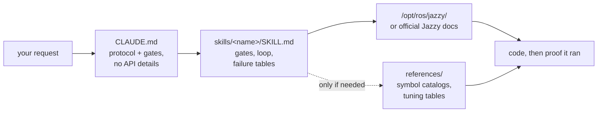

<div align="center">


**Claude Code Skills for ROS 2 Jazzy Jalisco robotics development.**

Skills that transform how AI agents approach ROS 2 development: identify unknown parameters upfront, verify settings against installed packages, and confirm execution through working evidence.


**English** | [한국어](README.ko.md) | [中文](README.zh.md) | [日本語](README.ja.md) | [Español](README.es.md) | [Français](README.fr.md) | [Deutsch](README.de.md)

| Skills | Always-loaded protocol | Doc links (CI-checked) | Physical robot checks |
| :---: | :---: | :---: | :---: |
| **11** | **28 lines** | **32** | **4 scripts** |

</div>

---

## Contents

- [The failures that cost you](#the-failures-that-cost-you)
- [How these skills are built](#how-these-skills-are-built)
- [What makes this different](#what-makes-this-different)
- [Evals](#evals)
- [Quickstart](#quickstart)
- [Skills](#skills)
- [Verification scripts](#verification-scripts)
- [How it works](#how-it-works)
- [Updating](#updating)
- [Contributing](#contributing)
- [License](#license)

## The failures that cost you

The most costly errors in AI-generated ROS 2 code are rarely syntax mistakes. Instead, they are subtle issues that appear correct at first glance:

| Failure | What you see | Why an agent encounters the issue |
| :--- | :--- | :--- |
| **Silent failure** | `ros2 topic hz` shows 30 Hz; your callback never fires | A default RELIABLE subscriber attempts to connect to a BEST_EFFORT publisher. The code compiles and passes code review, but fails at the DDS middleware level. |
| **Wrong ground truth** | `/cmd_vel` indicates forward motion and `/odom` reports forward motion, but the physical robot moves **backward** | The static TF frame is inverted relative to physical mounting. Downstream components compute correctly *using the wrong transform*, producing no obvious errors. |
| **Outdated API** | Code passes review but fails at runtime when calling an incorrect method | The agent uses deprecated Foxy or Humble API methods that were renamed or removed in Jazzy. |
| **Invalid premise** | The agent writes 200 lines of code based on an assumption that you could have corrected in a single sentence | No mechanism prompts the agent to verify missing details before generating code. |

Neither compilers, linters, nor log analyses detect these hidden issues. Resolving each error requires an extra feedback cycle: reviewing output, diagnosing the cause, explaining the fix, and re-generating code.

## How these skills are built

Four design rules govern every skill in this repository:

**1. Identify unknown variables upfront.** Key operational details often do not exist in documentation — such as whether the environment is real hardware or simulation, whether to extend an existing workspace or create a new one, which node already publishes a transform, or the robot's precise geometry. [`CLAUDE.md`](./CLAUDE.md) instructs the agent to clarify these unknowns before generating code. Domain-specific skills manage targeted parameters; for example, `ros2-dev` requests the robot footprint, drive kinematics, and localization source before configuring any Nav2 parameters.

**2. Execute a structured loop with clear exit criteria.** Every skill follows a *verify → write → prove* cycle: inspect system defaults on the installed environment, apply incremental changes, and confirm execution. A task completes only when supported by observed evidence — such as a successful build, active data on `ros2 topic echo`, or a passing verification script — rather than simply producing code files.

**3. Prioritize structured failure tables over long descriptions.** Structured tables mapping symptoms → root causes → corrective actions provide clear, durable guidance that official documentation often lacks and that remains reliable across release versions:

> `[` is GZ→ROS, `]` is ROS→GZ · `16UC1` is millimeters, `32FC1` is meters · `joint_state_broadcaster` is not spawned automatically · `raytrace_max_range` ≤ `obstacle_max_range` means obstacles never clear · rclc does not auto-allocate unbounded message fields

**4. Optimize context usage with a three-layer architecture.** Each skill balances context efficiency: skill descriptions remain in context, skill bodies load when invoked, and deep reference files in `references/` load only on demand. Large symbol catalogs and detailed parameter tuning tables reside in `references/`, ensuring context is preserved and debugging targeted components (like AMCL) does not load unnecessary documentation (like behavior-tree nodes).

## What makes this different

Most robotics skill packs embed static API knowledge directly inside skill files. While initial usage is easy, this approach breaks when the underlying packages update — leaving outdated snippets that silently fail. This repository takes a dynamic, documentation-driven approach:

| Feature | Content-heavy skill packs | **claude-ros2-skills** |
| :--- | :--- | :--- |
| Knowledge location | Embedded in skill files (**400–1,800 lines/skill**) | Linked to official docs (**~60-line** skill bodies); detailed references read **only when needed** |
| Always-loaded context | Full `SKILL.md` files | **28-line** core protocol |
| Handling Jazzy API updates | Snippets become outdated quietly; requires continuous manual test updates | Outdated snippet risk is minimized to entry-point links and symbol names — **32 documentation links** verified weekly via CI |
| Verification method | Static code analysis or log checking | **Physical & runtime verification**: IMU gravity checks, directional odometry tests, TF frame alignment, DDS QoS compatibility |
| Distribution scope | Claims support for multiple ROS distros while targeting only one | **ROS 2 Jazzy only**, by design — no "works on Humble too" hedging |

This repository optimizes for a single outcome: minimizing the risk of generating plausible-looking code that fails to run on ROS 2 Jazzy.

## Evals

**A skill counts as verified here only when two questions are answered:** does it
change what the agent produces on a task exercising its own content, and is this
body the *smallest* one that produces that change? Correct is the floor, not the
bar — fewer tokens and less text may achieve the same result, and until that is
tested, "the agent used it" is half an answer.

**No skill has completed verification yet.** Per-skill status is in
[`evals/RESULTS.md`](./evals/RESULTS.md); results are published there as each
skill clears both axes, including the ones that fail. Interim measurements are
deliberately withheld — an earlier round produced a plausible conclusion from a
single run that a controlled re-run then disconfirmed, and partial results spread
that kind of error faster than it can be caught.

What is being measured, how it is graded, and how to re-run any of it:
[`evals/README.md`](./evals/README.md). The current criterion — a skill supplies
what the agent **cannot reach on its own**, given the model's knowledge, web
search and a live install — is in
[`evals/DESIGN.md`](./evals/DESIGN.md), and the status of every skill against it
is in [`evals/RESULTS.md`](./evals/RESULTS.md).

## Quickstart

**Option A — Plugin Marketplace (Recommended):**

```
/plugin marketplace add Leehyunbin0131/claude-ros2-skills
/plugin install claude-ros2-skills@claude-ros2-skills
```

Update installed plugins anytime with `/plugin marketplace update`.

**Option B — Manual Installation:**

```bash
git clone https://github.com/Leehyunbin0131/claude-ros2-skills.git

# Project-level installation (applies to the current project only)
mkdir -p your-project/.claude/skills
cp -r claude-ros2-skills/skills/* your-project/.claude/skills/
cp claude-ros2-skills/CLAUDE.md your-project/

# User-level installation (applies across all projects)
mkdir -p ~/.claude/skills
cp -r claude-ros2-skills/skills/* ~/.claude/skills/
```

Restart Claude Code (or start a new session) to apply the installed skills.

## Skills

| Skill | Path | Coverage |
| :--- | :--- | :--- |
| **ros2-core** | `skills/ros2-core/SKILL.md` | rclcpp, rclpy, TF2, EKF odometry, QoS profiles, parameters |
| **ros2-package** | `skills/ros2-package/SKILL.md` | `ros2 pkg create`, CMakeLists/setup.py wiring, colcon build & source, custom interfaces |
| **ros2-dev** | `skills/ros2-dev/SKILL.md` | Nav2 (AMCL, costmaps, MPPI/Smac), SLAM Toolbox, RTAB-Map, Isaac ROS |
| **gazebo-sim** | `skills/gazebo-sim/SKILL.md` | Gazebo Harmonic, ros_gz_bridge, ros_gz_sim, SDFormat modeling |
| **ros2-control** | `skills/ros2-control/SKILL.md` | ros2_control hardware abstraction, controller manager, URDF tags |
| **ros2-moveit** | `skills/ros2-moveit/SKILL.md` | MoveIt 2, MoveGroup C++/Python API, IK solvers, OMPL, MoveIt Servo |
| **ros2-perception** | `skills/ros2-perception/SKILL.md` | image_transport, cv_bridge, vision_msgs, depth_image_proc, PCL |
| **ros2-testing** | `skills/ros2-testing/SKILL.md` | launch_testing, gtest/pytest, rosbag2 C++/Python APIs, ros2trace |
| **ros2-microros** | `skills/ros2-microros/SKILL.md` | micro-ROS Agent, rclc client API, custom transports, static memory |
| **ros2-troubleshooting** | `skills/ros2-troubleshooting/SKILL.md` | REP 103/105 ground-truth TF tree, LiDAR/IMU alignment, physical verification |

## Verification scripts

These verification scripts are bundled within the `ros2-troubleshooting` skill (`skills/ros2-troubleshooting/scripts/`) and are included with every installation. They convert physical hardware checks into executable pass/fail verification steps (requires a sourced ROS 2 environment; return codes: 0 = PASS, 1 = FAIL, 2 = NO DATA):

| Script | Verifies |
| :--- | :--- |
| `check_imu_gravity.py` | Validates that a robot at rest measures gravity at ~+9.81 m/s² along the **+Z** axis (REP 103). Detects inverted or misaligned IMU mountings. |
| `check_odom_direction.py` | Validates that pushing the robot forward produces positive odometry displacement along its heading. Detects inverted motor directions, encoder polarity issues, or inverted TF setups. |
| `check_tf_tree.py` | Verifies that `map→odom→base_link` resolves correctly; displays each sensor mounting offset in RPY degrees and highlights potential 180° orientation errors. |
| `check_qos_compat.py` | Verifies QoS compatibility across all publisher/subscriber pairs on a topic using DDS rules. Prevents silent failures (such as a BEST_EFFORT publisher paired with a RELIABLE subscriber, or mismatches in durability, deadline, and liveliness). |

The core decision logic is unit-tested independently of ROS (`python3 skills/ros2-troubleshooting/scripts/test_checks.py`) and runs via continuous integration (CI) on every push.

## How it works



`CLAUDE.md` contains no specific API details. Instead, it establishes the operational protocol and requires clarifying questions to be answered before writing code. Each `SKILL.md` file manages domain-specific decisions: identifying unknown variables, executing the verify-write-prove loop, and referencing failure tables. Detailed reference materials are stored separately in the `references/` directory. See [`CLAUDE.md`](./CLAUDE.md) for details.

## Updating

```bash
cd claude-ros2-skills
git pull
cp -r skills/* ~/.claude/skills/   # or your project's .claude/skills/
```

## Contributing

Summary: Skill files must focus on decision logic (validation gates, loop steps, and failure tables), while detailed documentation stays in `references/`. Every API symbol must be verified against official Jazzy documentation or `/opt/ros/jazzy/` installations. Verification scripts must maintain pure logic that can be unit-tested without ROS dependencies. For full guidelines, skill and script checklists, and issue templates, see [`CONTRIBUTING.md`](./CONTRIBUTING.md).

## License

Apache-2.0 — see [LICENSE](./LICENSE).
