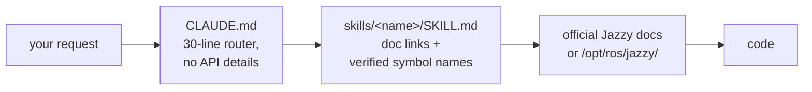

<div align="center">


**Claude Code Skills for ROS 2 Jazzy Jalisco robotics development.**

Anti-hallucination reference skills — every skill routes to official docs instead of guessing API names.


**English** | [한국어](README.ko.md) | [中文](README.zh.md) | [日本語](README.ja.md) | [Español](README.es.md) | [Français](README.fr.md) | [Deutsch](README.de.md)

| Skills | Always-loaded router | Doc links (CI-checked) | Robot ground-truth checks | Evals: hallucinated params |
| :---: | :---: | :---: | :---: | :---: |
| **11** | **30 lines** | **101** | **4 scripts** | **21 → 0** |

</div>

---

## Contents

- [Why this exists](#why-this-exists)
- [What makes this different](#what-makes-this-different)
- [Evals](#evals)
- [Quickstart](#quickstart)
- [Skills](#skills)
- [Verification scripts](#verification-scripts)
- [How it works](#how-it-works)
- [Updating](#updating)
- [Contributing](#contributing)
- [License](#license)

## Why this exists

Logs prove a system is *consistent*, never that it's *correct* — and an agent has no default reason to distrust a consistent story. Two failure modes keep coming up:

| Failure mode | What it looks like | Actual cause |
| :--- | :--- | :--- |
| **Wrong ground truth** | `/cmd_vel` says forward, `/odom` says forward, every topic healthy — robot drives **backward** | Static TF declared flipped vs. the physical sensor mount; everything downstream computes correctly *from the wrong transform*, so nothing ever contradicts |
| **Wrong era** | Code compiles in review, dies at runtime with a method that "sounds right" | Agent codes from memorized Foxy/Humble-era training data; the API was renamed or never existed in Jazzy |

Both come from trusting something that *looks* authoritative instead of checking ground truth. `ros2-troubleshooting` forces physical checks (push the robot, echo the raw TF, confirm IMU gravity) before trusting a topic. Every other skill applies the same rule to code: verify class names, messages, and flags against official Jazzy docs or `/opt/ros/jazzy/` — never from memory.

## What makes this different

Most robotics skill packs bake API knowledge into the skill files. That works until the ecosystem moves — then every baked-in snippet is a fact that can silently rot. This repo makes the opposite bet:

| | Content-heavy skill packs | **claude-ros2-skills** |
| :--- | :--- | :--- |
| Knowledge lives | baked into skill files, **400–1,800 lines/skill** | routed to official docs, **50–120 lines/skill** |
| Always-loaded context | full SKILL.md | **30-line** router |
| When a Jazzy API changes | snippets rot silently; needs doc regression tests forever | rot surface shrinks to links + symbol names — **101 links** CI-checked weekly (liveness only), dead link fails the build |
| Verification | static / log-based | **physical**: IMU gravity, push test, TF mounts vs. real hardware, DDS QoS matching |
| Distro claim | "covers 4 distros" over examples targeting one | **Jazzy only**, stated up front |

The trade-off, stated plainly: for topics where official docs are thin (DDS vendor tuning, PREEMPT_RT internals), a content-heavy pack can serve you better. This repo optimizes for one thing — the lowest probability of plausible-looking code that doesn't run on Jazzy.

## Evals

Measured, not claimed — with one disclosed caveat: the runs were executed and graded by the repo author's own agent session, not an independent party. Every artifact is committed for third-party re-grading. Identical prompts ran in fresh headless Claude Code sessions with and without the skills installed (same model per pair); outputs were graded symbol-by-symbol against the pinned Jazzy sources.

| Result | Without skills | With skills |
| :--- | ---: | ---: |
| Invented/wrong Nav2 MPPI params (haiku) | **21** — Nav2 dies at startup | **0** |
| Invented/wrong Nav2 MPPI params (sonnet) | 0 *(unverified recall)* | **0** *(live-verified)* |
| `/scan` callback fires on real BEST_EFFORT LiDAR (sonnet) | **never** — wrong default QoS, silently | **yes** |
| Runs that verified before writing | **0 / 3** | **3 / 3** |


Full grading tables, conditions, and every generated artifact: [`evals/RESULTS.md`](./evals/RESULTS.md) · protocol and checklists: [`evals/README.md`](./evals/README.md) — n=1 per cell so far; PRs adding graded transcripts are welcome.

<details>
<summary>What the numbers mean</summary>

Two patterns worth naming: with a strong model the skills turn "probably right" into "verified right"; with a smaller model they're the difference between a config that cannot start and the correct one. And in a run where verification tools were unavailable, the with-skills agent **refused to emit unverified parameters** rather than guess — the baseline never noticed it hadn't checked anything.

</details>

## Quickstart

**Option A — plugin marketplace (recommended):**

```
/plugin marketplace add Leehyunbin0131/claude-ros2-skills
/plugin install claude-ros2-skills@claude-ros2-skills
```

Updates land with `/plugin marketplace update`.

**Option B — manual copy:**

```bash
git clone https://github.com/Leehyunbin0131/claude-ros2-skills.git

# Project-level (this project only)
mkdir -p your-project/.claude/skills
cp -r claude-ros2-skills/skills/* your-project/.claude/skills/
cp claude-ros2-skills/CLAUDE.md your-project/

# OR user-level (all projects)
mkdir -p ~/.claude/skills
cp -r claude-ros2-skills/skills/* ~/.claude/skills/
```

Restart Claude Code (or start a new session) to pick up the skills.

## Skills

| Skill | Path | Coverage |
| :--- | :--- | :--- |
| **ros2** | `skills/ros2/SKILL.md` | Master router — points to the right domain skill below |
| **ros2-core** | `skills/ros2-core/SKILL.md` | rclcpp, rclpy, TF2, EKF odometry, QoS profiles, parameters |
| **ros2-dev** | `skills/ros2-dev/SKILL.md` | Nav2 (AMCL, costmaps, MPPI/Smac), SLAM Toolbox, RTAB-Map, Isaac ROS |
| **gazebo-sim** | `skills/gazebo-sim/SKILL.md` | Gazebo Harmonic, ros_gz_bridge, ros_gz_sim, SDFormat modeling |
| **ros2-control** | `skills/ros2-control/SKILL.md` | ros2_control hardware abstraction, controller manager, URDF tags |
| **ros2-moveit** | `skills/ros2-moveit/SKILL.md` | MoveIt 2, MoveGroup C++/Python API, IK solvers, OMPL, MoveIt Servo |
| **ros2-perception** | `skills/ros2-perception/SKILL.md` | image_transport, cv_bridge, vision_msgs, depth_image_proc, PCL |
| **ros2-testing** | `skills/ros2-testing/SKILL.md` | launch_testing, gtest/pytest, rosbag2 C++/Python APIs, ros2trace |
| **ros2-microros** | `skills/ros2-microros/SKILL.md` | micro-ROS Agent, rclc client API, custom transports, static memory |
| **ros2-security** | `skills/ros2-security/SKILL.md` | SROS2, PKI keystore generation, access control, DDS Security |
| **ros2-troubleshooting** | `skills/ros2-troubleshooting/SKILL.md` | REP 103/105 ground-truth TF tree, LiDAR/IMU alignment, anti-hallucination |

## Verification scripts

`scripts/` turns the physical checks into runnable pass/fail facts (needs a sourced ROS 2 env; each exits 0 = PASS, 1 = FAIL, 2 = no data):

| Script | Verifies |
| :--- | :--- |
| `check_imu_gravity.py` | Robot at rest → gravity is ~+9.81 m/s² on **+Z** (REP 103). Catches flipped or rotated IMU mounts. |
| `check_odom_direction.py` | Push the robot forward → odometry displacement is positive along its heading. Catches inverted motors, encoders, or TF. |
| `check_tf_tree.py` | `map→odom→base_link` resolves; prints each sensor mount as RPY degrees and flags ~180° declarations to compare against the physical mounting. |
| `check_qos_compat.py` | Every publisher/subscriber pair on a topic is QoS-compatible per DDS matching rules. Catches the silent "topic shows 30 Hz but my callback never fires" failure (BEST_EFFORT pub vs RELIABLE sub, and durability/deadline/liveliness mismatches). |

The pure decision logic is unit-tested without ROS (`python3 scripts/test_checks.py`) and runs in CI on every push.

## How it works



`CLAUDE.md` never inlines API details — it just routes. Each `SKILL.md` is a thin catalog of official documentation links plus the exact class/message/param names, so Claude verifies instead of guessing. See [`CLAUDE.md`](./CLAUDE.md).

## Updating

```bash
cd claude-ros2-skills
git pull
cp -r skills/* ~/.claude/skills/   # or your project's .claude/skills/
```

## Contributing

Short version — skills stay doc-link catalogs (not tutorials), every symbol gets verified against Jazzy docs or `/opt/ros/jazzy/`, scripts keep their pure logic unit-testable without ROS. Full rules, the skill/script checklists, and issue templates: [`CONTRIBUTING.md`](./CONTRIBUTING.md).

## License

Apache-2.0 — see [LICENSE](./LICENSE).
