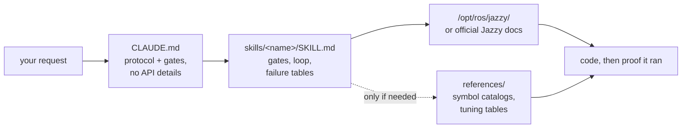

<div align="center">


**Claude Code Skills for ROS 2 Jazzy Jalisco robotics development.**

Skills that change *how* the agent works a ROS 2 task — establish the unknowns first, verify against the installed system, and prove the result ran.


**English** | [한국어](README.ko.md) | [中文](README.zh.md) | [日本語](README.ja.md) | [Español](README.es.md) | [Français](README.fr.md) | [Deutsch](README.de.md)

| Skills | Always-loaded protocol | Doc links (CI-checked) | Physical robot checks | Evals: verified before writing |
| :---: | :---: | :---: | :---: | :---: |
| **11** | **26 lines** | **38** | **4 scripts** | **0/3 → 3/3** |

</div>

---

## Contents

- [The failures that cost you](#the-failures-that-cost-you)
- [How these skills are built](#how-these-skills-are-built)
- [What makes this different](#what-makes-this-different)
- [Evals](#evals)
- [Quickstart](#quickstart)
- [Skills](#skills)
- [Verification scripts](#verification-scripts)
- [How it works](#how-it-works)
- [Updating](#updating)
- [Roadmap](#roadmap)
- [Contributing](#contributing)
- [License](#license)

## The failures that cost you

The expensive failures in agent-written ROS 2 code are not syntax errors. They are the ones that look fine:

| Failure | What you see | Why an agent walks into it |
| :--- | :--- | :--- |
| **Silent no-op** | `ros2 topic hz` shows 30 Hz; your callback never fires | Default RELIABLE subscriber vs. a BEST_EFFORT driver. Compiles, reviews clean, matches nothing at the DDS level |
| **Wrong ground truth** | `/cmd_vel` says forward, `/odom` says forward — robot drives **backward** | Static TF declared flipped vs. the physical mount. Everything downstream computes correctly *from the wrong transform*, so nothing contradicts |
| **Wrong era** | Passes review, dies at runtime on a method that "sounds right" | Memorized Foxy/Humble-era API that was renamed or never existed in Jazzy |
| **Wrong premise** | 200 lines built on an assumption you'd have corrected in one sentence | Nothing told the agent to establish the unknowns before writing |

No compiler, linter, or log inspection catches any of these. Each one costs a round trip: you read the output, work out what's wrong, explain it, and the agent regenerates.

## How these skills are built

Four design rules, applied to every skill.

**1. Establish the unknowns before writing.** Some facts are not in any documentation — whether this is real hardware or simulation, whether you're extending an existing workspace or starting fresh, which node already publishes the transform being touched, and the robot's actual geometry. [`CLAUDE.md`](./CLAUDE.md) makes the agent settle these first and ask when the request doesn't say. Domain-specific unknowns live in the skill: `ros2-dev` asks for footprint, drive type, and localization source before writing a single Nav2 parameter.

**2. A loop with a defined end.** Every skill runs *verify → write → prove*: read the shipped defaults on the installed system, write one change at a time, then confirm it actually ran. "Done" means observed evidence — a build succeeding, `ros2 topic echo` showing data, a check script passing — not code produced.

**3. Failure tables over prose.** The highest-value content is the symptom → root cause → action row, because it isn't assembled anywhere in the official docs and it doesn't rot when a release ships:

> `[` is GZ→ROS, `]` is ROS→GZ · `16UC1` is millimeters, `32FC1` is meters · `joint_state_broadcaster` is not spawned automatically · `raytrace_max_range` ≤ `obstacle_max_range` means obstacles never clear · rclc does not auto-allocate unbounded message fields

**4. Three layers, three price tags.** A skill's `description` is always in context, its body loads when the skill fires, and `references/` files are read only when the task needs them. Bulk symbol catalogs and tuning tables live in `references/`, so someone debugging AMCL doesn't pay for the behavior-tree node list — and depth can be added without taxing every load.

## What makes this different

Most robotics skill packs bake API knowledge into the skill files. That works until the ecosystem moves — then every baked-in snippet is a fact that can silently rot. This repo makes the opposite bet:

| | Content-heavy skill packs | **claude-ros2-skills** |
| :--- | :--- | :--- |
| Knowledge lives | baked into skill files, **400–1,800 lines/skill** | routed to official docs; **~60-line** skill bodies, bulk detail in `references/` read **only when needed** |
| Always-loaded context | full SKILL.md | **26-line** protocol |
| When a Jazzy API changes | snippets rot silently; needs doc regression tests forever | rot surface shrinks to entry-point links + symbol names — **38 links** CI-checked weekly (liveness only), dead link fails the build |
| Verification | static / log-based | **physical**: IMU gravity, push test, TF mounts vs. real hardware, DDS QoS matching |
| Distro claim | "covers 4 distros" over examples targeting one | **Jazzy only**, stated up front |

This repo optimizes for one thing: the lowest probability of plausible-looking code that doesn't run on Jazzy.

## Evals

Identical prompts run in fresh headless Claude Code sessions with and without the skills installed, same model per pair, graded symbol-by-symbol against pinned upstream `jazzy` sources.

| Result | Without skills | With skills |
| :--- | ---: | ---: |
| Wrong/invented Nav2 MPPI keys (haiku) | **~30** — no `critics:` list at all, config cannot run | **~16–20** — plugin string, `motion_model` and checker namespaces correct |
| `/scan` callback fires on real BEST_EFFORT LiDAR (sonnet) | **never** — wrong default QoS, silently | **yes** |
| Runs that verified before writing | **0 / 3** | **3 / 3** |

The behavioural split is the sharpest result: baseline runs consumed **zero** verification tools despite having them available, while every with-skills run loaded the skill and went looking for the shipped defaults first. One run asked its three gate questions up front and reported exactly what it had and hadn't been able to check, rather than quietly guessing.

Full grading tables, conditions, and per-run analysis: [`evals/RESULTS.md`](./evals/RESULTS.md) · protocol, task checklists, and the container recipe: [`evals/README.md`](./evals/README.md). PRs adding graded transcripts are welcome.

## Quickstart

**Option A — plugin marketplace (recommended):**

```
/plugin marketplace add Leehyunbin0131/claude-ros2-skills
/plugin install claude-ros2-skills@claude-ros2-skills
```

Updates land with `/plugin marketplace update`.

**Option B — manual copy:**

```bash
git clone https://github.com/Leehyunbin0131/claude-ros2-skills.git

# Project-level (this project only)
mkdir -p your-project/.claude/skills
cp -r claude-ros2-skills/skills/* your-project/.claude/skills/
cp claude-ros2-skills/CLAUDE.md your-project/

# OR user-level (all projects)
mkdir -p ~/.claude/skills
cp -r claude-ros2-skills/skills/* ~/.claude/skills/
```

Restart Claude Code (or start a new session) to pick up the skills.

## Skills

| Skill | Path | Coverage |
| :--- | :--- | :--- |
| **ros2-core** | `skills/ros2-core/SKILL.md` | rclcpp, rclpy, TF2, EKF odometry, QoS profiles, parameters |
| **ros2-package** | `skills/ros2-package/SKILL.md` | `ros2 pkg create`, CMakeLists/setup.py wiring, colcon build & source, custom interfaces |
| **ros2-dev** | `skills/ros2-dev/SKILL.md` | Nav2 (AMCL, costmaps, MPPI/Smac), SLAM Toolbox, RTAB-Map, Isaac ROS |
| **gazebo-sim** | `skills/gazebo-sim/SKILL.md` | Gazebo Harmonic, ros_gz_bridge, ros_gz_sim, SDFormat modeling |
| **ros2-control** | `skills/ros2-control/SKILL.md` | ros2_control hardware abstraction, controller manager, URDF tags |
| **ros2-moveit** | `skills/ros2-moveit/SKILL.md` | MoveIt 2, MoveGroup C++/Python API, IK solvers, OMPL, MoveIt Servo |
| **ros2-perception** | `skills/ros2-perception/SKILL.md` | image_transport, cv_bridge, vision_msgs, depth_image_proc, PCL |
| **ros2-testing** | `skills/ros2-testing/SKILL.md` | launch_testing, gtest/pytest, rosbag2 C++/Python APIs, ros2trace |
| **ros2-microros** | `skills/ros2-microros/SKILL.md` | micro-ROS Agent, rclc client API, custom transports, static memory |
| **ros2-security** | `skills/ros2-security/SKILL.md` | SROS2, PKI keystore generation, access control, DDS Security |
| **ros2-troubleshooting** | `skills/ros2-troubleshooting/SKILL.md` | REP 103/105 ground-truth TF tree, LiDAR/IMU alignment, physical verification |

## Verification scripts

Bundled inside the `ros2-troubleshooting` skill (`skills/ros2-troubleshooting/scripts/`), so they travel with any install. These turn the physical checks into runnable pass/fail facts (needs a sourced ROS 2 env; each exits 0 = PASS, 1 = FAIL, 2 = no data):

| Script | Verifies |
| :--- | :--- |
| `check_imu_gravity.py` | Robot at rest → gravity is ~+9.81 m/s² on **+Z** (REP 103). Catches flipped or rotated IMU mounts. |
| `check_odom_direction.py` | Push the robot forward → odometry displacement is positive along its heading. Catches inverted motors, encoders, or TF. |
| `check_tf_tree.py` | `map→odom→base_link` resolves; prints each sensor mount as RPY degrees and flags ~180° declarations to compare against the physical mounting. |
| `check_qos_compat.py` | Every publisher/subscriber pair on a topic is QoS-compatible per DDS matching rules. Catches the silent "topic shows 30 Hz but my callback never fires" failure (BEST_EFFORT pub vs RELIABLE sub, and durability/deadline/liveliness mismatches). |

The pure decision logic is unit-tested without ROS (`python3 skills/ros2-troubleshooting/scripts/test_checks.py`) and runs in CI on every push.

## How it works



`CLAUDE.md` carries no API details — it sets the protocol and the questions that must be answered before writing. Each `SKILL.md` body carries the decisions: what to establish, the verify-write-prove loop, and the failure table for that domain. Bulk reference material sits one hop away in `references/`. See [`CLAUDE.md`](./CLAUDE.md).

## Updating

```bash
cd claude-ros2-skills
git pull
cp -r skills/* ~/.claude/skills/   # or your project's .claude/skills/
```

## Roadmap

1. **Eval pairs graded inside `ros:jazzy`**, for a live-install baseline — container recipe in [`evals/README.md`](./evals/README.md).
2. **Task 5 results** — the task with a binary runtime outcome (does `ros2 topic echo` print data), exercising `ros2-package` and the build/source loop end to end.
3. **Corrections-to-done as a tracked metric.** How many rounds of "no, not like that" a task takes is the number users actually pay for.
4. **Deterministic `references/` resolution**, so bulk detail is reached whenever it's relevant.
5. **Extend the body/`references` split** to `ros2-core` and `gazebo-sim`, the next skills with real reference bulk and high load frequency.

## Contributing

Short version — skill bodies stay decision content (gates, loop, failure tables) with bulk detail in `references/`, every symbol gets verified against Jazzy docs or `/opt/ros/jazzy/`, and scripts keep their pure logic unit-testable without ROS. Full rules, the skill/script checklists, and issue templates: [`CONTRIBUTING.md`](./CONTRIBUTING.md).

## License

Apache-2.0 — see [LICENSE](./LICENSE).
