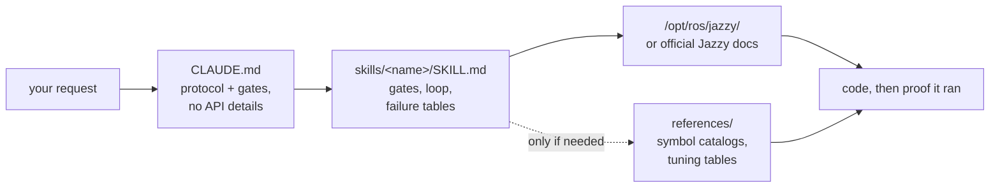

<div align="center">


**Claude Code Skills for ROS 2 Jazzy Jalisco robotics development.**

Skills that transform how AI agents approach ROS 2 development: identify unknown parameters upfront, verify settings against installed packages, and confirm execution through working evidence.


**English** | [한국어](README.ko.md) | [中文](README.zh.md) | [日本語](README.ja.md) | [Español](README.es.md) | [Français](README.fr.md) | [Deutsch](README.de.md)

| Skills | Always-loaded protocol | Doc links (CI-checked) | Physical robot checks | Evals: Gazebo A/B |
| :---: | :---: | :---: | :---: | :---: |
| **11** | **28 lines** | **32** | **4 scripts** | **goal reached vs. bringup abort** |

</div>

---

## Contents

- [The failures that cost you](#the-failures-that-cost-you)
- [How these skills are built](#how-these-skills-are-built)
- [What makes this different](#what-makes-this-different)
- [Evals](#evals)
- [Quickstart](#quickstart)
- [Skills](#skills)
- [Verification scripts](#verification-scripts)
- [How it works](#how-it-works)
- [Updating](#updating)
- [Roadmap](#roadmap)
- [Contributing](#contributing)
- [License](#license)

## The failures that cost you

The most costly errors in AI-generated ROS 2 code are rarely syntax mistakes. Instead, they are subtle issues that appear correct at first glance:

| Failure | What you see | Why an agent encounters the issue |
| :--- | :--- | :--- |
| **Silent failure** | `ros2 topic hz` shows 30 Hz; your callback never fires | A default RELIABLE subscriber attempts to connect to a BEST_EFFORT publisher. The code compiles and passes code review, but fails at the DDS middleware level. |
| **Wrong ground truth** | `/cmd_vel` indicates forward motion and `/odom` reports forward motion, but the physical robot moves **backward** | The static TF frame is inverted relative to physical mounting. Downstream components compute correctly *using the wrong transform*, producing no obvious errors. |
| **Outdated API** | Code passes review but fails at runtime when calling an incorrect method | The agent uses deprecated Foxy or Humble API methods that were renamed or removed in Jazzy. |
| **Invalid premise** | The agent writes 200 lines of code based on an assumption that you could have corrected in a single sentence | No mechanism prompts the agent to verify missing details before generating code. |

Neither compilers, linters, nor log analyses detect these hidden issues. Resolving each error requires an extra feedback cycle: reviewing output, diagnosing the cause, explaining the fix, and re-generating code.

## How these skills are built

Four design rules govern every skill in this repository:

**1. Identify unknown variables upfront.** Key operational details often do not exist in documentation — such as whether the environment is real hardware or simulation, whether to extend an existing workspace or create a new one, which node already publishes a transform, or the robot's precise geometry. [`CLAUDE.md`](./CLAUDE.md) instructs the agent to clarify these unknowns before generating code. Domain-specific skills manage targeted parameters; for example, `ros2-dev` requests the robot footprint, drive kinematics, and localization source before configuring any Nav2 parameters.

**2. Execute a structured loop with clear exit criteria.** Every skill follows a *verify → write → prove* cycle: inspect system defaults on the installed environment, apply incremental changes, and confirm execution. A task completes only when supported by observed evidence — such as a successful build, active data on `ros2 topic echo`, or a passing verification script — rather than simply producing code files.

**3. Prioritize structured failure tables over long descriptions.** Structured tables mapping symptoms → root causes → corrective actions provide clear, durable guidance that official documentation often lacks and that remains reliable across release versions:

> `[` is GZ→ROS, `]` is ROS→GZ · `16UC1` is millimeters, `32FC1` is meters · `joint_state_broadcaster` is not spawned automatically · `raytrace_max_range` ≤ `obstacle_max_range` means obstacles never clear · rclc does not auto-allocate unbounded message fields

**4. Optimize context usage with a three-layer architecture.** Each skill balances context efficiency: skill descriptions remain in context, skill bodies load when invoked, and deep reference files in `references/` load only on demand. Large symbol catalogs and detailed parameter tuning tables reside in `references/`, ensuring context is preserved and debugging targeted components (like AMCL) does not load unnecessary documentation (like behavior-tree nodes).

## What makes this different

Most robotics skill packs embed static API knowledge directly inside skill files. While initial usage is easy, this approach breaks when the underlying packages update — leaving outdated snippets that silently fail. This repository takes a dynamic, documentation-driven approach:

| Feature | Content-heavy skill packs | **claude-ros2-skills** |
| :--- | :--- | :--- |
| Knowledge location | Embedded in skill files (**400–1,800 lines/skill**) | Linked to official docs (**~60-line** skill bodies); detailed references read **only when needed** |
| Always-loaded context | Full `SKILL.md` files | **28-line** core protocol |
| Handling Jazzy API updates | Snippets become outdated quietly; requires continuous manual test updates | Outdated snippet risk is minimized to entry-point links and symbol names — **32 documentation links** verified weekly via CI |
| Verification method | Static code analysis or log checking | **Physical & runtime verification**: IMU gravity checks, directional odometry tests, TF frame alignment, DDS QoS compatibility |
| Distribution scope | Claims support for multiple ROS distros while targeting only one | **ROS 2 Jazzy only**, explicitly designed and validated |

This repository optimizes for a single outcome: minimizing the risk of generating plausible-looking code that fails to run on ROS 2 Jazzy.

## Evals

Every result below comes from a measured A/B pair: the **identical prompt** run in fresh, headless Claude Code sessions — once without these skills, once with them — using the **same model** in both cells. Outputs were graded symbol-by-symbol against pinned upstream Jazzy sources, then against a live `/opt/ros/jazzy` installation, then by loading both outputs into a **live Gazebo simulation**, and finally by **executing the generated nodes** against running publishers. Every task in the suite now has a live-install measurement. Full transcripts, generated code, and run logs are committed under [`evals/runs/`](./evals/runs/), and the harness that produces the pairs is in [`evals/harness/`](./evals/harness/), so anyone can re-grade or re-run without trusting us.

Most cells are **n=1**, and the runs were graded by the same project that publishes them; grading is mechanical wherever possible (does the symbol exist in the install? does the command succeed?) so it can be checked independently. One task has since been repeated 13 times, and doing so **retracted** a conclusion the single run had supported — the write-up keeps both the claim and the retraction.

### Nav2 MPPI configuration — Haiku, live Jazzy install

*Prompt: set up Nav2 with the MPPI controller for a differential-drive robot on Jazzy and produce the controller server YAML.*

| | Without skills | With skills |
| :--- | :--- | :--- |
| Process | Answered instantly from memory; **zero** verification despite tools being available | Asked footprint, existing-config, localization, and velocity limits **first**, then read the shipped defaults at `/opt/ros/jazzy/share/nav2_bringup/params/nav2_params.yaml` |
| Plugin string | `mppi_generic::ControllerServer` — does not exist | `nav2_mppi_controller::MPPIController` — correct |
| `critics:` list | Absent entirely | All 8, correct names |
| Fabricated parameter keys | **~16** | **0** — every key mechanically diffed against the installed defaults |
| **Loaded into a live Gazebo simulation** | **`[FATAL] Failed to create controller … does not exist` — Nav2 aborts at bringup; the robot never moves** | **MPPI + all 8 critics load; the robot drives (−2.0, −0.5) → (0.5, 0.5); `NavigateToPose` returns `SUCCEEDED`** |

### A package that must actually run — Haiku, in-container

*Prompt: create a Python package `demo_pkg` publishing `std_msgs/msg/String` on `/greeting` at 1 Hz with a launch file; build it and show `ros2 topic echo /greeting`.*

| | Without skills | With skills |
| :--- | :--- | :--- |
| `ros2 run` / `ros2 launch` / `topic echo` | **All three fail** — the package never registers in the ament index | **All three pass**, confirmed by independent re-runs of each command |
| Cost to that outcome | $0.17 · 36 turns · 178 s | **$0.08 · 18 turns · 61 s** — correct on the first pass and **2.2× cheaper** |

### Sensor subscription — Haiku, both nodes executed against a live publisher

*Prompt: write a Jazzy Python node that subscribes to `/scan` and logs the minimum range once per second.* Both generated nodes were then run for 6 s against a BEST_EFFORT `/scan` publisher.

| | Without skills | With skills |
| :--- | :--- | :--- |
| Subscription QoS | `create_subscription(..., 10)` → RELIABLE | `qos_profile_sensor_data` |
| **Messages received at runtime** | **Zero.** rclpy itself reported `offering incompatible QoS. No messages will be received from it. Last incompatible policy: RELIABILITY` | **Receives at 5 Hz** |
| Reported minimum (correct answer: 0.45 m) | never received one | **`0.450 m` — correct** |
| Clean exit on SIGTERM | traceback | no traceback |

An earlier round of this same pair is what produced the fix: both nodes then filtered only `inf`, so the with-skills node reported `0.020 m` — connected, but confidently wrong. `ros2-core` gained the bounds rule and the shutdown pattern, and the re-run above is the verification that the patch changed the output. Both tables are in [`evals/RESULTS.md`](./evals/RESULTS.md).

### Asking before writing — Haiku, inverted LiDAR mount

*Prompt: my LiDAR is mounted upside-down on the back, facing backward; write the static TF and tell me how to confirm it.*

| | Without skills | With skills |
| :--- | :--- | :--- |
| Physical mounting established first | Answered in one turn | **Stopped and asked for the back distance and offsets** before emitting a transform |
| Transform correctness | roll≈180° + yaw≈180°, REP 105 parent/child — correct | correct; both outputs were published and flagged by `check_tf_tree.py` exactly as designed |
| Confirmation advice | RViz with a **PointCloud2** display — wrong message type for a LiDAR | `tf2_echo` plus a **LaserScan** display |

### What the skills do not fix

Reported because leaving it out would make the rest less trustworthy:

- **A rule only helps if the skill carrying it actually loads — and loading is not guaranteed.** For one identical prompt the router selected three different skills across five runs. In a stripped install offering only a weakly-matching skill, the agent loaded **nothing in 4 of 8 cells**, even where `CLAUDE.md` — whose first instruction is "load the matching skill" — was present. Skill activation sits upstream of every other claim on this page.
- **One with-skills answer was worse than baseline, and chasing it produced a retraction.** A single run emitted `rclcpp.qos` in Python code (`ModuleNotFoundError`); the tidy explanation was that a C++-only skill had contaminated a Python answer, and a fix was written for it. A controlled re-run that forced exactly that condition, with the pre-patch skill as a true control, then failed to reproduce the error in **8 of 8 cells** — 1 occurrence in 13 total. The mechanism was imagined, and the write-up says so. Every n=1 result here carries the same risk.
- **Hallucination moves, it does not stop.** Every measured round has contained invented symbols in with-skills output — a non-existent package for this repo's own script, a wrong default durability, missing range bounds, a Python module that doesn't exist. Routing to docs raises the floor; it does not make the model correct.
- **On problems the model already knows cold, skills cost more and buy little.** For the classic QoS-mismatch diagnosis, both conditions were right in one turn and the with-skills side cost ~1.4× while adding an error.
- **Skills change what the agent asks, more reliably than what it checks.** Across four with-skills cells on that task, with a live reproduction running and `Bash` allowed, **none** ran the `ros2 topic info -v` they recommended. The verify-before-writing half does fire — on Task 1 the agent ran `ros2 interface show` first — but "prove it afterwards" does not reach diagnosis answers.

### The pattern across every pair

No baseline cell in any run verified against the installed packages or the docs **before** writing, even when WebFetch, Read, and Bash were explicitly allowed — and one baseline reported a fully working build for a package `ros2 run` cannot find. With-skills cells asked the pre-write gate questions in every run where the task had unknowns, and their claims matched independent re-execution. The verification scripts have now been exercised on live data in both directions: `check_qos_compat.py` produced its first real `[FAIL]` against a genuine BEST_EFFORT/RELIABLE mismatch, and `check_tf_tree.py` flagged an inverted sensor while leaving a correctly-mounted one alone.

Review full evaluation tables, test environments, and individual run analyses in [`evals/RESULTS.md`](./evals/RESULTS.md). For details on the evaluation protocol, task checklists, and container setup, see [`evals/README.md`](./evals/README.md). Pull requests containing additional graded transcripts are welcome.

## Quickstart

**Option A — Plugin Marketplace (Recommended):**

```
/plugin marketplace add Leehyunbin0131/claude-ros2-skills
/plugin install claude-ros2-skills@claude-ros2-skills
```

Update installed plugins anytime with `/plugin marketplace update`.

**Option B — Manual Installation:**

```bash
git clone https://github.com/Leehyunbin0131/claude-ros2-skills.git

# Project-level installation (applies to the current project only)
mkdir -p your-project/.claude/skills
cp -r claude-ros2-skills/skills/* your-project/.claude/skills/
cp claude-ros2-skills/CLAUDE.md your-project/

# User-level installation (applies across all projects)
mkdir -p ~/.claude/skills
cp -r claude-ros2-skills/skills/* ~/.claude/skills/
```

Restart Claude Code (or start a new session) to apply the installed skills.

## Skills

| Skill | Path | Coverage |
| :--- | :--- | :--- |
| **ros2-core** | `skills/ros2-core/SKILL.md` | rclcpp, rclpy, TF2, EKF odometry, QoS profiles, parameters |
| **ros2-package** | `skills/ros2-package/SKILL.md` | `ros2 pkg create`, CMakeLists/setup.py wiring, colcon build & source, custom interfaces |
| **ros2-dev** | `skills/ros2-dev/SKILL.md` | Nav2 (AMCL, costmaps, MPPI/Smac), SLAM Toolbox, RTAB-Map, Isaac ROS |
| **gazebo-sim** | `skills/gazebo-sim/SKILL.md` | Gazebo Harmonic, ros_gz_bridge, ros_gz_sim, SDFormat modeling |
| **ros2-control** | `skills/ros2-control/SKILL.md` | ros2_control hardware abstraction, controller manager, URDF tags |
| **ros2-moveit** | `skills/ros2-moveit/SKILL.md` | MoveIt 2, MoveGroup C++/Python API, IK solvers, OMPL, MoveIt Servo |
| **ros2-perception** | `skills/ros2-perception/SKILL.md` | image_transport, cv_bridge, vision_msgs, depth_image_proc, PCL |
| **ros2-testing** | `skills/ros2-testing/SKILL.md` | launch_testing, gtest/pytest, rosbag2 C++/Python APIs, ros2trace |
| **ros2-microros** | `skills/ros2-microros/SKILL.md` | micro-ROS Agent, rclc client API, custom transports, static memory |
| **ros2-security** | `skills/ros2-security/SKILL.md` | SROS2, PKI keystore generation, access control, DDS Security |
| **ros2-troubleshooting** | `skills/ros2-troubleshooting/SKILL.md` | REP 103/105 ground-truth TF tree, LiDAR/IMU alignment, physical verification |

## Verification scripts

These verification scripts are bundled within the `ros2-troubleshooting` skill (`skills/ros2-troubleshooting/scripts/`) and are included with every installation. They convert physical hardware checks into executable pass/fail verification steps (requires a sourced ROS 2 environment; return codes: 0 = PASS, 1 = FAIL, 2 = NO DATA):

| Script | Verifies |
| :--- | :--- |
| `check_imu_gravity.py` | Validates that a robot at rest measures gravity at ~+9.81 m/s² along the **+Z** axis (REP 103). Detects inverted or misaligned IMU mountings. |
| `check_odom_direction.py` | Validates that pushing the robot forward produces positive odometry displacement along its heading. Detects inverted motor directions, encoder polarity issues, or inverted TF setups. |
| `check_tf_tree.py` | Verifies that `map→odom→base_link` resolves correctly; displays each sensor mounting offset in RPY degrees and highlights potential 180° orientation errors. |
| `check_qos_compat.py` | Verifies QoS compatibility across all publisher/subscriber pairs on a topic using DDS rules. Prevents silent failures (such as a BEST_EFFORT publisher paired with a RELIABLE subscriber, or mismatches in durability, deadline, and liveliness). |

The core decision logic is unit-tested independently of ROS (`python3 skills/ros2-troubleshooting/scripts/test_checks.py`) and runs via continuous integration (CI) on every push.

## How it works



`CLAUDE.md` contains no specific API details. Instead, it establishes the operational protocol and requires clarifying questions to be answered before writing code. Each `SKILL.md` file manages domain-specific decisions: identifying unknown variables, executing the verify-write-prove loop, and referencing failure tables. Detailed reference materials are stored separately in the `references/` directory. See [`CLAUDE.md`](./CLAUDE.md) for details.

## Updating

```bash
cd claude-ros2-skills
git pull
cp -r skills/* ~/.claude/skills/   # or your project's .claude/skills/
```

## Roadmap

The detailed plan — what each item is for, what "done" means, what it costs, and which measurement created it — is in [`ROADMAP.md`](./ROADMAP.md).

1. ~~Automate evaluation pairs inside `ros:jazzy` containers~~ — **done (2026-07-25):** Task 4 re-run against a live `/opt/ros/jazzy` install; results in [`evals/RESULTS.md`](./evals/RESULTS.md).
2. ~~Publish Task 5 evaluation results~~ — **done (2026-07-25):** binary build/run/echo outcome measured in-container; results in [`evals/RESULTS.md`](./evals/RESULTS.md).
3. ~~Extend live-install evaluations to Tasks 1–3~~ — **done (2026-07-26):** run against a native `ros-jazzy-ros-base` install, with both generated nodes executed against live publishers; harness in [`evals/harness/`](./evals/harness/), results in [`evals/RESULTS.md`](./evals/RESULTS.md).
4. ~~Fix the defects those runs exposed~~ — **done (2026-07-26):** `ros2-troubleshooting` now states the literal script invocation (the model was inventing a package for it) and that `check_tf_tree.py` always flags a ~180° mount for physical confirmation; `ros2-core` gained the `range_min`/`range_max` bounds rule and a clean-shutdown pattern. **The eval tables measure the skills as they were before these fixes.**
5. ~~Re-run Tasks 1–3 against the patched skills~~ — **done (2026-07-26):** two of three defects corrected near-verbatim and Task 1 now reports the right minimum at runtime; the third task regressed for a traceable reason (see item 6).
6. ~~Duplicate the client-library guardrail across skills~~ — **applied (2026-07-26), effect unmeasured:** `CLAUDE.md` now states that `rclcpp` is C++ only and `rclpy` is Python only, and `ros2-perception`'s QoS row names both symbols instead of only the C++ one. Kept because it closes a real content gap, **not** because it fixed anything — the error it targeted turned out to occur once in 13 cells and did not reproduce under a controlled re-run. `ros2-perception` still has no Python examples.
7. **Measure skill-activation rate as a first-class metric.** It is upstream of everything else here: in a stripped install the agent loaded no skill at all in 4 of 8 cells. First routing data exists (one prompt selected 3 different skills across 5 runs); activation and routing both need per-task numbers.
8. **Repeat the favourable results.** Task 1's fix verification is n=1 in exactly the way the retracted mechanism claim was.
9. **Make Task 3 discriminating** — require the QoS diagnosis to be *demonstrated* against live endpoints, not recommended, since both conditions currently answer it correctly from memory.
10. **Track "corrections-to-completion" as a core metric** — measuring the number of feedback iterations required before code runs successfully.
11. **Implement deterministic `references/` lookups** to ensure detailed reference documents load whenever relevant.
12. **Expand the body/`references` split** to `ros2-core` and `gazebo-sim`, optimizing context efficiency for high-frequency skills with substantial reference documentation.

## Contributing

Summary: Skill files must focus on decision logic (validation gates, loop steps, and failure tables), while detailed documentation stays in `references/`. Every API symbol must be verified against official Jazzy documentation or `/opt/ros/jazzy/` installations. Verification scripts must maintain pure logic that can be unit-tested without ROS dependencies. For full guidelines, skill and script checklists, and issue templates, see [`CONTRIBUTING.md`](./CONTRIBUTING.md).

## License

Apache-2.0 — see [LICENSE](./LICENSE).
