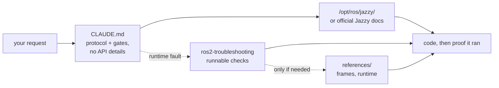

<div align="center">


**Claude Code Skills for ROS 2 Jazzy Jalisco robotics development.**

Skills that transform how AI agents approach ROS 2 development: identify unknown parameters upfront, verify settings against installed packages, and confirm execution through working evidence.


**English** | [한국어](README.ko.md) | [中文](README.zh.md) | [日本語](README.ja.md) | [Español](README.es.md) | [Français](README.fr.md) | [Deutsch](README.de.md)

| Skills | Always-loaded protocol | Doc links (CI-checked) | Physical robot checks |
| :---: | :---: | :---: | :---: |
| **2** | **28 lines** | **6** | **4 scripts** |

</div>

---

## Contents

- [The failures that cost you](#the-failures-that-cost-you)
- [How these skills are built](#how-these-skills-are-built)
- [What makes this different](#what-makes-this-different)
- [Evals](#evals)
- [Quickstart](#quickstart)
- [Skills](#skills)
- [Verification scripts](#verification-scripts)
- [How it works](#how-it-works)
- [Updating](#updating)
- [Contributing](#contributing)
- [License](#license)

## The failures that cost you

The most costly errors in AI-generated ROS 2 code are rarely syntax mistakes. Instead, they are subtle issues that appear correct at first glance:

| Failure | What you see | Why an agent encounters the issue |
| :--- | :--- | :--- |
| **Middleware mismatch** | `ros2 topic hz` shows 30 Hz; your callback never fires | A default RELIABLE subscriber cannot match a BEST_EFFORT publisher. It compiles, passes review, and fails below the application. rclpy does warn — `offering incompatible QoS ... Last incompatible policy: RELIABILITY` — but only at runtime, in the startup log, to whoever is reading it. |
| **Wrong ground truth** | `/cmd_vel` indicates forward motion and `/odom` reports forward motion, but the physical robot moves **backward** | The static TF frame is inverted relative to physical mounting. Downstream components compute correctly *using the wrong transform*, producing no obvious errors. |
| **Outdated API** | Code passes review but fails at runtime when calling an incorrect method | The agent uses deprecated Foxy or Humble API methods that were renamed or removed in Jazzy. |
| **Invalid premise** | The agent writes 200 lines of code based on an assumption that you could have corrected in a single sentence | No mechanism prompts the agent to verify missing details before generating code. |

Neither compilers, linters, nor log analyses detect these hidden issues. Resolving each error requires an extra feedback cycle: reviewing output, diagnosing the cause, explaining the fix, and re-generating code.

## How these skills are built

Four design rules govern every skill in this repository:

**1. Identify unknown variables upfront.** Key operational details often do not exist in documentation — such as whether the environment is real hardware or simulation, whether to extend an existing workspace or create a new one, which node already publishes a transform, or the robot's precise geometry. [`CLAUDE.md`](./CLAUDE.md) instructs the agent to clarify these unknowns before generating code.

**2. Execute a structured loop with clear exit criteria.** Every skill follows a *verify → write → prove* cycle: inspect system defaults on the installed environment, apply incremental changes, and confirm execution. A task completes only when supported by observed evidence — such as a successful build, active data on `ros2 topic echo`, or a passing verification script — rather than simply producing code files.

**3. Say nothing the model already knows or `CLAUDE.md` already says.** Every symptom→cause→action table this pack ever shipped was tested against a baseline agent with no skill loaded. None moved a single check — the model already reaches these mechanisms unaided, or the fix was a bundled script / a `CLAUDE.md` paragraph, never prose describing the domain. See [Evals](#evals).

**4. Point at a runnable artifact, never describe one.** The one piece of content in this pack ever shown to change an outcome is a script with an exit code (`scripts/check_*.py`, bundled in `ros2-troubleshooting`). A paragraph describing what such a script would tell you moved nothing — only running it did.

## What makes this different

Most robotics skill packs embed static API knowledge directly inside skill files. While initial usage is easy, this approach breaks when the underlying packages update — leaving outdated snippets that silently fail. This repository takes a dynamic, documentation-driven approach:

| Feature | Content-heavy skill packs | **claude-ros2-skills** |
| :--- | :--- | :--- |
| Knowledge location | Embedded in skill files (**400–1,800 lines/skill**) | Linked to official docs (**~60-line** skill bodies); detailed references read **only when needed** |
| Always-loaded context | Full `SKILL.md` files | **28-line** core protocol |
| Handling Jazzy API updates | Snippets become outdated quietly; requires continuous manual test updates | Outdated snippet risk is minimized to entry-point links and symbol names — **6 documentation links** verified weekly via CI |
| Verification method | Static code analysis or log checking | **Physical & runtime verification**: IMU gravity checks, directional odometry tests, TF frame alignment, DDS QoS compatibility |
| Distribution scope | Claims support for multiple ROS distros while targeting only one | **ROS 2 Jazzy only**, by design — no "works on Humble too" hedging |

This repository optimizes for a single outcome: minimizing the risk of generating plausible-looking code that fails to run on ROS 2 Jazzy.

## Evals

**The standard.** A skill earns its place only if it supplies something the agent
**cannot reach on its own** — with its own knowledge, web search, and a live
Jazzy install in front of it. Text that only tells the agent what it would have
done anyway is cost without benefit.

**How it is measured.** A real task in a clean container, ten runs with the piece
under test and ten without, graded by *running* what came out — a build, a topic
carrying data, an exit code — never by reading it. Fisher exact test,
Benjamini–Hochberg across the round.

**What that settled.** Eight domains were put through a three-rung ladder — 24
rungs, each rung adding a named mechanism, each graded by a check that runs the
artifact. The baseline agent reached **every mechanism it was asked for**:

| Domain | L1 → L2 → L3, mechanisms added per rung | Unaided |
| :--- | :--- | ---: |
| Packaging & build | `ament_python`/`ament_cmake` → cross-package `.srv` → composable node + `colcon test` | **190/190** |
| Simulation | SDF world + diff-drive → `ros_gz_bridge` + `gpu_lidar` → URDF spawn + `use_sim_time` | **108/110** |
| Executors | 1 s service from a timer → from a subscription + heartbeat → 5 concurrent calls | **110/110** |
| `ros2_control` | mock hardware + broadcaster → 2nd controller claiming interfaces → **custom C++ `SystemInterface` plugin** | **90/90** |
| Testing | pytest `colcon test` runs → `launch_testing` on a live node → rosbag2 written and read back | **110/110** |
| MoveIt 2 | self-authored URDF+SRDF `move_group` loads → real `GetMotionPlan` → collision object in the scene | **100/100** |
| Core | static TF from parameters → dynamic TF + `ExtrapolationException` → lifecycle node silent until activated | **110/110** |
| Nav2 | parameter file the servers accept → stack driven to `active` → costmap marking live scan obstacles | see below |
| Perception | `cv_bridge` round trip → `CameraInfo` projection → 16UC1 depth → `PointCloud2` | **106/120** |

**Not one failure was closed by supplying information.** Four gaps were found,
all behavioural:

| What the model does not do unaided | Baseline | What closed it | After |
| :--- | ---: | :--- | ---: |
| Verify against the install instead of answering from memory | **2/10** | one paragraph of `CLAUDE.md` | **10/10** (q=0.002) |
| Produce an exit-coded verdict rather than "looks right" | **0/10** | a bundled runnable script | **10/10** (q<0.001) |
| Run the QoS code it writes before shipping it | **5/10** | `CLAUDE.md`'s "Done means it ran" | **9/10** (underpowered) |
| Run the Nav2 config it writes before shipping it | **0/10** | a task that requires reaching `active` | **30/30** |

The last row is the cleanest result here. Asked for a Nav2 parameter file, 10/10
cells wrote one their own servers refuse to configure. Asked for the same file
*plus* the stack reaching `active`, every cell hit the identical error,
diagnosed it from the log, fixed it, and passed. **Same model, same wrong
belief, zero difference in information** — only the demand to run differs.

**Consequence for this pack.** Six domain skills were deleted in full, on top of
the two deleted earlier: the model already reaches their content, and no prose
in this repository has ever moved a check. What remains is a 28-line protocol,
four runnable scripts, and the reference material behind them. Method,
per-domain results and every raw run: [`evals/`](./evals/).

## Quickstart

**Option A — Plugin Marketplace (Recommended):**

```
/plugin marketplace add Leehyunbin0131/claude-ros2-skills
/plugin install claude-ros2-skills@claude-ros2-skills
```

Update installed plugins anytime with `/plugin marketplace update`.

**Option B — Manual Installation:**

```bash
git clone https://github.com/Leehyunbin0131/claude-ros2-skills.git

# Project-level installation (applies to the current project only)
mkdir -p your-project/.claude/skills
cp -r claude-ros2-skills/skills/* your-project/.claude/skills/
cp claude-ros2-skills/CLAUDE.md your-project/

# User-level installation (applies across all projects)
mkdir -p ~/.claude/skills
cp -r claude-ros2-skills/skills/* ~/.claude/skills/
```

Restart Claude Code (or start a new session) to apply the installed skills.

## Skills

| Skill | Path | Coverage |
| :--- | :--- | :--- |
| **ros2-troubleshooting** | `skills/ros2-troubleshooting/SKILL.md` | Four runnable pass/fail checks — QoS compatibility, TF tree, IMU mount, odometry direction — plus REP 103/105 frame conventions and Jazzy runtime behaviour behind them |
| **ros2-microros** | `skills/ros2-microros/SKILL.md` | micro-ROS Agent, rclc client API, custom transports, static memory |

**Why only two.** Every other skill was measured against a baseline agent that
had no skill loaded, and deleted when the agent produced the same result without
it — `ros2-core`, `ros2-dev`, `ros2-control`, `ros2-moveit`, `ros2-perception`,
`ros2-testing`, `ros2-package` and `gazebo-sim`, in that order of measurement.
`ros2-microros` is the one domain with no ladder: the hardware to run one
against is not available here, so it is kept and **not claimed as verified**.
See [Evals](#evals).

## Verification scripts

These verification scripts are bundled within the `ros2-troubleshooting` skill (`skills/ros2-troubleshooting/scripts/`) and are included with every installation. They convert physical hardware checks into executable pass/fail verification steps (requires a sourced ROS 2 environment; return codes: 0 = PASS, 1 = FAIL, 2 = NO DATA):

| Script | Verifies |
| :--- | :--- |
| `check_imu_gravity.py` | Validates that a robot at rest measures gravity at ~+9.81 m/s² along the **+Z** axis (REP 103). Detects inverted or misaligned IMU mountings. |
| `check_odom_direction.py` | Validates that pushing the robot forward produces positive odometry displacement along its heading. Detects inverted motor directions, encoder polarity issues, or inverted TF setups. |
| `check_tf_tree.py` | Verifies that `map→odom→base_link` resolves correctly; displays each sensor mounting offset in RPY degrees and highlights potential 180° orientation errors. |
| `check_qos_compat.py` | Verifies QoS compatibility across all publisher/subscriber pairs on a topic using DDS rules. Prevents silent failures (such as a BEST_EFFORT publisher paired with a RELIABLE subscriber, or mismatches in durability, deadline, and liveliness). |

The core decision logic is unit-tested independently of ROS (`python3 skills/ros2-troubleshooting/scripts/test_checks.py`) and runs via continuous integration (CI) on every push.

## How it works



`CLAUDE.md` contains no specific API details. It establishes the operational
protocol — verify against the install, establish the unknowns a doc cannot
supply, and treat a task as done only when something has been observed running.
The domain knowledge it would otherwise carry is left to the model and the
install, because that is where measurement put it. `ros2-troubleshooting` enters
only when a system logs healthy and does not work, and it answers with an exit
code rather than a paragraph. See [`CLAUDE.md`](./CLAUDE.md) for details.

## Updating

```bash
cd claude-ros2-skills
git pull
cp -r skills/* ~/.claude/skills/   # or your project's .claude/skills/
```

## Contributing

Summary: new skill content has to earn its place against a baseline agent that does not have it — a real task, ten runs each way, graded by running the output. Content the agent produces unaided does not get added, however correct it is. Verification scripts must keep their decision logic pure so it can be unit-tested without ROS. For the measurement protocol, checklists and issue templates, see [`CONTRIBUTING.md`](./CONTRIBUTING.md).

## License

Apache-2.0 — see [LICENSE](./LICENSE).
