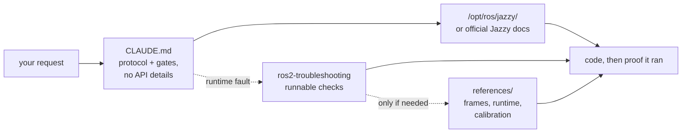

<div align="center">


**Claude Code Skills for ROS 2 Jazzy Jalisco robotics development.**

Skills that transform how AI agents approach ROS 2 development: identify unknown parameters upfront, verify settings against installed packages, and confirm execution through working evidence.


**English** | [한국어](README.ko.md) | [中文](README.zh.md) | [日本語](README.ja.md) | [Español](README.es.md) | [Français](README.fr.md) | [Deutsch](README.de.md)

| Skills | Always-loaded protocol | Doc links (CI-checked) | Physical robot checks |
| :---: | :---: | :---: | :---: |
| **2** | **30 lines** | **9** | **4 scripts** |

</div>

---

## Contents

- [The failures that cost you](#the-failures-that-cost-you)
- [How these skills are built](#how-these-skills-are-built)
- [What makes this different](#what-makes-this-different)
- [Evals](#evals)
- [Quickstart](#quickstart)
- [Skills](#skills)
- [Verification scripts](#verification-scripts)
- [How it works](#how-it-works)
- [Updating](#updating)
- [Contributing](#contributing)
- [License](#license)

## The failures that cost you

The most costly errors in AI-generated ROS 2 code are rarely syntax mistakes. Instead, they are subtle issues that appear correct at first glance:

| Failure | What you see | Why an agent encounters the issue |
| :--- | :--- | :--- |
| **Middleware mismatch** | `ros2 topic hz` shows 30 Hz; your callback never fires | A default RELIABLE subscriber cannot match a BEST_EFFORT publisher. It compiles, passes review, and fails below the application. rclpy does warn — `offering incompatible QoS ... Last incompatible policy: RELIABILITY` — but only at runtime, in the startup log, to whoever is reading it. |
| **Wrong ground truth** | `/cmd_vel` indicates forward motion and `/odom` reports forward motion, but the physical robot moves **backward** | The static TF frame is inverted relative to physical mounting. Downstream components compute correctly *using the wrong transform*, producing no obvious errors. |
| **Outdated API** | Code passes review but fails at runtime when calling an incorrect method | The agent uses deprecated Foxy or Humble API methods that were renamed or removed in Jazzy. |
| **Invalid premise** | The agent writes 200 lines of code based on an assumption that you could have corrected in a single sentence | No mechanism prompts the agent to verify missing details before generating code. |

Neither compilers, linters, nor log analyses detect these hidden issues. Resolving each error requires an extra feedback cycle: reviewing output, diagnosing the cause, explaining the fix, and re-generating code.

## How these skills are built

Four design rules govern every skill in this repository. They follow Anthropic's [context-engineering guidance for Claude 5 generation models](https://claude.com/blog/the-new-rules-of-context-engineering-for-claude-5-generation-models) — which diagnoses **over-constraining** and **conflicting instructions** across a system prompt, `CLAUDE.md` and skills — and each one was then checked against this repository's own measurements. [`evals/AUTHORING.md`](./evals/AUTHORING.md) keeps those two sources of authority apart, including where the guidance is followed but *not* yet measured here.

**1. Identify unknown variables upfront.** Key operational details often do not exist in documentation — such as whether the environment is real hardware or simulation, whether to extend an existing workspace or create a new one, which node already publishes a transform, or the robot's precise geometry. [`CLAUDE.md`](./CLAUDE.md) instructs the agent to clarify these unknowns before generating code.

**2. Execute a structured loop with clear exit criteria.** Every skill follows a *verify → write → prove* cycle: inspect system defaults on the installed environment, apply incremental changes, and confirm execution. A task completes only when supported by observed evidence — such as a successful build, active data on `ros2 topic echo`, or a passing verification script — rather than simply producing code files.

**3. Say nothing the model already knows or `CLAUDE.md` already says.** Every symptom→cause→action table previously included in this pack was benchmarked against an unassisted baseline agent. Descriptive prose never improved benchmark outcomes — the model either reaches the solution unaided, or requires a bundled executable script or a `CLAUDE.md` protocol constraint. See [Evals](#evals).

**4. Point at a runnable artifact, never describe one.** Empirical testing showed that descriptive text explaining what a script would check produced no benchmark improvement. Only executable scripts with deterministic exit codes (`scripts/check_*.py` in `ros2-troubleshooting`) measurably changed model behavior.

## What makes this different

Most robotics skill packs embed static API knowledge directly inside skill files. While initial usage is easy, this approach breaks when the underlying packages update — leaving outdated snippets that silently fail. This repository takes a dynamic, documentation-driven approach:

| Feature | Content-heavy skill packs | **claude-ros2-skills** |
| :--- | :--- | :--- |
| Knowledge location | Embedded in skill files (**400–1,800 lines/skill**) | Linked to official docs (**~60-line** skill bodies); detailed references read **only when needed** |
| Always-loaded context | Full `SKILL.md` files | **30-line** core protocol |
| Handling Jazzy API updates | Snippets become outdated quietly; requires continuous manual test updates | Outdated snippet risk is minimized to entry-point links and symbol names — **6 documentation links** verified weekly via CI |
| Verification method | Static code analysis or log checking | **Physical & runtime verification**: IMU gravity checks, directional odometry tests, TF frame alignment, DDS QoS compatibility |
| Distribution scope | Claims support for multiple ROS distros while targeting only one | **ROS 2 Jazzy only**, by design — no "works on Humble too" hedging |

This repository optimizes for a single outcome: minimizing the risk of generating plausible-looking code that fails to run on ROS 2 Jazzy.

## Evals

**The standard.** A skill earns its place only if it supplies something the agent
**cannot reach on its own** — with its own knowledge, web search, and a live
Jazzy install in front of it. Text that only tells the agent what it would have
done anyway is cost without benefit.

**How it is measured.** A real task in an isolated workspace, ten runs with the piece
under test and ten without, graded by *running* what came out — a build, a topic
carrying data, an exit code — never by reading it. Fisher exact test,
Benjamini–Hochberg across the round.

**Historical results, with reproducibility limits.** The following tables preserve previously reported scores. Several do not match the committed verdict files, and some regrading evidence is unavailable. See the [artifact reconciliation](./evals/CAPABILITIES.md) before treating these numbers or universal capability claims as verified. No new benchmark was run for this maintenance update.

| Domain | L1 → L2 → L3, mechanisms added per rung | Unaided |
| :--- | :--- | ---: |
| Packaging & build | `ament_python`/`ament_cmake` → cross-package `.srv` → composable node + `colcon test` | **190/190** |
| Simulation | SDF world + diff-drive → `ros_gz_bridge` + `gpu_lidar` → URDF spawn + `use_sim_time` | **108/110** |
| Executors | 1 s service from a timer → from a subscription + heartbeat → 5 concurrent calls | **110/110** |
| `ros2_control` | mock hardware + broadcaster → 2nd controller claiming interfaces → **custom C++ `SystemInterface` plugin** | **90/90** |
| Testing | pytest `colcon test` runs → `launch_testing` on a live node → rosbag2 written and read back | **110/110** |
| MoveIt 2 | self-authored URDF+SRDF `move_group` loads → real `GetMotionPlan` → collision object in the scene | **100/100** |
| Core | static TF from parameters → dynamic TF + `ExtrapolationException` → lifecycle node silent until activated | **110/110** |
| Nav2 | parameter file the servers accept → stack driven to `active` → costmap marking live scan obstacles | see below |
| Perception | `cv_bridge` round trip → `CameraInfo` projection → 16UC1 depth → `PointCloud2` | **106/120** |

The historical analysis attributed the following differences to verification and execution behavior. These are reported observations with the evidence limits above, not a guarantee across models or tasks.

| What the model does not do unaided | Baseline | What closed it | After |
| :--- | ---: | :--- | ---: |
| Verify against the install instead of answering from memory | **2/10** | one paragraph of `CLAUDE.md` | **10/10** (q=0.002) |
| Produce an exit-coded verdict rather than "looks right" | **0/10** | a bundled runnable script | **10/10** (q<0.001) |
| Run the QoS code it writes before shipping it | **5/10** | `CLAUDE.md`'s "Done means it ran" | **9/10** (underpowered) |
| Run the Nav2 config it writes before shipping it | **0/10** | a task that requires reaching `active` | **30/30** |

The historical Nav2 comparison suggested that requiring execution exposed configuration errors. Some committed verdicts are missing, so the reported totals and broader conclusions require the reconciliation linked above.

**Current scope.** The earlier skill deletions are retained; this maintenance does not establish new model capability results or reverse those decisions without new evidence. The pack contains the unchanged 30-line protocol, four executable checks, and their supporting references. See [`evals/`](./evals/) for the method, historical runs, and evidence limits.

## Quickstart

**Option A — Plugin Marketplace (Recommended):**

```
/plugin marketplace add Leehyunbin0131/claude-ros2-skills
/plugin install claude-ros2-skills@claude-ros2-skills
```

Update the installed plugin with `claude plugin update claude-ros2-skills@claude-ros2-skills`, then start a new session.

Choose one installation method. The plugin loads the unchanged `CLAUDE.md` through a `SessionStart` hook; at user scope it applies to every project. Manual installation copies it to `.claude/rules/ros2-verification.md` and preserves existing `CLAUDE.md` files. The 2/10→10/10 experiment used a project-root `CLAUDE.md`; equivalent effectiveness of hook/rules delivery has not been measured.

**Option B — Manual Installation:**

```bash
git clone https://github.com/Leehyunbin0131/claude-ros2-skills.git

# Project-level installation (applies to the current project only)
python3 claude-ros2-skills/scripts/install.py --project your-project

# User-level installation (applies across all projects)
python3 claude-ros2-skills/scripts/install.py --user
```

Restart Claude Code (or start a new session) to apply the installed skills.

## Skills

| Skill | Path | Coverage |
| :--- | :--- | :--- |
| **ros2-troubleshooting** | `skills/ros2-troubleshooting/SKILL.md` | Four runnable pass/fail checks — QoS compatibility, TF tree, IMU mount, odometry direction — plus REP 103/105 frame conventions, Jazzy runtime behaviour, and hardware odometry calibration behind them |
| **ros2-microros** | `skills/ros2-microros/SKILL.md` | micro-ROS Agent, rclc client API, custom transports, static memory |

**Why only two.** Every other skill was measured against a baseline agent that
had no skill loaded, and deleted when the agent produced the same result without
it — `ros2-core`, `ros2-dev`, `ros2-control`, `ros2-moveit`, `ros2-perception`,
`ros2-testing`, `ros2-package` and `gazebo-sim`, in that order of measurement.
`ros2-microros` is the one domain with no ladder: the hardware to run one
against is not available here, so it is kept and **not claimed as verified**.
See [Evals](#evals).

## Verification scripts

These verification scripts are bundled within the `ros2-troubleshooting` skill (`skills/ros2-troubleshooting/scripts/`) and are included with every installation. They convert physical hardware checks into executable pass/fail verification steps (requires a sourced ROS 2 environment; return codes: 0 = PASS, 1 = FAIL, 2 = INCONCLUSIVE):

Exit 2 also covers invalid data, unknown QoS, missing TF and insufficient motion. The IMU check transforms acceleration into `--base base_link`; use `--assume-aligned` only when the message axes are known to match the level base frame.

| Script | Verifies |
| :--- | :--- |
| `check_imu_gravity.py` | Checks gravity at rest on level ground after TF into the base frame: ~+9.81 m/s² on **+Z** (REP 103). Detects roll/pitch inconsistencies; gravity alone cannot verify yaw. |
| `check_odom_direction.py` | Validates that pushing the robot forward produces positive odometry displacement along its heading. Detects inverted motor directions, encoder polarity issues, or inverted TF setups. |
| `check_tf_tree.py` | Verifies that `map→odom→base_link` resolves correctly; displays each sensor mounting offset in RPY degrees and highlights potential 180° orientation errors. |
| `check_qos_compat.py` | Verifies QoS compatibility across all publisher/subscriber pairs on a topic using DDS rules. Prevents silent failures (such as a BEST_EFFORT publisher paired with a RELIABLE subscriber, or mismatches in durability, deadline, and liveliness). |

The core decision logic is unit-tested independently of ROS (`python3 skills/ros2-troubleshooting/scripts/test_checks.py`) and runs via continuous integration (CI) on every push.

## How it works



[`CLAUDE.md`](./CLAUDE.md) contains no specific API details. Instead, it establishes the operational protocol: verify settings against the local environment, identify operational unknowns up front, and consider a task finished only when execution is observed. Domain knowledge is left to the model and the installed environment, as empirical evals showed descriptive prose added no value. The `ros2-troubleshooting` skill is invoked only when a system appears healthy in logs but fails at runtime, providing actionable exit codes rather than descriptive text. See [`CLAUDE.md`](./CLAUDE.md) for details.

## Updating

```bash
cd claude-ros2-skills
git pull
python3 scripts/install.py --user
# python3 scripts/install.py --project /path/to/your-project
```

The installer updates its own unchanged files and refuses to overwrite local edits or existing unmanaged copies. Move conflicting copies aside after inspection. Retired skill directories are listed for manual cleanup and are never deleted automatically. Run the same installer command to update both skills and the protocol.

## Contributing

**Summary:** New skill content must prove its value against an unassisted baseline agent through empirical testing (a real task, 10 runs per condition, graded by executing the output). Content that the model generates unaided will not be included, regardless of correctness. Verification scripts must maintain pure decision logic so they can be unit-tested independently of ROS. For the evaluation protocol, checklists, and issue templates, see [`CONTRIBUTING.md`](./CONTRIBUTING.md).

## License

Apache-2.0 — see [LICENSE](./LICENSE).
