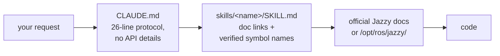

<div align="center">


**Claude Code Skills for ROS 2 Jazzy Jalisco robotics development.**

Anti-hallucination reference skills — every skill routes to official docs instead of guessing API names.


**English** | [한국어](README.ko.md) | [中文](README.zh.md) | [日本語](README.ja.md) | [Español](README.es.md) | [Français](README.fr.md) | [Deutsch](README.de.md)

| Skills | Always-loaded router | Doc links (CI-checked) | Robot ground-truth checks | Evals: verified before writing |
| :---: | :---: | :---: | :---: | :---: |
| **11** | **26 lines** | **38** | **4 scripts** | **0/3 → 3/3** |

</div>

---

## Contents

- [Why this exists](#why-this-exists)
- [What makes this different](#what-makes-this-different)
- [Evals](#evals)
- [Quickstart](#quickstart)
- [Skills](#skills)
- [Verification scripts](#verification-scripts)
- [How it works](#how-it-works)
- [Updating](#updating)
- [Roadmap](#roadmap)
- [Contributing](#contributing)
- [License](#license)

## Why this exists

Logs prove a system is *consistent*, never that it's *correct* — and an agent has no default reason to distrust a consistent story. Two failure modes keep coming up:

| Failure mode | What it looks like | Actual cause |
| :--- | :--- | :--- |
| **Wrong ground truth** | `/cmd_vel` says forward, `/odom` says forward, every topic healthy — robot drives **backward** | Static TF declared flipped vs. the physical sensor mount; everything downstream computes correctly *from the wrong transform*, so nothing ever contradicts |
| **Wrong era** | Code compiles in review, dies at runtime with a method that "sounds right" | Agent codes from memorized Foxy/Humble-era training data; the API was renamed or never existed in Jazzy |

Both come from trusting something that *looks* authoritative instead of checking ground truth. `ros2-troubleshooting` forces physical checks (push the robot, echo the raw TF, confirm IMU gravity) before trusting a topic. Every other skill applies the same rule to code: verify class names, messages, and flags against official Jazzy docs or `/opt/ros/jazzy/` — never from memory.

## What makes this different

Most robotics skill packs bake API knowledge into the skill files. That works until the ecosystem moves — then every baked-in snippet is a fact that can silently rot. This repo makes the opposite bet:

| | Content-heavy skill packs | **claude-ros2-skills** |
| :--- | :--- | :--- |
| Knowledge lives | baked into skill files, **400–1,800 lines/skill** | routed to official docs; **~60-line** skill bodies, bulk detail in `references/` read **only when needed** |
| Always-loaded context | full SKILL.md | **26-line** router |
| When a Jazzy API changes | snippets rot silently; needs doc regression tests forever | rot surface shrinks to entry-point links + symbol names — **38 links** CI-checked weekly (liveness only), dead link fails the build |
| Verification | static / log-based | **physical**: IMU gravity, push test, TF mounts vs. real hardware, DDS QoS matching |
| Distro claim | "covers 4 distros" over examples targeting one | **Jazzy only**, stated up front |

The trade-off, stated plainly: for topics where official docs are thin (DDS vendor tuning, PREEMPT_RT internals), a content-heavy pack can serve you better. This repo optimizes for one thing — the lowest probability of plausible-looking code that doesn't run on Jazzy.

## Evals

Measured, not claimed — with two disclosed caveats: the runs were executed and graded by the repo author's own agent session rather than an independent party, and **no eval machine so far has had ROS 2 installed**, so grading substitutes the pinned upstream `jazzy` sources for `/opt/ros/jazzy/`. Identical prompts ran in fresh headless Claude Code sessions with and without the skills installed (same model per pair); outputs were graded symbol-by-symbol against those pinned sources.

| Result | Without skills | With skills |
| :--- | ---: | ---: |
| Wrong/invented Nav2 MPPI keys (haiku, re-run) | **~30** — no `critics:` list at all, config cannot run | **~16–20** — plugin string, `motion_model` and checker namespaces correct |
| `/scan` callback fires on real BEST_EFFORT LiDAR (sonnet) | **never** — wrong default QoS, silently | **yes** |
| Runs that verified before writing | **0 / 3** | **3 / 3** |

**An earlier run of this table reported `21 → 0`. It did not reproduce** — see
[`evals/RESULTS.md`](./evals/RESULTS.md). The skills move a config that cannot
start Nav2 to one that gets the plugin string, motion model and namespaces
right, but they do **not** currently drive MPPI hallucinations to zero. Both
re-runs also failed to reach `/opt/ros/jazzy/`, so they measured the fallback
path rather than the intended one; the container re-run is item 1 of the
[roadmap](#roadmap).

Protocol and checklists: [`evals/README.md`](./evals/README.md) — n=1 per cell;
PRs adding graded transcripts are welcome.

<details>
<summary>What the numbers mean</summary>

Two patterns worth naming. With a strong model the skills turn "probably right" into "verified right". With a smaller model they move a config that **cannot start at all** much closer to correct — without getting it all the way there.

The sharper split is behavioural: the baseline consumed **zero** verification tools in every run despite having them available, while every with-skills run loaded the skill and went looking for the shipped defaults first. One re-run also asked its three gate questions (footprint, sim vs hardware, localization source) and stated outright that it could not reach the local install rather than quietly guessing.

One honest caveat found by re-running: when the local install is missing, whether the agent follows the pointer into `references/` is **probabilistic** — one run read both reference files, the next tried three times to find `/opt/ros/jazzy/` and then wrote from memory. Its output was the worse of the two.

</details>

## Quickstart

**Option A — plugin marketplace (recommended):**

```
/plugin marketplace add Leehyunbin0131/claude-ros2-skills
/plugin install claude-ros2-skills@claude-ros2-skills
```

Updates land with `/plugin marketplace update`.

**Option B — manual copy:**

```bash
git clone https://github.com/Leehyunbin0131/claude-ros2-skills.git

# Project-level (this project only)
mkdir -p your-project/.claude/skills
cp -r claude-ros2-skills/skills/* your-project/.claude/skills/
cp claude-ros2-skills/CLAUDE.md your-project/

# OR user-level (all projects)
mkdir -p ~/.claude/skills
cp -r claude-ros2-skills/skills/* ~/.claude/skills/
```

Restart Claude Code (or start a new session) to pick up the skills.

## Skills

| Skill | Path | Coverage |
| :--- | :--- | :--- |
| **ros2-core** | `skills/ros2-core/SKILL.md` | rclcpp, rclpy, TF2, EKF odometry, QoS profiles, parameters |
| **ros2-package** | `skills/ros2-package/SKILL.md` | `ros2 pkg create`, CMakeLists/setup.py wiring, colcon build & source, custom interfaces |
| **ros2-dev** | `skills/ros2-dev/SKILL.md` | Nav2 (AMCL, costmaps, MPPI/Smac), SLAM Toolbox, RTAB-Map, Isaac ROS |
| **gazebo-sim** | `skills/gazebo-sim/SKILL.md` | Gazebo Harmonic, ros_gz_bridge, ros_gz_sim, SDFormat modeling |
| **ros2-control** | `skills/ros2-control/SKILL.md` | ros2_control hardware abstraction, controller manager, URDF tags |
| **ros2-moveit** | `skills/ros2-moveit/SKILL.md` | MoveIt 2, MoveGroup C++/Python API, IK solvers, OMPL, MoveIt Servo |
| **ros2-perception** | `skills/ros2-perception/SKILL.md` | image_transport, cv_bridge, vision_msgs, depth_image_proc, PCL |
| **ros2-testing** | `skills/ros2-testing/SKILL.md` | launch_testing, gtest/pytest, rosbag2 C++/Python APIs, ros2trace |
| **ros2-microros** | `skills/ros2-microros/SKILL.md` | micro-ROS Agent, rclc client API, custom transports, static memory |
| **ros2-security** | `skills/ros2-security/SKILL.md` | SROS2, PKI keystore generation, access control, DDS Security |
| **ros2-troubleshooting** | `skills/ros2-troubleshooting/SKILL.md` | REP 103/105 ground-truth TF tree, LiDAR/IMU alignment, anti-hallucination |

## Verification scripts

Bundled inside the `ros2-troubleshooting` skill (`skills/ros2-troubleshooting/scripts/`), so they travel with any install. These turn the physical checks into runnable pass/fail facts (needs a sourced ROS 2 env; each exits 0 = PASS, 1 = FAIL, 2 = no data):

| Script | Verifies |
| :--- | :--- |
| `check_imu_gravity.py` | Robot at rest → gravity is ~+9.81 m/s² on **+Z** (REP 103). Catches flipped or rotated IMU mounts. |
| `check_odom_direction.py` | Push the robot forward → odometry displacement is positive along its heading. Catches inverted motors, encoders, or TF. |
| `check_tf_tree.py` | `map→odom→base_link` resolves; prints each sensor mount as RPY degrees and flags ~180° declarations to compare against the physical mounting. |
| `check_qos_compat.py` | Every publisher/subscriber pair on a topic is QoS-compatible per DDS matching rules. Catches the silent "topic shows 30 Hz but my callback never fires" failure (BEST_EFFORT pub vs RELIABLE sub, and durability/deadline/liveliness mismatches). |

The pure decision logic is unit-tested without ROS (`python3 skills/ros2-troubleshooting/scripts/test_checks.py`) and runs in CI on every push.

## How it works



`CLAUDE.md` never inlines API details — it just routes. Each `SKILL.md` is a thin catalog of official documentation links plus the exact class/message/param names, so Claude verifies instead of guessing. See [`CLAUDE.md`](./CLAUDE.md).

## Updating

```bash
cd claude-ros2-skills
git pull
cp -r skills/* ~/.claude/skills/   # or your project's .claude/skills/
```

## Roadmap

Ordered by what would most change what this repo can honestly claim. Items 1–2
need a machine with ROS 2 Jazzy (or Docker); item 3 needs a human in the loop.

### 1. Re-run Task 4 inside `ros:jazzy` — blocks every MPPI accuracy claim

Both graded re-runs failed to reach `/opt/ros/jazzy/`, so they measured the
skill's *fallback* path. The skill's first instruction is "read the shipped
defaults", and that step has never actually succeeded in an eval.

```bash
docker run --rm -it -v "$PWD":/repo ros:jazzy bash
# inside: install the CLI, then
mkdir -p /tmp/ev/{baseline,with-skills/.claude/skills}
cp -r /repo/skills/* /tmp/ev/with-skills/.claude/skills/
cp /repo/CLAUDE.md /tmp/ev/with-skills/

P="Set up Nav2 with the MPPI controller for a differential-drive robot on Jazzy. Give me the controller server YAML."
cd /tmp/ev/baseline && claude -p "$P" --model haiku --output-format json \
  --permission-mode acceptEdits --allowedTools WebFetch WebSearch Read Glob Grep Write Bash > result.json
cd /tmp/ev/with-skills && claude -p "$P" --model haiku --output-format stream-json --verbose \
  --permission-mode acceptEdits --allowedTools WebFetch WebSearch Read Glob Grep Write Bash > result.jsonl
```

Grade against `/opt/ros/jazzy/share/nav2_bringup/params/nav2_params.yaml` — now
actually present. Record cost and whether the agent opened the defaults file.

### 2. Run Task 5 — the only binary, runtime-verified task

Never run. Same container; the prompt and checklist are in
[`evals/README.md`](./evals/README.md#task-5--build-wiring-end-to-end-ros2-package).
Outcome is one bit: does `ros2 topic echo /greeting` print messages. This is the
only eval that tests `ros2-package` and the build/source loop at all.

### 3. Measure corrections-to-done (interactive, cannot be headless)

The metric users actually pay for is how many rounds of "no, not like that" a
task takes. `claude -p` has no one to answer a gate question, so this needs a
real session, small n, recorded by hand. Ten tasks, with and without skills,
counting turns until the user accepts the output.

### 4. Make the `references/` pointer reliable

Run 2 never opened `references/symbols.md`. Candidate fixes, cheapest first: an
explicit fallback line in the skill body ("if the local install is unavailable,
read `references/symbols.md` before writing any parameter name"), or promoting
the highest-value symbols back into the body. Verify with item 1 before choosing.

### 5. Propagate the body/`references` split — only after 1–4

`ros2-core` and `gazebo-sim` are the next candidates (high load frequency, real
reference bulk). The other seven skills are already mostly decision content or
are rarely loaded; reshaping them would add lines without adding capability.

### 6. Housekeeping

- `assets/eval-chart.svg` still renders the retired `21 → 0` figure and is no
  longer referenced — regenerate it from a container run or delete it.
- Commit eval artifacts with relative paths so third parties can re-grade.

## Contributing

Short version — skills stay doc-link catalogs (not tutorials), every symbol gets verified against Jazzy docs or `/opt/ros/jazzy/`, scripts keep their pure logic unit-testable without ROS. Full rules, the skill/script checklists, and issue templates: [`CONTRIBUTING.md`](./CONTRIBUTING.md).

## License

Apache-2.0 — see [LICENSE](./LICENSE).
