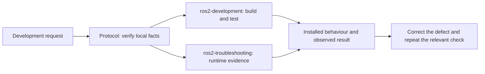

<div align="center">


**ROS 2 development with evidence that the result works.**


**English** | [한국어](README.ko.md) | [中文](README.zh.md) | [日本語](README.ja.md) | [Español](README.es.md) | [Français](README.fr.md) | [Deutsch](README.de.md)

</div>

Three Claude Code skills for **Ubuntu 24.04 / ROS 2 Jazzy**: develop packages,
verify tests and installed behaviour, and diagnose runtime faults. The goal is
less time spent correcting plausible code that was never exercised. This pack
supplies targeted workflows and executable checks, not a replacement for the
workspace's conventions or the installed ROS documentation.

## Quickstart

Choose one installation method.

**Plugin — from a Claude Code session:**

```text
/plugin marketplace add Leehyunbin0131/claude-ros2-skills
/plugin install claude-ros2-skills@claude-ros2-skills
```

Start a new session. A `SessionStart` hook loads the [30-line protocol](CLAUDE.md);
plugin-root `CLAUDE.md` is not automatically loaded on its own. The default user
scope applies to all projects. Prefer a project install when you want it limited
to a ROS workspace.

**Manual — into an existing project:**

```bash
git clone https://github.com/Leehyunbin0131/claude-ros2-skills.git
python3 claude-ros2-skills/scripts/install.py --project /path/to/your-workspace
# Alternative: install for this user across all projects
# python3 claude-ros2-skills/scripts/install.py --user
```

The installer copies the three skills and `.claude/rules/ros2-verification.md`.
It preserves existing `CLAUDE.md` files and unrelated skills, refuses to overwrite
local edits, and reports retired skill directories for manual review. Restart
Claude Code afterwards. ROS, colcon and robot drivers are not installed by this
pack; install the dependencies needed by your workspace.

## Skills

| Skill | When it helps | What it adds |
| :--- | :--- | :--- |
| [ros2-development](skills/ros2-development/SKILL.md) | Creating or modifying packages, nodes, interfaces, launch/config and tests | Dependency-aware builds, installed-artifact verification, a check that rejects empty/all-skipped test runs |
| [ros2-troubleshooting](skills/ros2-troubleshooting/SKILL.md) | A live publisher, callback, TF, IMU or odometry behaves incorrectly | Four executable diagnostics and focused frame, runtime and calibration references |
| [ros2-microros](skills/ros2-microros/SKILL.md) | MCU transport, agent, rclc or message memory work | Source pointers and troubleshooting guidance; **not MCU-validated** |

Claude selects a skill from its description. To request it explicitly, mention
its name in your task. Examples:

- “Use ros2-development to add a service to this existing Jazzy package. Build
  its consumers, run the relevant tests, and show that the installed node works.”
- “Use ros2-troubleshooting: `/scan` publishes, but my node's callback never
  fires. Find the incompatible endpoints and verify the correction.”
- “The robot is level but its IMU is mounted upside down. Check gravity using
  the declared TF; distinguish a correct mounting transform from a real error.”

Specify hardware versus simulation and the workspace when known. The agent
should establish genuinely missing robot geometry or existing publishers before
making assumptions about them.

## Verification scripts

Scripts ship with their skill. In Claude Code, resolve them from
`${CLAUDE_SKILL_DIR}/scripts/`, not the current working directory. They are Python
files, not ROS packages to invoke with `ros2 run`.

| Script | Evidence it checks |
| :--- | :--- |
| `ros2-development/scripts/check_test_results.py <results> --packages <name>` | Every named package has at least one executed, passing test in the supplied colcon reports; use a fresh results directory as shown in the skill |
| `ros2-troubleshooting/scripts/check_qos_compat.py --topic /scan` | Native Jazzy QoS compatibility for discovered publisher/subscriber pairs |
| `ros2-troubleshooting/scripts/check_tf_tree.py --sensors laser_frame,imu_link` | TF connectivity and mounting RPY for physical comparison; an unusual angle is an advisory |
| `ros2-troubleshooting/scripts/check_imu_gravity.py --topic /imu/data` | Gravity at rest on level ground, transformed into `--base base_link`; missing TF is inconclusive, and gravity cannot establish yaw |
| `ros2-troubleshooting/scripts/check_odom_direction.py --topic /odom` | Fresh odometry before and after an externally observed movement; direction only, not distance calibration |

**Exit codes: 0 PASS, 1 FAIL, 2 INCONCLUSIVE or invalid request.** Missing data,
NaN, unavailable IMU fields, unknown QoS, no executed tests and insufficient
motion must not become successful verification. The runtime scripts require a
sourced Jazzy environment. They do not publish motion commands; the odometry
check relies on movement performed outside the script. A check proves only the
property it observes, not the correctness of the whole robot.

## How it works



The protocol covers development across packages, Nav2, MoveIt and ros2_control;
the focused skills add procedures and tools when those are useful. We do not
restore large domain manuals merely to increase the skill count. The new
`ros2-development` workflow addresses a concrete gap: a successful test command
can report **zero tests**. In the real package fixture, that command returns 0
while the bundled evidence check returns 2.

## Validation and evidence limits

CI checks installation/update preservation, Python and shell code, deterministic
verdicts, real temporary Python/CMake package builds and tests, synthetic Jazzy
pub/sub and TF, and the evaluation harness. A live Claude Code plugin smoke test
also verified protocol delivery. Commands are in [CONTRIBUTING.md](CONTRIBUTING.md).

These checks establish tool behaviour and loading, **not a measured improvement
in an agent's development ability**. The new development workflow has not had a
controlled model comparison. Physical robots, MCU firmware and calibration
still need their own validation. Full Nav2/MoveIt/Gazebo development was not
re-tested for this change.

## Evals

[CAPABILITIES.md](evals/CAPABILITIES.md) preserves historical scores and reconciles
them with committed verdicts. Some reported scores cannot be reproduced because
transcripts or re-grades are missing; they are not evidence that all domain
knowledge is unnecessary. We do not advertise those scores as current results.

New skills should improve a real development task. Reproducible failure fixtures
support tool correctness; before claiming an agent performance gain, compare
matched tasks with and without the change. See [authoring criteria](evals/AUTHORING.md)
and the [evaluation method](evals/LADDER.md).

## Updating

For a plugin installation:

```bash
claude plugin update claude-ros2-skills@claude-ros2-skills
```

For a manual installation, pull the repository and rerun the same installer
command. Local edits are preserved by refusing the update until you review the
conflict. Start a new Claude Code session afterwards.

## Contributing

See [CONTRIBUTING.md](CONTRIBUTING.md). Correctness fixes, useful development
workflows and reproducible counterexamples are welcome. Keep historical
transcripts intact and distinguish observed results from hypotheses.

## License

[Apache-2.0](LICENSE).
