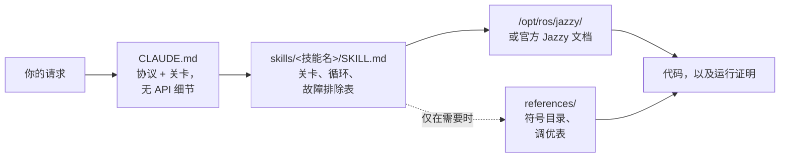

<div align="center">


**Claude Code Skills for ROS 2 Jazzy Jalisco robotics development.**

重塑 AI Agent 进行 ROS 2 开发方式的技能库：提前明确未知的参数，针对已安装的软件包验证配置，并通过实际运行结果确认代码执行。


[English](README.md) | [한국어](README.ko.md) | **中文** | [日本語](README.ja.md) | [Español](README.es.md) | [Français](README.fr.md) | [Deutsch](README.de.md)

<sub>🌐 本文档为机器翻译。原文请参阅 [English](README.md)。</sub>

| 技能数量 | 常驻上下文协议 | 文档链接 (CI 检查) | 物理机器人检验 | 评估：编写代码前先验证 |
| :---: | :---: | :---: | :---: | :---: |
| **11** | **26 行** | **38** | **4 个脚本** | **0/3 → 3/3** |

</div>

---

## 目录

- [代价高昂的失败](#代价高昂的失败)
- [这些技能的构建原则](#这些技能的构建原则)
- [有何不同](#有何不同)
- [实测评估](#实测评估)
- [快速开始](#快速开始)
- [技能列表](#技能列表)
- [验证脚本](#验证脚本)
- [工作原理](#工作原理)
- [更新](#更新)
- [路线图](#路线图)
- [贡献](#贡献)
- [许可证](#许可证)

## 代价高昂的失败

AI 生成的 ROS 2 代码中最昂贵的错误极少是语法错误。相反，它们往往是初看完全正确、隐蔽性极高的潜在问题：

| 故障类型 | 表面现象 | Agent 遇到该问题的原因 |
| :--- | :--- | :--- |
| **静默失败** | `ros2 topic hz` 显示 30 Hz；但你的回调函数从未触发 | 默认的 RELIABLE 订阅者试图连接到 BEST_EFFORT 发布者。代码虽然能够编译并通过代码审查，但在 DDS 中间件层面建立连接失败。 |
| **基准真相错误** | `/cmd_vel` 指示向前移动，`/odom` 也报告向前移动，但物理机器人实际上在**后退** | 静态 TF 坐标系相对于物理安装方向反转了。下游组件*基于错误的坐标变换*进行了正确的计算，因此不会产生明显的报错。 |
| **过时的 API** | 代码通过审查，但在运行时因调用了错误的方法而报错失败 | Agent 使用了在 Jazzy 中已被重命名或移除的旧版本（Foxy 或 Humble）API 方法。 |
| **前提假设无效** | Agent 基于一个原本用一句话就能纠正的假设，编写了 200 行代码 | 缺乏某种机制提示 Agent 在生成代码前先去确认缺失的细节信息。 |

无论是编译器、代码检查工具（linter）还是日志分析，都无法有效检测出这些隐藏的问题。解决其中的每一个错误都需要额外的反馈周期：检查输出、诊断原因、解释修复方案，然后重新生成代码。

## 这些技能的构建原则

本仓库中的每个技能都遵循以下四条设计规则：

**1. 提前明确未知的变量。** 关键的操作细节通常不存在于官方文档中——例如运行环境是真实硬件还是仿真环境、是扩展现有工作区还是创建新工作区、哪个节点已经在发布坐标变换，或者机器人的精确几何尺寸。[`CLAUDE.md`](./CLAUDE.md) 会要求 Agent 在生成代码前先澄清这些未知信息。特定领域的技能则负责管理针对性的参数；例如，`ros2-dev` 在配置任何 Nav2 参数之前，会先询问机器人的轮廓尺寸（footprint）、驱动运动学模型和定位来源。

**2. 执行具有明确退出条件的结构化循环。** 每个技能都遵循 *验证 → 编写 → 证明*（verify → write → prove）循环：在已安装的环境中检查系统默认设置，应用增量修改，并确认代码运行成功。任务只有在得到实际观测证据（如构建成功、`ros2 topic echo` 上有实时数据流或验证脚本通过）支持时才算完成，而不是仅仅生成了代码文件。

**3. 相比冗长描述，优先使用结构化的故障排除表。** 映射“症状 → 根因 → 修复方案”的结构化表格提供了清晰且持久的指导，这弥补了官方文档通常缺乏此类内容的不足，并且在跨版本迭代中依然保持可靠：

> `[` 表示 GZ→ROS，`]` 表示 ROS→GZ · `16UC1` 单位为毫米，`32FC1` 单位为米 · `joint_state_broadcaster` 不会自动加载 · `raytrace_max_range` ≤ `obstacle_max_range` 会导致障碍物永远无法清除 · rclc 不会自动为无界字段分配内存

**4. 利用三层架构优化上下文使用率。** 每个技能都在上下文效率上进行了精心设计：技能描述常驻在上下文，技能主体在调用时加载，而 `references/` 中的深度参考文件仅在需要时按需加载。大型符号目录和详细的参数调优表置于 `references/` 中，以确保节省上下文空间，使得在调试特定组件（如 AMCL）时不会加载无关的文档（如行为树节点）。

## 有何不同

大多数机器人技能包会将静态的 API 知识直接嵌入到技能文件中。虽然刚开始使用很方便，但当底层软件包更新时，这种方式就会失效——残留的代码片段会过时并导致静默失败。本仓库采用了动态的、文档驱动的方法：

| 特性 | 内容沉重的传统技能包 | **claude-ros2-skills** |
| :--- | :--- | :--- |
| 知识存放位置 | 直接嵌入技能文件中（**每个技能 400–1,800 行**） | 链接到官方文档（技能主体仅约 **60 行**）；详细参考文件**仅在需要时**读取 |
| 常驻上下文内容 | 完整的 `SKILL.md` 文件 | 仅 **26 行** 核心协议 |
| 处理 Jazzy API 更新 | 代码片段静默过时；需要持续进行手动测试与更新 | 将代码片段过时的风险降低至入口链接和符号名称层面——**38 个文档链接**每周通过 CI 自动验证 |
| 验证方法 | 静态代码分析或日志检查 | **物理与运行时验证**：IMU 重力检查、方向性里程计测试、TF 坐标系对齐、DDS QoS 兼容性 |
| 支持的版本范围 | 宣称支持多个 ROS 发行版，但实际上只针对某一个 | **仅限 ROS 2 Jazzy**，专门设计并经过严格验证 |

本仓库专注于实现一个明确的目标：最大程度地降低生成“看起来合理但在 ROS 2 Jazzy 上无法运行”的代码的风险。

## 实测评估

为了评估性能，我们在未安装和已安装这些技能的全新无界面（headless）Claude Code 会话中执行了完全相同的 Prompt。每组对照使用相同的模型，并参照上游绑定的 ROS 2 Jazzy 源码仓库，逐符号地进行评分。

| 指标 / 测试项目 | 未安装技能 | 已安装技能 |
| :--- | ---: | ---: |
| 错误或虚构的 Nav2 MPPI 参数键（Haiku） | **~30** — 缺少必需的 `critics:` 列表；配置无法运行 | **~16–20** — 具有正确的插件字符串、`motion_model` 和 checker 命名空间 |
| `/scan` 回调函数在物理 BEST_EFFORT 激光雷达上执行（Sonnet） | **从不** — 由于 QoS 默认配置不匹配而静默失败 | **成功** — 成功建立连接 |
| 在编写代码前验证运行环境的执行次数 | **0 / 3** | **3 / 3** |

行为模式的改变是最显著的结果：基线会话即使在工具可用时也**完全没有使用**验证工具，而配备了这些技能的会话则首先加载了相关指南并检查了系统默认设置。在一次测试中，Agent 在最开始就提出了关键的澄清问题，并明确列出了已验证的参数与未验证的假设，从而避免盲目猜测。

请在 [`evals/RESULTS.md`](./evals/RESULTS.md) 中查看完整的评估表格、测试环境和单次运行分析。有关评估协议、任务检查清单和容器配置的详细信息，请参阅 [`evals/README.md`](./evals/README.md)。非常欢迎提交包含更多评分记录的 Pull Request。

## 快速开始

**方案 A — 插件市场（推荐）：**

```
/plugin marketplace add Leehyunbin0131/claude-ros2-skills
/plugin install claude-ros2-skills@claude-ros2-skills
```

随时可以通过 `/plugin marketplace update` 更新已安装的插件。

**方案 B — 手动安装：**

```bash
git clone https://github.com/Leehyunbin0131/claude-ros2-skills.git

# 项目级安装（仅适用于当前项目）
mkdir -p your-project/.claude/skills
cp -r claude-ros2-skills/skills/* your-project/.claude/skills/
cp claude-ros2-skills/CLAUDE.md your-project/

# 用户级安装（适用于所有项目）
mkdir -p ~/.claude/skills
cp -r claude-ros2-skills/skills/* ~/.claude/skills/
```

重启 Claude Code（或启动新会话）以使安装的技能生效。

## 技能列表

| 技能 | 路径 | 覆盖范围 |
| :--- | :--- | :--- |
| **ros2-core** | `skills/ros2-core/SKILL.md` | rclcpp, rclpy, TF2, EKF 里程计, QoS 配置, 参数 |
| **ros2-package** | `skills/ros2-package/SKILL.md` | `ros2 pkg create`, CMakeLists/setup.py 配置, colcon build & source, 自定义接口 |
| **ros2-dev** | `skills/ros2-dev/SKILL.md` | Nav2 (AMCL, 代价地图, MPPI/Smac), SLAM Toolbox, RTAB-Map, Isaac ROS |
| **gazebo-sim** | `skills/gazebo-sim/SKILL.md` | Gazebo Harmonic, ros_gz_bridge, ros_gz_sim, SDFormat 建模 |
| **ros2-control** | `skills/ros2-control/SKILL.md` | ros2_control 硬件抽象, 控制器管理器, URDF 标签 |
| **ros2-moveit** | `skills/ros2-moveit/SKILL.md` | MoveIt 2, MoveGroup C++/Python API, 逆运动学求解器 (IK solvers), OMPL, MoveIt Servo |
| **ros2-perception** | `skills/ros2-perception/SKILL.md` | image_transport, cv_bridge, vision_msgs, depth_image_proc, PCL |
| **ros2-testing** | `skills/ros2-testing/SKILL.md` | launch_testing, gtest/pytest, rosbag2 C++/Python API, ros2trace |
| **ros2-microros** | `skills/ros2-microros/SKILL.md` | micro-ROS Agent, rclc 客户端 API, 自定义传输协议, 静态内存 |
| **ros2-security** | `skills/ros2-security/SKILL.md` | SROS2, PKI 密钥库生成, 访问控制, DDS Security |
| **ros2-troubleshooting** | `skills/ros2-troubleshooting/SKILL.md` | REP 103/105 基准 TF 树, 激光雷达/IMU 对齐, 物理验证 |

## 验证脚本

这些验证脚本内置于 `ros2-troubleshooting` 技能中（`skills/ros2-troubleshooting/scripts/`），在每次安装时都会包含在内。它们将物理硬件检查转换为可执行的通过/失败验证步骤（需要加载 ROS 2 环境变量；返回码：0 = PASS，1 = FAIL，2 = NO DATA）：

| 脚本 | 验证内容 |
| :--- | :--- |
| `check_imu_gravity.py` | 验证静止状态下的机器人沿 **+Z** 轴方向测得的重力加速度约为 +9.81 m/s²（REP 103）。检测 IMU 安装倒置或错位的问题。 |
| `check_odom_direction.py` | 验证向前推动机器人时，沿其朝向会产生正向的里程计位移。检测电机方向颠倒、编码器极性问题或 TF 设置反转。 |
| `check_tf_tree.py` | 验证 `map→odom→base_link` 解析是否正确；以 RPY 角度显示每个传感器的安装偏移量，并高亮提示潜在的 180° 朝向错误。 |
| `check_qos_compat.py` | 根据 DDS 规则验证某话题上所有发布者/订阅者对之间的 QoS 兼容性。防止静默失败（例如 BEST_EFFORT 发布者与 RELIABLE 订阅者配对，或者 durability、deadline、liveliness 不匹配）。 |

核心决策逻辑独立于 ROS 进行单元测试（`python3 skills/ros2-troubleshooting/scripts/test_checks.py`），并在每次提交时通过持续集成（CI）自动运行。

## 工作原理



`CLAUDE.md` 不包含具体的 API 细节。相反，它建立了操作协议，并要求在编写代码之前必须澄清问题。每个 `SKILL.md` 文件负责管理特定领域的决策：识别未知变量、执行“验证-编写-证明”循环，以及参考故障排除表。详细的参考资料单独存放在 `references/` 目录中。有关详细信息，请参阅 [`CLAUDE.md`](./CLAUDE.md)。

## 更新

```bash
cd claude-ros2-skills
git pull
cp -r skills/* ~/.claude/skills/   # 或项目的 .claude/skills/
```

## 路线图

1. **在 `ros:jazzy` 容器中自动化评估对比测试**，以建立实时安装基线——容器配置详情请参阅 [`evals/README.md`](./evals/README.md)。
2. **发布任务 5 评估结果**——通过跨 `ros2-package` 构建和工作区环境变量加载（sourcing）循环的二元结果（确认 `ros2 topic echo` 是否输出数据）来验证运行时性能。
3. **将“完成所需的修正次数”作为核心指标追踪**——测量在代码成功运行之前所需的反馈迭代次数。
4. **实现确定性的 `references/` 检索机制**，确保在相关时能够精准加载详细的参考文档。
5. **将主体/`references` 的拆分架构扩展**到 `ros2-core` 和 `gazebo-sim`，为包含大量参考文档的高频技能优化上下文效率。

## 贡献

摘要：技能文件必须专注于决策逻辑（验证关卡、循环步骤和故障排除表），而详细文档则保存在 `references/` 中。每个 API 符号都必须对照官方 Jazzy 文档或 `/opt/ros/jazzy/` 安装进行验证。验证脚本必须保持纯逻辑，以便在没有 ROS 依赖的情况下进行单元测试。有关完整指南、技能和脚本检查清单以及 Issue 模板，请参阅 [`CONTRIBUTING.md`](./CONTRIBUTING.md)。

## 许可证

Apache-2.0 — 详见 [LICENSE](./LICENSE)。
