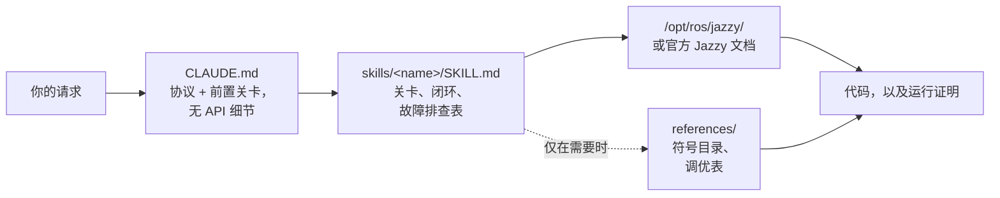

<div align="center">


**Claude Code Skills for ROS 2 Jazzy Jalisco robotics development.**

改变 Agent 处理 ROS 2 任务*方式*的技能集——首先明确未知的关键要素，根据已安装的系统进行验证，并证实运行结果。


[English](README.md) | [한국어](README.ko.md) | **中文** | [日本語](README.ja.md) | [Español](README.es.md) | [Français](README.fr.md) | [Deutsch](README.de.md)

<sub>🌐 本文档为机器翻译。原文请参阅 [English](README.md)。</sub>

| 技能数量 | 始终加载的协议 | 文档链接（CI 检查） | 物理机器人检查 | 实测评估：编写前验证 |
| :---: | :---: | :---: | :---: | :---: |
| **11** | **26 行** | **38** | **4 个脚本** | **0/3 → 3/3** |

</div>

---

## 目录

- [代价高昂的失败](#代价高昂的失败)
- [这些技能的构建原则](#这些技能的构建原则)
- [有何不同](#有何不同)
- [实测评估](#实测评估)
- [快速开始](#快速开始)
- [技能列表](#技能列表)
- [验证脚本](#验证脚本)
- [工作原理](#工作原理)
- [更新](#更新)
- [路线图](#路线图)
- [贡献](#贡献)
- [许可证](#许可证)

## 代价高昂的失败

AI 智能体编写的 ROS 2 代码中，代价高昂的失败往往不是语法错误，而是那些看起来完全没问题的隐蔽问题：

| 故障类型 | 你所看到的现象 | 为什么 AI 智能体会掉入陷阱 |
| :--- | :--- | :--- |
| **静默无响应** | `ros2 topic hz` 显示 30 Hz；但你的回调函数永远不会触发 | 默认的 RELIABLE 订阅者遇到了 BEST_EFFORT 驱动程序。编译正常、代码审查通过，但在 DDS 层面上没有任何数据匹配 |
| **基准真相错误** | `/cmd_vel` 显示前进，`/odom` 显示前进——但机器人却**后退** | 声明的静态 TF 变换与物理安装方向反了。下游的所有组件基于*错误的变换*都能正确计算，因此没有任何地方会报错矛盾 |
| **跨版本 API 混淆** | 通过了代码审查，但在运行时因使用了“听起来很对”的方法而崩溃 | 记忆了 Foxy/Humble 时代的 API，这些 API 在 Jazzy 中已被重命名或根本不存在 |
| **前提假设错误** | 基于一个你只需一句话就能纠正的假设，编写了 200 行代码 | 没有机制要求 Agent 在编写代码前先确认未知的关键要素 |

没有任何编译器、Linter 或日志检查能捕获上述任何一个问题。每一个错误都会带来一次沟通往返代价：你读取输出、找出错因、进行解释，然后 Agent 重新生成。

## 这些技能的构建原则

贯穿每个技能的四条设计原则：

**1. 在编写前明确未知的关键要素。** 某些事实在任何文档中都找不到——例如这是真实硬件还是仿真环境、你是要扩展现有的工作区还是从头开始、哪个节点已经在发布正在修改的变换，以及机器人的实际几何形状。[`CLAUDE.md`](./CLAUDE.md) 强制 Agent 优先明确这些事项，并在提示词未提及时主动提问。特定领域的未知要素包含在具体的技能中：例如 `ros2-dev` 在编写任何 Nav2 参数之前，会先询问机器人的轮廓（footprint）、驱动类型和定位来源。

**2. 具有明确终点的闭环。** 每个技能都遵循 *验证（verify）→ 编写（write）→ 证明（prove）* 流程：首先读取已安装系统上的默认设置，每次只修改一个地方，然后确认更改是否实际生效。“完成”意味着观察到了确凿的证据——如构建成功、`ros2 topic echo` 显示数据、检查脚本通过——而不是仅仅输出了代码。

**3. 故障排查表优于长篇大论。** 价值最高的内容是“现象 → 根因 → 解决措施”表格，因为官方文档中未汇总此类内容，且不会因新版本发布而失效：

> `[` 表示 GZ→ROS，`]` 表示 ROS→GZ · `16UC1` 单位为毫米，`32FC1` 单位为米 · `joint_state_broadcaster` 不会自动加载 · `raytrace_max_range` ≤ `obstacle_max_range` 会导致障碍物永远无法被清除 · rclc 不会自动为无界消息字段分配内存

**4. 三层架构，三种开销。** 技能的 `description`（描述）始终存在于上下文（context）中，技能的主体（body）在技能被触发时加载，而 `references/` 目录下的文件仅在任务需要时才会被读取。海量的符号目录和调优表保存在 `references/` 中，因此调试 AMCL 的用户无需为行为树节点列表支付上下文开销——可以在不增加每次加载负担的前提下扩展深度。

## 有何不同

大多数机器人技能包会将 API 知识直接硬编码到技能文件中。在生态系统保持不变时这没问题——但一旦生态发生变化，每个硬编码的代码片段都会在暗中失效腐化。本仓库做出了截然相反的选择：

| | 内容繁重的技能包 | **claude-ros2-skills** |
| :--- | :--- | :--- |
| 知识来源 | 硬编码在技能文件中，**每个技能 400–1,800 行** | 引导至官方文档；技能主体仅约 **60 行**，海量细节存放在 `references/` 中，**仅在需要时读取** |
| 始终加载的上下文 | 完整的 SKILL.md | **26 行** 协议 |
| 当 Jazzy API 变更时 | 代码片段静默失效；需要永久维护文档回归测试 | 过期风险收缩至入口链接 + 符号名称——**38 个链接** 每周由 CI 检查（仅检查有效性），失效链接会导致构建失败 |
| 验证方式 | 静态 / 基于日志 | **物理级验证**：IMU 重力、推行测试、TF 挂载与物理硬件对比、DDS QoS 匹配 |
| 发行版声明 | 声称“支持 4 个发行版”，但示例仅针对某一个 | **仅限 Jazzy**，事先明确声明 |

本仓库只针对一个目标进行优化：最大程度降低生成“看似合理却无法在 Jazzy 上运行的代码”的概率。

## 实测评估

在全新的无头（headless）Claude Code 会话中，对安装与未安装技能的系统运行相同的提示词，每组对比使用相同的模型，并逐个符号参照已锚定的上游 `jazzy` 源码进行打分。

| 评估结果 | 未安装技能 | 安装技能后 |
| :--- | ---: | ---: |
| 错误/虚构的 Nav2 MPPI 键值 (haiku) | **~30 个** — 甚至没有任何 `critics:` 列表，配置无法运行 | **~16–20 个** — 插件字符串、`motion_model` 和检查器命名空间均正确 |
| 在真实 BEST_EFFORT LiDAR 上触发 `/scan` 回调 (sonnet) | **从不** — 静默使用错误的默认 QoS | **是** |
| 在编写前进行验证的运行比例 | **0 / 3** | **3 / 3** |

行为层面的差异是最显著的结果：基线（未安装技能）运行虽然可以使用验证工具，但**完全没有使用**；而安装了技能的每次运行都会加载技能并优先查找系统内置的默认配置。其中一次运行甚至在开头就主动提出了三个前置问题，并准确报告了哪些已检查、哪些未检查，而不是默默猜测。

完整的打分表、测试条件及每次运行分析：[`evals/RESULTS.md`](./evals/RESULTS.md) · 协议、任务检查清单和容器构建配方：[`evals/README.md`](./evals/README.md)。非常欢迎提交包含评分记录的 PR。

## 快速开始

**方案 A — 插件市场（推荐）：**

```
/plugin marketplace add Leehyunbin0131/claude-ros2-skills
/plugin install claude-ros2-skills@claude-ros2-skills
```

通过 `/plugin marketplace update` 进行更新。

**方案 B — 手动复制：**

```bash
git clone https://github.com/Leehyunbin0131/claude-ros2-skills.git

# 项目级（仅对当前项目生效）
mkdir -p your-project/.claude/skills
cp -r claude-ros2-skills/skills/* your-project/.claude/skills/
cp claude-ros2-skills/CLAUDE.md your-project/

# 或 用户级（对所有项目生效）
mkdir -p ~/.claude/skills
cp -r claude-ros2-skills/skills/* ~/.claude/skills/
```

重启 Claude Code（或启动一个新会话）以加载这些技能。

## 技能列表

| 技能 | 路径 | 覆盖范围 |
| :--- | :--- | :--- |
| **ros2-core** | `skills/ros2-core/SKILL.md` | rclcpp, rclpy, TF2, EKF 里程计, QoS 配置档, 参数 |
| **ros2-package** | `skills/ros2-package/SKILL.md` | `ros2 pkg create`, CMakeLists/setup.py 配置, colcon build & source, 自定义接口 |
| **ros2-dev** | `skills/ros2-dev/SKILL.md` | Nav2 (AMCL, costmaps, MPPI/Smac), SLAM Toolbox, RTAB-Map, Isaac ROS |
| **gazebo-sim** | `skills/gazebo-sim/SKILL.md` | Gazebo Harmonic, ros_gz_bridge, ros_gz_sim, SDFormat 建模 |
| **ros2-control** | `skills/ros2-control/SKILL.md` | ros2_control 硬件抽象, controller manager, URDF 标签 |
| **ros2-moveit** | `skills/ros2-moveit/SKILL.md` | MoveIt 2, MoveGroup C++/Python API, 逆运动学求解器 (IK), OMPL, MoveIt Servo |
| **ros2-perception** | `skills/ros2-perception/SKILL.md` | image_transport, cv_bridge, vision_msgs, depth_image_proc, PCL |
| **ros2-testing** | `skills/ros2-testing/SKILL.md` | launch_testing, gtest/pytest, rosbag2 C++/Python API, ros2trace |
| **ros2-microros** | `skills/ros2-microros/SKILL.md` | micro-ROS Agent, rclc 客户端 API, 自定义传输层, 静态内存 |
| **ros2-security** | `skills/ros2-security/SKILL.md` | SROS2, PKI 密钥库生成, 访问控制, DDS Security |
| **ros2-troubleshooting** | `skills/ros2-troubleshooting/SKILL.md` | REP 103/105 基准真相 TF 树, LiDAR/IMU 对齐, 物理级验证 |

## 验证脚本

内置于 `ros2-troubleshooting` 技能中（`skills/ros2-troubleshooting/scripts/`），因此随任何安装一起提供。这些脚本将物理检查转化为可运行的通过/失败事实（需要加载 ROS 2 环境；每个脚本退出码 0 = 通过 PASS，1 = 失败 FAIL，2 = 无数据）：

| 脚本 | 验证内容 |
| :--- | :--- |
| `check_imu_gravity.py` | 机器人静止时 → 重力加速度在 **+Z** 轴上约为 +9.81 m/s² (REP 103)。捕获倒置或旋转的 IMU 安装错误。 |
| `check_odom_direction.py` | 向前推机器人 → 里程计位移沿其朝向为正数。捕获反向电机、编码器或 TF 错误。 |
| `check_tf_tree.py` | 解析 `map→odom→base_link`；将每个传感器安装输出为 RPY 角度，并标记约 180° 的声明，以便与实际物理安装进行对比。 |
| `check_qos_compat.py` | 某个话题上的每个发布者/订阅者对均符合 DDS 匹配规则下的 QoS 兼容性。捕获隐蔽的“话题显示 30 Hz 但回调函数从不触发”故障（BEST_EFFORT 发布者对 RELIABLE 订阅者，以及持久性/截止时间/活跃度不匹配）。 |

纯决策逻辑在没有 ROS 环境下进行了单元测试（`python3 skills/ros2-troubleshooting/scripts/test_checks.py`），并在每次提交推送时在 CI 中自动运行。

## 工作原理



`CLAUDE.md` 不包含具体的 API 细节——它设定了协议以及在编写代码之前必须回答的问题。每个 `SKILL.md` 的主体承载了决策：需要明确事项、验证-编写-证明闭环以及该领域的故障排查表。海量的参考资料存放在距离仅一步之遥的 `references/` 中。请参阅 [`CLAUDE.md`](./CLAUDE.md)。

## 更新

```bash
cd claude-ros2-skills
git pull
cp -r skills/* ~/.claude/skills/   # 或你项目中的 .claude/skills/
```

## 路线图

1. **在 `ros:jazzy` 容器环境内部对评估对进行打分**，基于实时安装的环境而非固定的源码镜像——容器配置说明请参阅 [`evals/README.md`](./evals/README.md)。
2. **任务 5 评估结果**——具有二元运行时结果的任务（`ros2 topic echo` 是否打印了数据），全流程测试 `ros2-package` 以及构建/加载闭环。
3. **“纠错直至完成的轮数”作为追踪指标。** 一个任务需要经历多少轮“不对，不是这样”的修正，才是用户真正付出的成本。
4. **确切的 `references/` 解析机制**，以便在相关时能准确加载海量细节。
5. **将“主体与参考资料分离”的架构扩展**至 `ros2-core` 和 `gazebo-sim`，这两个是下一个具有海量参考资料且加载频率较高的技能。

## 贡献

简短版本——技能主体保持为决策内容（关卡、闭环、故障排查表），海量细节放在 `references/` 中；每个符号都要经过 Jazzy 文档或 `/opt/ros/jazzy/` 的验证；脚本保持纯逻辑在无需 ROS 的情况下可进行单元测试。完整的规则、技能/脚本检查清单以及 issue 模板请参阅：[`CONTRIBUTING.md`](./CONTRIBUTING.md)。

## 许可证

Apache-2.0 — 详见 [LICENSE](./LICENSE)。
