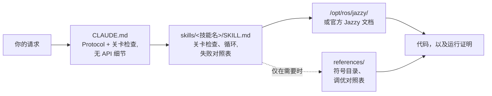

<div align="center">


**Claude Code Skills for ROS 2 Jazzy Jalisco robotics development.**

彻底重塑 AI Agent 进行 ROS 2 开发的方式：预先明确未知参数、对照已安装软件包验证配置，并通过实际运行证据确认执行结果。


[English](README.md) | [한국어](README.ko.md) | **中文** | [日本語](README.ja.md) | [Español](README.es.md) | [Français](README.fr.md) | [Deutsch](README.de.md)

<sub>🌐 本文档为机器翻译。原文请参阅 [English](README.md)。</sub>

| 技能数量 | 常驻 Protocol | 文档链接（CI 验证） | 实体机器人检查 | Gazebo A/B 实测 |
| :---: | :---: | :---: | :---: | :---: |
| **11 个** | **26 行** | **38 个** | **4 个脚本** | **成功到达目标 vs. 启动中断** |

</div>

---

## 目录

- [代价高昂的失败](#代价高昂的失败)
- [这些技能的构建原则](#这些技能的构建原则)
- [有何不同](#有何不同)
- [实测评估](#实测评估)
- [快速开始](#快速开始)
- [技能列表](#技能列表)
- [验证脚本](#验证脚本)
- [工作原理](#工作原理)
- [更新](#更新)
- [路线图](#路线图)
- [贡献](#贡献)
- [许可证](#许可证)

## 代价高昂的失败

AI 生成的 ROS 2 代码中最昂贵的错误很少是语法错误。相反，它们往往是初看完全正确、实则暗藏玄机的隐蔽问题：

| 错误类型 | 表面现象 | Agent 引入该问题的原因 |
| :--- | :--- | :--- |
| **静默失效** | `ros2 topic hz` 显示 30 Hz；但回调函数从未触发 | 默认的 RELIABLE 订阅者尝试连接 BEST_EFFORT 发布者。代码能够成功编译并打包通过审查，但在 DDS 中间件层连接失败。 |
| **基准真相错误** | `/cmd_vel` 指示向前移动，`/odom` 也汇报向前移动，但实体机器人却**向后**移动 | 静态 TF 坐标系与物理安装方向相反。下游组件*基于错误的变换*进行了“正确”的计算，因此不会抛出任何明显错误。 |
| **API 过期** | 代码通过审查，但在运行时调用错误的方法导致崩溃 | Agent 使用了在 Foxy 或 Humble 中废弃、并在 Jazzy 中被重命名或移除的 API 方法。 |
| **前提假设错误** | Agent 基于某种错误假设编写了 200 行代码，而这个假设本可以被你用一句话纠正 | 缺少相关机制提示 Agent 在生成代码前先验证缺失的细节。 |

编译器、Linter 或日志分析都无法检测出这些隐蔽问题。解决每个错误都需要额外的反馈循环：检查输出、诊断原因、解释修复方案并重新生成代码。

## 这些技能的构建原则

本仓库中的每一项技能都遵循以下四条设计原则：

**1. 预先明确未知变量。** 关键的操作细节通常不会出现在文档中——例如运行环境是真实硬件还是仿真、是扩展现有工作空间还是新建工作空间、哪个节点已经发布了坐标变换，或者机器人的精确几何形状。[`CLAUDE.md`](./CLAUDE.md) 会要求 Agent 在生成代码之前先澄清这些未知信息。特定领域的技能则负责管理针对性的参数；例如，`ros2-dev` 会在配置任何 Nav2 参数之前，先询问机器人的轮廓形状 (footprint)、运动学驱动方式和定位来源。

**2. 执行具备清晰退出标准的结构化循环。** 每一项技能都遵循 *验证 (verify) → 编写 (write) → 证明 (prove)* 循环：检查已安装环境中的系统默认配置，应用增量修改，并确认执行结果。任务只有在得到可观测证据支持时（如编译成功、`ros2 topic echo` 上有活跃数据，或通过验证脚本）才算完成，而不是仅仅生成了代码文件。

**3. 优先使用结构化失败对照表而非长篇大段的描述。** 将“现象 → 根因 → 修复措施”进行映射的结构化表格，提供了官方文档往往欠缺且跨版本依然可靠的清晰、持久的指导：

> `[` 表示 GZ→ROS，`]` 表示 ROS→GZ · `16UC1` 单位为毫米，`32FC1` 单位为米 · `joint_state_broadcaster` 不会自动加载生成 · `raytrace_max_range` ≤ `obstacle_max_range` 会导致障碍物永远无法清除 · rclc 不会自动为无界消息字段分配内存

**4. 利用三层架构优化上下文占用。** 每项技能都兼顾了上下文效率：技能描述常驻于上下文中，技能主体仅在被调用时加载，而 `references/` 中的深度参考文件则完全按需加载。大型符号目录和详细的参数调优表存放在 `references/` 中，确保节省上下文空间，并且在调试特定组件（如 AMCL）时不会加载无关的文档（如行为树节点）。

## 有何不同

大多数机器人技能包直接将静态 API 知识嵌入到技能文件内部。虽然初期使用很方便，但当底层软件包更新时，这种方式就会失效——留下的陈旧代码片段会导致静默失败。本仓库采用了一种动态的、由文档驱动的方法：

| 特性 | 重度内容型技能包 | **claude-ros2-skills** |
| :--- | :--- | :--- |
| 知识存储位置 | 直接嵌入技能文件（**每项技能 400–1,800 行**） | 链接至官方文档（技能主体仅 **~60 行**）；详细参考资料**仅在需要时读取** |
| 常驻上下文大小 | 完整的 `SKILL.md` 文件 | **26 行** 核心 Protocol |
| 处理 Jazzy API 更新 | 代码片段静默失效；需要持续手动更新测试 | 将代码片段失效的风险降至最低（仅保留入口链接和符号名称）—— **38 个文档链接** 每周通过 CI 自动验证 |
| 验证方法 | 静态代码分析或日志检查 | **物理与运行时验证**：IMU 重力检查、方向里程计测试、TF 坐标系对齐、DDS QoS 兼容性 |
| 支持的版本范围 | 宣称支持多个 ROS 发行版，但实际上只针对某一个 | **仅限 ROS 2 Jazzy**，专为其设计并经过严格验证 |

本仓库专注于唯一的成果优化：将生成看起来合理但在 ROS 2 Jazzy 上无法运行的代码的风险降至最低。

## 实测评估

以下所有结果均来自实测 A/B 对比测试：在全新的无界面（headless）Claude Code 会话中使用**相同的模型**运行**完全相同的提示词**——一次不使用这些技能，一次使用。输出结果逐个符号对照固定的上游 Jazzy 源码进行评分，接着在 `ros:jazzy` Docker 容器内的真实 `/opt/ros/jazzy` 安装环境中进行测试，最后将两次输出加载到**真实的 Gazebo 仿真环境**中进行验证。完整的测试记录与生成产物均已提交在 [`evals/runs/`](./evals/runs/) 目录下，任何人都可以自行核查评分，无需凭空相信我们。

### Nav2 MPPI 配置 — Haiku，真实 Jazzy 安装环境

*提示词：在 Jazzy 上为差速驱动机器人配置带有 MPPI 控制器的 Nav2，并生成 controller server 的 YAML 文件。*

| | 未使用技能 | 使用技能 |
| :--- | :--- | :--- |
| 执行过程 | 仅凭记忆立即回答；尽管有工具可用，但进行了**零**验证 | **首先**询问机器人轮廓 (footprint)、现有配置、定位方式和速度限制，然后读取官方默认配置 `/opt/ros/jazzy/share/nav2_bringup/params/nav2_params.yaml` |
| 插件字符串 | `mppi_generic::ControllerServer` — 根本不存在 | `nav2_mppi_controller::MPPIController` — 正确 |
| `critics:` 列表 | 完全缺失 | 全部 8 个批评器 (critics)，名称正确 |
| 虚构的参数键名 | **~16 个** | **0 个** — 每个键名都与安装的默认配置进行了对比验证 |
| **加载到实时 Gazebo 仿真中** | **`[FATAL] Failed to create controller … does not exist` — Nav2 在启动时中断；机器人完全未移动** | **MPPI 及全部 8 个 critics 成功加载；机器人成功从 (−2.0, −0.5) 行驶至 (0.5, 0.5)；`NavigateToPose` 返回 `SUCCEEDED`** |

### 需要实际运行的软件包 — Haiku，容器内测试

*提示词：创建一个 Python 软件包 `demo_pkg`，使其以 1 Hz 的频率在 `/greeting` 话题上发布 `std_msgs/msg/String`，并包含 launch 文件；编译该包并展示 `ros2 topic echo /greeting` 的输出。*

| | 未使用技能 | 使用技能 |
| :--- | :--- | :--- |
| `ros2 run` / `ros2 launch` / `topic echo` | **三者全部失败** — 软件包从未注册到 ament index 中 | **三者全部通过**，并经过独立重新运行各项命令的确认 |
| 达此结果的开销 | $0.17 · 36 轮对话 · 178 秒 | **$0.08 · 18 轮对话 · 61 秒** — 一次成功且成本降低 **2.2 倍** |

### 传感器订阅 — Sonnet

| | 未使用技能 | 使用技能 |
| :--- | :--- | :--- |
| 实体 BEST_EFFORT 激光雷达上的 `/scan` 回调 | **从未触发** — 默认的 RELIABLE QoS 在 DDS 层静默不匹配 | **正常工作** — 正确设置 `qos_profile_sensor_data` 并进行了边界过滤 |

### 所有对比组呈现出的规律

在每次运行中，基线会话（无技能）使用的验证工具均为 **零** 个，即使明确允许使用 WebFetch、Read 和 Bash——其中一个基线会话甚至声称某个 `ros2 run` 根本找不到的软件包已“完全成功构建”。而加载了本技能的会话在**每次**运行中都在编写前进行了验证，其声明的结果与独立重新执行的结果一致。技能自带的验证脚本本身也在实时仿真中经过了测试：TF 树、QoS 兼容性和里程计方向检查均在真实数据上成功通过，并且雷达倒置的异常场景被按设计准确标记出来。

请在 [`evals/RESULTS.md`](./evals/RESULTS.md) 中查看完整的评估表格、测试环境和单次运行分析。有关评估协议、任务检查清单和容器设置的详细信息，请参阅 [`evals/README.md`](./evals/README.md)。欢迎提交包含更多评分测试记录的 Pull Request。

## 快速开始

**方案 A — 插件市场（推荐）：**

```
/plugin marketplace add Leehyunbin0131/claude-ros2-skills
/plugin install claude-ros2-skills@claude-ros2-skills
```

随时使用 `/plugin marketplace update` 更新已安装的插件。

**方案 B — 手动安装：**

```bash
git clone https://github.com/Leehyunbin0131/claude-ros2-skills.git

# 项目级安装（仅适用于当前项目）
mkdir -p your-project/.claude/skills
cp -r claude-ros2-skills/skills/* your-project/.claude/skills/
cp claude-ros2-skills/CLAUDE.md your-project/

# 用户级安装（适用于所有项目）
mkdir -p ~/.claude/skills
cp -r claude-ros2-skills/skills/* ~/.claude/skills/
```

重启 Claude Code（或开启新会话）以应用已安装的技能。

## 技能列表

| 技能名称 | 路径 | 覆盖范围 |
| :--- | :--- | :--- |
| **ros2-core** | `skills/ros2-core/SKILL.md` | rclcpp、rclpy、TF2、EKF 里程计、QoS 配置、参数设置 |
| **ros2-package** | `skills/ros2-package/SKILL.md` | `ros2 pkg create`、CMakeLists/setup.py 配置、colcon 构建与环境加载、自定义接口 |
| **ros2-dev** | `skills/ros2-dev/SKILL.md` | Nav2（AMCL、代价地图、MPPI/Smac）、SLAM Toolbox、RTAB-Map、Isaac ROS |
| **gazebo-sim** | `skills/gazebo-sim/SKILL.md` | Gazebo Harmonic、ros_gz_bridge、ros_gz_sim、SDFormat 建模 |
| **ros2-control** | `skills/ros2-control/SKILL.md` | ros2_control 硬件抽象、控制器管理器、URDF 标签 |
| **ros2-moveit** | `skills/ros2-moveit/SKILL.md` | MoveIt 2、MoveGroup C++/Python API、逆运动学求解器、OMPL、MoveIt Servo |
| **ros2-perception** | `skills/ros2-perception/SKILL.md` | image_transport、cv_bridge、vision_msgs、depth_image_proc、PCL |
| **ros2-testing** | `skills/ros2-testing/SKILL.md` | launch_testing、gtest/pytest、rosbag2 C++/Python API、ros2trace |
| **ros2-microros** | `skills/ros2-microros/SKILL.md` | micro-ROS Agent、rclc 客户端 API、自定义传输层、静态内存 |
| **ros2-security** | `skills/ros2-security/SKILL.md` | SROS2、PKI 密钥库生成、访问控制、DDS 安全机制 |
| **ros2-troubleshooting** | `skills/ros2-troubleshooting/SKILL.md` | REP 103/105 基准 TF 树、激光雷达/IMU 对齐、实体机器人验证 |

## 验证脚本

这些验证脚本打包在 `ros2-troubleshooting` 技能中（位于 `skills/ros2-troubleshooting/scripts/`），随每次安装一同包含。它们将物理硬件检查转换为可执行的通过/失败验证步骤（需要已 source 环境变量的 ROS 2 环境；返回码：0 = PASS，1 = FAIL，2 = NO DATA）：

| 脚本 | 验证内容 |
| :--- | :--- |
| `check_imu_gravity.py` | 验证静止状态下的机器人沿 **+Z** 轴测得的重力加速度约为 +9.81 m/s² (REP 103)。用于检测倒置或未对齐的 IMU 安装。 |
| `check_odom_direction.py` | 验证向前推机器人时沿其朝向产生正向里程计位移。用于检测电机反转、编码器极性问题或颠倒的 TF 配置。 |
| `check_tf_tree.py` | 验证 `map→odom→base_link` 能够正确解析；以 RPY 角度显示每个传感器的安装偏移量，并突出显示潜在的 180° 朝向错误。 |
| `check_qos_compat.py` | 使用 DDS 规则验证某个话题上所有发布者/订阅者对之间的 QoS 兼容性。防止静默失效（例如 BEST_EFFORT 发布者与 RELIABLE 订阅者匹配，或耐久性、截止时间和活跃度不匹配）。 |

核心决策逻辑独立于 ROS 进行了单元测试（`python3 skills/ros2-troubleshooting/scripts/test_checks.py`），并在每次推送时通过持续集成 (CI) 自动运行。

## 工作原理



`CLAUDE.md` 不包含具体的 API 细节。相反，它确立了操作 Protocol，并要求在编写代码之前必须澄清未知问题。每个 `SKILL.md` 文件负责管理特定领域的决策：识别未知变量、执行“验证-编写-证明”循环以及参考失败对照表。详细的参考资料则单独保存在 `references/` 目录中。详情请参阅 [`CLAUDE.md`](./CLAUDE.md)。

## 更新

```bash
cd claude-ros2-skills
git pull
cp -r skills/* ~/.claude/skills/   # 或项目的 .claude/skills/
```

## 路线图

1. ~~在 `ros:jazzy` 容器内自动完成评估对测试~~ — **已完成 (2026-07-25)：** 针对真实 `/opt/ros/jazzy` 安装环境重新运行 Task 4；结果记录于 [`evals/RESULTS.md`](./evals/RESULTS.md)。
2. ~~发布 Task 5 评估结果~~ — **已完成 (2026-07-25)：** 在容器内完成二进制构建/运行/echo 结果测量；结果记录于 [`evals/RESULTS.md`](./evals/RESULTS.md)。
3. **将容器评估扩展至 Task 1–3**，使测试套件中的每个任务都包含真实安装环境下的测量数据。
4. **将“完成所需的修正次数”作为核心指标进行跟踪** — 测量代码成功运行前所需的反馈迭代次数。
5. **实现确定的 `references/` 检索机制**，确保在相关时能够自动加载详细的参考文档。
6. **将技能主体与 `references/` 分离的架构推广至** `ros2-core` 和 `gazebo-sim`，为包含大量参考文档的高频技能优化上下文效率。

## 贡献

概述：技能文件必须专注于决策逻辑（验证关卡、循环步骤和失败对照表），而详细文档应保留在 `references/` 中。每个 API 符号都必须对照官方 Jazzy 文档或 `/opt/ros/jazzy/` 安装环境进行验证。验证脚本必须保持纯逻辑，以便在脱离 ROS 依赖的情况下进行单元测试。有关完整指南、技能与脚本检查清单以及 Issue 模板，请参阅 [`CONTRIBUTING.md`](./CONTRIBUTING.md)。

## 许可证

Apache-2.0 — 详见 [LICENSE](./LICENSE)。
