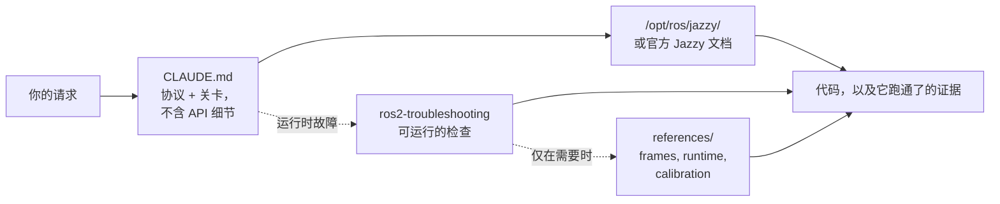

<div align="center">


**Claude Code Skills for ROS 2 Jazzy Jalisco robotics development.**

改变 AI Agent 进行 ROS 2 开发方式的技能集：预先确认未知参数，对照已安装的软件包验证配置，并通过实际运行的证据确认执行。


[English](README.md) | [한국어](README.ko.md) | **中文** | [日本語](README.ja.md) | [Español](README.es.md) | [Français](README.fr.md) | [Deutsch](README.de.md)

<sub>🌐 本文档为 [English](README.md) 的中文翻译版。</sub>

| 技能数量 | 常驻上下文协议 | 文档链接（CI 验证） | 实体与运行时验证脚本 |
| :---: | :---: | :---: | :---: |
| **2** | **30 行** | **6** | **4** |

</div>

---

## 目录

- [代价高昂的失败](#代价高昂的失败)
- [这些技能的构建原则](#这些技能的构建原则)
- [有何不同](#有何不同)
- [实测评估](#实测评估)
- [快速开始](#快速开始)
- [技能列表](#技能列表)
- [验证脚本](#验证脚本)
- [工作原理](#工作原理)
- [更新](#更新)
- [贡献](#贡献)
- [许可证](#许可证)

## 代价高昂的失败

AI 生成的 ROS 2 代码中代价最高的错误很少是语法错误，而是那些乍看之下完全正确的细微问题：

| 失败 | 表面现象 | Agent 为何会遇到该问题 |
| :--- | :--- | :--- |
| **中间件不匹配** | `ros2 topic hz` 显示 30 Hz，但回调从未触发 | 默认的 RELIABLE 订阅者无法与 BEST_EFFORT 发布者匹配。代码能编译、能通过评审，却在应用层之下失败。rclpy 确实会告警 —— `offering incompatible QoS ... Last incompatible policy: RELIABILITY` —— 但只在运行时、在启动日志里、只对正在读日志的人可见。 |
| **错误的基准坐标** | `/cmd_vel` 指示前进，`/odom` 也报告前进，但实体机器人却在**后退** | 静态 TF 坐标系与实际安装方向相反。下游组件*使用错误的变换*进行了完全正确的计算，因此不会产生任何明显错误。 |
| **过时的 API** | 代码通过评审，却因调用了错误的方法而在运行时失败 | Agent 使用了在 Jazzy 中被重命名或移除的 Foxy / Humble API。 |
| **错误的前提** | Agent 基于一个你用一句话就能纠正的假设写下 200 行代码 | 没有任何机制促使 Agent 在生成代码前先确认缺失的细节。 |

编译器、linter 和日志分析都无法检测这些隐藏问题。解决每一个都需要额外的反馈循环：查看输出、诊断原因、解释修复、重新生成。

## 这些技能的构建原则

本仓库的每个技能都遵循四条设计原则：

**1. 预先识别未知变量。** 运行环境是实体硬件还是仿真、是扩展现有工作空间还是新建、哪个节点已经发布了坐标变换、机器人的精确几何形状如何 —— 这些关键的操作细节往往并不存在于文档中。[`CLAUDE.md`](./CLAUDE.md) 要求 Agent 在生成代码之前先澄清这些未知项。

**2. 执行带有明确退出条件的结构化循环。** *验证 → 编写 → 证明* 的循环：在已安装环境中检查系统默认值，逐步应用变更，然后确认执行结果。仅仅产出代码文件并不算完成，只有得到观测证据支持时任务才算完成 —— 例如构建成功、`ros2 topic echo` 上有实际数据、验证脚本通过。

**3. 不重述模型已知的内容或 `CLAUDE.md` 已有的规定。** 本技能包曾包含的所有"症状→根因→措施"诊断表，均与未加载技能的基线模型进行了对比测试。结果表明，描述性文本未对任何评估指标产生改善 — 模型要么在无辅助情况下自主给出解法，要么需要可执行脚本或 `CLAUDE.md` 的协议约束。参见[实测评估](#实测评估)。

**4. 提供可运行的产物，而非对其进行文字描述。** 实测表明，解释脚本作用的描述性文本未带来任何指标提升。唯有返回确定性退出码的可执行脚本（`ros2-troubleshooting` 中的 `scripts/check_*.py`）真正改善了模型行为。

## 有何不同

大多数机器人技能包把静态的 API 知识直接嵌入技能文件。初期使用很方便，但当底层软件包更新时就会失效 —— 留下会静默失败的过时代码片段。本仓库采用动态的、文档驱动的方式：

| 特性 | 内容密集型技能包 | **claude-ros2-skills** |
| :--- | :--- | :--- |
| 知识位置 | 嵌入技能文件（**每个技能 400–1,800 行**） | 链接到官方文档（技能正文**约 60 行**），详细参考资料**仅在需要时**读取 |
| 常驻上下文 | 完整的 `SKILL.md` 文件 | **30 行**核心协议 |
| 应对 Jazzy API 更新 | 代码片段悄然过时，需要持续手动更新 | 过时风险被限制在入口链接和符号名称上 —— **6 条文档链接**由 CI 每周验证 |
| 验证方式 | 静态代码分析或日志检查 | **物理与运行时验证**：IMU 重力检查、里程计方向测试、TF 坐标系对齐、DDS QoS 兼容性 |
| 发行范围 | 声称支持多个 ROS 发行版，实际只针对一个 | 按设计**仅支持 ROS 2 Jazzy** —— 没有"Humble 上也能用"这类含糊说辞 |

本仓库只为一个结果做优化：最大限度降低生成看似合理却无法在 ROS 2 Jazzy 上运行的代码的风险。

## 实测评估

**标准。** 一个技能只有在提供了 Agent **自身无法到达**的东西时才配拥有一席之地 —— 在它已拥有自身知识、网络搜索以及眼前一个真实的 Jazzy 安装环境的前提下。仅仅告诉 Agent 它本来也会做的事情的文本，是有成本而无收益的。

**如何测量。** 在干净的容器中执行真实任务，包含被测内容运行 10 次、不包含运行 10 次。评分方式是*运行*产出的结果 —— 构建、有数据流动的话题、退出码 —— 而绝非阅读它。Fisher 精确检验，并在整轮范围内做 Benjamini–Hochberg 校正。

**这确定了什么。** 八个领域被放上三级阶梯 —— 共 24 级，每一级新增一个命名的机制，每一级都由运行产物的检查来评分。基线 Agent **到达了它被要求的每一个机制**：

| 领域 | L1 → L2 → L3，每级新增的机制 | 无辅助 |
| :--- | :--- | ---: |
| 打包与构建 | `ament_python`/`ament_cmake` → 跨包 `.srv` → 可组合节点 + `colcon test` | **190/190** |
| 仿真 | SDF 世界 + 差速驱动 → `ros_gz_bridge` + `gpu_lidar` → URDF 生成 + `use_sim_time` | **108/110** |
| 执行器（Executor） | 定时器中调用 1 秒服务 → 订阅回调中调用 + 心跳 → 5 个并发调用 | **110/110** |
| `ros2_control` | 模拟硬件 + 广播器 → 抢占接口的第二个控制器 → **自定义 C++ `SystemInterface` 插件** | **90/90** |
| 测试 | `colcon test` 真正会运行的 pytest → 针对活动节点的 `launch_testing` → rosbag2 写入并回读 | **110/110** |
| MoveIt 2 | 自行编写的 URDF+SRDF 被 `move_group` 加载 → 真实的 `GetMotionPlan` → 规划场景中的碰撞对象 | **100/100** |
| 核心 | 由参数驱动的静态 TF → 动态 TF + `ExtrapolationException` → 激活前保持静默的生命周期节点 | **110/110** |
| Nav2 | 服务器可原样接受的参数文件 → 将整个栈驱动至 `active` → 用实时扫描标记障碍物的代价地图 | 见下文 |
| 感知（Perception） | `cv_bridge` 往返 → `CameraInfo` 投影 → 16UC1 深度图 → `PointCloud2` | **106/120** |

**没有任何一个失败是靠提供信息而被关闭的。** 发现的四个缺口全部属于行为（behavioural）层面：

| 模型在无辅助下不会做的事 | 基线 | 什么关闭了它 | 之后 |
| :--- | ---: | :--- | ---: |
| 不凭记忆作答，而是对照已安装环境验证 | **2/10** | `CLAUDE.md` 中的一个段落 | **10/10**（q=0.002） |
| 给出带退出码的判定，而不是"看起来没问题" | **0/10** | 一个捆绑的可运行脚本 | **10/10**（q<0.001） |
| 在交付之前先运行自己写的 QoS 代码 | **5/10** | `CLAUDE.md` 的"跑通了才算完成" | **9/10**（检验效能不足） |
| 在交付之前先运行自己写的 Nav2 配置 | **0/10** | 一个要求到达 `active` 的任务 | **30/30** |

最后一行最为清晰地展示了这一原则。当仅要求生成 Nav2 参数文件时，10/10 的测试单元均写出了其自身服务器拒绝加载的配置文件。然而，在要求生成同一文件并**附加要求将整个栈驱动至 `active` 状态**时，所有测试单元均遇到了完全相同的配置错误，从日志中诊断并修复了该问题，最终通过测试。**同一个模型，同一个误解，信息量零差异** — 唯一的区别是要求其真正运行并验证。

**对本技能包的影响。** 在此前已删除的两个技能之外，六个领域技能被全部移除。模型自身已具备这些领域知识，且本仓库中的描述性文本从未改善过任何一项评估检查。最终仅保留了 30 行核心协议、4 个可运行脚本及必要的参考资料。评估方法、各领域详细结果及原始运行记录：[`evals/`](./evals/)。

## 快速开始

**方式 A —— 插件市场（推荐）：**

```
/plugin marketplace add Leehyunbin0131/claude-ros2-skills
/plugin install claude-ros2-skills@claude-ros2-skills
```

可随时使用 `/plugin marketplace update` 更新已安装的插件。

**方式 B —— 手动安装：**

```bash
git clone https://github.com/Leehyunbin0131/claude-ros2-skills.git

# 项目级安装（仅对当前项目生效）
mkdir -p your-project/.claude/skills
cp -r claude-ros2-skills/skills/* your-project/.claude/skills/
cp claude-ros2-skills/CLAUDE.md your-project/

# 用户级安装（对所有项目生效）
mkdir -p ~/.claude/skills
cp -r claude-ros2-skills/skills/* ~/.claude/skills/
```

重启 Claude Code（或开启新会话）以应用已安装的技能。

## 技能列表

| 技能 | 路径 | 覆盖范围 |
| :--- | :--- | :--- |
| **ros2-troubleshooting** | `skills/ros2-troubleshooting/SKILL.md` | 四个可运行的通过/失败检查 —— QoS 兼容性、TF 树、IMU 安装、里程计方向 —— 以及支撑它们的 REP 103/105 坐标系约定、Jazzy 运行时行为和实体里程计标定 |
| **ros2-microros** | `skills/ros2-microros/SKILL.md` | micro-ROS Agent、rclc 客户端 API、自定义传输、静态内存 |

**为什么只有两个。** 其余所有技能都与未加载任何技能的基线 Agent 做过对照测量，一旦 Agent 在没有它的情况下也能得出相同结果，就被删除 —— 按测量顺序依次为 `ros2-core`、`ros2-dev`、`ros2-control`、`ros2-moveit`、`ros2-perception`、`ros2-testing`、`ros2-package` 和 `gazebo-sim`。`ros2-microros` 是唯一没有阶梯的领域：此处没有运行它所需的硬件，因此予以保留，并且**不声称其已通过验证**。参见[实测评估](#实测评估)。

## 验证脚本

这些验证脚本捆绑在 `ros2-troubleshooting` 技能中（`skills/ros2-troubleshooting/scripts/`），随每种安装方式一同分发。它们把物理硬件检查转化为可执行的通过/失败验证步骤（需要已 source 的 ROS 2 环境；返回码：0 = 通过，1 = 失败，2 = 无数据）：

| 脚本 | 验证内容 |
| :--- | :--- |
| `check_imu_gravity.py` | 验证静止的机器人沿 **+Z** 轴测得约 +9.81 m/s² 的重力（REP 103）。检测倒置或错位的 IMU 安装。 |
| `check_odom_direction.py` | 验证向前推动机器人时，沿其航向产生正的里程计位移。检测电机方向反转、编码器极性问题或反转的 TF 配置。 |
| `check_tf_tree.py` | 验证 `map→odom→base_link` 能否正确解析；以 RPY 角度显示每个传感器的安装偏移，并标出可能的 180° 朝向错误。 |
| `check_qos_compat.py` | 依据 DDS 规则验证某一话题上所有发布者/订阅者对的 QoS 兼容性。防止静默失败（例如 BEST_EFFORT 发布者搭配 RELIABLE 订阅者，或 durability、deadline、liveliness 不匹配）。 |

核心判定逻辑独立于 ROS 进行单元测试（`python3 skills/ros2-troubleshooting/scripts/test_checks.py`），并在每次推送时通过持续集成（CI）运行。

## 工作原理



[`CLAUDE.md`](./CLAUDE.md) 不包含任何具体的 API 代码细节。相反，它确立了操作协议：对照已安装环境验证配置、预先确认文档无法提供的未知项，且仅在观测到实际运行结果后才视为任务完成。静态领域知识交由模型自身及已安装环境处理，因为实测表明描述性文本未带来附加价值。`ros2-troubleshooting` 技能仅在系统日志正常但运行时发生故障时触发，提供明确的退出码而非段落说明。详见 [`CLAUDE.md`](./CLAUDE.md)。

## 更新

```bash
cd claude-ros2-skills
git pull
cp -r skills/* ~/.claude/skills/   # 或你项目的 .claude/skills/
```

## 贡献

**概要：** 新的技能内容必须通过与无技能基线模型的对照评估测试（真实开发任务，每种条件运行 10 次，根据实际运行产出评分）。模型无需辅助即可生成的内容，无论多么正确均不予加入。验证脚本必须保持纯粹的判定逻辑，以便在脱离 ROS 环境时进行单元测试。评估协议、检查清单及 Issue 模板请参阅 [`CONTRIBUTING.md`](./CONTRIBUTING.md)。

## 许可证

Apache-2.0 —— 参见 [LICENSE](./LICENSE)。
